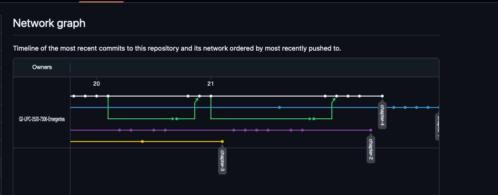

# **COURSE PROJECT**

  

<strong>Universidad Peruana de Ciencias Aplicadas</strong>

<strong>Ingeniería de Software</strong> 
SI728 - Arquitecturas de Software Emergentes - NRC: 7306  
Ciclo Académico: 202520  
<strong>Profesor:</strong> Ernesto Ocampo Tello

<h2 align="center">INFORME DE TRABAJO FINAL</h2>

<h3 align="center">Startup: FoodChain</h3>

<em>"Chaining you to the food you love"</em>

<h3 align="center">Equipo de Desarrollo</h3>

<table>
  <thead>
    <tr>
      <th><strong>Código</strong></th>
      <th><strong>Nombre</strong></th>
    </tr>
  </thead>
  <tbody>
    <tr>
      <td>U20221C936</td>
      <td>JUAN FABRITZZIO PESCORAN ANGULO</td>
    </tr>
    <tr>
      <td>U202022387</td>
      <td>ANGELO MARCIO CURI MARCELO</td>
    </tr>
    <tr>
      <td>U202102344</td>
      <td>BRENDA LUCÍA GAMIO UPIACHIHUA</td>
    </tr>
    <tr>
      <td>u202215285</td>
      <td>GUSTAVO ESAU HUANCA NAVARRO</td>
    </tr>
    <tr>
      <td>U202214477</td>
      <td>DIEGO ULISES SOTO QUISPE</td>
    </tr>
  </tbody>
</table>

<strong>Noviembre 2025</strong>

# Registro de Versiones del Informe

| Versión | Fecha       | Autor(es)                                                                                                                                                                                                                   | Descripción de la modificación                                                                                                                                                                                                                                                                                                                                                                                                                                                                                                                                                                                                                      |
|---------|-------------|------------------------------------------------------------------------------------------------------------------------------------------------------------------------------------------------------------------------------|-----------------------------------------------------------------------------------------------------------------------------------------------------------------------------------------------------------------------------------------------------------------------------------------------------------------------------------------------------------------------------------------------------------------------------------------------------------------------------------------------------------------------------------------------------------------------------------------------------------------------------------------------------|
| **TB1** | 21/09/2025  | Juan Fabritzzio Pescoran Angulo    Angelo Marcio Curi Marcelo    Brenda Lucía Gamio Upiachihua    Gustavo Esau Huanca Navarro    Diego Ulises Soto Quispe | Se agregó el contenido completo del **Capítulo 1 (Introducción)**, incluyendo los apartados 1.1 *Startup Profile* (1.1.1 Descripción de la Startup, 1.1.2 Perfiles de integrantes del equipo), 1.2 *Solution Profile* (1.2.1 Antecedentes y problemática, 1.2.2 *Lean UX Process* con sus subapartados 1.2.2.1 *Problem Statements*, 1.2.2.2 *Assumptions*, 1.2.2.3 *Hypothesis Statements*, 1.2.2.4 *Lean UX Canvas*) y 1.3 *Segmentos objetivo*. También se incorporó el **Capítulo 2 (Requirements Elicitation & Analysis)**, abarcando 2.1 *Competidores* (2.1.1 Análisis competitivo, 2.1.2 Estrategias y tácticas), 2.2 *Entrevistas* (2.2.1 Diseño, 2.2.2 Registro, 2.2.3 Análisis), 2.3 *Needfinding* (2.3.1 User Personas, 2.3.2 User Task Matrix, 2.3.3 Empathy Mapping, 2.3.4 *As-is Scenario Mapping*) y 2.4 *Ubiquitous Language*. Asimismo, se completó el **Capítulo 3 (Requirements Specification)** con los apartados 3.1 *To-Be Scenario Mapping*, 3.2 *User Stories*, 3.3 *Impact Mapping* y 3.4 *Product Backlog*; y el **Capítulo 4 (Strategic-Level Software Design)**, incluyendo 4.1 *Strategic-Level Attribute-Driven Design* (4.1.1 Design Purpose, 4.1.2 Attribute-Driven Design Inputs con sus subapartados 4.1.2.1 *Primary Functionality*, 4.1.2.2 *Quality Attribute Scenarios*, 4.1.2.3 *Constraints*, 4.1.3 *Architectural Drivers Backlog*, 4.1.4 *Architectural Design Decisions*, 4.1.5 *Quality Attribute Scenario Refinements*), 4.2 *Strategic-Level Domain-Driven Design* (4.2.1 *EventStorming*, 4.2.2 *Candidate Context Discovery*, 4.2.3 *Domain Message Flows Modeling*, 4.2.4 *Bounded Context Canvases*, 4.2.5 *Context Mapping*) y 4.3 *Software Architecture* (4.3.1 *System Landscape Diagram*, 4.3.2 *Context Level Diagrams*, 4.3.3 *Container Level Diagrams*, 4.3.4 *Deployment Diagrams*). |
| **TP**  | 10/10/2025  | Juan Fabritzzio Pescoran Angulo    Angelo Marcio Curi Marcelo    Brenda Lucía Gamio Upiachihua    Gustavo Esau Huanca Navarro    Diego Ulises Soto Quispe | Se realizaron **mejoras al Capítulo 4 (Strategic-Level Software Design)**, optimizando los diagramas arquitectónicos (C4 y despliegue), la redacción técnica y la coherencia entre componentes y bounded contexts.    Se desarrolló completamente el **Capítulo 5 (Tactical-Level Software Design)**, incluyendo: *Bounded Context*, *Domain Layer*, *Interface Layer*, *Application Layer*, *Infrastructure Layer*, *Bounded Context Software Architecture Component Level Diagrams*, *Code Level Diagrams*, *Domain Layer Class Diagrams* y *Database Design Diagram*.    Además, se elaboró íntegramente el **Capítulo 6 (Solution UX Design)**, que abarca: *Style Guidelines*, *General Style Guidelines*, *Web, Mobile & Devices Style Guidelines*, *Information Architecture*, *Labeling Systems*, *Searching Systems*, *SEO Tags and Meta Tags*, *Navigation Systems*, *Landing Page UI Design*, *Landing Page Wireframe*, *Landing Page Mock-up*, *Applications UX/UI Design*, *Applications Wireframes*, *Applications Wireflow Diagrams*, *Applications Mock-ups*, *Applications User Flow Diagrams* y *Applications Prototyping*.    Con estas incorporaciones, el documento consolida la versión final del proyecto, integrando diseño táctico, experiencia de usuario y coherencia arquitectónica bajo los estándares ABET y de ingeniería de software. |

## Project Report Collaboration Insights

TB1: Las tareas asignadas para la entrega **TB1** han sido completadas y están documentadas en el siguiente repositorio de GitHub perteneciente a la organización del equipo:

Repositorio del proyecto: [https://github.com/G2-UPC-2520-7306-Emergentes](https://github.com/G2-UPC-2520-7306-Emergentes)

Durante la preparación del informe, se llevaron a cabo las siguientes actividades:

- Se escribieron y diagramaron los contenidos asignados a cada miembro en formato Markdown,  
  con commits frecuentes para asegurar el progreso continuo en la rama `develop`.
- Se desarrollaron los **capítulos 1, 2, 3 y 4 del informe**, abarcando desde la presentación de la startup *FoodChain*  
  hasta el diseño estratégico de la solución, aplicando las técnicas revisadas en clase como **Lean UX**,  
  entrevistas, análisis de usuarios y **Domain-Driven Design**.
- Los artefactos necesarios (diagramas, mapas, matrices) fueron elaborados con herramientas recomendadas  
  y almacenados en la carpeta `Assets` dentro de la rama `develop`, facilitando su referencia directa en el informe.
- Se organizaron reuniones virtuales para coordinar los avances, distribuir las secciones  
  y garantizar el desarrollo coherente del contenido teórico–práctico.

Esta entrega representa una evidencia del **trabajo colaborativo del equipo**, permitiendo cumplir con el **Student Outcome 3 (ABET – EAC)**, que establece la capacidad para **comunicarse efectivamente con un rango de audiencias**.  
En particular, el grupo demostró que puede:

- Comunicar de manera clara y objetiva las ideas y resultados de ingeniería, tanto en forma oral como escrita,  
  a público de distintas especialidades y niveles jerárquicos.
- Integrar conocimientos y metodologías de arquitectura de software emergente en un documento técnico bien estructurado.
- Documentar procesos, decisiones y resultados en un entorno ágil, asegurando trazabilidad y calidad en cada hito.

En conjunto, la entrega **TB1** evidencia la apropiación de metodologías de diseño, la correcta aplicación de herramientas de colaboración en GitHub y la capacidad del equipo para producir documentación técnica de alta calidad alineada con los objetivos del proyecto **FoodChain**.

## **TP**

Las tareas asignadas para la entrega **TP** han sido completadas y documentadas en el mismo repositorio de GitHub perteneciente a la organización del equipo:

Repositorio del proyecto: [https://github.com/G2-UPC-2520-7306-Emergentes](https://github.com/G2-UPC-2520-7306-Emergentes)

Durante la preparación de esta entrega, se desarrollaron las siguientes actividades clave:

- Se aplicaron **mejoras en el Capítulo 4 (Strategic-Level Software Design)**, ajustando los diagramas arquitectónicos (C4 y de despliegue), revisando la coherencia entre los *Bounded Contexts* y la trazabilidad entre decisiones arquitectónicas y tácticas de diseño.  
  Además, se optimizó la redacción técnica y se mejoró la correspondencia entre los elementos de los escenarios de calidad y los componentes del sistema.

- Se elaboró completamente el **Capítulo 5 (Tactical-Level Software Design)**, detallando la estructura interna de los contextos delimitados (*Bounded Contexts*) e incluyendo los diagramas:  
  *Domain Layer*, *Interface Layer*, *Application Layer*, *Infrastructure Layer*, *Software Architecture Component Level Diagrams*, *Code Level Diagrams*, *Domain Layer Class Diagrams* y *Database Design Diagram*.  
  Este capítulo consolida la traducción del diseño estratégico hacia una arquitectura técnica modular y coherente.

- Se completó el **Capítulo 6 (Solution UX Design)**, donde se desarrollaron todos los apartados correspondientes al diseño de experiencia de usuario y la interfaz visual.  
  Entre los entregables figuran: *Style Guidelines*, *General Style Guidelines*, *Web, Mobile & Devices Style Guidelines*, *Information Architecture*, *Labeling Systems*, *Searching Systems*, *SEO Tags and Meta Tags*, *Navigation Systems*, *Landing Page UI Design*, *Landing Page Wireframe*, *Landing Page Mock-up*, *Applications UX/UI Design*, *Applications Wireframes*, *Applications Wireflow Diagrams*, *Applications Mock-ups*, *Applications User Flow Diagrams* y *Applications Prototyping*.  
  Todo el diseño fue documentado con estructura jerárquica clara y orientado a usabilidad, accesibilidad y consistencia visual.

- Los contenidos fueron redactados en formato **Markdown** y versionados dentro de la rama `develop`, empleando *commits* estructurados por capítulo y revisión.  
  Se mantuvo una gestión constante mediante *pull requests* para la integración de los avances, garantizando trazabilidad y control de cambios.

- Se realizaron sesiones colaborativas para validar la coherencia entre el **diseño técnico (Capítulo 5)** y el **diseño de experiencia de usuario (Capítulo 6)**, asegurando la alineación entre la arquitectura del sistema y la interfaz de interacción.

Esta entrega **TP** representa un avance significativo hacia la versión final del proyecto, evidenciando la capacidad del equipo para **integrar diseño estratégico, diseño táctico y experiencia de usuario** en un único marco coherente de ingeniería de software.  
Asimismo, permite demostrar competencias vinculadas al **Student Outcome 2 (ABET – EAC)**, relacionadas con la capacidad para **diseñar soluciones de ingeniería que satisfacen necesidades específicas considerando aspectos sociales, ambientales y tecnológicos**, y al **Student Outcome 3**, que refuerza la **comunicación efectiva y la documentación técnica profesional**.

En conjunto, la entrega **TP** refleja un nivel de madurez técnica y colaborativa superior, consolidando los componentes arquitectónicos, la documentación visual y el sistema de trazabilidad completo de la solución **FoodChain**.

# Contenido

## Tabla de Contenidos

- [**Capítulo I: Introducción**](#capítulo-i-introducción)
  - [1.1. Startup Profile](#11-startup-profile)
    - [1.1.1. Descripción de la Startup](#111-descripción-de-la-startup)
    - [1.1.2. Perfiles de integrantes del equipo](#112-perfiles-de-integrantes-del-equipo)
  - [1.2. Solution Profile](#12-solution-profile)
    - [1.2.1. Antecedentes y problemática](#121-antecedentes-y-problemática)
    - [1.2.2. Lean UX Process](#122-lean-ux-process)
      - [1.2.2.1. Lean UX Problem Statements](#1221-lean-ux-problem-statements)
      - [1.2.2.2. Lean UX Assumptions](#1222-lean-ux-assumptions)
      - [1.2.2.3. Lean UX Hypothesis Statements](#1223-lean-ux-hypothesis-statements)
      - [1.2.2.4. Lean UX Canvas](#1224-lean-ux-canvas)
  - [1.3. Segmentos objetivo](#13-segmentos-objetivo)

- [**Capítulo II: Requirements Elicitation & Analysis**](#capítulo-ii-requirements-elicitation--analysis)
  - [2.1. Competidores](#21-competidores)
    - [2.1.1. Análisis competitivo](#211-análisis-competitivo)
    - [2.1.2. Estrategias y tácticas frente a competidores](#212-estrategias-y-tácticas-frente-a-competidores)
  - [2.2. Entrevistas](#22-entrevistas)
    - [2.2.1. Diseño de entrevistas](#221-diseño-de-entrevistas)
    - [2.2.2. Registro de entrevistas](#222-registro-de-entrevistas)
    - [2.2.3. Análisis de entrevistas](#223-análisis-de-entrevistas)
  - [2.3. Needfinding](#23-needfinding)
    - [2.3.1. User Personas](#231-user-personas)
    - [2.3.2. User Task Matrix](#232-user-task-matrix)
    - [2.3.3. Empathy Mapping](#233-empathy-mapping)
    - [2.3.4. As-is Scenario Mapping](#234-as-is-scenario-mapping)
  - [2.4. Ubiquitous Language](#24-ubiquitous-language)

- [**Capítulo III: Requirements Specification**](#capítulo-iii-requirements-specification)
  - [3.1. To-Be Scenario Mapping](#31-to-be-scenario-mapping)
  - [3.2. User Stories](#32-user-stories)
  - [3.3. Impact Mapping](#33-impact-mapping)
  - [3.4. Product Backlog](#34-product-backlog)

- [**Capítulo IV: Strategic-Level Software Design**](#capítulo-iv-strategic-level-software-design)
  - [4.1. Strategic-Level Attribute-Driven Design](#41-strategic-level-attribute-driven-design)
    - [4.1.1. Design Purpose](#411-design-purpose)
    - [4.1.2. Attribute-Driven Design Inputs](#412-attribute-driven-design-inputs)
      - [4.1.2.1. Primary Functionality (Primary User Stories)](#4121-primary-functionality-primary-user-stories)
      - [4.1.2.2. Quality attribute Scenarios](#4122-quality-attribute-scenarios)
      - [4.1.2.3. Constraints](#4123-constraints)
    - [4.1.3. Architectural Drivers Backlog](#413-architectural-drivers-backlog)
    - [4.1.4. Architectural Design Decisions](#414-architectural-design-decisions)
    - [4.1.5. Quality Attribute Scenario Refinements](#415-quality-attribute-scenario-refinements)
  - [4.2. Strategic-Level Domain-Driven Design](#42-strategic-level-domain-driven-design)
    - [4.2.1. EventStorming](#421-eventstorming)
    - [4.2.2. Candidate Context Discovery](#422-candidate-context-discovery)
    - [4.2.3. Domain Message Flows Modeling](#423-domain-message-flows-modeling)
    - [4.2.4. Bounded Context Canvases](#424-bounded-context-canvases)
    - [4.2.5. Context Mapping](#425-context-mapping)
  - [4.3. Software Architecture](#43-software-architecture)
    - [4.3.1. Software Architecture System Landscape Diagram](#431-software-architecture-system-landscape-diagram)
    - [4.3.2. Software Architecture Context Level Diagrams](#432-software-architecture-context-level-diagrams)
    - [4.3.3. Software Architecture Container Level Diagrams](#433-software-architecture-container-level-diagrams)
    - [4.3.4. Software Architecture Deployment Diagrams](#434-software-architecture-deployment-diagrams)

- [**Capítulo V: Tactical-Level Software Design**](#capítulo-v-tactical-level-software-design)
  - [5.X. Bounded Context: <Bounded Context Name>](#5x-bounded-context-bounded-context-name)
    - [5.X.1. Domain Layer](#5x1-domain-layer)
    - [5.X.2. Interface Layer](#5x2-interface-layer)
    - [5.X.3. Application Layer](#5x3-application-layer)
    - [5.X.4. Infrastructure Layer](#5x4-infrastructure-layer)
    - [5.X.5. Bounded Context Software Architecture Component Level Diagrams](#5x5-bounded-context-software-architecture-component-level-diagrams)
    - [5.X.6. Bounded Context Software Architecture Code Level Diagrams](#5x6-bounded-context-software-architecture-code-level-diagrams)
      - [5.X.6.1. Bounded Context Domain Layer Class Diagrams](#5x61-bounded-context-domain-layer-class-diagrams)
      - [5.X.6.2. Bounded Context Database Design Diagram](#5x62-bounded-context-database-design-diagram)

- [**Capítulo VI: Solution UX Design**](#capítulo-vi-solution-ux-design)
  - [6.1. Style Guidelines](#61-style-guidelines)
    - [6.1.1. General Style Guidelines](#611-general-style-guidelines)
    - [6.1.2. Web, Mobile & Devices Style Guidelines](#612-web-mobile--devices-style-guidelines)
  - [6.2. Information Architecture](#62-information-architecture)
    - [6.2.1. Labeling Systems](#621-labeling-systems)
    - [6.2.2. Searching Systems](#622-searching-systems)
    - [6.2.3. SEO Tags and Meta Tags](#623-seo-tags-and-meta-tags)
    - [6.2.4. Navigation Systems](#624-navigation-systems)
  - [6.3. Landing Page UI Design](#63-landing-page-ui-design)
    - [6.3.1. Landing Page Wireframe](#631-landing-page-wireframe)
    - [6.3.2. Landing Page Mock-up](#632-landing-page-mock-up)
  - [6.4. Applications UX/UI Design](#64-applications-uxui-design)
    - [6.4.1. Applications Wireframes](#641-applications-wireframes)
    - [6.4.2. Applications Wireflow Diagrams](#642-applications-wireflow-diagrams)
    - [6.4.3. Applications Mock-ups](#643-applications-mock-ups)
    - [6.4.4. Applications User Flow Diagrams](#644-applications-user-flow-diagrams)
  - [6.5. Applications Prototyping](#65-applications-prototyping)

- [**Capítulo VII: Product Implementation, Validation & Deployment**](#capítulo-vii-product-implementation-validation--deployment)
  - [7.1. Software Configuration Management](#71-software-configuration-management)
    - [7.1.1. Software Development Environment Configuration](#711-software-development-environment-configuration)
    - [7.1.2. Source Code Management](#712-source-code-management)
    - [7.1.3. Source Code Style Guide & Conventions](#713-source-code-style-guide--conventions)
    - [7.1.4. Software Deployment Configuration](#714-software-deployment-configuration)
  - [7.2. Solution Implementation](#72-solution-implementation)
    - [7.2.X. Sprint n](#72x-sprint-n)
      - [7.2.X.1. Sprint Planning n](#72x1-sprint-planning-n)
      - [7.2.X.2. Sprint Backlog n](#72x2-sprint-backlog-n)
      - [7.2.X.3. Development Evidence for Sprint Review](#72x3-development-evidence-for-sprint-review)
      - [7.2.X.4. Testing Suite Evidence for Sprint Review](#72x4-testing-suite-evidence-for-sprint-review)
      - [7.2.X.5. Execution Evidence for Sprint Review](#72x5-execution-evidence-for-sprint-review)
      - [7.2.X.6. Services Documentation Evidence for Sprint Review](#72x6-services-documentation-evidence-for-sprint-review)
      - [7.2.X.7. Software Deployment Evidence for Sprint Review](#72x7-software-deployment-evidence-for-sprint-review)
      - [7.2.X.8. Team Collaboration Insights during Sprint](#72x8-team-collaboration-insights-during-sprint)
  - [7.3. Validation Interviews](#73-validation-interviews)
    - [7.3.1. Diseño de Entrevistas](#731-diseño-de-entrevistas)
    - [7.3.2. Registro de Entrevistas](#732-registro-de-entrevistas)
    - [7.3.3. Evaluaciones según heurísticas](#733-evaluaciones-según-heurísticas)
  - [7.4. Video About-the-Product](#74-video-about-the-product)

- [**Conclusiones**](#conclusiones)
  - [Conclusiones y recomendaciones](#conclusiones-y-recomendaciones)
  - [Video About-the-Team](#video-about-the-team)

- [**Bibliografía**](#bibliografía)

- [**Anexos**](#anexos)

# Student Outcome

El curso contribuye al cumplimiento del Student Outcome ABET:  
**ABET – EAC – Student Outcome 3**

**Criterio: Capacidad de comunicarse efectivamente con un rango de audiencias.**  
En el siguiente cuadro se describen las acciones realizadas y las conclusiones por parte del grupo, que permiten sustentar el logro del ABET – EAC – Student Outcome 3 en la entrega **TB1**.

| Criterio específico | Acciones realizadas | Conclusiones |
|--------------------|--------------------|--------------|
| **Comunica oralmente sus ideas y/o resultados con objetividad a público de diferentes especialidades y niveles jerárquicos, en el marco del desarrollo de un proyecto en ingeniería.** | **TB1**  - **Juan Fabritzzio Pescoran Angulo:** Expuso la presentación de la startup *FoodChain* y la problemática (Capítulo 1), explicando la propuesta de valor y el enfoque de trazabilidad.  - **Angelo Marcio Curi Marcelo:** Presentó el proceso de entrevistas y análisis de usuarios (Capítulo 2), detallando los hallazgos y su impacto en la definición de requisitos.  - **Brenda Lucía Gamio Upiachihua:** Explicó el desarrollo de Needfinding y User Personas (Capítulo 2.3), mostrando cómo se identificaron los perfiles y necesidades de los consumidores finales.  - **Gustavo Esau Huanca Navarro:** Explicó el diseño estratégico de la solución (Capítulo 4), describiendo el EventStorming, los Bounded Contexts y la arquitectura de software propuesta.  - **Diego Ulises Soto Quispe:** Moderó la presentación global y expuso el Capítulo 3 (Requirements Specification), asegurando coherencia en los mensajes y la integración entre capítulos.  **TP**  - **Juan Fabritzzio Pescoran Angulo:** Explicó el Capítulo 5 (*Tactical-Level Software Design*), detallando los componentes de las capas *Domain*, *Application* e *Infrastructure*.  - **Angelo Marcio Curi Marcelo:** Presentó el desarrollo del *Bounded Context Software Architecture* y los *Component Level Diagrams*, vinculándolos con el diseño estratégico previo.  - **Brenda Lucía Gamio Upiachihua:** Expuso el Capítulo 6 (*Solution UX Design*), mostrando la estructura visual, los *mock-ups* y las *style guidelines* aplicadas.  - **Gustavo Esau Huanca Navarro:** Explicó las mejoras aplicadas al Capítulo 4, resaltando la consistencia entre la arquitectura estratégica y táctica.  - **Diego Ulises Soto Quispe:** Coordinó la exposición final del proyecto y presentó la integración del diseño UX/UI con la arquitectura técnica, asegurando coherencia transversal entre capítulos. | **TB1** El equipo demostró una comunicación oral clara y efectiva. Cada integrante expuso su sección de manera precisa y ordenada, adaptando el lenguaje a una audiencia diversa (profesor evaluador y compañeros). Se fortalecieron las habilidades de presentación técnica, argumentando decisiones de diseño y garantizando una narrativa coherente en todo el proyecto.  **TP** Durante la exposición final, el equipo mostró un dominio técnico y comunicativo avanzado. Se evidenció la capacidad de argumentar decisiones de diseño arquitectónico y visual, relacionando el desarrollo del sistema con los principios de usabilidad y trazabilidad alimentaria. La comunicación fue fluida, técnica y accesible, demostrando madurez profesional y coherencia conceptual en la exposición. |
| **Comunica en forma escrita ideas y/o resultados con objetividad a público de diferentes especialidades y niveles jerárquicos, en el marco del desarrollo de un proyecto en ingeniería.** | **TB1**  - **Juan Fabritzzio Pescoran Angulo:** Redactó el Capítulo 1 (*Startup Profile*, antecedentes y problemática), presentando de forma ordenada el contexto, las motivaciones y la propuesta de *FoodChain*.  - **Angelo Marcio Curi Marcelo:** Documentó el diseño, registro y análisis de entrevistas (Capítulo 2.2), empleando un lenguaje técnico preciso y estructurado.  - **Brenda Lucía Gamio Upiachihua:** Elaboró la sección de *Needfinding* y *User Personas* (Capítulo 2.3), incorporando mapas de empatía y escenarios actuales con redacción clara y consistente.  - **Gustavo Esau Huanca Navarro:** Redactó el Capítulo 4 (*Strategic-Level Software Design*), incluyendo *EventStorming*, *Context Mapping* y diagramas de arquitectura con terminología especializada y bien explicada.  - **Diego Ulises Soto Quispe:** Desarrolló el Capítulo 3 (*Requirements Specification*), integrando *To-Be Scenarios*, *User Stories*, *Impact Mapping* y *Product Backlog*, y revisó la coherencia general del documento.  **TP**  - **Juan Fabritzzio Pescoran Angulo:** Redactó el *Domain Layer* y *Application Layer* (Capítulo 5), empleando estructuras claras para representar las dependencias entre clases y componentes.  - **Angelo Marcio Curi Marcelo:** Documentó los *Bounded Context Diagrams* y la arquitectura de software a nivel de componentes y código, asegurando trazabilidad entre niveles de diseño.  - **Brenda Lucía Gamio Upiachihua:** Redactó las secciones de *Style Guidelines*, *Information Architecture* y *UX Design* (Capítulo 6), manteniendo uniformidad visual y narrativa entre plataformas web y móvil.  - **Gustavo Esau Huanca Navarro:** Realizó la actualización y mejora del Capítulo 4, reforzando la coherencia visual y semántica de los diagramas de arquitectura.  - **Diego Ulises Soto Quispe:** Integró y revisó la redacción global de los capítulos 5 y 6, asegurando la consistencia editorial y la relación entre diseño técnico y experiencia de usuario. | **TB1** El equipo alcanzó un alto nivel de redacción técnica, clara y organizada, que permitió transmitir conceptos complejos (*Lean UX*, *Domain-Driven Design*, especificación de requisitos y diseño estratégico*) de forma comprensible para audiencias técnicas y no técnicas. La calidad del informe aseguró la uniformidad en el estilo y la coherencia de todo el documento.  **TP** Se logró un documento técnico sólido, con una redacción estructurada y coherente en los capítulos de diseño táctico y de experiencia de usuario. La escritura fue formal, precisa y orientada a estándares profesionales, evidenciando la capacidad del equipo para comunicar decisiones de ingeniería mediante documentación técnica clara, argumentada y visualmente consistente. |
