# Capítulo II: Requirements Elicitation & Analysis

## 2.1 Competidores

#### IBM Food Trust
**Qué hace:** Plataforma empresarial de trazabilidad y transparencia para alimentos; integra productores, procesadores, retailers y consumidores.  
**Cómo funciona:** Incluye módulos que permiten registrar cada etapa del lote (desde cosecha hasta venta), gestionar certificados, generar reportes verificables, y mostrar al consumidor final el historial completo del producto al escanear un código QR.  
**Por qué nos importa:** Porque demuestra que es posible lograr trazabilidad extremo a extremo con tiempos de rastreo muy cortos, lo cual valida la viabilidad de nuestro pasaporte digital por lote con blockchain.

#### VeChain ToolChain
**Qué hace:** Servicio de trazabilidad que conecta blockchain, IoT y códigos QR/NFC para registrar eventos en la cadena de suministro, permitiendo a marcas y agricultores certificar origen, calidad y autenticidad del producto.  
**Cómo funciona:** Permite capturar datos del campo, incorporar certificaciones digitales, registrar eventos en blockchain, proporcionar herramientas de verificación al consumidor, y realizar auditorías sobre condiciones de transporte o almacenamiento.  
**Por qué nos importa:** Es un buen referente de cómo manejar el equilibrio entre seguridad, costo y experiencia del usuario, especialmente en entornos donde la cadena productiva es extensa.

#### Connecting Food (LiveAudit / LiveTrack / LiveScan)
**Qué hace:** Suite centrada en trazabilidad alimentaria con auditoría continua y visibilidad, permitiendo que los lotes sean rastreados, verificados contra estándares de calidad, y mostrados al consumidor mediante QR.  
**Cómo funciona:** Compara automáticamente los datos del lote con certificaciones o reglas de calidad, alerta cuando hay discrepancias, permite seguimiento completo del lote y ofrece al usuario final un historial claro con certificados, fotos o registros de inspecciones.  
**Por qué nos importa:** Añade una capa de compliance muy valiosa (verificación constante de afirmaciones como "orgánico" o denominación de origen), lo que puede diferenciar a FoodChain si lo integramos desde el inicio.

## 2.2 Análisis competitivo

A continuación, se presenta la tabla de competidores para analizar cada punto específico de algunos referentes globales en **trazabilidad alimentaria basada en blockchain**. Con esto alinearemos la propuesta de **FoodChain** al valor que nuestro segmento objetivo (productores, logística, procesadores, retailers y consumidores) realmente requiere.

| **Competitive Analysis Landscape** |  |
| --- | --- |
| **¿Por qué llevar a cabo este análisis?** | **Definir con evidencia cómo FoodChain se posiciona frente a soluciones consolidadas (IBM Food Trust, VeChain ToolChain, Connecting Food) en: alcance de trazabilidad, integridad y auditoría, velocidad de rastreo, facilidad de integración y adecuación al mercado LATAM.** |
|  | **Objetivo: priorizar funcionalidades del MVP, drivers arquitectónicos (rendimiento, seguridad, escalabilidad) y tácticas comerciales B2B/SaaS, manteniendo la consulta gratuita para el consumidor.** |

| ***Competidor*** |  | FoodChain (Startup) | IBM Food Trust | VeChain ToolChain | Connecting Food |
| --- | --- | --- | -- | -- | -- |
| ***Logo*** |  | |  |  |  |
| ***Perfil*** | Overview | Plataforma **SaaS** de **trazabilidad alimentaria** con **pasaporte digital por lote** (QR/NFC). Cada evento (cosecha, transporte, procesamiento, empaque) queda **registrado** y anclado en **blockchain**; aplicaciones móviles y web para registrar y auditar; el **consumidor** escanea **QR** y ve historia, mapa de ruta, fechas y **certificados**. Enfoque en **América Latina** con servicio gratuito para el consumidor. | Plataforma empresarial de trazabilidad multi-actor con módulos **Trace**, **Consumer**, **Documents** e **Insights**; probada en grandes retailers y sus redes de proveedores; reducción del tiempo de rastreo de **días a segundos** en casos emblemáticos. | Plataforma **blockchain-as-a-service** sobre **VeChainThor** con **QR/NFC** e **IoT**; adoptada por retail para exponer al consumidor origen, rutas y resultados de inspecciones por **lote**. | Suite de **trazabilidad con auditoría digital continua** por lote (**LiveAudit/LiveTrack/LiveScan**); verifica especificaciones en tiempo real y muestra al consumidor la historia **batch-level** vía QR. |
|  | ***Ventaja competitiva – ¿Qué valor ofrece a los clientes?*** | **Transparencia de extremo a extremo** con **registro inmutable**, **validación de certificaciones** en cadena y **gestión de crisis** (recall por lote) en minutos; **UX simple** (QR) para el **consumidor** y acompañamiento a **productores** de LATAM. | **Madurez y escala**; módulos integrales para trazabilidad, certificados y analítica; referencia operativa de rastreo “en segundos”. | **Ecosistema** con SDK/QR/NFC e integración IoT; enfoque de **transparencia al consumidor** con despliegues en retail. | **Compliance continuo** con alertas tempranas; alto valor para asegurar **claims** (orgánico, DO, libre de X) y reducir retiros. |
| ***Perfil de Marketing*** | ***Mercado objetivo*** | **Productores** (B2B pagantes) y **consumidor final** (consulta gratuita). | Grandes **retailers/fabricantes** y su red de **proveedores**; también orientado a compartir datos con **consumidores** vía módulo Consumer. | **Retail y marcas** con foco en categorías frescas/de riesgo y **consumidores** que escanean para ver datos del lote. | **Marcas/procesadores** que requieren **auditoría por lote** y **consumidores** que escanean QR para ver la historia real del producto. |
|  | ***Estrategias de marketing*** | **Pilotos** con productores, co-branding con **QR** al consumidor, narrativa de **confianza/seguridad** y **suscripción B2B**; consumidor **gratis**. | Venta **enterprise**, alianzas con retailers e integradores; guías de adopción por categoría. | Partnerships con retailers/consultoras; comunicación de **transparencia** al consumidor y casos por vertical. | Casos de éxito en **auditoría continua** y reducción de recalls; mensajes a **Calidad/QA** y prueba de **claims**. |
| ***Perfil de Producto*** | ***Productos & Servicios*** | Apps móviles/web para registrar eventos de lote; **API** y contratos/“anclaje” en blockchain; tablero de **auditoría** y **página QR** para el consumidor (historia, mapa, certificados). | **Trace/Consumer/Documents/Insights**: *track & trace*, certificados y analítica cercana al tiempo real. | **ToolChain** con SDK + QR/NFC/IoT; registro on-chain y portales de verificación para consumidor. | **LiveAudit** (auditoría continua), **LiveTrack** (trazabilidad por lote), **LiveScan** (vista consumidor vía QR). |
|  | ***Precios & Costos*** | **SaaS B2B** por suscripción (productores y marcas registran productos); **consumidor gratis**. | Suscripción **enterprise** por módulos/escala. | **BaaS** con costos operativos/on-chain según uso e integración. | **SaaS** por volumen/auditorías/QR, con soporte de integración. |
|  | ***Canales de distribución (Web y/o Móvil)*** | Web y apps móviles. | Web y apps móviles. | Web y apps móviles. | Web y apps móviles. |
| ***Análisis SWOT*** | ***Fortalezas*** | **Pasaporte digital por lote**, registro **inmutable**, **validación de certificaciones**, **recall eficiente**, UX de **escaneo QR** y foco en **productores** y **consumidor** en LATAM. | Escala global, confianza de grandes marcas, módulos integrales y rastreo **en segundos**. | Ecosistema con herramientas listas, adopción en retail y **exposición directa** al consumidor. | Auditoría continua y alertas, transparencia **batch-level** y énfasis en cumplimiento de calidad. |
|  | ***Debilidades*** | **Marca nueva** y necesidad de **onboarding** multi-actor; requiere tracción y casos de referencia. | Barrera de entrada para pymes; posible rigidez de personalización. | Percepción de cadena **pública** en entornos regulados; dependencia de tarifas on-chain/gobernanza. | Menor foco en LATAM; dependencia de **calidad de datos** de proveedores. |
|  | ***Oportunidades*** | Regulaciones de trazabilidad en **LATAM**, diferenciación de marca mediante QR, interés del **consumidor** por origen y **certificaciones**. | Expansión sectorial/geográfica y presión por seguridad alimentaria. | Extender categorías y adopción en retail; integración con IoT. | Mayor presión regulatoria sobre **claims** y demanda de auditoría continua. |
|  | ***Amenazas*** | Adopción lenta en pymes, cambios regulatorios, presión de precios y competencia de suites globales. | Competencia de otras suites especializadas y cambios regulatorios. | Volatilidad de percepción sobre blockchain pública y barreras regulatorias. | Fricción de adopción multi-actor si la **calidad de datos** es heterogénea. |

## 2.3 Estrategias y tácticas frente a competidores

A continuación, la **Matriz FODA y C.A.M.E** específica para **FoodChain** (trazabilidad alimentaria con blockchain + QR/NFC, modelo SaaS B2B para productores; consulta gratuita para el consumidor).  
Interpretación de acciones:
- **Explotar/Mantener** = usar la fortaleza para capturar la oportunidad.
- **Afrontar/Mantener** = usar la fortaleza para defendernos de la amenaza.
- **Corregir/Explotar** = resolver la debilidad aprovechando la oportunidad.
- **Corregir/Afrontar** = mitigar la debilidad para resistir la amenaza.

| **MATRIZ FODA y C.A.M.E** | **Oportunidades: crecimiento de exigencias de trazabilidad en LATAM; interés del consumidor por origen/certificaciones; adopción de QR/NFC; digitalización agro y acuerdos con retailers locales.** | **Amenazas: resistencia al cambio y calidad de datos heterogénea; presión de suites globales; sensibilidad a costos; cambios regulatorios y percepción escéptica de “blockchain”.** |
|---|---|---|
| **Fortalezas: pasaporte digital por lote; registro inmutable en blockchain; validación de certificaciones; recall por lote en minutos; UX de escaneo QR; foco LATAM.** | **Explotar/Mantener**  \n- Lanzar **pilotos con productores** y supermercados (lotes reales) midiendo *time-to-trace* y *time-to-recall*; publicar métricas en casos de éxito.  \n- **Co-branding con QR** en góndola: historia del producto, mapa y certificados para elevar confianza del consumidor.  \n- Paquetes **SaaS por niveles** (micro, pyme, enterprise) y **onboarding guiado** para acelerar adopción.  \n- Integrar **sellos/certificaciones** (orgánico, DO, comercio justo) en el pasaporte digital para diferenciar marca. | **Afrontar/Mantener**  \n- **Gobernanza de datos** y acuerdos de rol/responsabilidad por actor; **SLA/SLO** de consulta (p.ej., p95 ≤ 3 s) y disponibilidad.  \n- **Validaciones en origen** (formularios con reglas, fotos georreferenciadas, firmas) y **auditoría** de cambios para mejorar calidad de datos.  \n- **Guías regulatorias** y plantillas de cumplimiento (etiquetado, privacidad, interoperabilidad) para reducir fricción legal.  \n- Mensajería clara: “blockchain como **prueba de integridad**”, no como cripto; foco en **seguridad alimentaria y confianza**. |
| **Debilidades: marca nueva; sin casos masivos; dependencia del onboarding multi-actor; recursos limitados frente a competidores globales.** | **Corregir/Explotar**  \n- Programa de **Design Partners** (3–5 productores ancla) a cambio de precio preferente y *roadmap* compartido.  \n- **Kits de despliegue**: plantillas de datos por cultivo, manuales de captura, video-demo para personal operativo.  \n- **Integraciones ligeras** (API/CSV) y conectores con ERP/WMS para reducir costo de entrada.  \n- Métricas de **ROI**: reducción de días de investigación a minutos; impacto en **ventas por confianza** (escaneos/visitas a página QR). | **Corregir/Afrontar**  \n- **Plan de adopción por etapas** (productor → procesador → retail) con hitos medibles y soporte remoto.  \n- **Pricing transparente** y TCO comparativo frente a suites globales; opción de **piloto** de 60–90 días.  \n- **Acuerdos con cámaras/consorcios** agro y universidades para credibilidad y acceso a red.  \n- **Backups y exportación** (evitar lock-in), y política de salida para confianza de clientes. |

## 2.4 Entrevistas

Para asegurar que **FoodChain** responda a necesidades reales, se realizarán **entrevistas breves y semiestructuradas** a dos actores clave:

- **Productores**: quienes registrarán la información de cada lote en la plataforma para garantizar trazabilidad y certificaciones.
- **Consumidores finales**: quienes escanearán el QR/NFC para conocer origen, ruta y certificaciones del producto.

Estas entrevistas permitirán:
- Identificar requerimientos funcionales y de experiencia de usuario.
- Conocer hábitos de uso de tecnología y nivel de confianza en la cadena alimentaria.
- Generar insumos para artefactos como **User Personas**, **User Journey Maps** y **Empathy Maps**.

Los hallazgos alimentarán la definición del **MVP** y de la arquitectura de FoodChain, asegurando que la solución sea clara, segura y útil para ambos segmentos.

### 2.4.1 Diseño de entrevistas

Para conocer el perfil básico de cada participante se incluirán las siguientes preguntas demográficas, diferenciando a los dos públicos clave de **FoodChain**:

#### Segmento objetivo #1: Productores

**Preguntas demográficas:**
- ¿Cuál es su nombre?
- ¿Cuál es su edad?
- ¿En qué región o localidad se encuentra su centro de producción?
- ¿A qué tipo de cultivo o actividad alimentaria se dedica?
- ¿Cuántos años de experiencia tiene en la producción y distribución de alimentos?
- ¿Cuántas personas conforman su equipo de trabajo?

#### Preguntas principales

- ¿Con qué frecuencia necesitas crear nuevos lotes de productos y qué datos consideras indispensables registrar desde el inicio?
- ¿Cómo gestionas actualmente la identificación y seguimiento de los lotes (por ejemplo, uso de códigos, documentos u otras herramientas)?
- ¿Qué importancia le das a que cada paso del proceso (cosecha, empaque, transporte) quede validado digitalmente para asegurar su autenticidad?
- ¿Qué tan relevante es para ti contar con un sistema que garantice la coherencia de fechas y horas entre los pasos de la cadena de producción?
- ¿Qué nivel de detalle consideras necesario en los reportes o paneles de control para administrar y supervisar los lotes?
- ¿Qué tan útil te resultaría recibir alertas automáticas cuando se detecten errores o inconsistencias en los datos de un lote?
- ¿Qué funciones de permisos y roles (por ejemplo, productores, transportistas, auditores) crees que son esenciales para proteger la información de cada lote?
- ¿Cómo ves la idea de registrar cada acción de la cadena (cosecha, transporte, venta) de forma inmutable en una tecnología como blockchain?

#### Preguntas complementarias
- ¿Qué dificultades enfrentas hoy para llevar el control de los lotes y su historial de pasos?
- ¿Qué funcionalidades te ayudarían a mantener la coherencia temporal de los registros de cada paso?
- ¿Qué tan importante es para ti que los roles y permisos de cada usuario estén claramente definidos para evitar errores o accesos no autorizados?
- ¿Qué métricas o reportes serían más valiosos para ti en un dashboard de administración de lotes?
- ¿Qué mecanismos te darían más seguridad a la hora de corregir o rectificar datos en un paso sin perder trazabilidad?

#### Segmento objetivo #2: Consumidor final

**Preguntas demográficas:**
- ¿Cuál es tu nombre?
- ¿Cuál es tu edad?
- ¿Dónde vives?
- ¿A qué te dedicas?
- ¿Con qué frecuencia compras productos alimenticios frescos o procesados?
- ¿Sueles preferir productos con certificaciones como orgánico o comercio justo?

#### Preguntas principales
- ¿Con qué frecuencia escaneas códigos QR de productos para conocer su origen o trazabilidad?
- ¿Qué información esperas encontrar primero al escanear un código QR (por ejemplo, historial de pasos, certificaciones, estado de verificación)?
- ¿Qué tan importante es para ti que la aplicación muestre de inmediato si la información está verificada en blockchain?
- ¿Cómo valoras la visualización del historial en línea de tiempo y qué datos consideras esenciales en cada paso?
- ¿Qué utilidad le encuentras a ver el recorrido del producto en un mapa interactivo?
- ¿Qué esperarías que ocurra si la aplicación detecta inconsistencias o encuentra datos no verificados?
- ¿Qué tan importante es para ti que la carga de la información sea rápida, incluso si el lote tiene muchos eventos?
- ¿Cómo influye la trazabilidad verificada en tu decisión de compra?

#### Preguntas complementarias
- ¿Qué problemas sueles encontrar al intentar conocer el origen o la autenticidad de un producto que compras?
- ¿Qué te generaría más confianza al momento de comprar: certificaciones, historial de transporte, o pruebas de control de calidad?
- ¿Qué tipo de información adicional te gustaría consultar sobre las empresas que participan en la cadena de producción?
- ¿Qué formatos o visualizaciones te ayudarían a comprender mejor la trazabilidad de un producto?
- ¿Qué aspectos harían que una aplicación de este tipo te resulte más fácil y rápida de usar en tu día a día?

### 2.2.2. Registro de entrevistas

### Segmento objetivo – Consumidores

#### Entrevista 1 

| Campo | Detalle |
|-------|--------|
| **Imagen** | 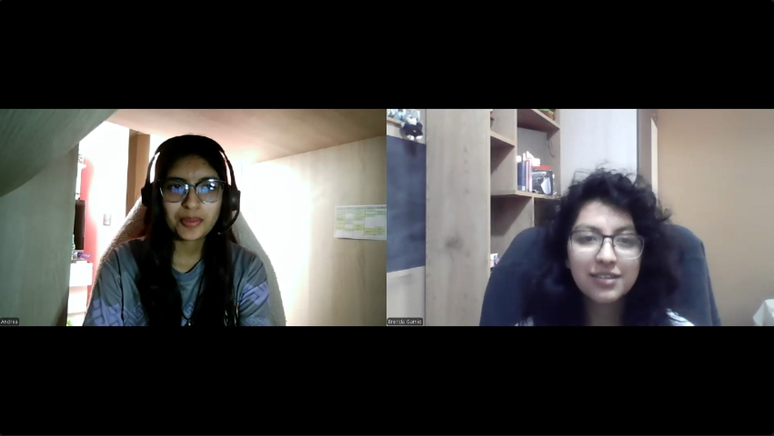 |
| **Entrevistado** | Andrea Ramirez |
| **Entrevistador** | Brenda Gamio |
| **Sexo** | Femenino |
| **Edad** | 21 años |
| **Link de entrevista** | https://upcedupe-my.sharepoint.com/:v:/g/personal/u201500225_upc_edu_pe/EQb9gem5T9NPgXwQ_FV652UBRtYuMs3WIJZrZrZ_LUfrFw?e=Lwr2vd&nav=eyJyZWZlcnJhbEluZm8iOnsicmVmZXJyYWxBcHAiOiJTdHJlYW1XZWJBcHAiLCJyZWZlcnJhbFZpZXciOiJTaGFyZURpYWxvZy1MaW5rIiwicmVmZXJyYWxBcHBQbGF0Zm9ybSI6IldlYiIsInJlZmVycmFsTW9kZSI6InZpZXcifX0%3D |
| **Resumen** | La entrevistada no ha utilizado aplicaciones de **trazabilidad alimentaria** con QR y blockchain, pero muestra interés creciente en **productos saludables y con certificaciones**. En sus **compras familiares semanales**, valora la **verificación de la información**, la **facilidad de uso** y la **rapidez** al escanear. Prefiere visualizar datos mediante **líneas de tiempo** y **mapas interactivos** que detallen el recorrido del producto, las certificaciones obtenidas y las empresas involucradas. Además, **está dispuesta a pagar un precio mayor** por productos con trazabilidad verificada, pues la **transparencia** influye directamente en su decisión de compra. El **prototipo presentado fue bien recibido**, aunque sugirió **mejoras en elementos visuales** para facilitar la comprensión de la información. |

#### Entrevista 2

| Campo | Detalle |
|-------|--------|
| **Imagen** | 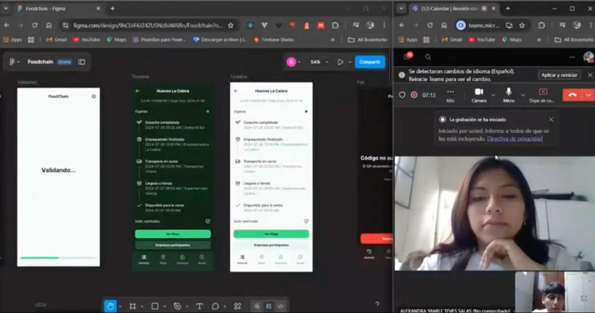 |
| **Entrevistado** | Alexandra Teves |
| **Entrevistador** | Diego Soto |
| **Sexo** | Femenino |
| **Edad** | 21 años |
| **Link de entrevista** | https://upcedupe-my.sharepoint.com/:v:/g/personal/u202214477_upc_edu_pe/EYBvQODrYrJCpzmjP_GLM0MBJ57Xly85cfcU-TdvuCiRrw?e=FqiwCG&nav=eyJyZWZlcnJhbEluZm8iOnsicmVmZXJyYWxBcHAiOiJTdHJlYW1XZWJBcHAiLCJyZWZlcnJhbFZpZXciOiJTaGFyZURpYWxvZy1MaW5rIiwicmVmZXJyYWxBcHBQbGF0Zm9ybSI6IldlYiIsInJlZmVycmFsTW9kZSI6InZpZXcifX0%3D |
| **Resumen** | Consumidora limeña de 21 años, analista de marketing digital. Compra alimentos frescos y procesados **4–5 veces por semana**, priorizando **certificaciones** y **trazabilidad verificada**. Escanea códigos QR con frecuencia para verificar **origen**, **fechas** y **certificaciones** en blockchain. Valora información **rápida, clara y visual** (línea de tiempo y mapa). Pide **alertas ante inconsistencias** y una app **simple e intuitiva** que muestre los datos en menos de dos segundos. |

#### Entrevista 3

| Campo | Detalle                                        |
|-------|------------------------------------------------|
| **Imagen** ||
| **Entrevistado** | Rosa Gutiérrez                                 |
| **Entrevistador** | Gustavo Huanca                                 |
| **Sexo** | Femenino                                       |
| **Edad** | 56                                             |
| **Link de entrevista** |      https://upcedupe-my.sharepoint.com/:v:/g/personal/u202215285_upc_edu_pe/EbQwl13e2wBImSbaa1T8wLsBLsKtuximA69_yWKKVYaBEQ?e=KP3gL7&nav=eyJyZWZlcnJhbEluZm8iOnsicmVmZXJyYWxBcHAiOiJTdHJlYW1XZWJBcHAiLCJyZWZlcnJhbFZpZXciOiJTaGFyZURpYWxvZy1MaW5rIiwicmVmZXJyYWxBcHBQbGF0Zm9ybSI6IldlYiIsInJlZmVycmFsTW9kZSI6InZpZXcifX0%3D                                         |
| **Resumen** |   Mamá de 56 años en Lima, profesora de primaria. Hace una compra grande cada semana y completa con compras pequeñas. Prefiere productos con certificaciones cuando el precio no se dispara. Escanea códigos QR una o dos veces por semana, sobre todo en huevos, leche y miel. Al hacerlo, quiere ver un resumen corto con origen, fecha, lote y un aviso claro de verificación. Le gustan las presentaciones simples: una tarjeta con los datos esenciales y una línea de tiempo con íconos; el mapa le parece útil, pero no indispensable. Si hay errores, espera un aviso en rojo, una recomendación y un botón para reportar. Valora que todo cargue en uno o dos segundos. La trazabilidad confiable le da seguridad y está dispuesta a pagar un poco más. Pide letra grande, botones claros y que no exija registro.                                            |

#### Entrevista 4

| Campo | Detalle |
|-------|--------|
| **Imagen** | 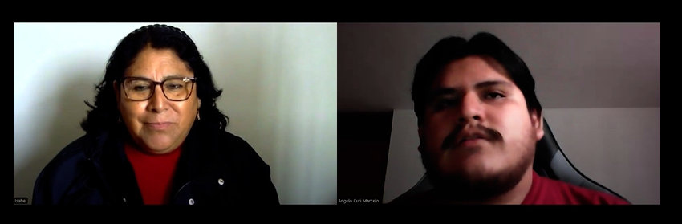 |
| **Entrevistado** | Isabel Osorio |
| **Entrevistador** | Angelo Curi |
| **Sexo** | Femenino |
| **Edad** | 60 años |
| **Link de entrevista** | https://upcedupe-my.sharepoint.com/:v:/g/personal/u202022387_upc_edu_pe/EdnoOyfnMeFCrq9gwYy-G2IBbV6KFZ8gG6M_OSlo_djzng?e=BgRco2&nav=eyJyZWZlcnJhbEluZm8iOnsicmVmZXJyYWxBcHAiOiJTdHJlYW1XZWJBcHAiLCJyZWZlcnJhbFZpZXciOiJTaGFyZURpYWxvZy1MaW5rIiwicmVmZXJyYWxBcHBQbGF0Zm9ybSI6IldlYiIsInJlZmVycmFsTW9kZSI6InZpZXcifX0%3D |
| **Resumen** | La señora Isabel Osorio, una profesora de 60 años que vive en el distrito de Chorrillos, compra productos alimenticios frescos y procesados casi todos los días. Ella prefiere productos que cuenten con certificaciones. Aunque no suele escanéar códigos QR con frecuencia, si lo hiciera, buscaría información sobre cómo y dónde se elaboraron los productos. Considera que una aplicación que muestre estos datos sería muy importante y valiosa. |

### Segmento objetivo – Productores

#### Entrevista 1

| Campo                  | Detalle                                                                                                                                                                                                                                                                                                                |
|------------------------|------------------------------------------------------------------------------------------------------------------------------------------------------------------------------------------------------------------------------------------------------------------------------------------------------------------------|
| **Imagen**             | 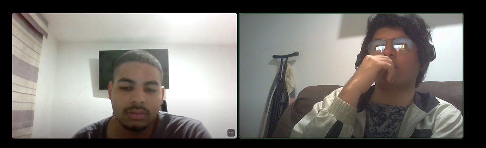                                                                                                                                                                                                                                               |
| **Entrevistado**       | Jorge                                                                                                                                                                                                                                                                                                                  |
| **Entrevistador**      | Juan Pescoran                                                                                                                                                                                                                                                                                                          |
| **Sexo**               | Masculino                                                                                                                                                                                                                                                                                                              |
| **Edad**               | 28                                                                                                                                                                                                                                                                                                                     |
| **Link de entrevista** | https://upcedupe-my.sharepoint.com/:v:/g/personal/u20221c936_upc_edu_pe/ESybPOGgCLlDtPTP8IlIP8cB8OfuDqgFRqXKMlQ3Cn3YdQ?e=lVjz5H&nav=eyJyZWZlcnJhbEluZm8iOnsicmVmZXJyYWxBcHAiOiJTdHJlYW1XZWJBcHAiLCJyZWZlcnJhbFZpZXciOiJTaGFyZURpYWxvZy1MaW5rIiwicmVmZXJyYWxBcHBQbGF0Zm9ybSI6IldlYiIsInJlZmVycmFsTW9kZSI6InZpZXcifX0%3D |
| **Resumen**            | Los dolores del entrevistado no son teóricos, sino operativos y con consecuencias financieras directas (lotes rechazados). La solución propuesta fue comprendida no por su tecnología, sino por sus beneficios directos: orden, detección de errores y, sobre todo, la capacidad de generar confianza verificable ante sus clientes exigentes.                                                                                                                                                                                                                                                                                                                       |

#### Entrevista 2

| Campo                  | Detalle                                                                                                                                                                                                                                                                                                                |
|------------------------|------------------------------------------------------------------------------------------------------------------------------------------------------------------------------------------------------------------------------------------------------------------------------------------------------------------------|
| **Imagen**             |                                                                                                                                                                                                                                                |
| **Entrevistado**       | Adrian Torres                                                                                                                                                                                                                                                                                                          |
| **Entrevistador**      | Juan Pescoran                                                                                                                                                                                                                                                                                                          |
| **Sexo**               | Masculino                                                                                                                                                                                                                                                                                                              |
| **Edad**               | 25                                                                                                                                                                                                                                                                                                                     |
| **Link de entrevista** | https://upcedupe-my.sharepoint.com/:v:/g/personal/u20221c936_upc_edu_pe/EawJ44YfLbhBvB53l4j_ukcB5wycgDdULezhcJiC3KEwwA?e=2iIM5J&nav=eyJyZWZlcnJhbEluZm8iOnsicmVmZXJyYWxBcHAiOiJTdHJlYW1XZWJBcHAiLCJyZWZlcnJhbFZpZXciOiJTaGFyZURpYWxvZy1MaW5rIiwicmVmZXJyYWxBcHBQbGF0Zm9ybSI6IldlYiIsInJlZmVycmFsTW9kZSI6InZpZXcifX0%3D |
| **Resumen**            |  La entrevista valida que para un cliente de gran escala como Backus, la trazabilidad no es un problema de falta de datos, sino de silos de información y falta de visibilidad externa. Su sistema interno (SAP) es robusto, pero la confianza se rompe en cuanto el producto interactúa con terceros (distribuidores, minoristas).                                                                                                                                                                                                                                                                                                                      |

## 2.2.3. Análisis de entrevistas

De acuerdo con la información recopilada de las entrevistas, realizamos el siguiente análisis segmentado:

### Segmento objetivo #1: Productores

**Hallazgos:**

Los productores entrevistados, dedicados a cultivos, ganadería y procesamiento de alimentos, crean nuevos lotes de manera frecuente, en su mayoría de forma diaria o varias veces por semana, lo que exige un control continuo y preciso. Actualmente, una gran parte gestiona la trazabilidad de forma manual o en planillas de Excel, lo que deriva en errores humanos, pérdida de información y dificultad para responder rápidamente a auditorías.

Todos los entrevistados coincidieron en la necesidad de una plataforma que digitalice y automatice el registro de cada paso, desde la creación de lotes y las operaciones de cosecha, empaque y transporte, hasta el cierre final, garantizando coherencia temporal, validación automática y alertas inmediatas ante inconsistencias. La captura de ubicación GPS en tiempo real es vista como esencial para asegurar la autenticidad de la información, mientras que la verificación inmutable en blockchain genera confianza tanto para auditorías internas como para sus clientes B2B.

Los productores manifestaron un gran interés en dashboards de control con métricas en tiempo real, filtros avanzados y reportes exportables (CSV/PDF) que permitan una gestión más eficiente y transparente. Además, consideran imprescindible una definición clara de roles y permisos para proteger los datos y evitar accesos no autorizados.

Las principales frustraciones detectadas incluyen la falta de alertas automáticas, los problemas de conectividad en campo y las dificultades para corregir datos sin perder trazabilidad. La mayoría expresó disposición a invertir en una solución SaaS si esta reduce significativamente los errores de registro y acelera las auditorías y procesos de control de calidad.

### Segmento objetivo #2: Consumidores finales

**Hallazgos:**

Los consumidores entrevistados, que incluyen jóvenes adultos y amas de casa entre 21 y 60 años, realizan compras frecuentes de alimentos frescos o procesados (4 a 5 veces por semana en promedio) y prefieren productos con certificaciones orgánicas o de comercio justo. Aproximadamente 60 % escanea códigos QR al menos dos veces por semana, buscando principalmente origen, fecha de producción, certificaciones y verificación en blockchain.

La verificación inmediata en blockchain es un requisito crítico: cerca del 85 % espera que la aplicación confirme la autenticidad en segundos. Asimismo, la línea de tiempo cronológica y los mapas interactivos son considerados muy útiles (≈80 %) para visualizar el recorrido completo del producto. La velocidad de carga es un factor determinante, ya que 9 de cada 10 usuarios esperan que la información aparezca en menos de dos segundos.

Entre las frustraciones más comunes se encuentran la falta de información completa, la dificultad para validar certificaciones en otras plataformas y la lentitud en la carga de datos. Además, los consumidores valoran la posibilidad de recibir alertas inmediatas ante inconsistencias y desean conocer información sobre sostenibilidad y responsabilidad social de las empresas involucradas en la cadena de producción.

La trazabilidad verificada influye directamente en la decisión de compra (≈85 %), y alrededor del 60 % está dispuesto a pagar hasta un 10 % adicional por productos auditados y con certificaciones verificables. La facilidad de uso y la claridad en la interfaz, con botones visibles, textos legibles y acceso sin necesidad de registro, también fueron señaladas como indispensables.

### Conclusiones generales

Los hallazgos del segmento productor confirman la urgencia de una solución digital que automatice la captura de datos, garantice la inmutabilidad en blockchain, provea reportes claros y alertas automáticas, reduciendo errores humanos y acelerando los procesos de control y auditoría.

En el segmento consumidor final, la demanda se centra en transparencia, velocidad y confianza: requieren verificación inmediata en blockchain, presentación visual clara (línea de tiempo, mapa interactivo) y notificaciones de inconsistencias, así como información sobre la sostenibilidad de los productos.

En conjunto, ambos segmentos respaldan el enfoque de FoodChain como plataforma de trazabilidad alimentaria en tiempo real, capaz de conectar seguridad, eficiencia y transparencia a lo largo de toda la cadena de suministro.

### Entrevista completa

Link de las entrevistas completas:  

### Análisis por medio de herramientas estadísticas

**Segmento objetivo #1: Productores**  

Enlace: https://forms.gle/Lvdai8xSNk41KTWDA

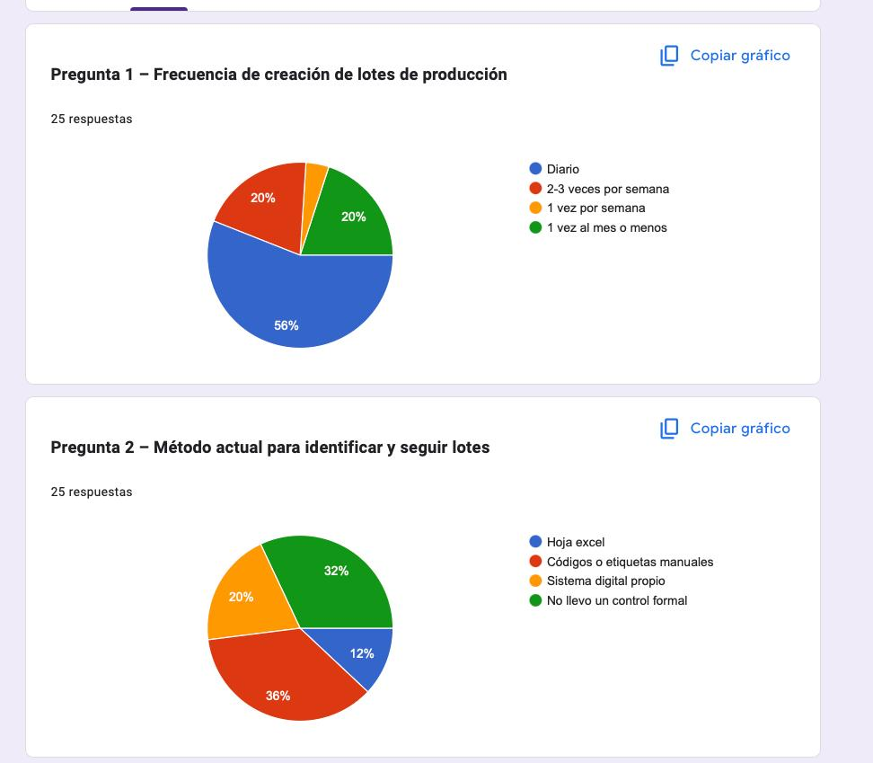

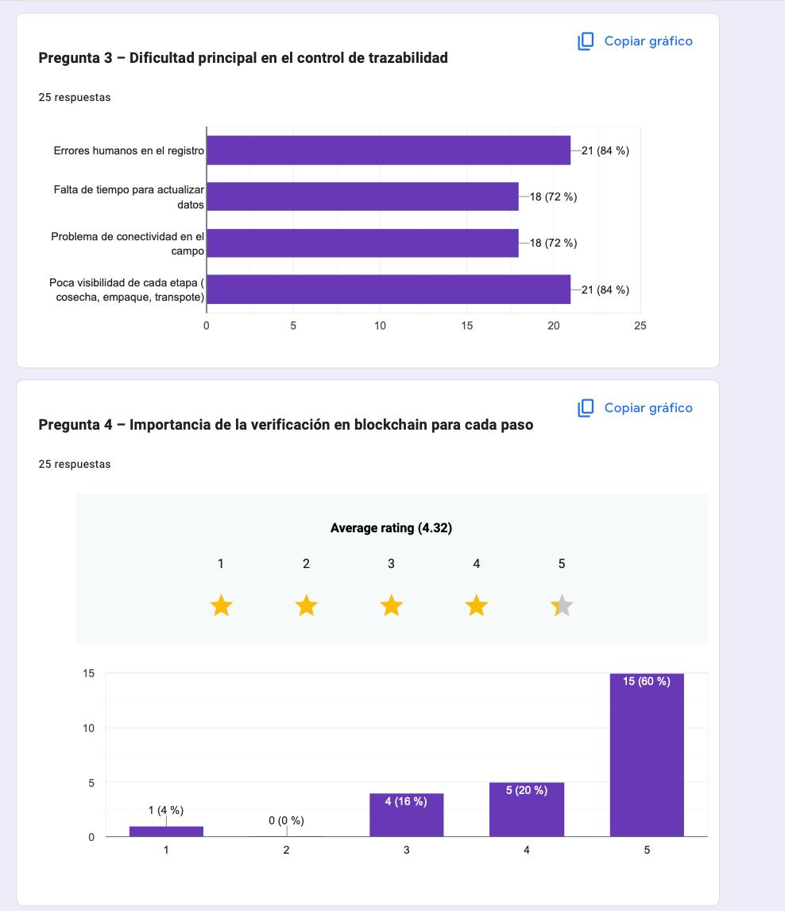

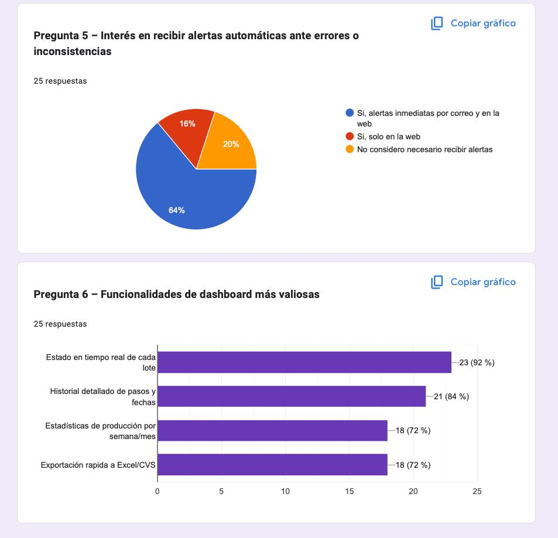

**Segmento objetivo #2: Consumidores finales**  

Enlace: https://forms.gle/SXtQtRzKza5CD9Ns8

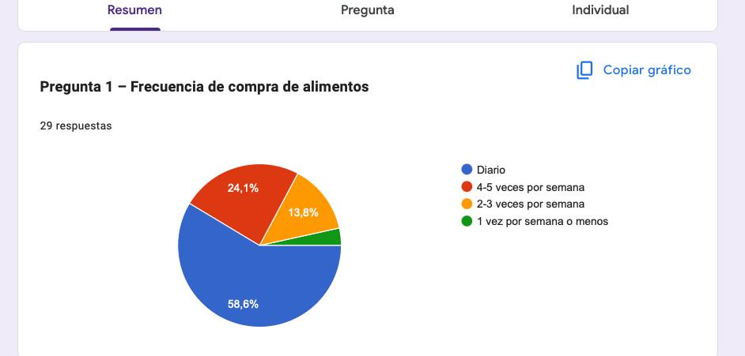

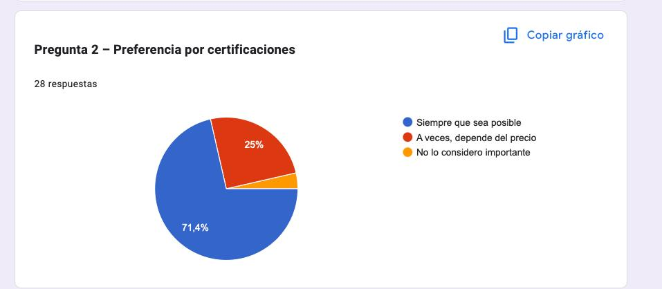

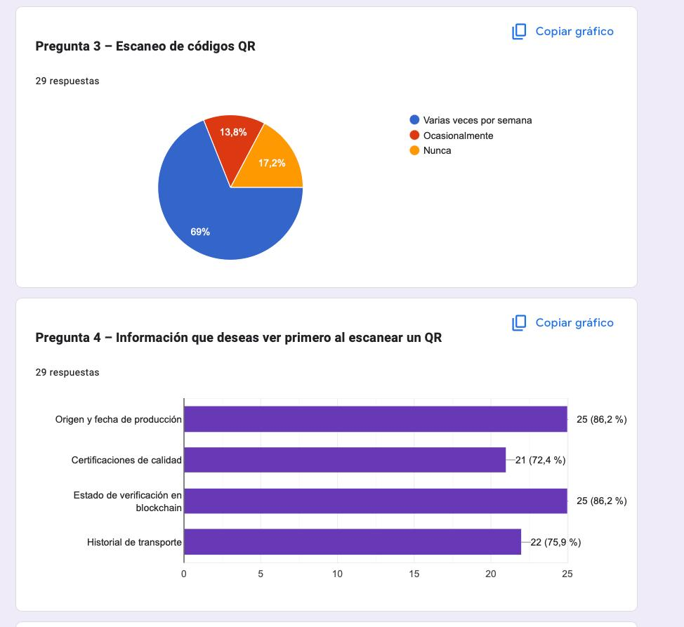

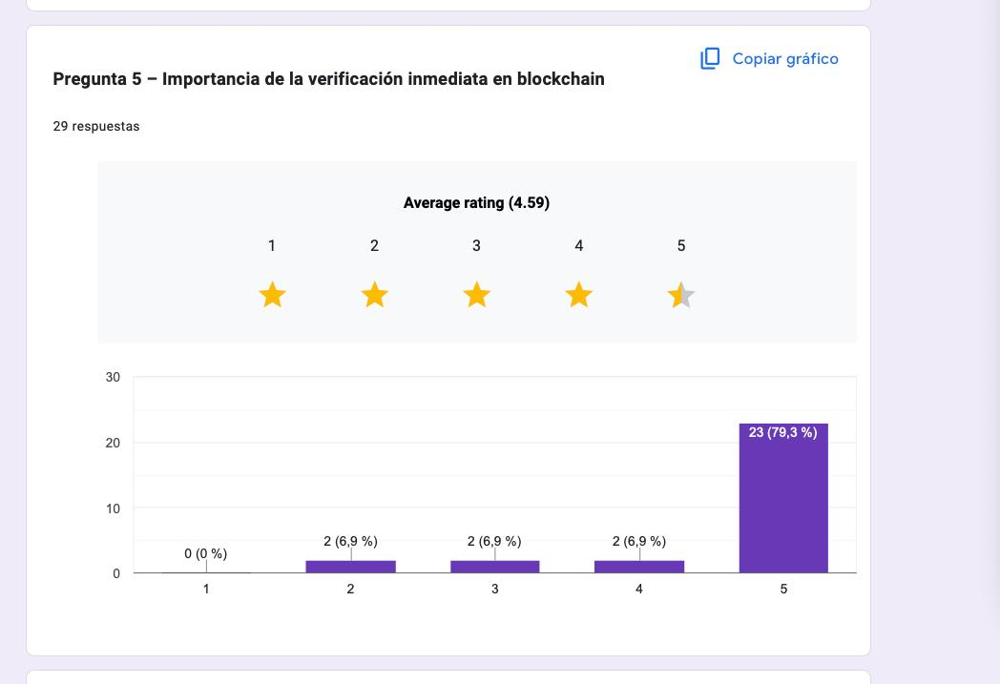

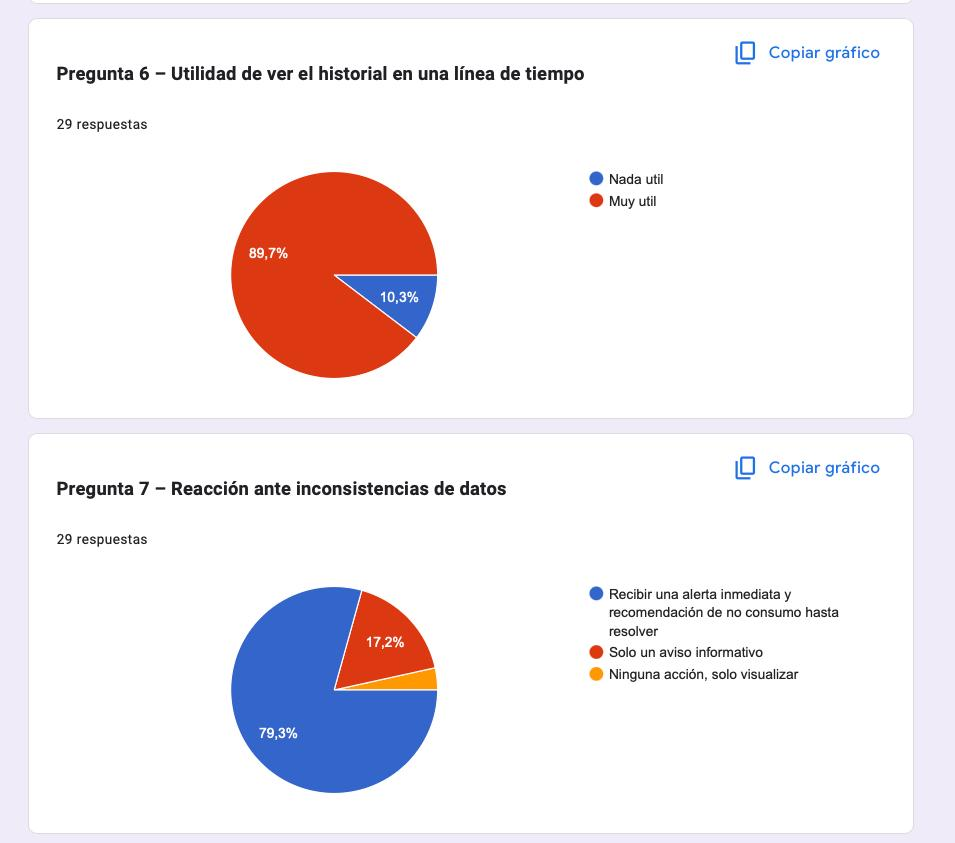

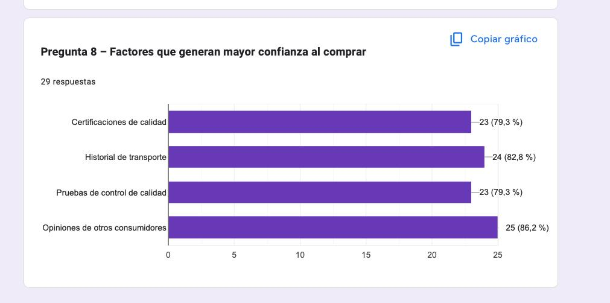

## 2.3. Needfinding

En esta sección presentamos los artefactos clave que representan las necesidades, motivaciones y puntos de dolor de nuestros usuarios, tales como los perfiles de User Personas, la User Task Matrix, los User Journey Maps, el Empathy Mapping y el As-Is Scenario Mapping. Estos elementos son fundamentales para definir soluciones de diseño centradas en el usuario y asegurar que las decisiones de producto se basen en una comprensión profunda de los comportamientos y expectativas reales.

### 2.3.1. User Personas

En esta sección describimos la construcción de las fichas de User Persona para nuestros segmentos objetivo, enfocándonos en las características, comportamientos, motivaciones y retos clave de productores y consumidores dentro del ecosistema FoodChain. Consideramos aspectos demográficos y psicográficos, así como el nivel de competencia tecnológica, las necesidades de trazabilidad y transparencia, y las condiciones específicas de conectividad y uso.

###### Figura *
*User persona de nuestro segmento de Productores*

 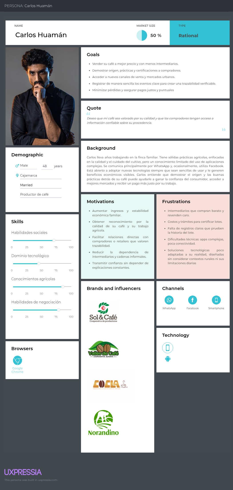

###### Figura *
*User persona de nuestro segmento de Usuarios Finales*

 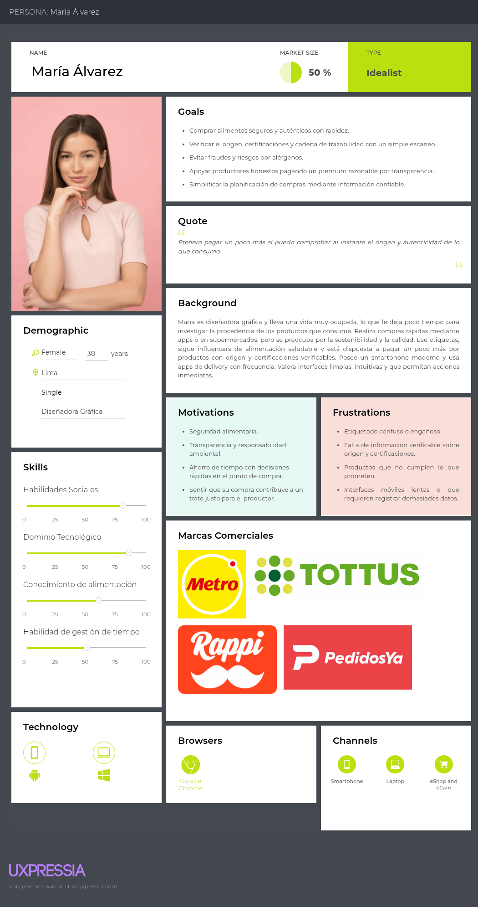

### 2.3.2. User Task Matrix

En esta sección presentamos el User Task Matrix, una herramienta que sintetiza las acciones clave que nuestros User Personas (Productores y Usuarios finales) ejecutan para alcanzar sus objetivos con respecto a la trazabilidad alimentaria, independientemente de la existencia de una solución digital. 

Cada fila representa una tarea específica, mientras que las columnas reflejan la frecuencia e importancia con la que cada segmento ejecuta dichas tareas. Hemos mantenido el enfoque en tareas reales que reflejan el comportamiento orgánico de los usuarios, evitando confundir funcionalidades del software con tareas del usuario.

###### Tabla X

*User Task Matrix para los segmentos objetivos de FoodChain*

<table style="text-align: center; width: 100%;">
  <thead>
    <tr>
      <th rowspan="2">Tareas</th>
      <th colspan="2">Usuarios Finales (Consumidores)</th>
      <th colspan="2">Productores (Pequeños/Medianos)</th>
    </tr>
    <tr>
      <th>Frecuencia</th>
      <th>Importancia</th>
      <th>Frecuencia</th>
      <th>Importancia</th>
    </tr>
  </thead>
  <tbody>
    <tr>
      <td>Escanear código QR para acceder a la historia del producto</td>
      <td>Often</td>
      <td>High</td>
      <td>Rarely</td>
      <td>Low</td>
    </tr>
    <tr>
      <td>Visualizar mapa con la ruta logística del producto</td>
      <td>Often</td>
      <td>High</td>
      <td>Rarely</td>
      <td>Low</td>
    </tr>
    <tr>
      <td>Ver certificados y documentación adjunta (orgánico, comercio justo, análisis)</td>
      <td>Often</td>
      <td>High</td>
      <td>Sometimes</td>
      <td>High</td>
    </tr>
    <tr>
      <td>Consultar perfil del productor (origen, prácticas, fechas clave)</td>
      <td>Sometimes</td>
      <td>Medium</td>
      <td>Rarely</td>
      <td>Medium</td>
    </tr>
    <tr>
      <td>Registrar eventos del lote</td>
      <td>Never</td>
      <td>Low</td>
      <td>Always</td>
      <td>High</td>
    </tr>
    <tr>
      <td>Generar/emitir etiquetas QR o identificadores por lote</td>
      <td>Never</td>
      <td>Low</td>
      <td>Often</td>
      <td>High</td>
    </tr>
    <tr>
      <td>Integrar datos externos (certificados, análisis de laboratorio, sensores IoT)</td>
      <td>Never</td>
      <td>Low</td>
      <td>Sometimes</td>
      <td>High</td>
    </tr>
    <tr>
      <td>Acceder a los registros del propio lote para control/gestión</td>
      <td>Never</td>
      <td>Low</td>
      <td>Often</td>
      <td>High</td>
    </tr>
    <tr>
      <td>Interoperar / sincronizar datos con sistemas existentes (ERP, certificadoras)</td>
      <td>Never</td>
      <td>Low</td>
      <td>Sometimes</td>
      <td>Medium</td>
    </tr>
    <tr>
      <td>Tomar decisión de compra basada en la información de trazabilidad</td>
      <td>Often</td>
      <td>High</td>
      <td>Never</td>
      <td>Low</td>
    </tr>
  </tbody>
</table>

***Análisis comparativo de tareas: Usuarios finales (consumidores) vs. Productores**

**Tareas de mayor frecuencia e importancia en ambos perfiles**

Tanto los **usuarios finales** como los **productores** coinciden en ciertas tareas clave que son realizadas con alta frecuencia y valoradas como altamente importantes en el contexto de la trazabilidad alimentaria:

- **Acceder a la historia del producto (escaneo de QR).**  
  - *Consumidores:* acción frecuente y de alto impacto en la decisión de compra.  
  - *Productores:* menos frecuente, pero clave porque valida el registro que ellos generan.

- **Verificación de certificaciones y documentación adjunta.**  
  - Ambos perfiles consideran esta tarea de alta importancia: los consumidores para decidir y los productores para aportar evidencia de calidad.

- **Registrar y consultar eventos del lote.**  
  - *Productores:* prioritaria (registro continuo y base de la trazabilidad).  
  - *Consumidores:* dependen de que estos registros existan para confiar en el producto (importancia alta aunque no registren).

**Principales diferencias**

- **Dirección de la interacción**  
  - *Consumidores:* realizan acciones de verificación y decisión (escaneo, mapa, lectura de certificados).  
  - *Productores:* ejecutan acciones operativas y administrativas (registrar eventos, generar QR, subir certificados).

- **Frecuencia operativa**  
  - *Productores:* registros y gestión de lotes de forma recurrente (Always/Often).  
  - *Consumidores:* acciones puntuales en el punto de compra o cuando necesitan verificar (Often/Sometimes).

- **Requerimientos técnicos y de usabilidad**  
  - *Productores:* necesitan flujos de **registro rápido**, soporte **offline** y sincronización con sistemas externos.  
  - *Consumidores:* necesitan respuestas **instantáneas**, vistas resumidas y señales claras de confianza (badges, certificados visibles, mapa).

- **Propósito y motivadores**  
  - *Productores:* documentar y probar origen para obtener mejor precio y acceso al mercado.  
  - *Consumidores:* verificar y decidir para garantizar seguridad, calidad y, en ocasiones, pagar un premium por trazabilidad.

**Coincidencias destacadas**

- Ambos perfiles comparten la **prioridad por la confianza**: registros verificables son valorados por razones complementarias.
- La **verificación de certificaciones** aumenta la confianza del consumidor y el valor comercial del productor.
- Las **notificaciones críticas** son útiles para ambos: consumidores (recalls, información) y productores (gestión operativa).
- La **interoperabilidad** con certificadoras y ERPs beneficia principalmente a productores, pero mejora indirectamente la credibilidad percibida por consumidores.

### 2.3.3. User Journey Mapping

En esta sección presentamos los User Journey Maps As-Is para cada uno de nuestros User Personas, ilustrando el recorrido completo que realizan actualmente para verificar la trazabilidad y autenticidad de los productos alimentarios, desde la identificación de la necesidad hasta la toma de decisión de compra informada. Iniciaremos con una descripción general del viaje end-to-end, resaltando los momentos clave de descubrimiento, interacción y evaluación, así como los principales puntos de dolor y oportunidades para optimizar la experiencia. Luego, mostraremos los diagramas elaborados en la herramienta correspondiente, vinculando cada mapa con el User Persona respectivo para evidenciar cómo sus metas, frustraciones y comportamientos influyen en cada fase del proceso.

###### Figura *
*User Journey map de nuestro segmento de Productores*

 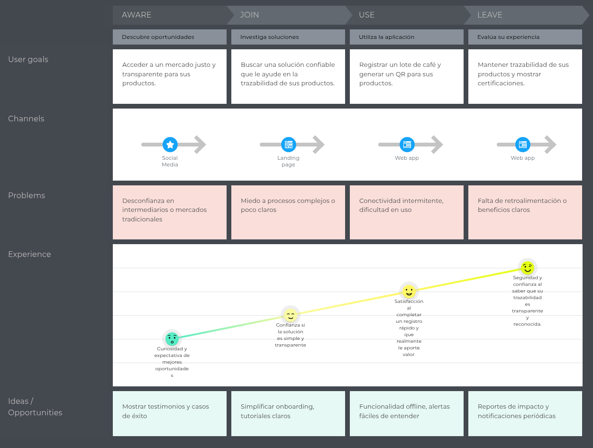

###### Figura *
*User Journey map de nuestro segmento de Usuarios Finales*

 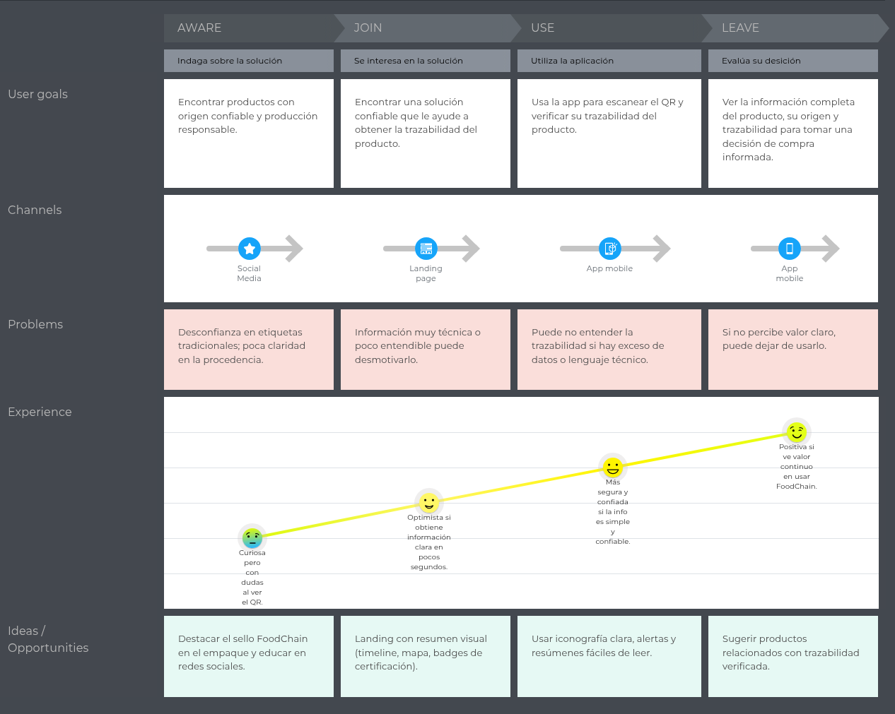

### 2.3.4. Empathy Mapping

En esta sección presentamos los Empathy Maps desarrollados para nuestros dos User Personas: el Productor (caficultor) y el Usuario Final (consumidor consciente). Cada mapa organiza la información en torno a seis dimensiones clave: qué ve, dice, hace, escucha, piensa y siente el usuario.

A partir de este análisis, identificamos sus principales frustraciones y obstáculos (Pains), así como sus motivaciones y expectativas (Gains). Esto nos ayuda a comprender mejor su experiencia frente a la trazabilidad alimentaria y a diseñar soluciones más acordes a sus necesidades reales.

###### Figura *
*Empathy map de nuestro segmento de Productores*

 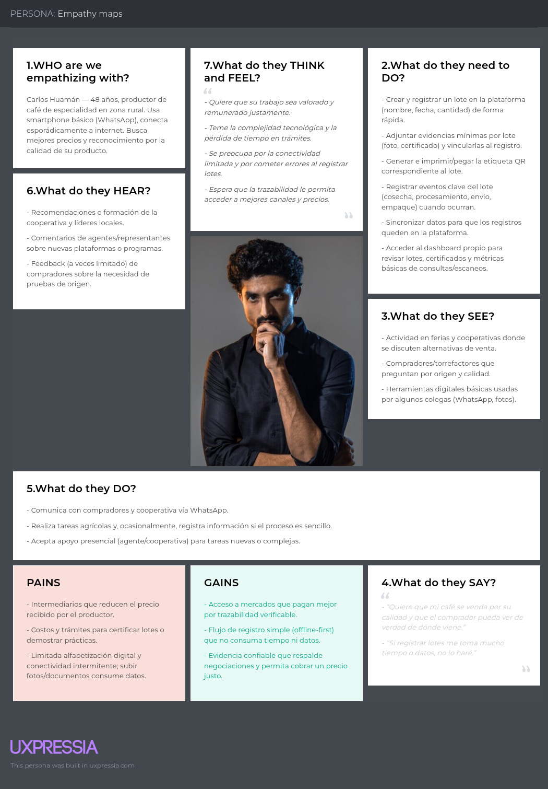

###### Figura *
*Empathy map de nuestro segmento de Usuarios Finales*

 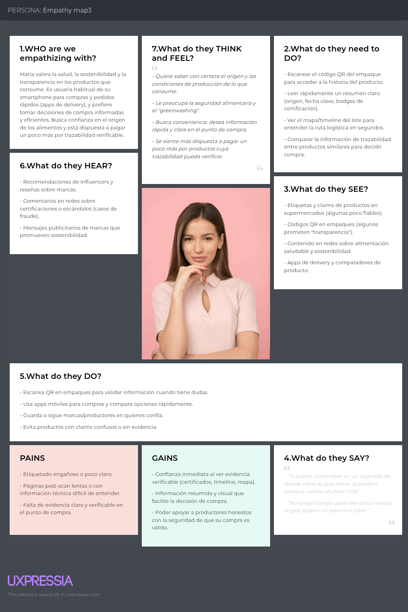

### 2.3.5. As-is Scenario Mapping

El As‑Is Scenario Mapping es una herramienta clave para analizar cómo interactúan actualmente nuestros usuarios con procesos relacionados a la trazabilidad alimentaria. En esta sección se descompone paso a paso la experiencia real tanto del Productor como del Usuario Final, desde sus acciones cotidianas hasta sus pensamientos y emociones durante el proceso.

Cada escenario se estructura en torno a cuatro dimensiones principales:

- Phases (Fases del proceso)

- Doing (Qué hace el usuario)

- Thinking (Qué piensa en cada paso)

- Feeling (Qué emociones experimenta)

Este enfoque nos permite detectar con claridad puntos de dolor, frustraciones, necesidades no resueltas y áreas de oportunidad, incluso antes de plantear soluciones digitales.

###### Figura *
*As-Is Scenario Mapping de nuestro segmento de Productores*

 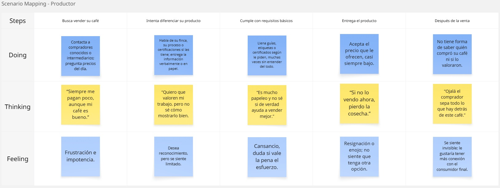

###### Figura *
*As-Is Scenario Mapping de nuestro segmento de Usuarios Finales*

 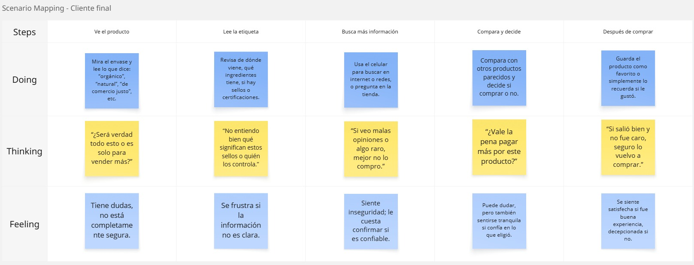

## 2.4. Ubiquitous Language

Este glosario de Ubiquitous Language reúne los términos clave del dominio de la trazabilidad alimentaria en FoodChain. Cada entrada aparece en inglés, con su equivalente en español y una definición clara. Su propósito es asegurar un entendimiento común entre todos los miembros del equipo y stakeholders, evitando ambigüedades y mejorando la comunicación. El glosario incluye solo términos propios del business domain y excluye jerga técnica de software.

| Term (Término)                              | Definición                                                                                                                                                                            |
| ------------------------------------------- | ------------------------------------------------------------------------------------------------------------------------------------------------------------------------------------- |
| Attachment (Adjunto)                        | Documento o evidencia digital asociada a un evento (ej. certificado, guía de transporte, factura).                                                                                    |
| Audit (Auditoría)                           | Proceso de revisión de un lote y sus eventos, realizado por un auditor o por la plataforma.                                                                                           |
| Audit Status (Estado de auditoría)          | Estado resultante de la revisión de un lote (aprobado, rechazado, pendiente).                                                                                                         |
| Authentication (Autenticación)              | Proceso de acceso a la plataforma mediante credenciales válidas (usuario y contraseña).                                                                                               |
| BlockchainRecord (Registro en blockchain)   | Registro inmutable en blockchain que asegura la trazabilidad y la autenticidad de la información de un evento o documento adjunto.                                                    |
| Consumer (Consumidor)                       | Usuario final que consulta la información de un lote escaneando su código QR, sin capacidad de modificar datos.                                                                       |
| Dashboard (Tablero de control)              | Interfaz gráfica que muestra métricas clave (ej. cantidad de lotes activos, eventos registrados, auditorías realizadas).                                                              |
| Event (Evento)                              | Acción registrada sobre un lote (ej. siembra, procesamiento, transporte, venta). Cada evento incluye fecha, ubicación y responsable.                                                  |
| GPS Location (Ubicación GPS)                | Ubicación geográfica capturada automáticamente al registrar un evento.                                                                                                                |
| Hash (Hash)                                 | Código único generado para garantizar la integridad de un evento o adjunto en blockchain.                                                                                             |
| History (Historial)                         | Registro completo y cronológico de todos los eventos y cambios de estado de un lote.                                                                                                  |
| Lot (Lote)                                  | Unidad de producción o conjunto de productos rastreado a lo largo de toda la cadena de suministro.                                                                                    |
| Lot Closure (Cierre de lote)                | Acción que finaliza un lote, bloqueando la posibilidad de añadir nuevos eventos.                                                                                                      |
| Lot Duplication (Duplicación de lote)       | Creación de un nuevo lote a partir de uno ya existente, heredando su información inicial.                                                                                             |
| Lot Status (Estado del lote)                | Condición actual del lote: Activo (abierto a registros), En Revisión (bajo auditoría o verificación) o Cerrado (finalizado, sin nuevas modificaciones).                               |
| Notification (Notificación)                 | Mensaje enviado al Producer sobre eventos relevantes (ej. cambios de estado, validaciones, revisiones).                                                                               |
| Permissions (Permisos)                      | Reglas que definen las acciones que puede ejecutar el Producer en la gestión de sus lotes.                                                                                            |
| Predefined Location (Ubicación predefinida) | Ubicación seleccionada de un catálogo cuando no se usa GPS.                                                                                                                           |
| Producer (Productor)                        | Usuario que gestiona lotes dentro de la plataforma. Puede crear, editar, cerrar, duplicar o eliminar lotes, así como registrar eventos, adjuntar documentos y responder a auditorías. |
| QR Code (Código QR)                         | Código único generado para identificar un lote y permitir su consulta por cualquier usuario.                                                                                          |
| Role (Rol)                                  | Categoría de usuario que determina permisos (en este caso, Producer o Consumer).                                                                                                      |
| Session (Sesión)                            | Periodo autorizado en el que un Producer interactúa con la plataforma tras autenticarse.                                                                                              |

