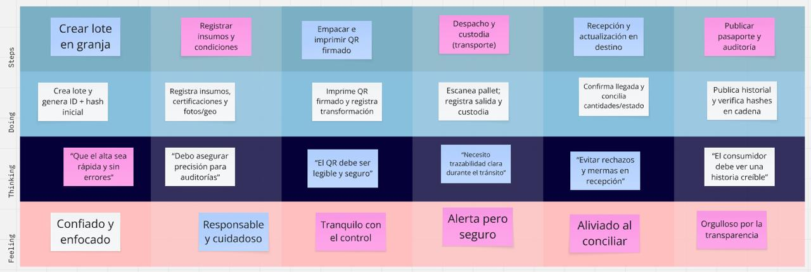
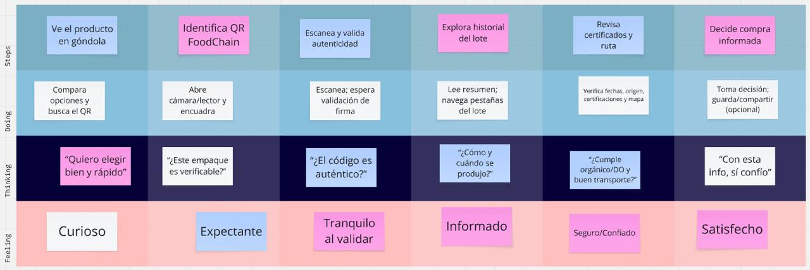
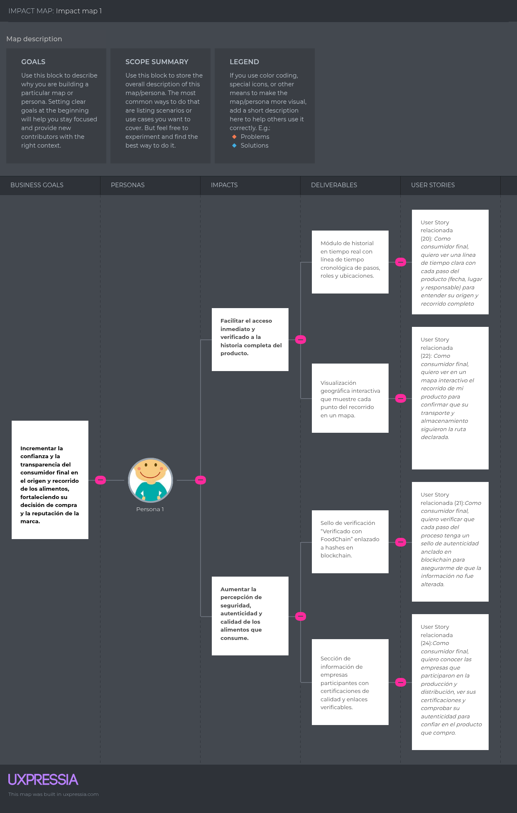
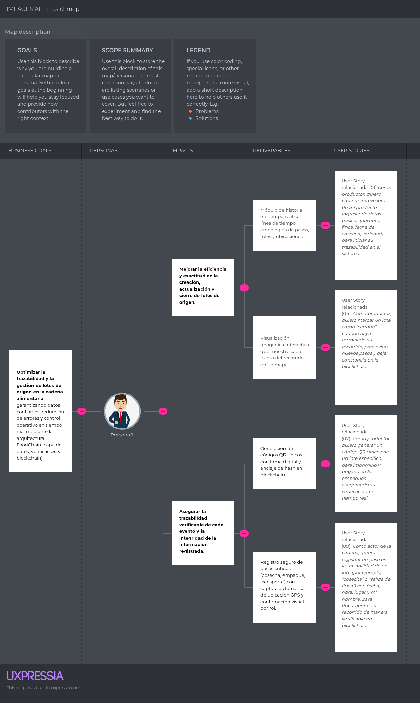

## Capítulo III: Requirements Specification

### 3.1 To-Be Scenario Mapping

#### Segmento Productores
El *To-Be Scenario Mapping* para **Productores** muestra el escenario ideal cuando utilizan FoodChain para registrar y verificar la trazabilidad de sus lotes de origen.  

<b>Escenario ideal para productores que buscan asegurar la integridad de sus productos y cumplir con certificaciones.</b>

#### Segmento Usuarios finales
El *To-Be Scenario Mapping* para **Usuarios finales** muestra el escenario ideal al momento de escanear el código QR de un producto en el punto de venta para verificar su origen y calidad.  

<b>Escenario ideal para consumidores que desean comprar con confianza y transparencia.</b>

Enlace de la elaboracion del To-be Scenario Mapping: https://miro.com/welcomeonboard/OE9kSjJSQjdJUGsrQ3cyTmNRV1JqS3gzWXJnSVJxL3dINWN3MCtsOE1qbTFySEZ6aWxLSXRqbUNCU04yaE9IU3JEMDVSbTU2cWlJUldvaS9OWGVHVmQ3Qk9OaTVFVUVYQjZFZEJDSjE3S1B2NjZ0cnh4OXA4cERJZSt6QTBmOWp0R2lncW1vRmFBVnlLcVJzTmdFdlNRPT0hdjE=?share_link_id=288737406659

### 3.2 User Stories

## Epics 

| Epic ID | Título                                | Descripción                                                                                                                                           | User Stories                                   |
|:--------|:--------------------------------------|:------------------------------------------------------------------------------------------------------------------------------------------------------|:-----------------------------------------------|
| EP01    | Gestión de Lotes                      | Esta epic agrupa todas las funcionalidades relacionadas con la creación, edición, duplicación, cierre y eliminación de lotes por parte del productor. | US01, US02, US04, US05, US06, US07, US08       |
| EP02    | Trazabilidad y Registro de Pasos      | Esta epic cubre el registro de pasos en la cadena de suministro, validaciones de secuencia, captura de ubicación y registro en blockchain.            | US09, US10, US11, US12, US13, US16, US18       |
| EP03    | Visualización y Consulta de Historial | Esta epic incluye la visualización del historial de lotes para actores de la cadena y consumidores, con filtros y verificación de autenticidad.       | US03, US14, US15, US19, US20, US21, US22, US23 |
| EP04    | Gestión de Usuarios y Roles           | Esta epic se enfoca en la administración de usuarios, roles, permisos y autenticación.                                                                | US17, US25, US26, US27, US28, US29, US30, US31 |
| EP05    | Dashboard y Administración            | Esta epic agrupa las funcionalidades de dashboard, métricas, exportación y gestión avanzada para administradores.                                     | US32, US33, US34, US35, US36, US37, US38       |
| EP06    | Experiencia del Consumidor            | Esta epic se centra en las funcionalidades destinadas al consumidor final, como escaneo de QR, verificación y visualización de información.           | US19, US20, US21, US22, US24                   |
| EP07    | Tecnología y Seguridad                | Esta epic incluye las historias técnicas relacionadas con seguridad, blockchain, hashing y manejo de errores.                                         | TS09, TS10, TS11, TS12, TS13, TS14, TS15, TS16 |

## User Stories

| User ID | Título                                                                                      | Descripción                                                                                                                                                                                                                                                                                                                                                                                                                                                                                                                                  | Criterios de Aceptación                                                                                                                                                                                                                                                                                                                                                                                                                                                                                                                                                                                                                                                                                                                                                                                                                                                                                                                                                                                                                                                                                                                                                                                                                                                                                                                                                                                                                                                                                                                                                                                                                                                                                                                                                                                                                                                                                                                                                                                                                                                                                                                                                                                                                                                                                                                                                                                                                                                                                                                                                                                                                                                                                                                                                                                                                                                                                                                                                                                                                                                                                                                                                                                                                                                                                                                                                                                                                                                                                                                                                                                                                                                                                                                                                                                                                                                                                                                                                                                                                                                                                                                                                                                                                                                                                                                                                                                                                                                                                                                                                                                                                                                                                                                                                                                                                                                                                                                                                                                                                                                                                                                                                                                                                                                                                                                                                                                                                                                                                                                                                                                                                                                                                                                                                                                                                                                                                                                                                                                                                                                                                     | Epic relacionada |
|:--------|:--------------------------------------------------------------------------------------------|:---------------------------------------------------------------------------------------------------------------------------------------------------------------------------------------------------------------------------------------------------------------------------------------------------------------------------------------------------------------------------------------------------------------------------------------------------------------------------------------------------------------------------------------------|:------------------------------------------------------------------------------------------------------------------------------------------------------------------------------------------------------------------------------------------------------------------------------------------------------------------------------------------------------------------------------------------------------------------------------------------------------------------------------------------------------------------------------------------------------------------------------------------------------------------------------------------------------------------------------------------------------------------------------------------------------------------------------------------------------------------------------------------------------------------------------------------------------------------------------------------------------------------------------------------------------------------------------------------------------------------------------------------------------------------------------------------------------------------------------------------------------------------------------------------------------------------------------------------------------------------------------------------------------------------------------------------------------------------------------------------------------------------------------------------------------------------------------------------------------------------------------------------------------------------------------------------------------------------------------------------------------------------------------------------------------------------------------------------------------------------------------------------------------------------------------------------------------------------------------------------------------------------------------------------------------------------------------------------------------------------------------------------------------------------------------------------------------------------------------------------------------------------------------------------------------------------------------------------------------------------------------------------------------------------------------------------------------------------------------------------------------------------------------------------------------------------------------------------------------------------------------------------------------------------------------------------------------------------------------------------------------------------------------------------------------------------------------------------------------------------------------------------------------------------------------------------------------------------------------------------------------------------------------------------------------------------------------------------------------------------------------------------------------------------------------------------------------------------------------------------------------------------------------------------------------------------------------------------------------------------------------------------------------------------------------------------------------------------------------------------------------------------------------------------------------------------------------------------------------------------------------------------------------------------------------------------------------------------------------------------------------------------------------------------------------------------------------------------------------------------------------------------------------------------------------------------------------------------------------------------------------------------------------------------------------------------------------------------------------------------------------------------------------------------------------------------------------------------------------------------------------------------------------------------------------------------------------------------------------------------------------------------------------------------------------------------------------------------------------------------------------------------------------------------------------------------------------------------------------------------------------------------------------------------------------------------------------------------------------------------------------------------------------------------------------------------------------------------------------------------------------------------------------------------------------------------------------------------------------------------------------------------------------------------------------------------------------------------------------------------------------------------------------------------------------------------------------------------------------------------------------------------------------------------------------------------------------------------------------------------------------------------------------------------------------------------------------------------------------------------------------------------------------------------------------------------------------------------------------------------------------------------------------------------------------------------------------------------------------------------------------------------------------------------------------------------------------------------------------------------------------------------------------------------------------------------------------------------------------------------------------------------------------------------------------------------------------------------------------------------------------------------------------------|:-----------------|
| US01    | Crear un nuevo lote                                                                         | Como productor, quiero crear un nuevo lote de mi producto, ingresando datos básicos (ej. nombre, finca, fecha de cosecha, variedad) para iniciar su trazabilidad en el sistema.                                                                                                                                                                                                                                                                                                                                                              | Scenario: Creación exitosa de un nuevo lote   Given que he iniciado sesión como productor  And estoy en la página de creación de lotes   When completo todos los campos obligatorios   And hago clic en "Crear Lote"  Then el sistema guarda el nuevo lote  And me redirige a la página de detalle del lote  And veo un mensaje de confirmación "Lote creado exitosamente"  Scenario: Intento crear lote con datos incompletos  Given que he iniciado sesión como productor  And estoy en la página de creación de lotes  When dejo campos obligatorios vacíos  And hago clic en "Crear Lote"  Then el sistema muestra mensajes de error junto a los campos obligatorios  And el lote no se crea                                                                                                                                                                                                                                                                                                                                                                                                                                                                                                                                                                                                                                                                                                                                                                                                                                                                                                                                                                                                                                                                                                                                                                                                                                                                                                                                                                                                                                                                                                                                                                                                                                                                                                                                                                                                                                                                                                                                                                                                                                                                                                                                                                                                                                                                                                                                                                                                                                                                                                                                                                                                                                                                                                                                                                                                                                                                                                                                                                                                                                                                                                                                                                                                                                                                                                                                                                                                                                                                                                                                                                                                                                                                                                                                                                                                                                                                                                                                                                                                                                                                                                                                                                                                                                                                                                                                                                                                                                                                                                                                                                                                                                                                                                                                                                                                                                                                                                                                                                                                                                                                                                                                                                                                                                                                                                                                                               | EP01             |
| US02    | Generar código QR único para un lote                                                        | Como productor, quiero generar un código QR único para un lote específico, para imprimirlo y pegarlo en todos los empaques de ese lote.                                                                                                                                                                                                                                                                                                                                                                                                      | Scenario: Generación de QR para lote existente  Given que he iniciado sesión como productor  And estoy en la página de detalle de un lote existente  When hago clic en "Generar QR"  Then el sistema genera un código QR único  And me muestra una vista previa del QR  And me ofrece opciones para descargar/imprimir el QR  Scenario: Verificación de unicidad del QR  Given que existen múltiples lotes en el sistema  When genero códigos QR para diferentes lotes  Then cada código QR generado es único  And no hay duplicados en el sistema                                                                                                                                                                                                                                                                                                                                                                                                                                                                                                                                                                                                                                                                                                                                                                                                                                                                                                                                                                                                                                                                                                                                                                                                                                                                                                                                                                                                                                                                                                                                                                                                                                                                                                                                                                                                                                                                                                                                                                                                                                                                                                                                                                                                                                                                                                                                                                                                                                                                                                                                                                                                                                                                                                                                                                                                                                                                                                                                                                                                                                                                                                                                                                                                                                                                                                                                                                                                                                                                                                                                                                                                                                                                                                                                                                                                                                                                                                                                                                                                                                                                                                                                                                                                                                                                                                                                                                                                                                                                                                                                                                                                                                                                                                                                                                                                                                                                                                                                                                                                                                                                                                                                                                                                                                                                                                                                                                                                                                                                                                                      | EP01             |
| US03    | Visualizar lista de mis lotes                                                               | Como productor, quiero ver una lista de todos mis lotes creados, con su estado actual (en progreso, cerrado), para gestionarlos fácilmente.                                                                                                                                                                                                                                                                                                                                                                                                  | Scenario: Visualizar lista de lotes  Given que he iniciado sesión como productor  When accedo a la sección "Mis Lotes"  Then veo una lista paginada con todos mis lotes  And cada lote muestra su nombre, estado y fecha de creación  Scenario: Filtrado por estado  Given que tengo lotes en diferentes estados  When aplico un filtro por estado "Activo"  Then solo veo los lotes que coinciden con ese estado                                                                                                                                                                                                                                                                                                                                                                                                                                                                                                                                                                                                                                                                                                                                                                                                                                                                                                                                                                                                                                                                                                                                                                                                                                                                                                                                                                                                                                                                                                                                                                                                                                                                                                                                                                                                                                                                                                                                                                                                                                                                                                                                                                                                                                                                                                                                                                                                                                                                                                                                                                                                                                                                                                                                                                                                                                                                                                                                                                                                                                                                                                                                                                                                                                                                                                                                                                                                                                                                                                                                                                                                                                                                                                                                                                                                                                                                                                                                                                                                                                                                                                                                                                                                                                                                                                                                                                                                                                                                                                                                                                                                                                                                                                                                                                                                                                                                                                                                                                                                                                                                                                                                                                                                                                                                                                                                                                                                                                                                                                                                                                                                                                                                | EP03             |
| US04    | Cerrar un lote finalizado                                                                   | Como productor, quiero marcar un lote como "cerrado" cuando haya terminado su recorrido en la cadena de suministro, para evitar que se agreguen nuevos pasos.                                                                                                                                                                                                                                                                                                                                                                                | Scenario: Cerrar un lote exitosamente  Given que soy un productor y he iniciado sesión  And el lote está en estado "Activo"  When marco el lote como "Cerrado"  Then el estado del lote cambia a "Cerrado"  And se registra un evento de cierre en la blockchain con mi firma digital  And se muestra una confirmación con el hash de la transacción  Scenario: Intentar cerrar un lote ya cerrado  Given que el lote ya está en estado "Cerrado"  When intento marcarlo como "Cerrado" nuevamente  Then el sistema muestra un error: "El lote ya está cerrado"  And no se realiza ningún cambio en el estado  Scenario: Intentar agregar un paso normal a un lote cerrado  Given que el lote está en estado "Cerrado"  When cualquier actor intenta agregar un paso normal (ej: transporte, procesamiento)  Then el sistema rechaza la acción y muestra un error: "No se pueden agregar pasos a lotes cerrados"  And el paso no se registra en la blockchain  Scenario: Marcar un lote cerrado como "En Revisión" por error detectado  Given que el lote está en estado "Cerrado"  And un auditor o administrador con permisos especiales ha detectado un error  When el auditor marca el lote como "En Revisión"  Then el estado del lote cambia a "En Revisión"  And se registra un evento de cambio de estado en la blockchain  And se notifica al productor sobre la revisión  Scenario: Agregar un paso de rectificación a un lote "En Revisión"  Given que el lote está en estado "En Revisión"  When un auditor o administrador agrega un paso de rectificación (ej: corrección de datos, explicación de error)  Then el paso de rectificación se registra en la blockchain con una firma digital  And el historial muestra el paso de rectificación vinculado al lote  And el estado del lote permanece "En Revisión" hasta que se complete la revisión  Scenario: Cerrar un lote después de la revisión  Given que el lote está en estado "En Revisión"  And se han completado las rectificaciones necesarias  When el auditor o administrador marca el lote como "Cerrado" nuevamente  Then el estado del lote vuelve a "Cerrado"  And se registra un evento de cierre final en la blockchain  And no se permiten más pasos de rectificación a menos que se detecte un nuevo error                                                                                                                                                                                                                                                                                                                                                                                                                                                                                                                                                                                                                                                                                                                                                                                                                                                                                                                                                                                                                                                                                                                                                                                                                                                                                                                                                                                                                                                                                                                                                                                                                                                                                                                                                                                                                                                                                                                                                                                                                                                                                                                                                                                                                                                                                                                                                                                                                                                                                                                                                                                                                                                                                                                                                                                                                                                                                                                                                                                                                                                                                                                                                                                                                                                                                                                                                                                                                                                                                                                                                                                                                                                                                    | EP01             |
| US05    | Editar información de un lote activo                                                        | Como productor, quiero editar la información básica de un lote antes de cerrarlo, para corregir errores o actualizar datos.                                                                                                                                                                                                                                                                                                                                                                                                                  | Scenario: Editar información exitosamente  Given que tengo un lote activo  When modifico sus datos básicos y guardo  Then los cambios se reflejan inmediatamente  And el historial registra la modificación  Scenario: Editar lote cerrado  Given que tengo un lote cerrado  When intento editar sus datos  Then el sistema muestra error "No se puede editar un lote cerrado"                                                                                                                                                                                                                                                                                                                                                                                                                                                                                                                                                                                                                                                                                                                                                                                                                                                                                                                                                                                                                                                                                                                                                                                                                                                                                                                                                                                                                                                                                                                                                                                                                                                                                                                                                                                                                                                                                                                                                                                                                                                                                                                                                                                                                                                                                                                                                                                                                                                                                                                                                                                                                                                                                                                                                                                                                                                                                                                                                                                                                                                                                                                                                                                                                                                                                                                                                                                                                                                                                                                                                                                                                                                                                                                                                                                                                                                                                                                                                                                                                                                                                                                                                                                                                                                                                                                                                                                                                                                                                                                                                                                                                                                                                                                                                                                                                                                                                                                                                                                                                                                                                                                                                                                                                                                                                                                                                                                                                                                                                                                                                                                                                                                                                                   | EP01             |
| US06    | Duplicar un lote existente                                                                  | Como productor, quiero poder duplicar un lote existente para crear uno nuevo con datos similares, ahorrando tiempo.                                                                                                                                                                                                                                                                                                                                                                                                                          | Scenario: Duplicar lote exitosamente  Given que selecciono un lote existente  When elijo la opción "Duplicar"  Then se crea un nuevo lote con datos similares  And el nuevo lote tiene un QR diferente                                                                                                                                                                                                                                                                                                                                                                                                                                                                                                                                                                                                                                                                                                                                                                                                                                                                                                                                                                                                                                                                                                                                                                                                                                                                                                                                                                                                                                                                                                                                                                                                                                                                                                                                                                                                                                                                                                                                                                                                                                                                                                                                                                                                                                                                                                                                                                                                                                                                                                                                                                                                                                                                                                                                                                                                                                                                                                                                                                                                                                                                                                                                                                                                                                                                                                                                                                                                                                                                                                                                                                                                                                                                                                                                                                                                                                                                                                                                                                                                                                                                                                                                                                                                                                                                                                                                                                                                                                                                                                                                                                                                                                                                                                                                                                                                                                                                                                                                                                                                                                                                                                                                                                                                                                                                                                                                                                                                                                                                                                                                                                                                                                                                                                                                                                                                                                                                                          | EP01             |
| US08    | Agregar imagen representativa a un lote                                                     | Como productor, quiero agregar una imagen o foto representativa del lote, para enriquecer la información visual para los consumidores.                                                                                                                                                                                                                                                                                                                                                                                                       | Scenario: Agregar imagen exitosamente  Given que estoy editando un lote  When subo una imagen válida  Then el sistema la almacena y muestra  And la imagen es visible en el historial para consumidores                                                                                                                                                                                                                                                                                                                                                                                                                                                                                                                                                                                                                                                                                                                                                                                                                                                                                                                                                                                                                                                                                                                                                                                                                                                                                                                                                                                                                                                                                                                                                                                                                                                                                                                                                                                                                                                                                                                                                                                                                                                                                                                                                                                                                                                                                                                                                                                                                                                                                                                                                                                                                                                                                                                                                                                                                                                                                                                                                                                                                                                                                                                                                                                                                                                                                                                                                                                                                                                                                                                                                                                                                                                                                                                                                                                                                                                                                                                                                                                                                                                                                                                                                                                                                                                                                                                                                                                                                                                                                                                                                                                                                                                                                                                                                                                                                                                                                                                                                                                                                                                                                                                                                                                                                                                                                                                                                                                                                                                                                                                                                                                                                                                                                                                                                                                                                                                                                         | EP01             |
| US09    | Registrar un paso en la trazabilidad de un lote                                             | Como actor (productor, proveedor de insumo, procesador, empacador, distribuidor, transportista o retailer), quiero registrar un paso en la trazabilidad de un lote (ej: "cosecha", "salida de finca", "llegada a planta") con fecha, hora, lugar y mi nombre, para documentar su recorrido de manera verificable en blockchain.                                                                                                                                                                                                              | Scenario: Registro exitoso de un paso por un productor  Given que he iniciado sesión como productor  And estoy en la página de registro de pasos  When selecciono un lote existente en estado "Activo"  And completo los datos del paso con tipo "cosecha" o "salida de finca", fecha, hora y ubicación GPS automática  And hago clic en "Registrar Paso"  Then el sistema guarda el paso con éxito  And el paso queda asociado al lote  And el hash del paso se registra en blockchain  And recibo una confirmación visual con el ID del evento y el hash de transacción  Scenario: Registro exitoso de un paso por un proveedor de insumo  Given que he iniciado sesión como proveedor de insumo  And estoy en la página de registro de pasos  When selecciono un lote existente en estado "Activo"  And completo los datos del paso con tipo "entrega de insumos" o "recepcion de insumos", fecha, hora y ubicación  And hago clic en "Registrar Paso"  Then el sistema guarda el paso con éxito  And el paso queda asociado al lote  And el hash del paso se registra en blockchain  And recibo una confirmación visual con el ID del evento y el hash de transacción  Scenario: Registro exitoso de un paso por un procesador  Given que he iniciado sesión como procesador  And estoy en la página de registro de pasos  When selecciono un lote existente en estado "Activo"  And completo los datos del paso con tipo "procesamiento iniciado" o "procesamiento completado", fecha, hora y ubicación  And hago clic en "Registrar Paso"  Then el sistema guarda el paso con éxito  And el paso queda asociado al lote  And el hash del paso se registra en blockchain  And recibo una confirmación visual con el ID del evento y el hash de transacción  Scenario: Registro exitoso de un paso por un empacador  Given que he iniciado sesión como empacador  And estoy en la página de registro de pasos  When selecciono un lote existente en estado "Activo"  And completo los datos del paso con tipo "empaque iniciado" o "empaque completado", fecha, hora y ubicación  And hago clic en "Registrar Paso"  Then el sistema guarda el paso con éxito  And el paso queda asociado al lote  And el hash del paso se registra en blockchain  And recibo una confirmación visual con el ID del evento y el hash de transacción  Scenario: Registro exitoso de un paso por un distribuidor (mayorista)  Given que he iniciado sesión como distribuidor  And estoy en la página de registro de pasos  When selecciono un lote existente en estado "Activo"  And completo los datos del paso con tipo "recepcion en centro de distribucion" o "despacho desde centro de distribucion", fecha, hora y ubicación  And hago clic en "Registrar Paso"  Then el sistema guarda el paso con éxito  And el paso queda asociado al lote  And el hash del paso se registra en blockchain  And recibo una confirmación visual con el ID del evento y el hash de transacción  Scenario: Registro exitoso de un paso por un transportista  Given que he iniciado sesión como transportista  And estoy en la página de registro de pasos  When selecciono un lote existente en estado "Activo"  And completo los datos del paso con tipo "salida de almacen" o "llegada a destino", fecha, hora y ubicación GPS automática  And hago clic en "Registrar Paso"  Then el sistema guarda el paso con éxito  And el paso queda asociado al lote  And el hash del paso se registra en blockchain  And recibo una confirmación visual con el ID del evento y el hash de transacción  Scenario: Registro exitoso de un paso por un retailer (minorista)  Given que he iniciado sesión como retailer  And estoy en la página de registro de pasos  When selecciono un lote existente en estado "Activo"  And completo los datos del paso con tipo "llegada a tienda" o "disponible para venta", fecha, hora y ubicación  And hago clic en "Registrar Paso"  Then el sistema guarda el paso con éxito  And el paso queda asociado al lote  And el hash del paso se registra en blockchain  And recibo una confirmación visual con el ID del evento y el hash de transacción  Scenario: Intentar registrar paso en lote cerrado  Given que he iniciado sesión como actor autorizado  And selecciono un lote que está marcado como "Cerrado"  When intento registrar un nuevo paso  Then el sistema muestra un error "No se pueden agregar pasos a lotes cerrados"  And el paso no se registra  And no se genera ningún hash en blockchain  Scenario: Intentar registrar un tipo de paso no permitido para mi rol  Given que he iniciado sesión como transportista  And estoy en la página de registro de pasos  When selecciono un lote existente  And intento registrar un paso con tipo "procesamiento iniciado"  Then el sistema muestra un error "Su rol no tiene permisos para registrar este tipo de paso"  And el paso no se registra  And no se genera ningún hash en blockchain  Scenario: Registrar paso con captura automática de GPS  Given que he iniciado sesión como actor autorizado  And he concedido permisos de ubicación a la aplicación  When estoy en la página de registro de pasos  Then la ubicación GPS se captura automáticamente y se muestra en el formulario  And no puedo editarla manualmente para garantizar la integridad  Scenario: Registrar paso con adjunto de comprobante (opcional)  Given que he iniciado sesión como actor autorizado  And estoy en la página de registro de pasos  When adjunto una imagen de comprobante (factura, ticket)  And hago clic en "Registrar Paso"  Then el sistema calcula el hash de la imagen y lo incluye en la transacción de blockchain  And la imagen se almacena en un servicio seguro con acceso controlado | EP02             |
| US10    | Capturar ubicación GPS automáticamente al registrar un paso                                 | Como actor de la cadena (productor, proveedor, procesador, empacador, distribuidor, transportista o retailer), quiero que la aplicación capture automáticamente mi ubicación GPS al registrar pasos críticos que requieren verificación de ubicación en tiempo real (ej: "salida", "llegada", "cosecha"), para garantizar la precisión geográfica y prevenir fraudes. Para pasos que no requieren ubicación en tiempo real (ej: "procesamiento completado" en una planta fija), la ubicación debe ser seleccionada de una lista predefinida. | # Escenarios para pasos que REQUIEREN GPS en tiempo real (ej: movimientos físicos) Scenario: Captura exitosa de GPS para paso de "salida" o "llegada" (Transportista)  Given que soy un transportista registrando un paso de "salida de almacén"  And mi dispositivo tiene GPS activado y permisos concedidos  When abro el formulario de registro  Then el sistema captura automáticamente mis coordenadas GPS  And muestra la ubicación en el mapa integrado  And bloquea la edición manual de la ubicación  Scenario: Captura exitosa de GPS para paso de "cosecha" (Productor)  Given que soy un productor registrando un paso de "cosecha iniciada"  And estoy en el campo con GPS activo  When abro el formulario de registro  Then el sistema captura mi ubicación actual  And asocia las coordenadas al lote de café cosechado  Scenario: Fallo de GPS en paso que lo requiere (Ej: Transportista)  Given que soy un transportista registrando un paso de "llegada a destino"  And el GPS falla o está desactivado  When intento registrar el paso  Then el sistema muestra: "Error: Ubicación requerida. Active el GPS"  And bloquea el registro hasta que se obtenga la ubicación  # Escenarios para pasos que NO REQUIEREN GPS en tiempo real (ej: procesos en ubicaciones fijas) Scenario: Registro sin GPS para paso de "procesamiento completado" (Procesador)  Given que soy un procesador en una planta fija  And registro un paso de "procesamiento completado"  When abro el formulario  Then el sistema NO solicita GPS  And permite seleccionar la planta de la lista predefinida: "Planta de Procesamiento XYZ"  Scenario: Registro sin GPS para paso de "empaque completado" (Empacador)  Given que soy un empacador en una instalación fija  And registro un paso de "empaque completado"  Then el sistema usa la ubicación predefinida de la instalación  And no requiere captura GPS en tiempo real  # Escenarios de integridad y seguridad Scenario: Ubicación GPS se incluye en el hash de blockchain  Given que registro un paso con GPS capturado automáticamente  When confirmo el registro  Then las coordenadas se incluyen en los datos hasheados en blockchain  And quedan inmutables para auditoría futura  Scenario: Intento de manipulación de coordenadas GPS  Given que capturé mi ubicación real para un paso  When intento editar manualmente las coordenadas en el formulario  Then el sistema bloquea la edición y muestra: "Ubicación verificada. No editable"                                                                                                                                                                                                                                                                                                                                                                                                                                                                                                                                                                                                                                                                                                                                                                                                                                                                                                                                                                                                                                                                                                                                                                                                                                                                                                                                                                                                                                                                                                                                                                                                                                                                                                                                                                                                                                                                                                                                                                                                                                                                                                                                                                                                                                                                                                                                                                                                                                                                                                                                                                                                                                                                                                                                                                                                                                                                                                                                                                                                                                                                                                                                                                                                                                                                                                                                                                                                                                                     | EP02             |
| US11    | Registrar pasos de procesamiento y empaque por rol correspondiente                          | Como actor autorizado (procesador, empacador o quality control), quiero registrar los pasos específicos de mi área ("recibido", "procesado", "embolsado", "control de calidad") para un lote, para documentar mi participación en la cadena, con validación de secuencia lógica y ubicación.                                                                                                                                                                                                                                                 | Scenario: Procesador registra "material recibido" en planta  Given que he iniciado sesión como procesador  And estoy en la planta de procesamiento "Planta XYZ"  When registro el paso "recibido" para un lote  Then el sistema registra el paso con timestamp  And asigna automáticamente la ubicación predefinida de la planta  And el estado del lote cambia a "En Procesamiento"  Scenario: Procesador registra "procesamiento completado"  Given que soy un procesador  And el lote está en estado "En Procesamiento"  When registro el paso "procesado" para el lote  Then el sistema valida que exista un paso previo de "recibido"  And registra el paso con mi firma digital  And el estado del lote cambia a "Procesado"  Scenario: Empacador registra "empaque iniciado"  Given que he iniciado sesión como empacador  And el lote está en estado "Procesado"  When registro el paso "empaque iniciado"  Then el sistema registra el paso con timestamp  And asigna la ubicación predefinida de la línea de empaque  Scenario: Empacador registra "embolsado/completado"  Given que soy un empacador  And el lote tiene un paso de "empaque iniciado"  When registro el paso "embolsado"  Then el sistema valida la secuencia lógica  And registra el paso con mi firma digital  And el estado del lote cambia a "Empacado"  Scenario: Inspector registra "control de calidad aprobado"  Given que he iniciado sesión como inspector de calidad  And el lote está en estado "Empacado"  When registro el paso "control de calidad aprobado"  Then el sistema solicita que adjunte el certificado de calidad  And el hash del certificado se incluye en la transacción de blockchain  And el estado del lote cambia a "Aprobado"  Scenario: Inspector registra "control de calidad rechazado"  Given que he iniciado sesión como inspector de calidad  And el lote está en estado "Empacado"  When registro el paso "control de calidad rechazado" con una razón  Then el sistema cambia el estado del lote a "Rechazado"  And notifica automáticamente al productor y al procesador  Scenario: Intentar registrar paso fuera de secuencia  Given que he iniciado sesión como empacador  And el lote está en estado "En Procesamiento" (no "Procesado")  When intento registrar "empaque iniciado"  Then el sistema muestra error: "El lote debe estar 'Procesado' antes del empaque"  Scenario: Registro de pasos con ubicación predefinida (no GPS)  Given que estoy registrando un paso de procesamiento/empaque  When completo el formulario  Then el sistema asigna automáticamente la ubicación predefinida de mi instalación  And no requiere captura de GPS en tiempo real  Scenario: Verificación de integridad en blockchain  Given que registro cualquier paso de procesamiento  When confirmo el registro  Then los datos del paso (incluyendo rol, timestamp y ubicación) se hashean y registran en blockchain  And recibo confirmación con el hash de transacción                                                                                                                                                                                                                                                                                                                                                                                                                                                                                                                                                                                                                                                                                                                                                                                                                                                                                                                                                                                                                                                                                                                                                                                                                                                                                                                                                                                                                                                                                                                                                                                                                                                                                                                                                                                                                                                                                                                                                                                                                                                                                                                                                                                                                                                                                                                                                                                                                                                                                                                                                                                                                                                                                                                                                                                                                                                                                                                         | EP02             |
| US12    | Registrar llegada y disponibilidad por distribuidores y retailers                           | Como actor autorizado (distribuidor o retailer), quiero registrar la llegada de un lote a mi centro de distribución o tienda, y actualizar su estado a "disponible para venta" cuando corresponda, para completar su recorrido en la cadena de suministro de manera verificable.                                                                                                                                                                                                                                                             | Scenario: Distribuidor registra "llegada a centro de distribución"  Given que he iniciado sesión como distribuidor  And un lote está en estado "En Tránsito"  When registro el paso "llegada a centro de distribución" con fecha, hora y ubicación del centro  Then el sistema actualiza el estado del lote a "En Centro de Distribución"  And el hash del paso se registra en blockchain  And se notifica al retailer asignado  Scenario: Distribuidor registra "despacho desde centro de distribución"  Given que he iniciado sesión como distribuidor  And el lote está en estado "En Centro de Distribución"  When registro el paso "despacho a retailer" con detalles del envío  Then el sistema actualiza el estado del lote a "En Tránsito a Retailer"  And el hash del paso se registra en blockchain  And se genera un código de seguimiento para el retailer  Scenario: Retailer registra "recepcion en tienda"  Given que he iniciado sesión como retailer  And el lote está en estado "En Tránsito a Retailer"  When registro el paso "llegada a tienda" con fecha, hora y ubicación de la tienda  Then el sistema actualiza el estado del lote a "Recibido en Tienda"  And el hash del paso se registra en blockchain  And se notifica al distribuidor de la recepción  Scenario: Retailer marca el lote como "disponible para venta"  Given que he iniciado sesión como retailer  And el lote está en estado "Recibido en Tienda"  When cambio el estado a "disponible para venta"  Then el sistema actualiza el estado del lote  And el hash del cambio de estado se registra en blockchain  And los consumidores pueden ver que el producto está disponible al escanear el QR  Scenario: Intentar registrar llegada sin envío previo  Given que he iniciado sesión como retailer  And el lote está en estado "Empacado" (no "En Tránsito a Retailer")  When intento registrar "llegada a tienda"  Then el sistema muestra error: "El lote no ha sido enviado al retailer"  Scenario: Secuencia inválida de pasos  Given que he iniciado sesión como retailer  And intento marcar el lote como "disponible para venta"  Without haber registrado primero "llegada a tienda"  Then el sistema muestra error: "Debe registrar la recepción primero"  Scenario: Verificación de ubicación para retailer  Given que registro "llegada a tienda"  When completo el formulario  Then el sistema asigna automáticamente la ubicación predefinida de la tienda  And no requiere captura de GPS en tiempo real  Scenario: Todos los pasos quedan registrados en blockchain  Given que cualquier actor registra un paso de distribución o retail  When confirmo el registro  Then los datos del paso se hashean y registran en blockchain  And recibo confirmación con el hash de transacción                                                                                                                                                                                                                                                                                                                                                                                                                                                                                                                                                                                                                                                                                                                                                                                                                                                                                                                                                                                                                                                                                                                                                                                                                                                                                                                                                                                                                                                                                                                                                                                                                                                                                                                                                                                                                                                                                                                                                                                                                                                                                                                                                                                                                                                                                                                                                                                                                                                                                                                                                                                                                                                                                                                                                                                                                                                                                                                                                                                                                                                                                                                                        | EP02             |
| US13    | Adjuntar imagen de comprobante a un paso                                                    | Como actor, quiero adjuntar una imagen de comprobante (como una factura o ticket) al registrar un paso, y que el hash de esa imagen se almacene en la blockchain para garantizar su integridad y permitir su verificación posterior.                                                                                                                                                                                                                                                                                                         | Scenario: Adjuntar comprobante exitosamente con hash en blockchain  Given que estoy registrando un paso en la trazabilidad  When adjunto una imagen de comprobante válida  Then el sistema calcula el hash de la imagen  And el hash se incluye en la transacción de blockchain  And la imagen se almacena en un servicio seguro con acceso controlado  Scenario: Verificación de integridad del comprobante  Given que un paso tiene un comprobante adjunto  When un consumidor verifica el paso  Then puede descargar la imagen  And puede verificar que el hash de la imagen coincide con el almacenado en blockchain                                                                                                                                                                                                                                                                                                                                                                                                                                                                                                                                                                                                                                                                                                                                                                                                                                                                                                                                                                                                                                                                                                                                                                                                                                                                                                                                                                                                                                                                                                                                                                                                                                                                                                                                                                                                                                                                                                                                                                                                                                                                                                                                                                                                                                                                                                                                                                                                                                                                                                                                                                                                                                                                                                                                                                                                                                                                                                                                                                                                                                                                                                                                                                                                                                                                                                                                                                                                                                                                                                                                                                                                                                                                                                                                                                                                                                                                                                                                                                                                                                                                                                                                                                                                                                                                                                                                                                                                                                                                                                                                                                                                                                                                                                                                                                                                                                                                                                                                                                                                                                                                                                                                                                                                                                                                                                                                                                                                                                                   | EP02             |
| US14    | Visualizar historial de actividades por rol y estado del lote                               | Como actor de la cadena (productor, procesador, distribuidor, retailer) o consumidor, quiero poder visualizar el historial de actividades de los lotes según mi rol y el estado del lote, con filtros avanzados y capacidad de exportación, manteniendo la privacidad durante el proceso activo y permitiendo la transparencia al consumidor final.                                                                                                                                                                                          | Scenario: Actor visualiza historial de lote activo de su responsabilidad  Given que he iniciado sesión como productor/procesador/distribuidor/retailer  And un lote está en estado "Activo" y bajo mi responsabilidad actual  When accedo al historial del lote  Then puedo ver todos los eventos relacionados con mi participación  And puedo filtrar por tipo de evento, fecha y usuario  And veo detalles como timestamp, ID de evento y hash de blockchain  Scenario: Actor no puede visualizar historial de lote activo de otra sección de la cadena  Given que he iniciado sesión como productor  And existe un lote activo que está actualmente en proceso de distribución  When intento acceder al historial completo del lote  Then solo veo los eventos relacionados con la fase de producción  And no veo los eventos de distribución o retail  Scenario: Admin visualiza historial completo de cualquier lote  Given que he iniciado sesión como administrador  And existe un lote en cualquier estado  When accedo al historial del lote  Then puedo ver todos los eventos sin restricciones  And puedo filtrar por todos los criterios disponibles  Scenario: Consumidor visualiza historial de lote disponible en tienda  Given que he escaneado un código QR de un producto en tienda  And el lote está en estado "Disponible para Venta"  When accedo al historial  Then puedo ver la trazabilidad completa desde el origen hasta la tienda  And veo información de cada paso con fechas y ubicaciones  And puedo verificar cada evento mediante los hashes de blockchain  Scenario: Consumidor intenta visualizar historial de lote no disponible  Given que he escaneado un código QR de un producto  And el lote está en estado "En Procesamiento" o "En Tránsito"  When intento acceder al historial  Then veo un mensaje: "Información de trazabilidad disponible cuando el producto esté en tienda"  And no puedo ver los detalles del historial  Scenario: Exportar historial filtrado para auditoría  Given que he aplicado filtros a mi historial (por lote, tipo de evento, fecha)  When selecciono la opción "Exportar a CSV/PDF"  Then obtengo un archivo con los eventos filtrados  And cada evento incluye el hash de blockchain para verificación  Scenario: Filtrar historial por estado de lote  Given que he iniciado sesión como actor de la cadena  When uso el filtro "Estado de lote"  Then puedo seleccionar entre "Activo", "En Procesamiento", "En Tránsito", "Disponible"  And el sistema muestra solo los lotes que coinciden con el estado seleccionado  Scenario: Verificación de hashes en blockchain  Given que estoy visualizando cualquier evento del historial  When hago clic en el hash de blockchain  Then soy redirigido a un explorador de bloques donde puedo verificar la autenticidad  And confirmo que los datos coinciden con lo mostrado en la plataforma                                                                                                                                                                                                                                                                                                                                                                                                                                                                                                                                                                                                                                                                                                                                                                                                                                                                                                                                                                                                                                                                                                                                                                                                                                                                                                                                                                                                                                                                                                                                                                                                                                                                                                                                                                                                                                                                                                                                                                                                                                                                                                                                                                                                                                                                                                                                                                                                                                                                                                                                                                                                                                                                                                                                                                                                                                                                                                                                                                                                                      | EP03             |
| US15    | Corregir un paso erróneo mediante un nuevo paso de corrección                               | Como actor autorizado, quiero corregir un paso erróneo registrado anteriormente mediante la adición de un nuevo paso de rectificación que no borre el original, sino que lo referencie y explique la corrección, dejando un registro inmutable en la blockchain.                                                                                                                                                                                                                                                                             | Scenario: Corregir un paso con paso de rectificación  Given que existe un paso erróneo en el sistema  When un actor autorizado agrega un paso de rectificación  Then el nuevo paso se registra en blockchain con una referencia al paso original  And el paso original permanece inalterado  And el historial muestra ambos pasos y la explicación de la rectificación  Scenario: Intentar corregir un paso sin autorización  Given que un usuario no autorizado intenta corregir un paso  When intenta agregar un paso de rectificación  Then el sistema deniega la acción  And muestra un mensaje de error de permisos insuficientes                                                                                                                                                                                                                                                                                                                                                                                                                                                                                                                                                                                                                                                                                                                                                                                                                                                                                                                                                                                                                                                                                                                                                                                                                                                                                                                                                                                                                                                                                                                                                                                                                                                                                                                                                                                                                                                                                                                                                                                                                                                                                                                                                                                                                                                                                                                                                                                                                                                                                                                                                                                                                                                                                                                                                                                                                                                                                                                                                                                                                                                                                                                                                                                                                                                                                                                                                                                                                                                                                                                                                                                                                                                                                                                                                                                                                                                                                                                                                                                                                                                                                                                                                                                                                                                                                                                                                                                                                                                                                                                                                                                                                                                                                                                                                                                                                                                                                                                                                                                                                                                                                                                                                                                                                                                                                                                                                                                                                                     | EP03             |
| US16    | Validar coherencia temporal entre pasos                                                     | Como consumidor, quiero validar que la fecha y hora de un paso sean coherentes con los pasos anteriores (no fechas futuras o pasadas inconsistentes), para asegurar la precisión temporal.                                                                                                                                                                                                                                                                                                                                                   | Scenario: Validación de fecha consistente  Given que existe un paso registrado a las 10:00  When intento registrar un paso anterior a las 09:00  Then el sistema rechaza el registro  And sugiere ajustar la fecha                                                                                                                                                                                                                                                                                                                                                                                                                                                                                                                                                                                                                                                                                                                                                                                                                                                                                                                                                                                                                                                                                                                                                                                                                                                                                                                                                                                                                                                                                                                                                                                                                                                                                                                                                                                                                                                                                                                                                                                                                                                                                                                                                                                                                                                                                                                                                                                                                                                                                                                                                                                                                                                                                                                                                                                                                                                                                                                                                                                                                                                                                                                                                                                                                                                                                                                                                                                                                                                                                                                                                                                                                                                                                                                                                                                                                                                                                                                                                                                                                                                                                                                                                                                                                                                                                                                                                                                                                                                                                                                                                                                                                                                                                                                                                                                                                                                                                                                                                                                                                                                                                                                                                                                                                                                                                                                                                                                                                                                                                                                                                                                                                                                                                                                                                                                                                                                                              | EP02             |
| US17    | Mostrar confirmación visual personalizada por rol tras registrar un paso                    | Como actor de la cadena (productor, proveedor, procesador, empacador, distribuidor, transportista o retailer), después de registrar un paso, quiero recibir una confirmación visual personalizada que incluya el ID del evento, el hash de transacción de blockchain, e información relevante específica de mi rol, para verificar inmediatamente que el registro fue exitoso, inmutable, y para tener acceso rápido a acciones relevantes para mis responsabilidades.                                                                       | Scenario: Confirmación para productor al registrar cosecha  Given que he iniciado sesión como productor  And he registrado exitosamente un paso de "cosecha"  Then el sistema muestra una confirmación con:  - ID del evento y hash de transacción  - Ubicación GPS capturada de la finca  - Estado actual del lote: "Cosechado"  - Acciones: "Ver detalles de lote" o "Registrar siguiente paso"  Scenario: Confirmación para procesador al registrar procesamiento  Given que he iniciado sesión como procesador  And he registrado exitosamente un paso de "procesamiento completado"  Then el sistema muestra una confirmación con:  - ID del evento y hash de transacción  - Tiempo de procesamiento registrado  - Próximos pasos sugeridos: "Enviar a empaque"  - Acceso rápido: "Generar reporte de calidad"  Scenario: Confirmación para transportista al registrar entrega  Given que he iniciado sesión como transportista  And he registrado exitosamente un paso de "llegada a destino"  Then el sistema muestra una confirmación con:  - ID del evento y hash de transacción  - Distancia recorrida y tiempo de tránsito  - Evidencia fotográfica de entrega (si se adjuntó)  - Opción: "Notificar al destinatario"  Scenario: Confirmación para retailer al registrar disponibilidad  Given que he iniciado sesión como retailer  And he marcado exitosamente un lote como "disponible para venta"  Then el sistema muestra una confirmación con:  - ID del evento y hash de transacción  - Cantidad de unidades disponibles  - Código QR para impresión en tienda  - Enlace: "Ver historial completo para consumidores"  Scenario: Confirmación para administrador al realizar modificación  Given que he iniciado sesión como administrador  And he registrado exitosamente un paso de rectificación  Then el sistema muestra una confirmación con:  - ID del evento y hash de transacción  - ID del paso original corregido  - Justificación de la modificación  - Opción: "Notificar a partes interesadas"  Scenario: Verificación rápida del hash en blockchain  Given que he recibido la confirmación de registro  When hago clic en "Copiar hash" o "Verificar en blockchain"  Then el hash se copia al portapapeles  And/o soy redirigido a un explorador de bloques donde puedo verificar la transacción  Scenario: Acceso a detalles extendidos del paso  Given que he recibido la confirmación de registro  When hago clic en "Ver detalles completos"  Then accedo a una vista detallada con:  - Todos los metadatos del paso  - Historial de auditoría del evento  - Relación con otros pasos del lote  - Opciones de exportación para reportes  Scenario: Navegación rápida a próximos pasos  Given que he recibido la confirmación de registro  When selecciono una de las acciones sugeridas (ej: "Registrar siguiente paso")  Then soy redirigido al formulario correspondiente  And la información relevante se pre-carga automáticamente                                                                                                                                                                                                                                                                                                                                                                                                                                                                                                                                                                                                                                                                                                                                                                                                                                                                                                                                                                                                                                                                                                                                                                                                                                                                                                                                                                                                                                                                                                                                                                                                                                                                                                                                                                                                                                                                                                                                                                                                                                                                                                                                                                                                                                                                                                                                                                                                                                                                                                                                                                                                                                                                                                                                                                                                                                                                                                                                   | EP04             |
| US18    | Guardar borrador de paso sin conexión a internet                                            | Como actor, quiero poder guardar un borrador de paso cuando no tenga conexión a internet, y que al restaurar la conexión, el sistema sincronice automáticamente los borradores, registrándolos en blockchain con el timestamp original de creación.                                                                                                                                                                                                                                                                                          | Scenario: Guardar borrador offline y sincronizar  Given que no tengo conexión a internet  When registro un paso y guardo como borrador  Then los datos se almacenan localmente en el dispositivo  And cuando se restablece la conexión, el borrador se sincroniza automáticamente  And el paso se registra en blockchain con el timestamp de cuando se creó el borrador  Scenario: Editar borrador offline  Given que tengo un borrador guardado localmente  When edito el borrador sin conexión  Then los cambios se guardan localmente  And se sincronizan cuando hay conexión                                                                                                                                                                                                                                                                                                                                                                                                                                                                                                                                                                                                                                                                                                                                                                                                                                                                                                                                                                                                                                                                                                                                                                                                                                                                                                                                                                                                                                                                                                                                                                                                                                                                                                                                                                                                                                                                                                                                                                                                                                                                                                                                                                                                                                                                                                                                                                                                                                                                                                                                                                                                                                                                                                                                                                                                                                                                                                                                                                                                                                                                                                                                                                                                                                                                                                                                                                                                                                                                                                                                                                                                                                                                                                                                                                                                                                                                                                                                                                                                                                                                                                                                                                                                                                                                                                                                                                                                                                                                                                                                                                                                                                                                                                                                                                                                                                                                                                                                                                                                                                                                                                                                                                                                                                                                                                                                                                                                                                                                                           | EP02             |
| US19    | Escanear código QR para acceder al historial                                                | Como consumidor, quiero escanear el código QR de un producto con mi teléfono, para acceder a su historial de trazabilidad sin necesidad de crear una cuenta.                                                                                                                                                                                                                                                                                                                                                                                 | Scenario: Escaneo exitoso de QR válido  Given que tengo la aplicación móvil instalada  And abro el escáner de QR  When escaneo un código QR válido de un producto  Then la aplicación reconoce el código  And me redirige a la página de historial del lote  Scenario: Escaneo de QR no válido  Given que tengo la aplicación móvil instalada  When escaneo un código QR que no está en el sistema  Then la aplicación muestra un mensaje "Producto no encontrado"  And me ofrece la opción de intentar nuevamente                                                                                                                                                                                                                                                                                                                                                                                                                                                                                                                                                                                                                                                                                                                                                                                                                                                                                                                                                                                                                                                                                                                                                                                                                                                                                                                                                                                                                                                                                                                                                                                                                                                                                                                                                                                                                                                                                                                                                                                                                                                                                                                                                                                                                                                                                                                                                                                                                                                                                                                                                                                                                                                                                                                                                                                                                                                                                                                                                                                                                                                                                                                                                                                                                                                                                                                                                                                                                                                                                                                                                                                                                                                                                                                                                                                                                                                                                                                                                                                                                                                                                                                                                                                                                                                                                                                                                                                                                                                                                                                                                                                                                                                                                                                                                                                                                                                                                                                                                                                                                                                                                                                                                                                                                                                                                                                                                                                                                                                                                                                                                         | EP03, EP06       |
| US20    | Visualizar línea de tiempo del historial del producto                                       | Como consumidor, quiero ver una línea de tiempo clara con todos los pasos del lote (fecha, lugar, responsable), para entender su origen y recorrido.                                                                                                                                                                                                                                                                                                                                                                                         | Scenario: Visualización de historial completo  Given que he escaneado un QR válido  When accedo a la página de historial  Then veo una línea de tiempo con todos los pasos registrados  And cada paso muestra fecha, lugar y responsable  And los pasos están ordenados cronológicamente  Scenario: Visualización de historial vacío  Given que he escaneado un QR válido  When el lote no tiene pasos registrados  Then veo un mensaje "Aún no hay información de trazabilidad"  And no se muestra la línea de tiempo                                                                                                                                                                                                                                                                                                                                                                                                                                                                                                                                                                                                                                                                                                                                                                                                                                                                                                                                                                                                                                                                                                                                                                                                                                                                                                                                                                                                                                                                                                                                                                                                                                                                                                                                                                                                                                                                                                                                                                                                                                                                                                                                                                                                                                                                                                                                                                                                                                                                                                                                                                                                                                                                                                                                                                                                                                                                                                                                                                                                                                                                                                                                                                                                                                                                                                                                                                                                                                                                                                                                                                                                                                                                                                                                                                                                                                                                                                                                                                                                                                                                                                                                                                                                                                                                                                                                                                                                                                                                                                                                                                                                                                                                                                                                                                                                                                                                                                                                                                                                                                                                                                                                                                                                                                                                                                                                                                                                                                                                                                                                                     | EP03, EP06       |
| US21    | Verificar autenticidad mediante hash en blockchain                                          | Como consumidor, cuando escaneo el código QR de un producto, quiero poder verificar que la información sobre su origen y recorrido es auténtica y no ha sido alterada, para tener confianza en que estoy comprando exactamente lo que dice la etiqueta.                                                                                                                                                                                                                                                                                      | Scenario: Verificar que la información del producto es confiable  Given que escaneé el código QR de un producto en la tienda  When veo la historia de cómo se hizo y llegó hasta aquí  Then cada paso importante muestra un "sello de verificación"   And al tocar el sello, veo un código único de seguridad  And puedo hacer clic para ver este código en un registro público en internet  Scenario: Información que aún no está verificada  Given que escaneé el código QR de un producto  When veo un paso que no tiene el "sello de verificación"  Then entiendo que esa parte del proceso aún está en verificación  And no puedo confirmar esa información específica todavía  Scenario: Encontrar información que no coincide  Given que escaneé el código QR de un producto  When el sistema detecta que alguna información no coincide con los registros  Then veo una alerta que dice "Información por verificar - Notificamos al equipo"  And sé que el equipo de FoodChain está resolviendo el problema                                                                                                                                                                                                                                                                                                                                                                                                                                                                                                                                                                                                                                                                                                                                                                                                                                                                                                                                                                                                                                                                                                                                                                                                                                                                                                                                                                                                                                                                                                                                                                                                                                                                                                                                                                                                                                                                                                                                                                                                                                                                                                                                                                                                                                                                                                                                                                                                                                                                                                                                                                                                                                                                                                                                                                                                                                                                                                                                                                                                                                                                                                                                                                                                                                                                                                                                                                                                                                                                                                                                                                                                                                                                                                                                                                                                                                                                                                                                                                                                                                                                                                                                                                                                                                                                                                                                                                                                                                                                                                                                                                                                                                                                                                                                                                                                                                                                                                                                                                                                                                      | EP03, EP06       |
| US22    | Visualizar el recorrido en un mapa interactivo                                              | Como consumidor, quiero ver la ubicación de cada paso en un mapa interactivo, para visualizar el recorrido geográfico del producto.                                                                                                                                                                                                                                                                                                                                                                                                          | Scenario: Visualización en mapa  Given que un lote tiene pasos con ubicación GPS  When veo el historial  Then puedo ver un mapa con el recorrido completo  And cada punto muestra información del paso correspondiente                                                                                                                                                                                                                                                                                                                                                                                                                                                                                                                                                                                                                                                                                                                                                                                                                                                                                                                                                                                                                                                                                                                                                                                                                                                                                                                                                                                                                                                                                                                                                                                                                                                                                                                                                                                                                                                                                                                                                                                                                                                                                                                                                                                                                                                                                                                                                                                                                                                                                                                                                                                                                                                                                                                                                                                                                                                                                                                                                                                                                                                                                                                                                                                                                                                                                                                                                                                                                                                                                                                                                                                                                                                                                                                                                                                                                                                                                                                                                                                                                                                                                                                                                                                                                                                                                                                                                                                                                                                                                                                                                                                                                                                                                                                                                                                                                                                                                                                                                                                                                                                                                                                                                                                                                                                                                                                                                                                                                                                                                                                                                                                                                                                                                                                                                                                                                                                                          | EP03, EP06       |
| US23    | Garantizar carga rápida del historial                                                       | Como consumidor, quiero que la página de historial de un producto cargue rápidamente, incluso para lotes con miles de eventos, mediante técnicas de paginación y virtualización, para una experiencia de usuario fluida.                                                                                                                                                                                                                                                                                                                     | Scenario: Carga rápida de historial con muchos eventos  Given que un lote tiene más de 1000 eventos  When un consumidor escanea el QR y accede al historial  Then la página carga en menos de 2 segundos  And los eventos se cargan dinámicamente al desplazarse  Scenario: Paginación en historial  Given que el historial tiene muchos eventos  When el consumidor se desplaza por la lista  Then solo se cargan los eventos visibles  And no hay bloqueo de la interfaz                                                                                                                                                                                                                                                                                                                                                                                                                                                                                                                                                                                                                                                                                                                                                                                                                                                                                                                                                                                                                                                                                                                                                                                                                                                                                                                                                                                                                                                                                                                                                                                                                                                                                                                                                                                                                                                                                                                                                                                                                                                                                                                                                                                                                                                                                                                                                                                                                                                                                                                                                                                                                                                                                                                                                                                                                                                                                                                                                                                                                                                                                                                                                                                                                                                                                                                                                                                                                                                                                                                                                                                                                                                                                                                                                                                                                                                                                                                                                                                                                                                                                                                                                                                                                                                                                                                                                                                                                                                                                                                                                                                                                                                                                                                                                                                                                                                                                                                                                                                                                                                                                                                                                                                                                                                                                                                                                                                                                                                                                                                                                                                                    | EP03             |
| US24    | Ver información de las empresas que participaron en el producto                             | Como consumidor, cuando escaneo el código QR de un producto, quiero poder conocer a las empresas que participaron en su creación y distribución, viendo información básica como su nombre, logotipo y certificaciones de calidad, para tener más confianza en el producto que estoy comprando.                                                                                                                                                                                                                                               | Scenario: Conocer a las empresas detrás del producto  Given que estoy viendo la historia de un producto que escaneé  When hago clic en el nombre de alguna de las empresas participantes  Then veo su logotipo y una breve descripción  And puedo ver qué certificaciones de calidad tienen  And no veo información privada como direcciones o teléfonos  Scenario: Verificar que las certificaciones son reales  Given que una empresa muestra certificaciones de calidad  When veo sus certificaciones  Then cada una tiene un "sello de verificación"  And al hacer clic en el sello, puedo confirmar que es auténtico  And el sistema me muestra dónde verificar esta información en internet  Scenario: Empresa sin información pública disponible  Given que estoy viendo la historia de un producto  When hago clic en una empresa que no tiene información pública  Then veo un mensaje: "Información de la empresa no disponible"  And sigo pudiendo ver el rol que tuvo en el proceso del producto                                                                                                                                                                                                                                                                                                                                                                                                                                                                                                                                                                                                                                                                                                                                                                                                                                                                                                                                                                                                                                                                                                                                                                                                                                                                                                                                                                                                                                                                                                                                                                                                                                                                                                                                                                                                                                                                                                                                                                                                                                                                                                                                                                                                                                                                                                                                                                                                                                                                                                                                                                                                                                                                                                                                                                                                                                                                                                                                                                                                                                                                                                                                                                                                                                                                                                                                                                                                                                                                                                                                                                                                                                                                                                                                                                                                                                                                                                                                                                                                                                                                                                                                                                                                                                                                                                                                                                                                                                                                                                                                                                                                                                                                                                                                                                                                                                                                                                                                                                                                                                          | EP06             |
| US25    | Registrar nuevos usuarios en el sistema (Administrador de una empresa productora)           | Como administrador de una empresa productora, quiero registrar nuevos usuarios en el sistema, asignándoles roles y permisos específicos (como productor, transportista, retail o auditor), para controlar el acceso a las funcionalidades.                                                                                                                                                                                                                                                                                                   | Scenario: Registrar usuario con rol específico  Given que he iniciado sesión como administrador  When registro un nuevo usuario y le asigno un rol  Then el usuario tiene solo los permisos correspondientes a ese rol  And puede acceder solo a las funciones permitidas  Scenario: Intentar registrar usuario con email existente  Given que intento registrar un usuario con un email ya registrado  When confirmo el registro  Then el sistema muestra un error y no crea el usuario                                                                                                                                                                                                                                                                                                                                                                                                                                                                                                                                                                                                                                                                                                                                                                                                                                                                                                                                                                                                                                                                                                                                                                                                                                                                                                                                                                                                                                                                                                                                                                                                                                                                                                                                                                                                                                                                                                                                                                                                                                                                                                                                                                                                                                                                                                                                                                                                                                                                                                                                                                                                                                                                                                                                                                                                                                                                                                                                                                                                                                                                                                                                                                                                                                                                                                                                                                                                                                                                                                                                                                                                                                                                                                                                                                                                                                                                                                                                                                                                                                                                                                                                                                                                                                                                                                                                                                                                                                                                                                                                                                                                                                                                                                                                                                                                                                                                                                                                                                                                                                                                                                                                                                                                                                                                                                                                                                                                                                                                                                                                                                                         | EP04             |
| US26    | Iniciar sesión en la aplicación web                                                         | Como usuario autorizado, quiero iniciar sesión en la aplicación web con mi email y contraseña, para acceder a las funcionalidades de registro de pasos.                                                                                                                                                                                                                                                                                                                                                                                      | Scenario: Inicio de sesión exitoso  Given que tengo credenciales válidas  When ingreso mi email y contraseña correctos  And hago clic en "Iniciar Sesión"  Then el sistema me autentica correctamente  And soy redirigido a mi dashboard  Scenario: Intento de inicio de sesión con credenciales incorrectas  Given que tengo credenciales inválidas  When ingreso email o contraseña incorrectos  And hago clic en "Iniciar Sesión"  Then el sistema muestra un error "Credenciales inválidas"  And no se me concede acceso                                                                                                                                                                                                                                                                                                                                                                                                                                                                                                                                                                                                                                                                                                                                                                                                                                                                                                                                                                                                                                                                                                                                                                                                                                                                                                                                                                                                                                                                                                                                                                                                                                                                                                                                                                                                                                                                                                                                                                                                                                                                                                                                                                                                                                                                                                                                                                                                                                                                                                                                                                                                                                                                                                                                                                                                                                                                                                                                                                                                                                                                                                                                                                                                                                                                                                                                                                                                                                                                                                                                                                                                                                                                                                                                                                                                                                                                                                                                                                                                                                                                                                                                                                                                                                                                                                                                                                                                                                                                                                                                                                                                                                                                                                                                                                                                                                                                                                                                                                                                                                                                                                                                                                                                                                                                                                                                                                                                                                                                                                                                            | EP04             |
| US27    | Cerrar sesión en la aplicación web                                                          | Como administrador de una empresa productora, quiero poder cerrar mi sesión en la plataforma de forma segura, para garantizar que nadie más pueda usar mi cuenta y que quede registrado cuándo me desconecté.                                                                                                                                                                                                                                                                                                                                | Scenario: Cerrar sesión exitosamente  Given que he iniciado sesión como administrador  When hago clic en "Cerrar sesión"  Then la plataforma me desconecta inmediatamente  And nadie puede usar mi sesión después de cerrarla  And el sistema guarda un registro de que cerré sesión, con la hora y fecha  Scenario: Intentar usar la plataforma después de cerrar sesión  Given que cerré mi sesión  When intento volver a ver información de la plataforma  Then el sistema me pide que inicie sesión nuevamente  And no me deja acceder hasta que ingrese mi usuario y contraseña  Scenario: Registro de seguridad para auditorías  Given que cierro sesión  Then el sistema guarda un registro seguro que muestra:  - Quién cerró sesión  - A qué hora lo hizo  - Desde dónde se conectaba  And este registro no se puede modificar ni eliminar                                                                                                                                                                                                                                                                                                                                                                                                                                                                                                                                                                                                                                                                                                                                                                                                                                                                                                                                                                                                                                                                                                                                                                                                                                                                                                                                                                                                                                                                                                                                                                                                                                                                                                                                                                                                                                                                                                                                                                                                                                                                                                                                                                                                                                                                                                                                                                                                                                                                                                                                                                                                                                                                                                                                                                                                                                                                                                                                                                                                                                                                                                                                                                                                                                                                                                                                                                                                                                                                                                                                                                                                                                                                                                                                                                                                                                                                                                                                                                                                                                                                                                                                                                                                                                                                                                                                                                                                                                                                                                                                                                                                                                                                                                                                                                                                                                                                                                                                                                                                                                                                                                                                                                                                | EP04             |
| US28    | Restablecer contraseña olvidada                                                             | Como usuario, quiero restablecer mi contraseña si la olvido, mediante un email de recuperación, para recuperar el acceso a mi cuenta.                                                                                                                                                                                                                                                                                                                                                                                                        | Scenario: Recuperación de contraseña  Given que olvidé mi contraseña  When solicito restablecerla mediante email  Then recibo un enlace seguro para crear nueva contraseña  And puedo acceder con la nueva contraseña                                                                                                                                                                                                                                                                                                                                                                                                                                                                                                                                                                                                                                                                                                                                                                                                                                                                                                                                                                                                                                                                                                                                                                                                                                                                                                                                                                                                                                                                                                                                                                                                                                                                                                                                                                                                                                                                                                                                                                                                                                                                                                                                                                                                                                                                                                                                                                                                                                                                                                                                                                                                                                                                                                                                                                                                                                                                                                                                                                                                                                                                                                                                                                                                                                                                                                                                                                                                                                                                                                                                                                                                                                                                                                                                                                                                                                                                                                                                                                                                                                                                                                                                                                                                                                                                                                                                                                                                                                                                                                                                                                                                                                                                                                                                                                                                                                                                                                                                                                                                                                                                                                                                                                                                                                                                                                                                                                                                                                                                                                                                                                                                                                                                                                                                                                                                                                                                           | EP04             |
| US29    | Asignar roles a los usuarios (Administrador de una empresa productora)                      | Como administrador de una empresa productora, quiero asignar roles específicos a los usuarios (ej: solo registro de pasos, o administración completa), para controlar los permisos de acceso.                                                                                                                                                                                                                                                                                                                                                | Scenario: Asignación de roles  Given que soy administrador  When edito un usuario y cambio su rol  Then los permisos se actualizan inmediatamente  And el usuario tiene acceso solo a las funciones correspondientes                                                                                                                                                                                                                                                                                                                                                                                                                                                                                                                                                                                                                                                                                                                                                                                                                                                                                                                                                                                                                                                                                                                                                                                                                                                                                                                                                                                                                                                                                                                                                                                                                                                                                                                                                                                                                                                                                                                                                                                                                                                                                                                                                                                                                                                                                                                                                                                                                                                                                                                                                                                                                                                                                                                                                                                                                                                                                                                                                                                                                                                                                                                                                                                                                                                                                                                                                                                                                                                                                                                                                                                                                                                                                                                                                                                                                                                                                                                                                                                                                                                                                                                                                                                                                                                                                                                                                                                                                                                                                                                                                                                                                                                                                                                                                                                                                                                                                                                                                                                                                                                                                                                                                                                                                                                                                                                                                                                                                                                                                                                                                                                                                                                                                                                                                                                                                                                                            | EP04             |
| US30    | Actualizar información de mi perfil                                                         | Como usuario, quiero actualizar mi información de perfil, y que los cambios estén vinculados a una firma digital para que los eventos que registre en el futuro estén asociados a mi identidad verificada.                                                                                                                                                                                                                                                                                                                                   | Scenario: Actualizar perfil con firma digital  Given que he iniciado sesión  When actualizo mi información de perfil  Then los cambios se guardan  And se genera una firma digital para mi perfil actualizado  And eventos futuros que registre incluyen esta firma  Scenario: Verificar firma en eventos  Given que he actualizado mi perfil  When registro un nuevo paso  Then el paso incluye mi firma digital  And otros usuarios pueden verificar mi identidad                                                                                                                                                                                                                                                                                                                                                                                                                                                                                                                                                                                                                                                                                                                                                                                                                                                                                                                                                                                                                                                                                                                                                                                                                                                                                                                                                                                                                                                                                                                                                                                                                                                                                                                                                                                                                                                                                                                                                                                                                                                                                                                                                                                                                                                                                                                                                                                                                                                                                                                                                                                                                                                                                                                                                                                                                                                                                                                                                                                                                                                                                                                                                                                                                                                                                                                                                                                                                                                                                                                                                                                                                                                                                                                                                                                                                                                                                                                                                                                                                                                                                                                                                                                                                                                                                                                                                                                                                                                                                                                                                                                                                                                                                                                                                                                                                                                                                                                                                                                                                                                                                                                                                                                                                                                                                                                                                                                                                                                                                                                                                                                                        | EP04             |
| US31    | Recibir email de confirmación de registro                                                   | Como usuario, quiero recibir un email de confirmación después de registrar mi cuenta, para verificar mi dirección de email.                                                                                                                                                                                                                                                                                                                                                                                                                  | Scenario: Email de confirmación de cuenta  Given que me registro en el sistema  Then recibo un email de confirmación  And debo confirmar mi email para activar la cuenta                                                                                                                                                                                                                                                                                                                                                                                                                                                                                                                                                                                                                                                                                                                                                                                                                                                                                                                                                                                                                                                                                                                                                                                                                                                                                                                                                                                                                                                                                                                                                                                                                                                                                                                                                                                                                                                                                                                                                                                                                                                                                                                                                                                                                                                                                                                                                                                                                                                                                                                                                                                                                                                                                                                                                                                                                                                                                                                                                                                                                                                                                                                                                                                                                                                                                                                                                                                                                                                                                                                                                                                                                                                                                                                                                                                                                                                                                                                                                                                                                                                                                                                                                                                                                                                                                                                                                                                                                                                                                                                                                                                                                                                                                                                                                                                                                                                                                                                                                                                                                                                                                                                                                                                                                                                                                                                                                                                                                                                                                                                                                                                                                                                                                                                                                                                                                                                                                                                           | EP04             |
| US32    | Visualizar dashboard de administración                                                      | Como administrador de una empresa productora, quiero ver un dashboard con todos los lotes registrados en el sistema y su estado, para tener una visión general.                                                                                                                                                                                                                                                                                                                                                                              | Scenario: Visualización de dashboard  Given que soy administrador  When accedo al dashboard  Then veo métricas clave: lotes activos, pasos registrados, usuarios online                                                                                                                                                                                                                                                                                                                                                                                                                                                                                                                                                                                                                                                                                                                                                                                                                                                                                                                                                                                                                                                                                                                                                                                                                                                                                                                                                                                                                                                                                                                                                                                                                                                                                                                                                                                                                                                                                                                                                                                                                                                                                                                                                                                                                                                                                                                                                                                                                                                                                                                                                                                                                                                                                                                                                                                                                                                                                                                                                                                                                                                                                                                                                                                                                                                                                                                                                                                                                                                                                                                                                                                                                                                                                                                                                                                                                                                                                                                                                                                                                                                                                                                                                                                                                                                                                                                                                                                                                                                                                                                                                                                                                                                                                                                                                                                                                                                                                                                                                                                                                                                                                                                                                                                                                                                                                                                                                                                                                                                                                                                                                                                                                                                                                                                                                                                                                                                                                                                            | EP05             |
| US33    | Consultar el historial completo de cualquier lote (Administrador de una empresa productora) | Como administrador de una empresa productora, quiero visualizar el historial completo de cualquier lote, para auditorías y solución de problemas.                                                                                                                                                                                                                                                                                                                                                                                            | Scenario: Acceso a historial completo  Given que soy administrador  When selecciono cualquier lote  Then puedo ver su historial completo sin restricciones                                                                                                                                                                                                                                                                                                                                                                                                                                                                                                                                                                                                                                                                                                                                                                                                                                                                                                                                                                                                                                                                                                                                                                                                                                                                                                                                                                                                                                                                                                                                                                                                                                                                                                                                                                                                                                                                                                                                                                                                                                                                                                                                                                                                                                                                                                                                                                                                                                                                                                                                                                                                                                                                                                                                                                                                                                                                                                                                                                                                                                                                                                                                                                                                                                                                                                                                                                                                                                                                                                                                                                                                                                                                                                                                                                                                                                                                                                                                                                                                                                                                                                                                                                                                                                                                                                                                                                                                                                                                                                                                                                                                                                                                                                                                                                                                                                                                                                                                                                                                                                                                                                                                                                                                                                                                                                                                                                                                                                                                                                                                                                                                                                                                                                                                                                                                                                                                                                                                         | EP05             |
| US34    | Filtrar lotes por diversos criterios                                                        | Como administrador de una empresa productora, quiero filtrar los lotes por estado, fecha o actor, para encontrar fácilmente lo que busco.                                                                                                                                                                                                                                                                                                                                                                                                    | Scenario: Filtrado avanzado  Given que tengo muchos lotes  When aplico múltiples filtros (fecha, estado, productor)  Then el sistema muestra solo los lotes que coinciden  And los resultados se actualizan en tiempo real                                                                                                                                                                                                                                                                                                                                                                                                                                                                                                                                                                                                                                                                                                                                                                                                                                                                                                                                                                                                                                                                                                                                                                                                                                                                                                                                                                                                                                                                                                                                                                                                                                                                                                                                                                                                                                                                                                                                                                                                                                                                                                                                                                                                                                                                                                                                                                                                                                                                                                                                                                                                                                                                                                                                                                                                                                                                                                                                                                                                                                                                                                                                                                                                                                                                                                                                                                                                                                                                                                                                                                                                                                                                                                                                                                                                                                                                                                                                                                                                                                                                                                                                                                                                                                                                                                                                                                                                                                                                                                                                                                                                                                                                                                                                                                                                                                                                                                                                                                                                                                                                                                                                                                                                                                                                                                                                                                                                                                                                                                                                                                                                                                                                                                                                                                                                                                                                      | EP05             |
| US35    | Exportar listado de lotes a CSV                                                             | Como administrador de una empresa productora, quiero exportar la lista de lotes a un archivo CSV, para análisis externo y backup.                                                                                                                                                                                                                                                                                                                                                                                                            | Scenario: Exportación de datos  Given que aplico filtros a la lista de lotes  When selecciono "Exportar a CSV"  Then descargo un archivo con todos los datos visibles  And el formato es adecuado para importar en Excel                                                                                                                                                                                                                                                                                                                                                                                                                                                                                                                                                                                                                                                                                                                                                                                                                                                                                                                                                                                                                                                                                                                                                                                                                                                                                                                                                                                                                                                                                                                                                                                                                                                                                                                                                                                                                                                                                                                                                                                                                                                                                                                                                                                                                                                                                                                                                                                                                                                                                                                                                                                                                                                                                                                                                                                                                                                                                                                                                                                                                                                                                                                                                                                                                                                                                                                                                                                                                                                                                                                                                                                                                                                                                                                                                                                                                                                                                                                                                                                                                                                                                                                                                                                                                                                                                                                                                                                                                                                                                                                                                                                                                                                                                                                                                                                                                                                                                                                                                                                                                                                                                                                                                                                                                                                                                                                                                                                                                                                                                                                                                                                                                                                                                                                                                                                                                                                                        | EP05             |
| US36    | Visualizar métricas básicas del sistema                                                     | Como administrador de una empresa productora, quiero ver métricas básicas, como el número de lotes creados por semana, para medir la actividad del sistema.                                                                                                                                                                                                                                                                                                                                                                                  | Scenario: Visualización de métricas  Given que accedo al dashboard  Then veo gráficos de lotes por semana  And estadísticas de uso por tipo de actor                                                                                                                                                                                                                                                                                                                                                                                                                                                                                                                                                                                                                                                                                                                                                                                                                                                                                                                                                                                                                                                                                                                                                                                                                                                                                                                                                                                                                                                                                                                                                                                                                                                                                                                                                                                                                                                                                                                                                                                                                                                                                                                                                                                                                                                                                                                                                                                                                                                                                                                                                                                                                                                                                                                                                                                                                                                                                                                                                                                                                                                                                                                                                                                                                                                                                                                                                                                                                                                                                                                                                                                                                                                                                                                                                                                                                                                                                                                                                                                                                                                                                                                                                                                                                                                                                                                                                                                                                                                                                                                                                                                                                                                                                                                                                                                                                                                                                                                                                                                                                                                                                                                                                                                                                                                                                                                                                                                                                                                                                                                                                                                                                                                                                                                                                                                                                                                                                                                                               | EP05             |
| US37    | Recibir notificaciones de inconsistencias en los datos                                      | Como administrador de una empresa productora, quiero recibir una notificación por email si un lote tiene un paso registrado con error o inconsistencia, para tomar acciones correctivas.                                                                                                                                                                                                                                                                                                                                                     | Scenario: Notificación de error  Given que se detecta una inconsistencia en los datos  Then el sistema envía email de alerta a administradores  And crea un ticket en el sistema de incidencias                                                                                                                                                                                                                                                                                                                                                                                                                                                                                                                                                                                                                                                                                                                                                                                                                                                                                                                                                                                                                                                                                                                                                                                                                                                                                                                                                                                                                                                                                                                                                                                                                                                                                                                                                                                                                                                                                                                                                                                                                                                                                                                                                                                                                                                                                                                                                                                                                                                                                                                                                                                                                                                                                                                                                                                                                                                                                                                                                                                                                                                                                                                                                                                                                                                                                                                                                                                                                                                                                                                                                                                                                                                                                                                                                                                                                                                                                                                                                                                                                                                                                                                                                                                                                                                                                                                                                                                                                                                                                                                                                                                                                                                                                                                                                                                                                                                                                                                                                                                                                                                                                                                                                                                                                                                                                                                                                                                                                                                                                                                                                                                                                                                                                                                                                                                                                                                                                                    | EP05             |
| US38    | Configurar información de la empresa para la marca                                          | Como administrador de una empresa productora, quiero configurar la información de la empresa (como nombre, logo y descripción) que se mostrará en el sello "Verificado con FoodChain" cuando los consumidores escaneen el QR, y que este sello sea verificable en blockchain.                                                                                                                                                                                                                                                                | Scenario: Configurar sello verificable  Given que he iniciado sesión como administrador  When configuro la información de la empresa  Then se genera un sello "Verificado con FoodChain" con un hash en blockchain  And cuando un consumidor escanea un QR, ve el sello  Scenario: Verificar sello en blockchain  Given que un consumidor ve el sello  When hace clic en el sello  Then se muestra información de verificación con el hash  And puede confirmar en blockchain que es auténtico                                                                                                                                                                                                                                                                                                                                                                                                                                                                                                                                                                                                                                                                                                                                                                                                                                                                                                                                                                                                                                                                                                                                                                                                                                                                                                                                                                                                                                                                                                                                                                                                                                                                                                                                                                                                                                                                                                                                                                                                                                                                                                                                                                                                                                                                                                                                                                                                                                                                                                                                                                                                                                                                                                                                                                                                                                                                                                                                                                                                                                                                                                                                                                                                                                                                                                                                                                                                                                                                                                                                                                                                                                                                                                                                                                                                                                                                                                                                                                                                                                                                                                                                                                                                                                                                                                                                                                                                                                                                                                                                                                                                                                                                                                                                                                                                                                                                                                                                                                                                                                                                                                                                                                                                                                                                                                                                                                                                                                                                                                                                                                                | EP05             |

## Technical Stories

| Technical ID | Título                                                         | Descripción                                                                                                                                                                                                                  | Criterios de Aceptación                                                                                                                                                                                                                                                                                                                                                                                                                                                                                                                                                                                                                                                                                                                                                                                                                                                                                                                                                                                                                                                                                                                                                                                                                        | Epic relacionada |
|:-------------|:---------------------------------------------------------------|:-----------------------------------------------------------------------------------------------------------------------------------------------------------------------------------------------------------------------------|:-----------------------------------------------------------------------------------------------------------------------------------------------------------------------------------------------------------------------------------------------------------------------------------------------------------------------------------------------------------------------------------------------------------------------------------------------------------------------------------------------------------------------------------------------------------------------------------------------------------------------------------------------------------------------------------------------------------------------------------------------------------------------------------------------------------------------------------------------------------------------------------------------------------------------------------------------------------------------------------------------------------------------------------------------------------------------------------------------------------------------------------------------------------------------------------------------------------------------------------------------|:-----------------|
| TS01         | Implementar Sección Hero con Valor Claro y Llamado a la Acción | Como visitante, quiero ver una sección hero que me explique rápidamente qué es FoodChain y cómo soluciona los problemas de trazabilidad, con un llamado a la acción claro (ej: "Comenzar Demo" o "Registrarse").             | Debe incluir un título conciso (ej: "Trazabilidad Alimentaria con Blockchain"). Subtítulo que resuma el beneficio principal (ej: "Desde el campo hasta la mesa, con transparencia inmutable"). Botones primarios y secundarios (ej: "Comenzar Demo" y "Ver Casos de Éxito"). Imagen o video ilustrativo de la plataforma en acción.                                                                                                                                                                                                                                                                                                                                                                                                                                                                                                                                                                                                                                                                                                                                                                                                                                                                                                   |                  |
| TS02         | Diseñar Sección de Problema y Solución                         | Como visitante, quiero entender los problemas actuales de la cadena de suministro alimentaria (fraude, recalls lentos) y cómo FoodChain los resuelve, para validar la necesidad de la plataforma.                            | Lista de problemas clave (ej: "Fraude de $40 mil millones anuales", "Recalls que tardan semanas"). - Explicación visual de cómo FoodChain aborda cada problema con blockchain y QR. - Iconos o gráficos que simplifiquen conceptos técnicos (ej: icono de blockchain para "inmutabilidad").                                                                                                                                                                                                                                                                                                                                                                                                                                                                                                                                                                                                                                                                                                                                                                                                                                                                                                                                              |                  |
| TS03         | Crear Sección de Funcionalidades Clave                         | Como visitante, quiero ver las funcionalidades principales de FoodChain (registro de lotes, trazabilidad, verificación) para evaluar si se ajusta a mis necesidades.                                                         | Tarjetas con iconos y descripciones breves para cada funcionalidad:  - Registro de Lotes y Generación de QR.  - Trazabilidad con GPS y Blockchain.  - Verificación por Consumidores.  - Dashboard de Auditoría. - Incluir tooltips o enlaces para aprender más sobre cada feature.                                                                                                                                                                                                                                                                                                                                                                                                                                                                                                                                                                                                                                                                                                                                                                                                                                                                                                                                              |                  |
| TS04         | Implementar Sección de Segmentos Objetivo                      | Como visitante, quiero identificar cómo FoodChain beneficia a mi segmento (productor, empresa o consumidor) para sentir que la plataforma es relevante para mí.                                                              | Pestañas o acordeones para cada segmento (Productores, Empresas, Consumidores). - Lista de beneficios específicos por segmento (ej: Para productores: "Diferenciación y precios premium"). - Testimonios o casos de uso por segmento (ej: "Cómo un productor de café aumentó sus ventas en un 25%").                                                                                                                                                                                                                                                                                                                                                                                                                                                                                                                                                                                                                                                                                                                                                                                                                                                                                                                                     |                  |
| TS05         | Integrar Sección de Tecnología y Seguridad                     | Como visitante técnico o tomador de decisiones, quiero entender cómo funciona la tecnología detrás de FoodChain (blockchain, hash, firmas digitales) para confiar en su seguridad.                                           | Explicación de cómo se garantiza la inmutabilidad y transparencia. - Logos de tecnologías utilizadas (ej: Ethereum, Polygon, AWS).                                                                                                                                                                                                                                                                                                                                                                                                                                                                                                                                                                                                                                                                                                                                                                                                                                                                                                                                                                                                                                                                                                          |                  |
| TS06         | Diseñar Sección de Llamados a la Acción (CTA) Estratégicos     | Como visitante interesado, quiero tener múltiples oportunidades para registrar mi interés o probar la plataforma, facilitando la conversión.                                                                                 | CTAs repetidos en puntos clave de la página (ej: después de cada sección destacada). - Formulario de registro para solicitar demo o acceso anticipado. - Botón flotante de WhatsApp o chat para consultas rápidas.                                                                                                                                                                                                                                                                                                                                                                                                                                                                                                                                                                                                                                                                                                                                                                                                                                                                                                                                                                                                                       |                  |
| TS07         | Implementar Sección de Prensa y Casos de Éxito                 | Como visitante escéptico, quiero ver evidencias de que FoodChain funciona (casos de éxito, menciones en prensa) para construir confianza.                                                                                    | Logos de medios o empresas asociadas (ej: "Mencionado en Forbes"). - Estudios de caso con métricas concretas (ej: "Recall reducido de 3 semanas a 2 minutos"). - Testimonios de clientes con foto y nombre.                                                                                                                                                                                                                                                                                                                                                                                                                                                                                                                                                                                                                                                                                                                                                                                                                                                                                                                                                                                                                              |                  |
| TS08         | Crear Footer con Recursos y Contacto                           | Como visitante, quiero acceder a recursos adicionales (blog, documentación) y información de contacto, para profundizar o resolver dudas.                                                                                    | Enlaces a redes sociales, blog y centro de ayuda. - Formulario de contacto con captcha para evitar spam. - Información legal (políticas de privacidad, términos de uso).                                                                                                                                                                                                                                                                                                                                                                                                                                                                                                                                                                                                                                                                                                                                                                                                                                                                                                                                                                                                                                                                 |                  |
| TS09         | Almacenar contraseñas de forma segura                          | Como desarrollador, quiero asegurar que las contraseñas se almacenen de forma segura (hash y salt), para proteger la información de los usuarios.                                                                            | Scenario: Seguridad de contraseñas  Given que un usuario crea o cambia su contraseña  Then el sistema la almacena hasheada con salt  And nunca en texto plano                                                                                                                                                                                                                                                                                                                                                                                                                                                                                                                                                                                                                                                                                                                                                                                                                                                                                                                                                                                                                                                                         | EP07             |
| TS10         | Limitar intentos de login para prevenir ataques                | Como desarrollador, quiero limitar los intentos de login fallidos para prevenir ataques de fuerza bruta, protegiendo la integridad de los eventos de trazabilidad y las firmas digitales que respaldan auditorías y recalls. | Scenario: Bloquear cuenta por intentos fallidos y notificar admin  Given que un usuario intenta iniciar sesión  When falla 5 veces consecutivas en 5 minutos  Then la cuenta se bloquea por 30 minutos  And se envía una notificación por email al administrador  And se registra el incidente en el log de seguridad con IP y timestamp  And el log de seguridad se almacena de forma inmutable en blockchain para auditoría futura  Scenario: Reintentar login después del bloqueo  Given que una cuenta está bloqueada  When el usuario intenta iniciar sesión antes de 30 minutos  Then el sistema muestra un mensaje: "Cuenta bloqueada por intentos fallidos. Intente después de [timestamp de desbloqueo]"  And el intento se registra en el log de seguridad para monitoreo de amenazas                                                                                                                                                                                                                                                                                                                                                                                                            | EP07             |
| TS11         | Generar hash único para cada paso                              | Como desarrollador, quiero generar un hash único para cada paso registrado en la trazabilidad, para garantizar su integridad.                                                                                                | Scenario: Generación exitosa de hash para un paso  Given que un actor ha completado el formulario de registro de un paso  And ha hecho clic en "Registrar Paso"  When el sistema valida que los datos son correctos  Then genera un hash único utilizando SHA-256  And el hash se genera basado en los datos del paso (fecha, ubicación, responsable, tipo de paso)  And el hash se almacena junto con los datos del paso en la base de datos  Scenario: Generación de hash para datos idénticos  Given que existen dos pasos con exactamente los mismos datos  When el sistema genera hashes para ambos pasos  Then cada hash es único y diferente  And los hashes no colisionan  Scenario: Verificación de integridad mediante hash  Given que un paso tiene un hash generado  When los datos del paso son modificados  Then el hash ya no coincide con los datos actuales  And el sistema detecta la inconsistencia en la verificación  Scenario: Generación de hash con datos mínimos  Given que se registra un paso con solo los campos obligatorios  When el sistema genera el hash  Then el hash se crea correctamente  And incluye solo los campos disponibles | EP07             |
| TS12         | Almacenar hash en la blockchain                                | Como desarrollador, quiero almacenar el hash de cada paso en la blockchain (usando una testnet como Polygon Mumbai) cuando se registre, para hacerlo inmutable.                                                              | Scenario: Registro exitoso en blockchain  Given que se ha registrado un nuevo paso en el sistema  When el sistema genera el hash del paso  Then el sistema envía el hash a la blockchain  And recibe un hash de transacción confirmación  And almacena dicho hash de transacción junto al paso  Scenario: Fallo en el registro en blockchain  Given que se ha registrado un nuevo paso  When falla la conexión con la blockchain  Then el sistema reintenta el registro 3 veces  And si persiste el error, marca el paso como "pendiente de registro en blockchain"  And programa un intento posterior                                                                                                                                                                                                                                                                                                                                                                                                                                                                                                                                                                                                     | EP07             |
| TS13         | Recuperar y mostrar hash de blockchain para verificación       | Como desarrollador, quiero recuperar y mostrar el hash de blockchain cuando un consumidor consulte el historial de un lote, para permitir la verificación.                                                                   | Scenario: Recuperación de hash  Given que un consumidor consulta un paso  When el sistema muestra la información  Then incluye el hash de transacción blockchain  And un enlace para verificación externa                                                                                                                                                                                                                                                                                                                                                                                                                                                                                                                                                                                                                                                                                                                                                                                                                                                                                                                                                                                                                          | EP07             |
| TS14         | Verificar autenticidad de hashes contra la blockchain          | Como desarrollador, quiero verificar la autenticidad de un hash contra la blockchain periódicamente, para detectar inconsistencias o manipulaciones.                                                                         | Scenario: Verificación periódica  Given que existen hashes registrados en blockchain  When se ejecuta la verificación periódica  Then el sistema reporta cualquier inconsistencia  And alerta a administradores en caso de discrepancia                                                                                                                                                                                                                                                                                                                                                                                                                                                                                                                                                                                                                                                                                                                                                                                                                                                                                                                                                                                            | EP07             |
| TS15         | Monitorear el estado de la conexión con la blockchain          | Como desarrollador, quiero tener una página de estado de la blockchain que muestre si la conexión está activa, para monitorear la salud del sistema.                                                                         | Scenario: Monitoreo de conexión  Given que accedo al panel de estado  Then veo el estado de conexión con la blockchain  And métricas de rendimiento de las transacciones                                                                                                                                                                                                                                                                                                                                                                                                                                                                                                                                                                                                                                                                                                                                                                                                                                                                                                                                                                                                                                                              | EP07             |
| TS16         | Manejar errores de conexión con la blockchain                  | Como desarrollador, quiero manejar errores de conexión con la blockchain de manera elegante, mostrando mensajes claros al usuario, para mantener la usabilidad.                                                              | Scenario: Manejo de errores de blockchain  Given que la blockchain está offline  When intento registrar un paso  Then el sistema guarda localmente el dato  And reintenta el registro cuando se restablece la conexión                                                                                                                                                                                                                                                                                                                                                                                                                                                                                                                                                                                                                                                                                                                                                                                                                                                                                                                                                                                                             | EP07             |

### 3.3 Impact Mapping

### Impact Mapping – Segmento Consumidor Final

El Impact Map para el segmento **Consumidor Final** se orienta a incrementar la confianza y la transparencia sobre el origen y recorrido de los alimentos, de modo que en un plazo de seis meses **al menos el 90 % de las consultas** al historial de productos carguen en **menos de dos segundos**, que **85 % de los usuarios** comprendan el estado y recorrido en la primera vista y que la trazabilidad verificada aumente la intención de compra en **10–15 %**. La persona objetivo es el cliente que escanea el código QR o NFC en el punto de venta para conocer el historial del producto. Los impactos definidos se centran en facilitar un acceso inmediato y comprensible a la historia completa del producto, así como en reforzar la percepción de seguridad y autenticidad mediante verificación pública. Para lograrlo, la solución incluye una línea de tiempo cronológica con fechas, lugares y responsables, un mapa interactivo del recorrido geográfico, un sello “Verificado con FoodChain” enlazado a los hashes de blockchain y una sección de información de las empresas participantes con certificaciones de calidad verificables. Con estos entregables, el consumidor puede validar con rapidez la autenticidad de cada paso de la cadena, fortalecer su confianza de compra y contribuir a la reputación de la marca.

### Impact Mapping – Segmento Productor

El Impact Map para el segmento **Productor** de FoodChain define como objetivo de negocio optimizar la trazabilidad y la gestión de los lotes de origen en la cadena alimentaria, garantizando datos confiables y reduciendo en un **60 %** el tiempo de gestión de cada lote, así como los errores de registro en un **50 %**, durante los próximos seis meses. La persona objetivo es el productor u operario encargado de crear, actualizar y cerrar los lotes. Los impactos clave son mejorar la eficiencia y exactitud en la creación y cierre de lotes, y asegurar la trazabilidad verificable de cada evento con evidencia de ubicación y anclaje en blockchain. Para provocar estos impactos, la solución contempla un módulo de creación y edición de lotes con validaciones automáticas, una funcionalidad de cierre con registro inmutable, generación de códigos QR únicos firmados digitalmente y registro seguro de pasos críticos cosecha, empaque, transporte con captura automática de GPS y confirmación visual por rol. Esta arquitectura permite reducir drásticamente los tiempos de auditoría, aumentar la confiabilidad de los datos y fortalecer el control operativo en tiempo real.

### 3.4 Product Backlog

## Entregables

| Sprint # | Título                                                 | Descripción                                                                                                                                                                                                                       |
|:---------|:-------------------------------------------------------|:----------------------------------------------------------------------------------------------------------------------------------------------------------------------------------------------------------------------------------|
| 1        | Funcionalidades Básicas y Gestión de Usuarios y Lotes  | Este entregable se enfoca en la creación y gestión de usuarios, así como en las operaciones básicas de lotes sin blockchain. Incluye autenticación segura y gestión de perfiles.                                                  |
| 2        | Trazabilidad, Blockchain y Gestión de Pasos            | Este entregable añade la capacidad de registrar pasos en la cadena de suministro, con captura de GPS, integración con blockchain, y visualización básica del historial. Incluye también el cierre de lotes y corrección de pasos. |
| 3        | Experiencia del Consumidor y Funcionalidades Avanzadas | Este entregable se centra en features para consumidores (como escaneo de QR y verificación), así como dashboards administrativos, métricas y configuraciones de empresa.	                                                         |

## Product Backlog

| Sprint | US ID | Título                                                                            | Descripción                                                                                                                                                                                                                                | Story Points (1/2/3/5) |
|:-------|:------|:----------------------------------------------------------------------------------|:-------------------------------------------------------------------------------------------------------------------------------------------------------------------------------------------------------------------------------------------|:-----------------------|
| 1      | US25  | Registrar nuevos usuarios en el sistema (Administrador de una empresa productora) | Como administrador de una empresa productora, quiero registrar nuevos usuarios en el sistema, asignándoles roles y permisos específicos (como productor, transportista, retail o auditor), para controlar el acceso a las funcionalidades. | 5                      |
| 1      | US26  | Iniciar sesión en la aplicación web                                               | Como usuario autorizado, quiero iniciar sesión en la aplicación web con mi email y contraseña, para acceder a las funcionalidades de registro de pasos.                                                                                    | 3                      |
| 1      | US27  | Cerrar sesión en la aplicación web                                                | Como administrador de una empresa productora, quiero poder cerrar mi sesión en la plataforma de forma segura, para garantizar que nadie más pueda usar mi cuenta y que quede registrado cuándo me desconecté.                              | 1                      |
| 1      | US28  | Restablecer contraseña olvidada                                                   | Como usuario, quiero restablecer mi contraseña si la olvido, mediante un email de recuperación, para recuperar el acceso a mi cuenta.                                                                                                      | 5                      |
| 1      | US29  | Asignar roles a los usuarios (Administrador de una empresa productora)            | Como administrador de una empresa productora, quiero asignar roles específicos a los usuarios (ej: solo registro de pasos, o administración completa), para controlar los permisos de acceso.                                              | 3                      |
| 1      | US31  | Recibir email de confirmación de registro                                         | Como usuario, quiero recibir un email de confirmación después de registrar mi cuenta, para verificar mi dirección de email.                                                                                                                | 5                      |
| 1      | US01  | Crear un nuevo lote                                                               | Como productor, quiero crear un nuevo lote de mi producto, ingresando datos básicos (ej. nombre, finca, fecha de cosecha, variedad) para iniciar su trazabilidad en el sistema.                                                            | 5                      |
| 1      | US03  | Visualizar lista de mis lotes                                                     | Como productor, quiero ver una lista de todos mis lotes creados, con su estado actual (en progreso, cerrado), para gestionarlos fácilmente.                                                                                                | 5                      |
| 1      | US05  | Editar información de un lote activo                                              | Como productor, quiero editar la información básica de un lote antes de cerrarlo, para corregir errores o actualizar datos.                                                                                                                | 3                      |
| 1      | US06  | Duplicar un lote existente                                                        | Como productor, quiero poder duplicar un lote existente para crear uno nuevo con datos similares, ahorrando tiempo.                                                                                                                        | 2                      |
| 1      | US07  | Eliminar un lote sin historial                                                    | Como productor, quiero eliminar un lote que fue creado por error, siempre que no tenga pasos registrados, para mantener la base de datos limpia.                                                                                           | 3                      |
| 1      | US08  | Agregar imagen representativa a un lote                                           | Como productor, quiero agregar una imagen o foto representativa del lote, para enriquecer la información visual para los consumidores.                                                                                                     | 5                      |
| 1      | TS09  | Almacenar contraseñas de forma segura                                             | Como desarrollador, quiero asegurar que las contraseñas se almacenen de forma segura (hash y salt), para proteger la información de los usuarios.                                                                                          | 3                      |
| 1      | TS10  | Limitar intentos de login para prevenir ataques                                   | Como desarrollador, quiero limitar los intentos de login fallidos para prevenir ataques de fuerza bruta, protegiendo la integridad de los eventos de trazabilidad y las firmas digitales que respaldan auditorías y recalls.               | 5                      |

| Sprint | US ID | Título                                                                   | Descripción                                                                                                                                                                                                                                                                                                                                                                                                                                                                                                                                  | Story Points (1/2/3/5) |
|:-------|:------|:-------------------------------------------------------------------------|:---------------------------------------------------------------------------------------------------------------------------------------------------------------------------------------------------------------------------------------------------------------------------------------------------------------------------------------------------------------------------------------------------------------------------------------------------------------------------------------------------------------------------------------------|:-----------------------|
| 2      | US04  | Cerrar un lote finalizado                                                | Como productor, quiero marcar un lote como "cerrado" cuando haya terminado su recorrido en la cadena de suministro, para evitar que se agreguen nuevos pasos.                                                                                                                                                                                                                                                                                                                                                                                | 8                      |
| 2      | US09  | Registrar un paso en la trazabilidad de un lote                          | Como actor (productor, proveedor de insumo, procesador, empacador, distribuidor, transportista o retailer), quiero registrar un paso en la trazabilidad de un lote (ej: "cosecha", "salida de finca", "llegada a planta") con fecha, hora, lugar y mi nombre, para documentar su recorrido de manera verificable en blockchain.                                                                                                                                                                                                              | 8                      |
| 2      | US10  | Capturar ubicación GPS automáticamente al registrar un paso              | Como actor de la cadena (productor, proveedor, procesador, empacador, distribuidor, transportista o retailer), quiero que la aplicación capture automáticamente mi ubicación GPS al registrar pasos críticos que requieren verificación de ubicación en tiempo real (ej: "salida", "llegada", "cosecha"), para garantizar la precisión geográfica y prevenir fraudes. Para pasos que no requieren ubicación en tiempo real (ej: "procesamiento completado" en una planta fija), la ubicación debe ser seleccionada de una lista predefinida. | 8                      |
| 2      | US11  | Registrar pasos de procesamiento y empaque por rol correspondiente       | Como actor autorizado (procesador, empacador o quality control), quiero registrar los pasos específicos de mi área ("recibido", "procesado", "embolsado", "control de calidad") para un lote, para documentar mi participación en la cadena, con validación de secuencia lógica y ubicación.                                                                                                                                                                                                                                                 | 8                      |
| 2      | US12  | Registrar llegada y disponibilidad por distribuidores y retailers        | Como actor autorizado (distribuidor o retailer), quiero registrar la llegada de un lote a mi centro de distribución o tienda, y actualizar su estado a "disponible para venta" cuando corresponda, para completar su recorrido en la cadena de suministro de manera verificable.                                                                                                                                                                                                                                                             | 8                      |
| 2      | US13  | Adjuntar imagen de comprobante a un paso                                 | Como actor, quiero adjuntar una imagen de comprobante (como una factura o ticket) al registrar un paso, y que el hash de esa imagen se almacene en la blockchain para garantizar su integridad y permitir su verificación posterior.                                                                                                                                                                                                                                                                                                         | 5                      |
| 2      | US14  | Visualizar historial de actividades por rol y estado del lote            | Como actor de la cadena (productor, procesador, distribuidor, retailer) o consumidor, quiero poder visualizar el historial de actividades de los lotes según mi rol y el estado del lote, con filtros avanzados y capacidad de exportación, manteniendo la privacidad durante el proceso activo y permitiendo la transparencia al consumidor final.                                                                                                                                                                                          | 8                      |
| 2      | US15  | Corregir un paso erróneo mediante un nuevo paso de corrección            | Como actor autorizado, quiero corregir un paso erróneo registrado anteriormente mediante la adición de un nuevo paso de rectificación que no borre el original, sino que lo referencie y explique la corrección, dejando un registro inmutable en la blockchain.                                                                                                                                                                                                                                                                             | 5                      |
| 2      | US16  | Validar coherencia temporal entre pasos                                  | Como consumidor, quiero validar que la fecha y hora de un paso sean coherentes con los pasos anteriores (no fechas futuras o pasadas inconsistentes), para asegurar la precisión temporal.                                                                                                                                                                                                                                                                                                                                                   | 3                      |
| 2      | US17  | Mostrar confirmación visual personalizada por rol tras registrar un paso | Como actor de la cadena (productor, proveedor, procesador, empacador, distribuidor, transportista o retailer), después de registrar un paso, quiero recibir una confirmación visual personalizada que incluya el ID del evento, el hash de transacción de blockchain, e información relevante específica de mi rol, para verificar inmediatamente que el registro fue exitoso, inmutable, y para tener acceso rápido a acciones relevantes para mis responsabilidades.                                                                       | 5                      |
| 2      | US18  | Guardar borrador de paso sin conexión a internet                         | Como actor, quiero poder guardar un borrador de paso cuando no tenga conexión a internet, y que al restaurar la conexión, el sistema sincronice automáticamente los borradores, registrándolos en blockchain con el timestamp original de creación.                                                                                                                                                                                                                                                                                          | 8                      |
| 2      | US30  | Actualizar información de mi perfil                                      | Como usuario, quiero actualizar mi información de perfil, y que los cambios estén vinculados a una firma digital para que los eventos que registre en el futuro estén asociados a mi identidad verificada.                                                                                                                                                                                                                                                                                                                                   | 5                      |
| 2      | TS11  | Generar hash único para cada paso                                        | Como desarrollador, quiero generar un hash único para cada paso registrado en la trazabilidad, para garantizar su integridad.                                                                                                                                                                                                                                                                                                                                                                                                                | 3                      |
| 2      | TS12  | Almacenar hash en la blockchain                                          | Como desarrollador, quiero almacenar el hash de cada paso en la blockchain (usando una testnet como Polygon Mumbai) cuando se registre, para hacerlo inmutable.                                                                                                                                                                                                                                                                                                                                                                              | 8                      |
| 2      | TS13  | Recuperar y mostrar hash de blockchain para verificación                 | Como desarrollador, quiero recuperar y mostrar el hash de blockchain cuando un consumidor consulte el historial de un lote, para permitir la verificación.                                                                                                                                                                                                                                                                                                                                                                                   | 3                      |
| 2      | TS14  | Verificar autenticidad de hashes contra la blockchain                    | Como desarrollador, quiero verificar la autenticidad de un hash contra la blockchain periódicamente, para detectar inconsistencias o manipulaciones.                                                                                                                                                                                                                                                                                                                                                                                         | 5                      |
| 2      | TS15  | Monitorear el estado de la conexión con la blockchain                    | Como desarrollador, quiero tener una página de estado de la blockchain que muestre si la conexión está activa, para monitorear la salud del sistema.                                                                                                                                                                                                                                                                                                                                                                                         | 3                      |
| 2      | TS16  | Manejar errores de conexión con la blockchain                            | Como desarrollador, quiero manejar errores de conexión con la blockchain de manera elegante, mostrando mensajes claros al usuario, para mantener la usabilidad.                                                                                                                                                                                                                                                                                                                                                                              | 5                      |

| Sprint | US ID | Título                                                                                      | Descripción                                                                                                                                                                                                                                                                                    | Story Points (1/2/3/5) |
|:-------|:------|:--------------------------------------------------------------------------------------------|:-----------------------------------------------------------------------------------------------------------------------------------------------------------------------------------------------------------------------------------------------------------------------------------------------|:-----------------------|
| 3      | US19  | Escanear código QR para acceder al historial                                                | Como consumidor, quiero escanear el código QR de un producto con mi teléfono, para acceder a su historial de trazabilidad sin necesidad de crear una cuenta.                                                                                                                                   | 5                      |
| 3      | US20  | Visualizar línea de tiempo del historial del producto                                       | Como consumidor, quiero ver una línea de tiempo clara con todos los pasos del lote (fecha, lugar, responsable), para entender su origen y recorrido.                                                                                                                                           | 5                      |
| 3      | US21  | Verificar autenticidad mediante hash en blockchain                                          | Como consumidor, cuando escaneo el código QR de un producto, quiero poder verificar que la información sobre su origen y recorrido es auténtica y no ha sido alterada, para tener confianza en que estoy comprando exactamente lo que dice la etiqueta.                                        | 5                      |
| 3      | US22  | Visualizar el recorrido en un mapa interactivo                                              | Como consumidor, quiero ver la ubicación de cada paso en un mapa interactivo, para visualizar el recorrido geográfico del producto.                                                                                                                                                            | 8                      |
| 3      | US23  | Garantizar carga rápida del historial                                                       | Como consumidor, quiero que la página de historial de un producto cargue rápidamente, incluso para lotes con miles de eventos, mediante técnicas de paginación y virtualización, para una experiencia de usuario fluida.                                                                       | 8                      |
| 3      | US24  | Ver información de las empresas que participaron en el producto                             | Como consumidor, cuando escaneo el código QR de un producto, quiero poder conocer a las empresas que participaron en su creación y distribución, viendo información básica como su nombre, logotipo y certificaciones de calidad, para tener más confianza en el producto que estoy comprando. | 3                      |
| 3      | US32  | Visualizar dashboard de administración                                                      | Como administrador de una empresa productora, quiero ver un dashboard con todos los lotes registrados en el sistema y su estado, para tener una visión general.                                                                                                                                | 8                      |
| 3      | US33  | Consultar el historial completo de cualquier lote (Administrador de una empresa productora) | Como administrador de una empresa productora, quiero visualizar el historial completo de cualquier lote, para auditorías y solución de problemas.                                                                                                                                              | 5                      |
| 3      | US34  | Filtrar lotes por diversos criterios                                                        | Como administrador de una empresa productora, quiero filtrar los lotes por estado, fecha o actor, para encontrar fácilmente lo que busco.                                                                                                                                                      | 5                      |
| 3      | US35  | Exportar listado de lotes a CSV                                                             | Como administrador de una empresa productora, quiero exportar la lista de lotes a un archivo CSV, para análisis externo y backup.                                                                                                                                                              | 3                      |
| 3      | US36  | Visualizar métricas básicas del sistema                                                     | Como administrador de una empresa productora, quiero ver métricas básicas, como el número de lotes creados por semana, para medir la actividad del sistema.                                                                                                                                    | 5                      |
| 3      | US37  | Recibir notificaciones de inconsistencias en los datos                                      | Como administrador de una empresa productora, quiero recibir una notificación por email si un lote tiene un paso registrado con error o inconsistencia, para tomar acciones correctivas.                                                                                                       | 5                      |
| 3      | US38  | Configurar información de la empresa para la marca                                          | Como administrador de una empresa productora, quiero configurar la información de la empresa (como nombre, logo y descripción) que se mostrará en el sello "Verificado con FoodChain" cuando los consumidores escaneen el QR, y que este sello sea verificable en blockchain.                  | 5                      |

