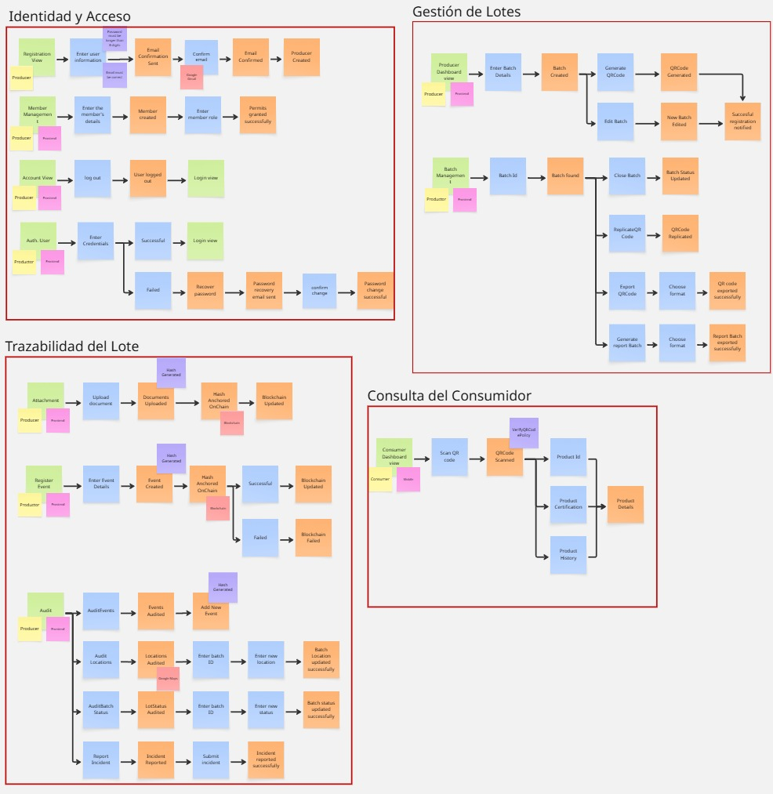
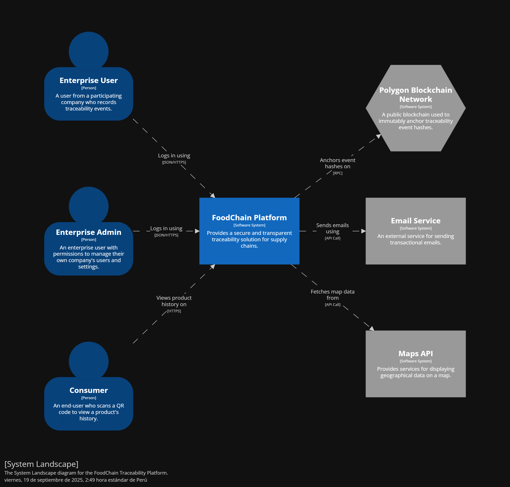
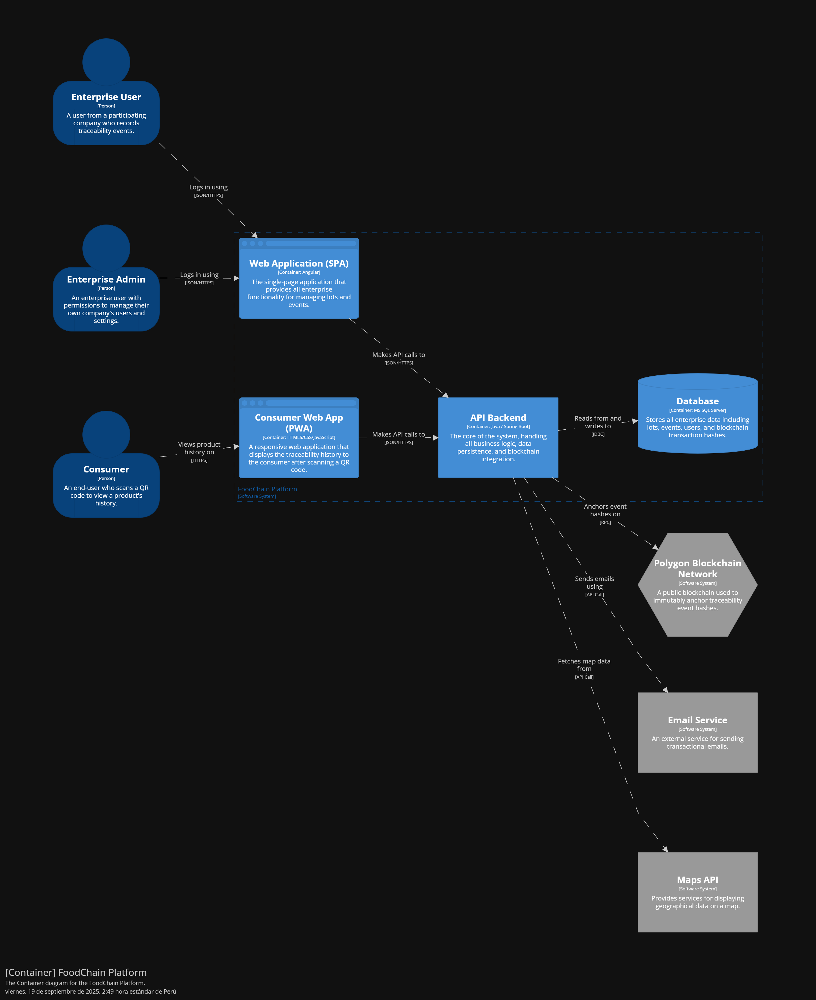
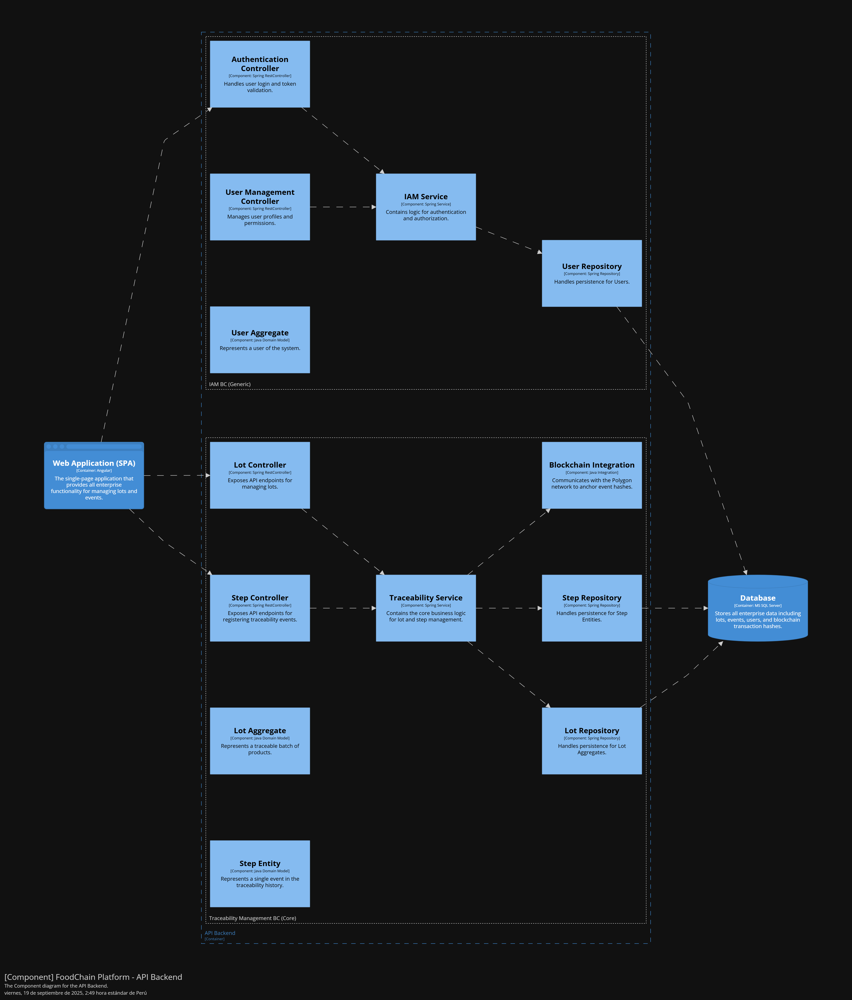
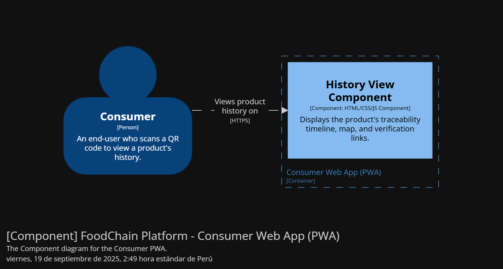
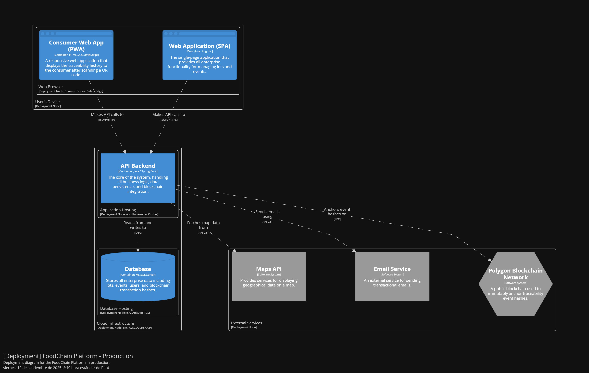

# Capítulo IV: Strategic-Level Software Design

## 4.1. Strategic-Level Attribute-Driven Design.

El enfoque Attribute-Driven Design guía la arquitectura a partir de los elementos que más moldean el sistema: la funcionalidad prioritaria, los atributos de calidad y las restricciones impuestas por negocio y tecnología. El trabajo comienza identificando y priorizando estos drivers con la participación de los principales interesados. A partir de ellos, el equipo propone conceptos, tácticas y patrones que permitan cumplir los escenarios de calidad definidos y, a la vez, sostener la funcionalidad clave dentro de los límites marcados por las restricciones.

El proceso avanza de manera iterativa. En cada ciclo se selecciona el elemento a descomponer, se asignan responsabilidades, se definen límites e interfaces y se verifican impactos y riesgos frente a los escenarios priorizados. Las decisiones quedan registradas y trazadas contra los drivers que las motivan, lo que facilita evaluar compromisos entre atributos, reducir incertidumbre y preparar la evolución del sistema. El resultado es una arquitectura explicable y verificable, conectada con objetivos de negocio y preparada para integrarse con los productos que conforman la solución.

### 4.1.1. Design Purpose.

El propósito del diseño estratégico es alinear la arquitectura con las metas del producto y las necesidades reales de sus usuarios, asegurando que cada decisión responda a drivers claramente priorizados. La intención no es solo cubrir la funcionalidad, sino garantizar que el sistema cumpla escenarios de calidad medibles como tiempos de respuesta, disponibilidad, seguridad o capacidad de cambio, dentro de las restricciones definidas para el proyecto.

Este enfoque permite tomar decisiones conscientes sobre patrones y tácticas, hacer explícitos los compromisos entre atributos y establecer criterios objetivos para la validación. Con ello, la arquitectura se convierte en un medio para disminuir riesgos tempranos, sostener el crecimiento del producto y facilitar su operación, monitoreo y evolución a lo largo del ciclo de vida.

### 4.1.2. Attribute-Driven Design Inputs.

Esta sección presenta los insumos que guían el diseño con ADD: la funcionalidad primaria, los escenarios de atributos de calidad y las restricciones. Cada subsección inicia con un resumen y continúa con el cuadro oficial para registrar los elementos seleccionados por el equipo.

#### 4.1.2.1. Primary Functionality (Primary User Stories).

En esta sección se especifican las **User Stories** con mayor relevancia en términos de requisitos funcionales y que tienen un impacto directo sobre la arquitectura de la solución.  
A diferencia del capítulo de Requisitos, aquí no se listan todas las historias, sino únicamente las **esenciales para las decisiones de diseño**.

En particular, se han seleccionado cinco historias críticas que definen el ciclo de vida del lote, el registro de eventos multi-rol con anclaje en blockchain, la verificación pública de la información y los objetivos de desempeño de la vista de historial. Estas historias permiten establecer el modelo de dominio central (lotes y eventos), la máquina de estados, la separación entre datos off-chain y on-chain, y las tácticas necesarias de rendimiento y seguridad.

| Epic / User Story ID | Título                                             | Descripción                                                                                                                                                                                                                                                                                                                     | Criterios de Aceptación                                                                                                                                                                                                                                                                                                                                                                                                                                                                                                                                                                                                                                                                                                                                                                                                                                                                                                                                                                                                                                                                                                                                                                                                                                                                                                                                                                                                                                                                                                                                                                                                                                                                                                                                                                                                                                                                                                                                                                                                                                                                                                                                                                                                                                                                                                                                                                                                                                                                                                                                                                                                                                                                                                                                                                                                                                                                                                                                                                                                                                                                                                                                                                                                                                                                                                                                                                                                                                                                                                                                                                                                                                                                                                                                                                                                                                                                                                                                                                                                                                                                                                                                                                                                                                                                                                                                                                                                                                                                                                                                                                                                                                                                                                                                                                                                                                                                                                                                                                                                                                                                                                                                                                                                                                                                                                                                                                                                                                                                                                                                                                                                                                                                                                                                                                                                                                                                                                                                                                                                                                          | Relacionado con (Epic ID) |
|----------------------|----------------------------------------------------|---------------------------------------------------------------------------------------------------------------------------------------------------------------------------------------------------------------------------------------------------------------------------------------------------------------------------------|------------------------------------------------------------------------------------------------------------------------------------------------------------------------------------------------------------------------------------------------------------------------------------------------------------------------------------------------------------------------------------------------------------------------------------------------------------------------------------------------------------------------------------------------------------------------------------------------------------------------------------------------------------------------------------------------------------------------------------------------------------------------------------------------------------------------------------------------------------------------------------------------------------------------------------------------------------------------------------------------------------------------------------------------------------------------------------------------------------------------------------------------------------------------------------------------------------------------------------------------------------------------------------------------------------------------------------------------------------------------------------------------------------------------------------------------------------------------------------------------------------------------------------------------------------------------------------------------------------------------------------------------------------------------------------------------------------------------------------------------------------------------------------------------------------------------------------------------------------------------------------------------------------------------------------------------------------------------------------------------------------------------------------------------------------------------------------------------------------------------------------------------------------------------------------------------------------------------------------------------------------------------------------------------------------------------------------------------------------------------------------------------------------------------------------------------------------------------------------------------------------------------------------------------------------------------------------------------------------------------------------------------------------------------------------------------------------------------------------------------------------------------------------------------------------------------------------------------------------------------------------------------------------------------------------------------------------------------------------------------------------------------------------------------------------------------------------------------------------------------------------------------------------------------------------------------------------------------------------------------------------------------------------------------------------------------------------------------------------------------------------------------------------------------------------------------------------------------------------------------------------------------------------------------------------------------------------------------------------------------------------------------------------------------------------------------------------------------------------------------------------------------------------------------------------------------------------------------------------------------------------------------------------------------------------------------------------------------------------------------------------------------------------------------------------------------------------------------------------------------------------------------------------------------------------------------------------------------------------------------------------------------------------------------------------------------------------------------------------------------------------------------------------------------------------------------------------------------------------------------------------------------------------------------------------------------------------------------------------------------------------------------------------------------------------------------------------------------------------------------------------------------------------------------------------------------------------------------------------------------------------------------------------------------------------------------------------------------------------------------------------------------------------------------------------------------------------------------------------------------------------------------------------------------------------------------------------------------------------------------------------------------------------------------------------------------------------------------------------------------------------------------------------------------------------------------------------------------------------------------------------------------------------------------------------------------------------------------------------------------------------------------------------------------------------------------------------------------------------------------------------------------------------------------------------------------------------------------------------------------------------------------------------------------------------------------------------------------------------------------------------------------------------------------------------------|---------------------------|
| **US01**             | Crear un nuevo lote                                | Como productor, quiero crear un nuevo lote de mi producto, ingresando datos básicos (ej. nombre, finca, fecha de cosecha, variedad) para iniciar su trazabilidad en el sistema.                                                                                                                                                 | **Scenario: Creación exitosa de un nuevo lote** Given que he iniciado sesión como productor And estoy en la página de creación de lotes When completo todos los campos obligatorios And hago clic en "Crear Lote" Then el sistema guarda el nuevo lote And me redirige a la página de detalle del lote And veo un mensaje de confirmación "Lote creado exitosamente"  **Scenario: Intento crear lote con datos incompletos** Given que he iniciado sesión como productor And estoy en la página de creación de lotes When dejo campos obligatorios vacíos And hago clic en "Crear Lote" Then el sistema muestra mensajes de error junto a los campos obligatorios And el lote no se crea                                                                                                                                                                                                                                                                                                                                                                                                                                                                                                                                                                                                                                                                                                                                                                                                                                                                                                                                                                                                                                                                                                                                                                                                                                                                                                                                                                                                                                                                                                                                                                                                                                                                                                                                                                                                                                                                                                                                                                                                                                                                                                                                                                                                                                                                                                                                                                                                                                                                                                                                                                                                                                                                                                                                                                                                                                                                                                                                                                                                                                                                                                                                                                                                                                                                                                                                                                                                                                                                                                                                                                                                                                                                                                                                                                                                                                                                                                                                                                                                                                                                                                                                                                                                                                                                                                                                                                                                                                                                                                                                                                                                                                                                                                                                                                                                                                                                                                                                                                                                                                                                                                                                                                                                                                                                                                                            | **EP01**                  |
| **US04**             | Cerrar un lote finalizado                          | Como productor, quiero marcar un lote como "cerrado" cuando haya terminado su recorrido en la cadena de suministro, para evitar que se agreguen nuevos pasos.                                                                                                                                                                   | **Scenario: Cerrar un lote exitosamente** Given que soy un productor y he iniciado sesión And el lote está en estado "Activo" When marco el lote como "Cerrado" Then el estado del lote cambia a "Cerrado" And se registra un evento de cierre en la blockchain con mi firma digital And se muestra una confirmación con el hash de la transacción  **Scenario: Intentar cerrar un lote ya cerrado** Given que el lote ya está en estado "Cerrado" When intento marcarlo como "Cerrado" nuevamente Then el sistema muestra un error: "El lote ya está cerrado" And no se realiza ningún cambio en el estado  **Scenario: Intentar agregar un paso normal a un lote cerrado** Given que el lote está en estado "Cerrado" When cualquier actor intenta agregar un paso normal (ej: transporte, procesamiento) Then el sistema rechaza la acción y muestra un error: "No se pueden agregar pasos a lotes cerrados" And el paso no se registra en la blockchain  **Scenario: Marcar un lote cerrado como "En Revisión" por error detectado** Given que el lote está en estado "Cerrado" And un auditor o administrador con permisos especiales ha detectado un error When el auditor marca el lote como "En Revisión" Then el estado del lote cambia a "En Revisión" And se registra un evento de cambio de estado en la blockchain And se notifica al productor sobre la revisión  **Scenario: Agregar un paso de rectificación a un lote "En Revisión"** Given que el lote está en estado "En Revisión" When un auditor o administrador agrega un paso de rectificación (ej: corrección de datos, explicación de error) Then el paso de rectificación se registra en la blockchain con una firma digital And el historial muestra el paso de rectificación vinculado al lote And el estado del lote permanece "En Revisión" hasta que se complete la revisión  **Scenario: Cerrar un lote después de la revisión** Given que el lote está en estado "En Revisión" And se han completado las rectificaciones necesarias When el auditor o administrador marca el lote como "Cerrado" nuevamente Then el estado del lote vuelve a "Cerrado" And se registra un evento de cierre final en la blockchain And no se permiten más pasos de rectificación a menos que se detecte un nuevo error                                                                                                                                                                                                                                                                                                                                                                                                                                                                                                                                                                                                                                                                                                                                                                                                                                                                                                                                                                                                                                                                                                                                                                                                                                                                                                                                                                                                                                                                                                                                                                                                                                                                                                                                                                                                                                                                                                                                                                                                                                                                                                                                                                                                                                                                                                                                                                                                                                                                                                                                                                                                                                                                                                                                                                                                                                                                                                                                                                                                                                                                                                                                                                                                                                                                                                                                                                                                                                                                                                                                                                                                                                                | **EP01**                  |
| **US09**             | Registrar un paso en la trazabilidad de un lote    | Como actor (productor, proveedor de insumo, procesador, empacador, distribuidor, transportista o retailer), quiero registrar un paso en la trazabilidad de un lote (ej: "cosecha", "salida de finca", "llegada a planta") con fecha, hora, lugar y mi nombre, para documentar su recorrido de manera verificable en blockchain. | **Scenario: Registro exitoso de un paso por un productor** Given que he iniciado sesión como productor And estoy en la página de registro de pasos When selecciono un lote existente en estado "Activo" And completo los datos del paso con tipo "cosecha" o "salida de finca", fecha, hora y ubicación GPS automática And hago clic en "Registrar Paso" Then el sistema guarda el paso con éxito And el paso queda asociado al lote And el hash del paso se registra en blockchain And recibo una confirmación visual con el ID del evento y el hash de transacción  **Scenario: Registro exitoso de un paso por un proveedor de insumo** Given que he iniciado sesión como proveedor de insumo And estoy en la página de registro de pasos When selecciono un lote existente en estado "Activo" And completo los datos del paso con tipo "entrega de insumos" o "recepcion de insumos", fecha, hora y ubicación And hago clic en "Registrar Paso" Then el sistema guarda el paso con éxito And el paso queda asociado al lote And el hash del paso se registra en blockchain And recibo una confirmación visual con el ID del evento y el hash de transacción  **Scenario: Registro exitoso de un paso por un procesador** Given que he iniciado sesión como procesador And estoy en la página de registro de pasos When selecciono un lote existente en estado "Activo" And completo los datos del paso con tipo "procesamiento iniciado" o "procesamiento completado", fecha, hora y ubicación And hago clic en "Registrar Paso" Then el sistema guarda el paso con éxito And el paso queda asociado al lote And el hash del paso se registra en blockchain And recibo una confirmación visual con el ID del evento y el hash de transacción  **Scenario: Registro exitoso de un paso por un empacador** Given que he iniciado sesión como empacador And estoy en la página de registro de pasos When selecciono un lote existente en estado "Activo" And completo los datos del paso con tipo "empaque iniciado" o "empaque completado", fecha, hora y ubicación And hago clic en "Registrar Paso" Then el sistema guarda el paso con éxito And el paso queda asociado al lote And el hash del paso se registra en blockchain And recibo una confirmación visual con el ID del evento y el hash de transacción  **Scenario: Registro exitoso de un paso por un distribuidor (mayorista)** Given que he iniciado sesión como distribuidor And estoy en la página de registro de pasos When selecciono un lote existente en estado "Activo" And completo los datos del paso con tipo "recepcion en centro de distribucion" o "despacho desde centro de distribucion", fecha, hora y ubicación And hago clic en "Registrar Paso" Then el sistema guarda el paso con éxito And el paso queda asociado al lote And el hash del paso se registra en blockchain And recibo una confirmación visual con el ID del evento y el hash de transacción  **Scenario: Registro exitoso de un paso por un transportista** Given que he iniciado sesión como transportista And estoy en la página de registro de pasos When selecciono un lote existente en estado "Activo" And completo los datos del paso con tipo "salida de almacen" o "llegada a destino", fecha, hora y ubicación GPS automática And hago clic en "Registrar Paso" Then el sistema guarda el paso con éxito And el paso queda asociado al lote And el hash del paso se registra en blockchain And recibo una confirmación visual con el ID del evento y el hash de transacción  **Scenario: Registro exitoso de un paso por un retailer (minorista)** Given que he iniciado sesión como retailer And estoy en la página de registro de pasos When selecciono un lote existente en estado "Activo" And completo los datos del paso con tipo "llegada a tienda" o "disponible para venta", fecha, hora y ubicación And hago clic en "Registrar Paso" Then el sistema guarda el paso con éxito And el paso queda asociado al lote And el hash del paso se registra en blockchain And recibo una confirmación visual con el ID del evento y el hash de transacción  **Scenario: Intentar registrar paso en lote cerrado** Given que he iniciado sesión como actor autorizado And selecciono un lote que está marcado como "Cerrado" When intento registrar un nuevo paso Then el sistema muestra un error "No se pueden agregar pasos a lotes cerrados" And el paso no se registra And no se genera ningún hash en blockchain  **Scenario: Intentar registrar un tipo de paso no permitido para mi rol** Given que he iniciado sesión como transportista And estoy en la página de registro de pasos When selecciono un lote existente And intento registrar un paso con tipo "procesamiento iniciado" Then el sistema muestra un error "Su rol no tiene permisos para registrar este tipo de paso" And el paso no se registra And no se genera ningún hash en blockchain  **Scenario: Registrar paso con captura automática de GPS** Given que he iniciado sesión como actor autorizado And he concedido permisos de ubicación a la aplicación When estoy en la página de registro de pasos Then la ubicación GPS se captura automáticamente y se muestra en el formulario And no puedo editarla manualmente para garantizar la integridad  **Scenario: Registrar paso con adjunto de comprobante (opcional)** Given que he iniciado sesión como actor autorizado And estoy en la página de registro de pasos When adjunto una imagen de comprobante (factura, ticket) And hago clic en "Registrar Paso" Then el sistema calcula el hash de la imagen y lo incluye en la transacción de blockchain And la imagen se almacena en un servicio seguro con acceso controlado | **EP02**                  |
| **US21**             | Verificar autenticidad mediante hash en blockchain | Como consumidor, cuando escaneo el código QR de un producto, quiero poder verificar que la información sobre su origen y recorrido es auténtica y no ha sido alterada, para tener confianza en que estoy comprando exactamente lo que dice la etiqueta.                                                                         | **Scenario: Verificar que la información del producto es confiable** Given que escaneé el código QR de un producto en la tienda When veo la historia de cómo se hizo y llegó hasta aquí Then cada paso importante muestra un "sello de verificación" And al tocar el sello, veo un código único de seguridad And puedo hacer clic para ver este código en un registro público en internet  **Scenario: Información que aún no está verificada** Given que escaneé el código QR de un producto When veo un paso que no tiene el "sello de verificación" Then entiendo que esa parte del proceso aún está en verificación And no puedo confirmar esa información específica todavía  **Scenario: Encontrar información que no coincide** Given que escaneé el código QR de un producto When el sistema detecta que alguna información no coincide con los registros Then veo una alerta que dice "Información por verificar - Notificamos al equipo" And sé que el equipo de FoodChain está resolviendo el problema                                                                                                                                                                                                                                                                                                                                                                                                                                                                                                                                                                                                                                                                                                                                                                                                                                                                                                                                                                                                                                                                                                                                                                                                                                                                                                                                                                                                                                                                                                                                                                                                                                                                                                                                                                                                                                                                                                                                                                                                                                                                                                                                                                                                                                                                                                                                                                                                                                                                                                                                                                                                                                                                                                                                                                                                                                                                                                                                                                                                                                                                                                                                                                                                                                                                                                                                                                                                                                                                                                                                                                                                                                                                                                                                                                                                                                                                                                                                                                                                                                                                                                                                                                                                                                                                                                                                                                                                                                                                                                                                                                                                                                                                                                                                                                                                                                                                                                                                                                                             | **EP03, EP06**            |
| **US23**             | Garantizar carga rápida del historial              | Como consumidor, quiero que la página de historial de un producto cargue rápidamente, incluso para lotes con miles de eventos, mediante técnicas de paginación y virtualización, para una experiencia de usuario fluida.                                                                                                        | **Scenario: Carga rápida de historial con muchos eventos** Given que un lote tiene más de 1000 eventos When un consumidor escanea el QR y accede al historial Then la página carga en menos de 2 segundos And los eventos se cargan dinámicamente al desplazarse  **Scenario: Paginación en historial** Given que el historial tiene muchos eventos When el consumidor se desplaza por la lista Then solo se cargan los eventos visibles And no hay bloqueo de la interfaz                                                                                                                                                                                                                                                                                                                                                                                                                                                                                                                                                                                                                                                                                                                                                                                                                                                                                                                                                                                                                                                                                                                                                                                                                                                                                                                                                                                                                                                                                                                                                                                                                                                                                                                                                                                                                                                                                                                                                                                                                                                                                                                                                                                                                                                                                                                                                                                                                                                                                                                                                                                                                                                                                                                                                                                                                                                                                                                                                                                                                                                                                                                                                                                                                                                                                                                                                                                                                                                                                                                                                                                                                                                                                                                                                                                                                                                                                                                                                                                                                                                                                                                                                                                                                                                                                                                                                                                                                                                                                                                                                                                                                                                                                                                                                                                                                                                                                                                                                                                                                                                                                                                                                                                                                                                                                                                                                                                                                                                                                                                                                         | **EP03**                  |

#### 4.1.2.2. Quality attribute Scenarios.

**Introducción.**  
Esta sección presenta la primera versión de los **escenarios de atributos de calidad** que más impactan la arquitectura de FoodChain. Son una guía práctica para el diseño, priorizando **integridad de la trazabilidad**, **disponibilidad** y **rendimiento** de la consulta pública por QR, además de **seguridad de acceso** y **resiliencia offline** en campo. A continuación, se especifican los escenarios usando el cuadro solicitado.

| Atributo | Fuente | Estímulo | Artefacto | Entorno | Respuesta | Medida |
|---|---|---|---|---|---|---|
| **QA-01 Integridad** | Actor autorizado | Registrar un paso (o una rectificación) de un lote | Registro de Eventos + Módulo de Hash y Anclaje | Operación normal | Se guarda el evento, se calcula el hash y se ancla en blockchain; se muestra el sello/tx-hash al usuario | **100%** de pasos con hash; **≥ 99%** con tx-hash confirmado en **≤ 5 min**; **0** alteraciones sin rastro |
| **QA-02 Disponibilidad** | Consumidor | Escanear un QR y abrir el historial del lote | API pública de historial + Frontend público | Pico de uso o falla parcial | El servicio sigue disponible y responde (con caché/failover) sin perder datos | **99.9%** de disponibilidad mensual; reanudación de lectura **≤ 15 min** tras fallos |
| **QA-03 Rendimiento** | Consumidor | Consultar el historial de un lote con muchos eventos | Frontend público (timeline) + API | Operación normal y horas pico | Se muestra la **primera pantalla** rápido y el resto carga de forma progresiva (paginado/scroll) | Primera vista **≤ 2 s**; desplazamiento fluido; errores **5xx < 0.5%** |
| **QA-04 Seguridad (acceso)** | Atacante | Repetir intentos de inicio de sesión con credenciales inválidas | Servicio de Autenticación | Operación normal | La cuenta se bloquea temporalmente y se notifica; queda registro del incidente | Bloqueo tras **5** intentos fallidos en **5 min** por **30 min**; alerta enviada; evento registrado |
| **QA-05 Resiliencia Offline** | Actor de campo | Registrar un paso sin conexión a internet | App (móvil/web) + almacenamiento local + sincronizador | Sin conectividad o intermitente | El paso se guarda como borrador y se sincroniza automáticamente al reconectar, manteniendo la hora original | **≥ 99%** de borradores sincronizados al reconectar; sync típica **≤ 60 s**; **0** pérdida de datos |

---

### Notas breves por escenario

- **QA-01 Integridad.**  
  La prioridad es que cada paso tenga una “huella” verificable: se guarda, se calcula su hash y se publica el identificador de la transacción para consulta pública.

- **QA-02 Disponibilidad.**  
  La consulta por QR debe estar disponible aun con picos o fallas parciales. Si hay incidentes, la lectura se recupera rápido sin afectar a los consumidores.

- **QA-03 Rendimiento.**  
  La experiencia pública carga primero lo esencial (cabecera y primeros eventos) y continúa con carga progresiva, manteniendo la navegación fluida.

- **QA-04 Seguridad (acceso).**  
  Se evita el abuso en login con bloqueo temporal y alerta a administradores, dejando trazabilidad del intento.

- **QA-05 Resiliencia Offline.**  
  En campo, si no hay internet, se permite trabajar con borradores y sincronizar después, conservando los tiempos originales del registro.

#### 4.1.2.3. Constraints.

En esta sección se incluyen las **restricciones** que no pueden negociarse y que son impuestas por el cliente o el propio negocio como guía para elaborar la solución. La sección inicia con una introducción donde se resume los principales constraints a considerar.

| ID | Título | Descripción | Aceptación | EPIC |
|---|---|---|---|---|
| **CON-01** | Uso de arquitectura monolítica modular | La solución debe implementarse con una arquitectura monolítica modular, con un único despliegue pero separando responsabilidades en módulos (gestión de lotes, pasos, usuarios, etc.). | **Escenario 1:** Dado que se revisa la estructura del proyecto backend, cuando se analiza el código, entonces se observa una separación clara en módulos.   **Escenario 2:** Dado que se despliega la aplicación en un entorno de pruebas, cuando se ejecuta el backend, entonces todos los módulos están presentes y operativos dentro de una sola unidad. | |
| **CON-02** | Backend en Spring Boot | El backend de la solución debe desarrollarse en Spring Boot, aprovechando su soporte para APIs REST, modularidad y gestión de dependencias. | **Escenario 1:** Dado que se revisa el código fuente del backend, cuando se inspeccionan las dependencias, entonces se encuentran configuraciones propias de Spring Boot.   **Escenario 2:** Dado que el backend está en ejecución, cuando se accede a un endpoint, entonces se recibe la respuesta desde un controlador Spring. | |
| **CON-03** | Frontend web con Angular | La aplicación web debe desarrollarse con Angular, siguiendo buenas prácticas modernas de frontend y arquitectura de componentes. | **Escenario 1:** Dado que se revisa el código de la interfaz web, cuando se exploran los archivos fuente, entonces se encuentran componentes y módulos característicos de Angular.   **Escenario 2:** Dado que se lanza la aplicación en un navegador, cuando se accede al servidor frontend, entonces se carga una SPA con rutas gestionadas por Angular Router. | |
| **CON-04** | Landing Page en HTML | Debe desarrollarse una página de aterrizaje estática con HTML, CSS y opcionalmente JavaScript, enfocada en explicar el modelo de negocio y redirigir a la aplicación. | **Escenario 1:** Dado que un usuario accede a la URL de la landing page, cuando se carga el contenido, entonces se muestran elementos informativos y enlaces funcionales.   **Escenario 2:** Dado que el usuario hace clic en un call-to-action, cuando se redirige, entonces llega al destino correspondiente según su plataforma. | |
| **CON-05** | Base de datos relacional MySQL | El sistema debe usar una base de datos relacional (MySQL), permitiendo integridad referencial y consultas SQL estándar. | **Escenario 1:** Dado que se inspecciona la base de datos, cuando se visualiza el esquema, entonces se encuentran tablas relacionadas con claves primarias y foráneas.   **Escenario 2:** Dado que se realiza una consulta, cuando se recuperan datos relacionados, entonces se obtienen resultados válidos según la lógica definida. | |
| **CON-06** | Repositorio de código en GitHub | El código fuente del proyecto debe estar versionado y publicado en un repositorio en GitHub, con control de versiones y colaboración en equipo. | **Escenario 1:** Dado que se accede al repositorio, cuando se inspeccionan los archivos, entonces se encuentra una estructura clara y organizada.   **Escenario 2:** Dado que se revisa el historial de commits, cuando se observan ramas y mensajes, entonces se evidencia un uso de buenas prácticas como Gitflow o commits semánticos. | |
| **CON-07** | Uso de RESTful APIs internas | La comunicación entre productos debe realizarse mediante APIs REST internas, cumpliendo con principios de diseño REST (recursos, verbos HTTP y respuestas estandarizadas). | **Escenario 1:** Dado que se documentan los endpoints, cuando se inspeccionan las rutas, entonces se evidencia el uso de verbos HTTP adecuados (GET, POST, PUT, DELETE).   **Escenario 2:** Dado que un cliente consume un servicio, cuando se realiza una solicitud, entonces se recibe una respuesta JSON estructurada. | |
| **CON-08** | Anclaje en blockchain pública (solo hashes) | Cada evento de trazabilidad debe registrarse en una blockchain pública, almacenando únicamente hashes para proteger los datos sensibles. | **Escenario 1:** Dado que se registra un paso en la trazabilidad, cuando se confirma el evento, entonces se genera un hash y se ancla en blockchain.   **Escenario 2:** Dado que un usuario consulta el hash en un explorador, cuando se revisa, entonces solo se observa el identificador, sin datos sensibles. | |
| **CON-09** | QR firmado y único por lote | Cada lote debe tener un código QR único firmado por el backend, evitando duplicados. | **Escenario 1:** Dado que un productor crea un lote, cuando solicita el QR, entonces el sistema genera un código único y firmado.   **Escenario 2:** Dado que se intenta emitir un QR duplicado, cuando el backend valida, entonces rechaza la operación. | |
| **CON-10** | Diseño impulsado por el dominio (DDD) | La solución debe desarrollarse siguiendo principios de Domain-Driven Design, donde el modelo de dominio guía la estructura y la lógica. | **Escenario 1:** Dado que se revisa la organización del backend, cuando se inspeccionan los paquetes, entonces se observan divisiones por contexto de dominio.   **Escenario 2:** Dado que los desarrolladores y stakeholders revisan el código, cuando leen los nombres de clases y métodos, entonces encuentran un lenguaje común alineado al negocio. | |

### 4.1.3. Architectural Drivers Backlog.

Tras nuestro Quality Attribute Workshop, acordamos el conjunto de drivers que guiarán el diseño de FoodChain. El backlog incluye Functional Drivers, Quality Attribute Drivers y los constraints clave. A continuación se listan en orden de mayor importancia para stakeholders y mayor impacto en la complejidad técnica de arquitectura.

| Driver ID | Título de Driver                | Descripción                                                                                                                                          | Importancia para Stakeholders | Impacto en Architecture Technical Complexity |
|-----------|---------------------------------|------------------------------------------------------------------------------------------------------------------------------------------------------|-------------------------------|----------------------------------------------|
| DR-01     | Integridad e inmutabilidad      | Cada paso de trazabilidad genera un hash y se ancla en blockchain pública, habilitando verificación externa y evitando alteraciones del historial.    | Alta                          | Alta                                         |
| DR-02     | Seguridad y control de acceso   | Gestión de identidades, autenticación, control de acceso por roles y firma digital de eventos para autoría y no repudio en toda la cadena.            | Alta                          | Alta                                         |
| DR-03     | Autenticidad y unicidad del QR  | Código QR firmado por el backend y único por lote, con detección y bloqueo de duplicados para disuadir la clonación de empaques.                       | Alta                          | Media                                        |
| DR-04     | Registro de pasos confiable     | Idempotencia, manejo de reintentos y sincronización offline a online para asegurar registro sin duplicados en escenarios de conectividad variable.     | Alta                          | Media                                        |
| DR-05     | Disponibilidad del canal público| La vista pública del historial por QR debe permanecer operativa en tienda, con mínimos tiempos de caída y recuperación rápida.                        | Alta                          | Media                                        |
| DR-06     | Desempeño del historial público | Carga inicial rápida del historial con paginación y virtualización para lotes con gran volumen de eventos.                                            | Alta                          | Media                                        |
| DR-07     | Captura de ubicación verificada | En pasos de movimiento la ubicación GPS se captura automáticamente y no es editable, reforzando evidencia de lugar y hora.                            | Alta                          | Media                                        |
| DR-08     | Alineación con DDD              | Estructura del sistema por bounded contexts de lotes, eventos y usuarios, con entidades y agregados alineados al lenguaje del dominio.                 | Alta                          | Alta                                         |
| DR-09     | Integración con servicios externos | Exposición y consumo de APIs REST; conexión a nodo blockchain y servicios de soporte con tolerancia a fallos y manejo de errores.                   | Media                         | Alta                                         |
| DR-10     | Arquitectura monolítica modular | Un único despliegue con separación interna por dominios para simplificar go-live y mantener orden en la evolución inicial.                             | Media                         | Media                                        |

### 4.1.4. Architectural Design Decisions.

#### Candidate Pattern Evaluation Matrix

| Driver ID | Título de Driver | Monolito Modular (DDD) – Pro | Monolito Modular (DDD) – Con | Microservicios – Pro | Microservicios – Con |
|---|---|---|---|---|---|
| DR-01 | Integridad e inmutabilidad | Trazabilidad y hashing centralizados; anclaje on-chain controlado. | Escalado del anclaje atado al proceso central. | Servicio de notarización escalable. | Orquestación distribuida para orden e idempotencia. |
| DR-02 | Seguridad y control de acceso | RBAC y firma digital uniformes; menos puntos a endurecer. | Una brecha impacta más superficie si no se segmenta bien. | Aislamiento por dominio. | Gestión de identidades y políticas distribuida. |
| DR-03 | Registro de pasos confiable | Idempotencia y reintentos simples; depuración directa. | Posible cuello en picos extremos. | Escalado granular del servicio de eventos. | Duplicados y orden entre servicios más complejos. |
| DR-04 | Autenticidad y unicidad del QR | Emisión y firma en un módulo único; control de colisiones. | Menor elasticidad si crece mucho la emisión. | Servicio “QR authority” escalable. | Coherencia de unicidad distribuida más difícil. |
| DR-05 | Disponibilidad del canal público | Menos piezas; rollback y caché simples. | Un fallo crítico puede afectar todo si no se aísla. | Fallo de un servicio no derriba otros. | Requiere gateways, balanceo y más operación. |
| DR-06 | Desempeño del historial | Consultas en un solo store; paginación/virtualización. | Límite vertical si el histórico crece demasiado. | Lectura separada con réplicas/stores. | Latencias y consistencia eventual afectan UX. |
| DR-07 | Captura de ubicación verificada | Validación y regla de no-edición central. | Acopla la validación al backend. | Servicio dedicado de validación de señales. | Más saltos y políticas distribuidas. |
| DR-08 | Integraciones externas | Adaptadores centrales; circuit breakers en un borde. | Menos flexibilidad para paralelizar integraciones. | Integraciones por servicio. | Más contratos y puntos a observar. |
| DR-09 | Auditoría administrativa | Log central y exportación completa. | Filtros finos requieren buena segmentación interna. | Auditoría por servicio más granular. | Trazas extremo a extremo más costosas. |

#### Decisión

**Arquitectura seleccionada: Monolito Modular con DDD.**  
Elegimos esta opción porque:

- **Cumple los drivers clave** (integridad, seguridad, disponibilidad del canal público, desempeño del historial).
- **Reduce la complejidad operativa**, adecuada para el tamaño actual del equipo.
- **Permite aplicar DDD** segmentando el sistema por dominios dentro de una sola unidad desplegable.
- **Evita sobreingeniería**: microservicios no aportan beneficios claros en esta etapa.

### 4.1.5. Quality Attribute Scenario Refinements.

Tras concluir el Quality Attribute Workshop, priorizamos cuatro escenarios que concentran el mayor impacto en la arquitectura de FoodChain: **integridad/inmutabilidad de la trazabilidad**, **desempeño y disponibilidad de la vista pública por QR**, **privacidad por estado del lote**, y **captura confiable de ubicación en pasos críticos**. A continuación se presentan los refinamientos finales en orden de prioridad.

---

## Scenario Refinement for Scenario 1
**Scenario(s):** Como actor de la cadena, quiero registrar un paso y que quede protegido contra modificaciones, para asegurar un historial confiable.  
**Business Goals:** Garantizar confianza y auditoría pública del recorrido del producto.  
**Relevant Quality Attributes:** Integridad, Trazabilidad, Confiabilidad

### Scenario Components
- **Stimulus:** Se envía un nuevo paso (ej. “salida”, “llegada”, “cosecha”) desde la app.
- **Stimulus Source:** Actor autenticado (productor, transportista, etc.).
- **Environment:** Operación normal, conexión estable (o sincronización al reconectar).
- **Artifact (if Known):** Backend de registro de eventos + base relacional + anclaje on-chain.
- **Response:** El sistema persiste el evento, genera hash del paso y lo ancla en blockchain; retorna confirmación con IDs y enlaces de verificación.
- **Response Measure:**
    - Confirmación de registro y hash local: **≤ 1 s**.
    - Recibo de transacción on-chain (o ticket de “pendiente” con reintento): **≤ 5 s**.
    - Verificación pública del hash accesible en **≤ 3 s**.
    - **0 duplicados** del mismo evento (idempotencia).
- **Questions:** ¿Qué hacer si el anclaje falla repetidamente? ¿Cuánto tiempo reintentar?
- **Issues:** Dependencia de la red blockchain; colas y reintentos deben evitar pérdida/duplicado.

---

## Scenario Refinement for Scenario 2
**Scenario(s):** Como consumidor, quiero escanear el QR y ver el historial rápidamente, para confiar en el producto en el punto de venta.  
**Business Goals:** Experiencia ágil en tienda y confianza inmediata al escanear.  
**Relevant Quality Attributes:** Performance, Disponibilidad, Usabilidad

### Scenario Components
- **Stimulus:** Escaneo de un QR válido desde el móvil.
- **Stimulus Source:** Consumidor final.
- **Environment:** Red móvil variable (3G/4G/5G/Wi-Fi), alta concurrencia.
- **Artifact (if Known):** Frontend público + APIs de lectura + caché/consultas a base relacional.
- **Response:** Se muestra el historial del lote (línea de tiempo, ubicaciones, sellos de verificación) y accesos a verificación del hash.
- **Response Measure:**
    - Tiempo de primera carga (p95) **≤ 2 s**.
    - Disponibilidad mensual del canal público **≥ 99.9%**.
    - Interacciones posteriores (paginación/virtualización) **≤ 1 s** (p95).
- **Questions:** ¿Qué porción del historial se precarga? ¿Qué se cachea y por cuánto tiempo?
- **Issues:** Variabilidad de red móvil; balancear tamaño de respuesta vs. rapidez.

---

## Scenario Refinement for Scenario 3
**Scenario(s):** Como actor/consumidor, quiero que durante el proceso activo solo se muestren datos mínimos, y que al estar “Disponible” se vea la trazabilidad completa.  
**Business Goals:** Proteger información sensible durante producción/transporte y asegurar transparencia al final.  
**Relevant Quality Attributes:** Privacidad, Seguridad, Trazabilidad

### Scenario Components
- **Stimulus:** Consulta del historial por QR o por interfaz de actor.
- **Stimulus Source:** Consumidor o actor con sesión iniciada.
- **Environment:** Operación normal con distintos estados del lote.
- **Artifact (if Known):** Políticas de visualización en backend + capa de presentación.
- **Response:** Si el lote **no** está “Disponible”, se muestra vista mínima (mensajes y metadatos no sensibles). Si está “Disponible”, se muestra trazabilidad completa con verificación.
- **Response Measure:**
    - **0 filtraciones** de datos marcados como privados en estados no públicos.
    - Cambio de estado refleja reglas de visualización en **≤ 1 s**.
    - Registro de accesos y auditoría 100% de las consultas.
- **Questions:** ¿Qué campos quedan siempre ocultos? ¿Se requiere ofuscación adicional?
- **Issues:** Definir lista clara de datos sensibles por estado; pruebas de regresión de privacidad.

---

## Scenario Refinement for Scenario 4
**Scenario(s):** Como actor en pasos de movimiento, quiero que el GPS se capture automáticamente y no pueda editarse, para validar el recorrido real.  
**Business Goals:** Reducir fraude y asegurar correspondencia lugar-evento.  
**Relevant Quality Attributes:** Confiabilidad, Seguridad, Integridad

### Scenario Components
- **Stimulus:** Intento de registrar un paso crítico (salida, llegada, cosecha).
- **Stimulus Source:** Actor autenticado (transportista, productor).
- **Environment:** Dispositivo móvil con GPS; posible señal débil.
- **Artifact (if Known):** App móvil + backend de validación de pasos.
- **Response:** La app solicita y captura coordenadas automáticamente; el formulario bloquea edición manual; si no hay ubicación, el registro se rechaza con mensaje claro.
- **Response Measure:**
    - Porcentaje de pasos críticos con GPS válido **= 100%**.
    - Intentos sin GPS bloqueados con feedback **< 1 s**.
    - Coordenadas visibles en confirmación y auditables por hash.
- **Questions:** ¿Qué tolerancia de precisión es aceptable (ej. ±30 m)?
- **Issues:** Cobertura GPS limitada en interiores/rutas; necesidad de *fallback* (reintento/salida segura).

## **4.2. Strategic-Level Domain-Drive Design**

### **4.2.1. EvenStorming**

En esta sección se muestra el EventStorming aplicado al dominio de la trazabilidad alimentaria para construir una visión compartida y elaborar una primera versión del modelo del sistema FoodChain. Esta técnica permite identificar y organizar eventos de negocio en una secuencia lógica, descubrir puntos críticos y dependencias ocultas, y vincularlos con decisiones de arquitectura orientadas a garantizar transparencia, confianza e integridad de los datos en la cadena alimentaria.

https://miro.com/welcomeonboard/SlZKNUJTTEJBcTZRMGNDYmFqOXR4OEh6aTlMTE83amYxVjRlMUQxTWRUdE56QkplZUpUOHp6V1NhNkUxU04xSjNzSXpNL1VUUzl5NUUxT1dqTTBITW5uZW9sQlAvMVluZDlJd0NHZ0U5SDlzcWUvSnUvYWdKdUZ4dWRzOFY1c2tzVXVvMm53MW9OWFg5bkJoVXZxdFhRPT0hdjE=?share_link_id=353989808784

### **4.2.2. Candidate Context Discovery**

Con base en los resultados de la sesión de EventStorming, se desarrolló una sesión adicional de Candidate Context Discovery, enfocada en identificar y delimitar los Bounded Contexts del sistema FoodChain. Se aplicaron las siguientes técnicas:

- Start-With-Value
Se identificaron las áreas con mayor impacto en la propuesta de valor del negocio, que es "reconstruir la confianza en la cadena de suministro alimentaria". Las capacidades clave son:

 - Garantizar la inmutabilidad y verificabilidad de la historia de un producto. Esto es el corazón de la confianza que se quiere generar.

 - Empoderar al consumidor con acceso transparente y directo a la información del origen de sus alimentos.

 - Proveer una plataforma segura y eficiente para que los productores demuestren la autenticidad de sus productos.

Este análisis permitió priorizar los contextos de Trazabilidad, Gestión del Lote y Consulta Pública como los núcleos funcionales de más alto valor para el negocio.

- Look-For-Pivotal-Events

Se utilizaron eventos clave del dominio como indicadores de fronteras naturales entre contextos. Eventos como:

 - “Lote Creado”: Marca el inicio del ciclo de vida de un producto y es el evento central del contexto de Gestión de Lotes.

 - “Evento Registrado”: Es el punto de transferencia de responsabilidad entre actores. Es el evento principal del contexto de Trazabilidad.

 - “Hash Anclado en Blockchain”: Es un evento de frontera claro. El contexto de Trazabilidad solicita el anclaje, y un servicio externo lo ejecuta, creando una prueba inmutable.

 - “Código QR Escaneado”: Es el evento que inicia la interacción del consumidor y sirve como puente entre el mundo físico y el contexto de Consulta Pública.

 - “Incidente Reportado”: Activa lógicas de negocio completamente diferentes a las operaciones normales, centradas en la corrección y la auditoría, justificando un contexto separado de Auditoría.

- Start-With-Simple

Se descompusieron las líneas de tiempo de los eventos en pasos secuenciales, revelando una alta cohesión interna en ciertos grupos. Por ejemplo, la secuencia de eventos Lote Creado → Lote Editado → Lote Cerrado comparte un lenguaje, reglas de estado y entidades comunes (el agregado Lote). Esta cohesión justifica plenamente la delimitación del contexto Gestión de Lotes. De igual manera, todos los eventos relacionados con el registro de pasos están altamente cohesionados en el contexto de Trazabilidad.

Finalmente, con base en este análisis, se delimitaron los siguientes cuatro Bounded Contexts:

 - Identidad y Acceso (Identity & Access): Gestión de cuentas para todos los actores de la cadena (productores, transportistas, etc.), manejo de credenciales, roles y permisos de acceso a la plataforma.

 - Gestión de Lotes (Batch Management): Es el Core Domain. Se encarga de la creación, gestión, edición y cierre de los lotes de productos.

 - Trazabilidad del Lote (Batch Traceability): También un Core Domain. Su única responsabilidad es registrar y validar cada paso (evento) en el historial de un lote, así como gestionar la lógica de auditoría y cumplimiento.

 - Consulta del Consumidor (Consumer Inquiry): Se encarga de la experiencia del consumidor final. Responde al escaneo de un código QR, valida su autenticidad y presenta el historial completo y verificado del producto de una manera clara y comprensible.

### **4.2.3. Domain Message Flows Modeling**

https://miro.com/welcomeonboard/akd6K1RSbzd4aWdzcmxxZDljMjllUWoyMTNoL1FTK2c0VXFPUTQ5OEF4dU1ZbVJJWDhTaEhESU15TVNIQXN1Q2VGeDllT3p0SU9tY3E4dHFaeHJUSUtFZG9pQ2xTVjlSTlVSdVBpd29nSTRtUmFxUmhYL1VrTW05b29SekwxeE1Bd044SHFHaVlWYWk0d3NxeHNmeG9BPT0hdjE=?share_link_id=421523459845

### **4.2.4. Bounded Context Canvases**

https://miro.com/welcomeonboard/ZTZMcy9zWURYSjNrZ1FSK3lnRjZLZU1OUzdIT2VrT3VFN21RSGc2ZEtFeExHNWVCRlBoaEZQSjBPTkJUN09NTmt4VEQ4WVdBUEFJY2tkenNRTGhlbkhuZW9sQlAvMVluZDlJd0NHZ0U5SDgzRDBxSUNRcWF4RXlCU1FtcktJSGtQdGo1ZEV3bUdPQWRZUHQzSGl6V2NBPT0hdjE=?share_link_id=605140937332

### **4.2.5. Context Mapping**

## **4.3. Software Architecture**

La visión general de la arquitectura describe la estructura fundamental de un sistema, abarcando sus componentes principales y la interacción entre ellos. Para FoodChain, una plataforma de confianza digital, una arquitectura sólida es el pilar fundamental para garantizar que el sistema sea seguro, escalable y auditable. Este enfoque permite una implementación ordenada, donde cada componente tiene una responsabilidad clara y bien definida, facilitando la integración de nuevas funcionalidades sin comprometer la integridad de la trazabilidad (Richards & Ford, 2021).

El diseño arquitectónico de FoodChain se basa en una arquitectura de microservicios distribuida, donde cada componente está desacoplado y se comunica a través de APIs bien definidas. Para el backend, se ha seleccionado el framework **SpringBoot (Java)**, conocido por su robustez para aplicaciones empresariales. La separación de preocupaciones se logra mediante patrones de diseño como el **Modelo-Vista-Controlador (MVC)** y la **Inyección de Dependencias**. El sistema se integra con servicios externos clave: una **blockchain pública (Polygon)** para el anclaje de hashes y un proveedor de almacenamiento de archivos para los comprobantes.

La seguridad es un aspecto central de nuestra arquitectura. Se implementa en múltiples capas: desde el cifrado de datos en tránsito (HTTPS) y en reposo, hasta la validación de firmas digitales para los códigos QR y la gestión de identidades y accesos (IAM). La arquitectura está diseñada para ser resiliente, manejando fallos de conexión con la blockchain y garantizando que ningún dato de trazabilidad se pierda.

De acuerdo con Brown (2023), el **modelo C4** para la diagramación de la arquitectura de software ofrece un enfoque estructurado que permite describir el sistema en diferentes niveles de abstracción. Al dividir la arquitectura en cuatro niveles —**Contexto, Contenedores, Componentes y Código**—, se facilita una comprensión clara tanto para el equipo técnico como para los stakeholders no técnicos. Utilizaremos este modelo para visualizar y comunicar el diseño de FoodChain de manera efectiva.

### **4.3.1. Software Architecture System Landscape Diagram**

El diagrama de paisaje (*landscape*), correspondiente al nivel más alto del modelo C4, ofrece una visión integral de FoodChain dentro de su ecosistema tecnológico. Este diagrama mapea los sistemas de software internos y externos, así como los flujos de información que los conectan, lo cual es clave para entender cómo nuestra plataforma crea valor al interactuar con el mundo exterior (Brown, 2023).

En el caso de FoodChain, el diagrama de paisaje ilustra la interacción entre nuestra plataforma central y los sistemas de los diversos actores de la cadena de suministro, así como con sistemas externos críticos como la **red blockchain de Polygon** y APIs de certificación de terceros.

###### **Figura 1**
*_Diagrama de Paisaje del Sistema FoodChain_*

###### **Figura 2**
*_Leyenda para el Diagrama de Paisaje_*

### **4.3.2. Software Architecture Context Level Diagram**

El diagrama de contexto clarifica los límites del sistema FoodChain, mostrando cómo interactúa con sus usuarios y con otros sistemas de software. Este nivel de abstracción del modelo C4 es fundamental para definir el alcance del proyecto, identificando quién usa el sistema y qué dependencias externas son críticas para su funcionamiento (Brown, 2023).

Para FoodChain, el diagrama de contexto muestra a los actores principales (Usuario de Empresa, Consumidor) y las interacciones con sistemas externos clave como la Red Blockchain de Polygon, un Servicio de Email y una API de Mapas.

###### **Figura 3**
*_Diagrama de Contexto de la Plataforma FoodChain_*

### **4.3.3. Software Architecture Container Level Diagram**

El diagrama de contenedores descompone el sistema FoodChain en sus principales bloques ejecutables o "contenedores". Este nivel del modelo C4 ofrece una visión de la arquitectura de alto nivel, mostrando las responsabilidades de cada parte del sistema (la SPA en Angular, la PWA del consumidor, el Backend en SpringBoot y la base de datos en SQL Server) y cómo se comunican entre sí (Brown, 2023).

###### **Figura 4**
*_Diagrama de Contenedores de la Plataforma FoodChain_*

#### **4.3.3.1. Software Architecture Component Level Diagrams**

Este nivel hace zoom en los contenedores individuales para mostrar sus componentes internos. Estos diagramas son cruciales para que el equipo de desarrollo entienda la estructura interna de cada aplicación y cómo se dividen las responsabilidades.

**API Backend Components**

El diagrama de componentes para el API Backend ilustra la estructura interna de nuestra aplicación SpringBoot. Se organiza en Bounded Contexts, siguiendo principios de Domain-Driven Design (DDD), para separar claramente el dominio central de la trazabilidad de las funcionalidades genéricas como la gestión de identidades (IAM).

###### **Figura 5**
*_Diagrama de Componentes del API Backend_*

###### **Figura 6**
*_Leyenda para el Diagrama de Componentes del Backend_*

**Consumer PWA Components**

Este diagrama muestra los componentes simples que conforman la aplicación web progresiva para el consumidor. Su responsabilidad principal es escanear y mostrar el historial de un producto.

###### **Figura 7**
*_Diagrama de Componentes de la PWA del Consumidor_*

### **4.3.4. Software Architecture Deployment Diagram**

El diagrama de despliegue ilustra cómo se mapean los contenedores de software a la infraestructura de hardware en un entorno de producción. Este diagrama es esencial para entender cómo se ejecutará el sistema, considerando aspectos como la escalabilidad, la disponibilidad y la seguridad de la red en un entorno cloud.

###### **Figura 8**
*_Diagrama de Despliegue de la Plataforma FoodChain_*

