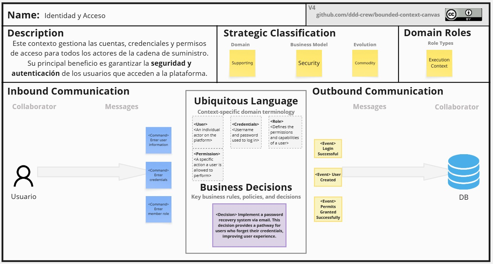
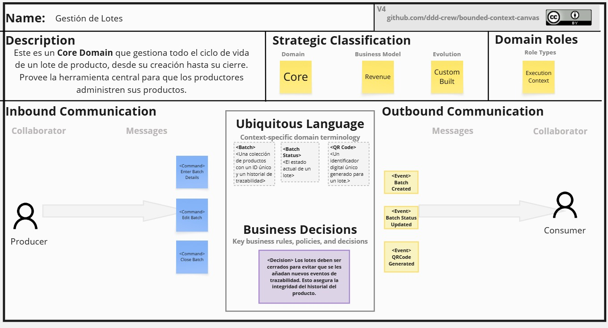
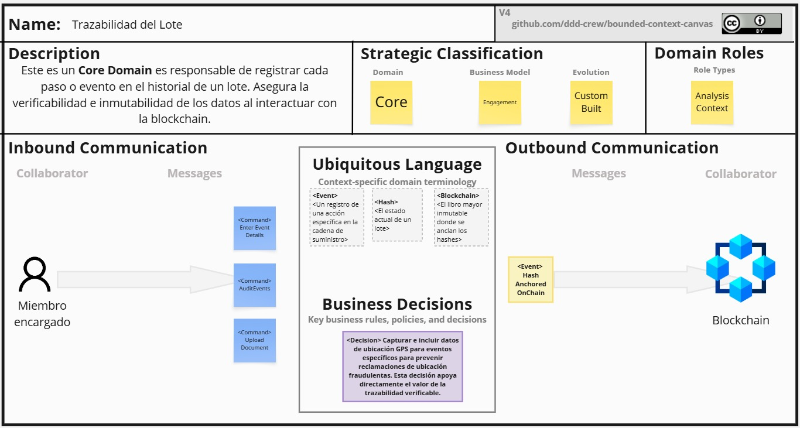
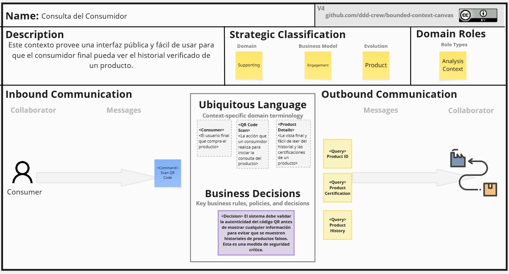

# Capítulo IV: Strategic-Level Software Design

## 4.1. Strategic-Level Attribute-Driven Design.

El enfoque Attribute-Driven Design guía la arquitectura a partir de los elementos que más moldean el sistema: la funcionalidad prioritaria, los atributos de calidad y las restricciones impuestas por negocio y tecnología. El trabajo comienza identificando y priorizando estos drivers con la participación de los principales interesados. A partir de ellos, el equipo propone conceptos, tácticas y patrones que permitan cumplir los escenarios de calidad definidos y, a la vez, sostener la funcionalidad clave dentro de los límites marcados por las restricciones.

El proceso avanza de manera iterativa. En cada ciclo se selecciona el elemento a descomponer, se asignan responsabilidades, se definen límites e interfaces y se verifican impactos y riesgos frente a los escenarios priorizados. Las decisiones quedan registradas y trazadas contra los drivers que las motivan, lo que facilita evaluar compromisos entre atributos, reducir incertidumbre y preparar la evolución del sistema. El resultado es una arquitectura explicable y verificable, conectada con objetivos de negocio y preparada para integrarse con los productos que conforman la solución.

### 4.1.1. Design Purpose.

El propósito del diseño estratégico es alinear la arquitectura con las metas del producto y las necesidades reales de sus usuarios, asegurando que cada decisión responda a drivers claramente priorizados. La intención no es solo cubrir la funcionalidad, sino garantizar que el sistema cumpla escenarios de calidad medibles como tiempos de respuesta, disponibilidad, seguridad o capacidad de cambio, dentro de las restricciones definidas para el proyecto.

Este enfoque permite tomar decisiones conscientes sobre patrones y tácticas, hacer explícitos los compromisos entre atributos y establecer criterios objetivos para la validación. Con ello, la arquitectura se convierte en un medio para disminuir riesgos tempranos, sostener el crecimiento del producto y facilitar su operación, monitoreo y evolución a lo largo del ciclo de vida.

### 4.1.2. Attribute-Driven Design Inputs.

Esta sección presenta los insumos que guían el diseño con ADD: la funcionalidad primaria, los escenarios de atributos de calidad y las restricciones. Cada subsección inicia con un resumen y continúa con el cuadro oficial para registrar los elementos seleccionados por el equipo.

#### 4.1.2.1. Primary Functionality (Primary User Stories).

| Epic / User Story ID | Título                                         | Descripción                                                                                                                                                                                                                                                       | Criterios de Aceptación | Relacionado con (Epic ID) |
|----------------------|-------------------------------------------------|-------------------------------------------------------------------------------------------------------------------------------------------------------------------------------------------------------------------------------------------------------------------|-------------------------|---------------------------|
| US01                 | Crear un nuevo lote                             | Como productor, quiero crear un nuevo lote de mi producto, ingresando datos básicos (ej. nombre, finca, fecha de cosecha, variedad) para iniciar su trazabilidad en el sistema.                                             | Scenario: Creación exitosa de un nuevo lote Given que he iniciado sesión como productor And estoy en la página de creación de lotes When completo todos los campos obligatorios And hago clic en "Crear Lote" Then el sistema guarda el nuevo lote And me redirige a la página de detalle del lote And veo un mensaje de confirmación "Lote creado exitosamente"  Scenario: Intento crear lote con datos incompletos Given que he iniciado sesión como productor And estoy en la página de creación de lotes When dejo campos obligatorios vacíos And hago clic en "Crear Lote" Then el sistema muestra mensajes de error junto a los campos obligatorios And el lote no se crea |                           |
| US02                 | Generar código QR único para un lote            | Como productor, quiero generar un código QR único para un lote específico, para imprimirlo y pegarlo en todos los empaques de ese lote.                                                                                    | Scenario: Generación de QR para lote existente Given que he iniciado sesión como productor And estoy en la página de detalle de un lote existente When hago clic en "Generar QR" Then el sistema genera un código QR único And me muestra una vista previa del QR And me ofrece opciones para descargar/imprimir el QR  Scenario: Verificación de unicidad del QR Given que existen múltiples lotes en el sistema When genero códigos QR para diferentes lotes Then cada código QR generado es único And no hay duplicados en el sistema |                           |
| US09                 | Registrar un paso en la trazabilidad de un lote | Como actor (productor, transportista, etc.), quiero registrar un paso en la trazabilidad de un lote (ej: "salida de finca") con fecha, hora, lugar y mi nombre, para documentar su recorrido.                              | Scenario: Registro exitoso de un paso por un productor / proveedor / procesador / empacador / distribuidor / transportista / retailer Given que he iniciado sesión con mi rol correspondiente And estoy en la página de registro de pasos When selecciono un lote existente en estado "Activo" And completo los datos requeridos según el tipo de paso And hago clic en "Registrar Paso" Then el sistema guarda el paso con éxito And el paso queda asociado al lote And el hash del paso se registra en blockchain And recibo confirmación visual con el ID y hash  Scenario: Intentar registrar paso en lote cerrado Given que selecciono un lote "Cerrado" When intento registrar un nuevo paso Then el sistema muestra error "No se pueden agregar pasos a lotes cerrados" And no se genera hash  Scenario: Intentar registrar un tipo de paso no permitido para mi rol Given que he iniciado sesión como transportista When intento registrar un paso "procesamiento iniciado" Then el sistema muestra error "Su rol no tiene permisos para registrar este tipo de paso" And el paso no se registra And no se genera ningún hash en blockchain  Scenario: Registrar paso con captura automática de GPS Given que he iniciado sesión como actor autorizado And he concedido permisos de ubicación a la aplicación When estoy en la página de registro de pasos Then la ubicación GPS se captura automáticamente y se muestra en el formulario And no puedo editarla manualmente para garantizar la integridad  Scenario: Registrar paso con adjunto de comprobante (opcional) Given que he iniciado sesión como actor autorizado And estoy en la página de registro de pasos When adjunto una imagen de comprobante (factura, ticket) And hago clic en "Registrar Paso" Then el sistema calcula el hash de la imagen y lo incluye en la transacción de blockchain And la imagen se almacena en un servicio seguro con acceso controlado |                           |
| US11                 | Registrar salida y llegada durante el transporte| Como transportista, quiero registrar la "salida" y "llegada" de un lote durante el transporte, para confirmar el cambio de custodia.                                                                                       | Scenario: Registro exitoso de un paso por un transportista Given que he iniciado sesión como transportista And estoy en la página de registro de pasos When selecciono un lote existente en estado "Activo" And completo los datos del paso con tipo "salida de almacen" o "llegada a destino", fecha, hora y ubicación GPS automática And hago clic en "Registrar Paso" Then el sistema guarda el paso con éxito And el paso queda asociado al lote And el hash del paso se registra en blockchain And recibo una confirmación visual con el ID del evento y el hash de transacción |                           |
| US14                 | Adjuntar imagen de comprobante a un paso        | Como actor, quiero adjuntar una imagen de comprobante (como una factura o ticket) al registrar un paso, y que el hash de esa imagen se almacene en la blockchain para garantizar su integridad y permitir su verificación posterior. | Scenario: Registrar paso con adjunto de comprobante (opcional) Given que he iniciado sesión como actor autorizado And estoy en la página de registro de pasos When adjunto una imagen de comprobante (factura, ticket) And hago clic en "Registrar Paso" Then el sistema calcula el hash de la imagen y lo incluye en la transacción de blockchain And la imagen se almacena en un servicio seguro con acceso controlado |                           |
| US19                 | Guardar borrador de paso sin conexión a internet| Como actor, quiero poder guardar un borrador de paso cuando no tenga conexión a internet, y que al restaurar la conexión, el sistema sincronice automáticamente los borradores, registrándolos en blockchain con el timestamp original de creación. | *(Pendiente de escenarios Gherkin)* |                           |
| US20                 | Escanear código QR para acceder al historial    | Como consumidor, quiero escanear el código QR de un producto con mi teléfono, para acceder a su historial de trazabilidad sin necesidad de crear una cuenta.                                                               | Scenario: Escaneo exitoso de QR válido Given que tengo la aplicación móvil instalada And abro el escáner de QR When escaneo un código QR válido de un producto Then la aplicación reconoce el código And me redirige a la página de historial del lote  Scenario: Escaneo de QR no válido Given que tengo la aplicación móvil instalada When escaneo un código QR que no está en el sistema Then la aplicación muestra un mensaje "Producto no encontrado" And me ofrece la opción de intentar nuevamente |                           |
| US21                 | Visualizar línea de tiempo del historial del producto | Como consumidor, quiero ver una línea de tiempo clara con todos los pasos del lote (fecha, lugar, responsable), para entender su origen y recorrido.                                                                       | Scenario: Visualización de historial completo Given que he escaneado un QR válido When accedo a la página de historial Then veo una línea de tiempo con todos los pasos registrados And cada paso muestra fecha, lugar y responsable And los pasos están ordenados cronológicamente  Scenario: Visualización de historial vacío Given que he escaneado un QR válido When el lote no tiene pasos registrados Then veo un mensaje "Aún no hay información de trazabilidad" And no se muestra la línea de tiempo |                           |

#### 4.1.2.2. Quality attribute Scenarios.

| Atributo      | Fuente                     | Estímulo                                                                                | Artefacto                     | Entorno                  | Respuesta                                                                   | Medida                                                                                                            |
|---------------|----------------------------|-----------------------------------------------------------------------------------------|-------------------------------|--------------------------|-----------------------------------------------------------------------------|-------------------------------------------------------------------------------------------------------------------|
| Integridad    | Actor (productor/operario) | Se registra un paso de trazabilidad con datos y comprobante adjunto                     | Events API + Base de datos    | Operación normal         | Calcula un hash único y lo guarda; además programa su anclaje en blockchain | Todos los pasos deben tener hash; la mayoría deben confirmarse en blockchain en menos de 1 minuto                 |
| Autenticidad  | Consumidor                 | Escanea un QR de lote para acceder a su historial                                       | Servicio verificador de QR    | Consulta pública         | Verifica firma/validez del QR y registra auditoría                          | El sistema no debe aceptar códigos falsos; la validación debe tardar menos de 1 segundo                           |
| Rendimiento   | Consumidor                 | Un consumidor abre el historial de un lote con muchos pasos registrados (ej. 1000–5000) | Servicio de historial público | Alta demanda de usuarios | El sistema entrega la información paginada y de forma rápida                | El historial debe mostrarse en menos de 2 segundos normalmente y no más de 3 segundos en momentos de alta demanda |
| Rendimiento   | Actor (productor/operario) | Envía un evento para registrar un paso                                                  | Events API                    | Operación normal         | Persistencia síncrona y envío asíncrono de anclaje                          | El evento debe registrarse en menos de 1 segundo (sin contar la confirmación en blockchain)                       |
| Seguridad     | Servicio de Autenticación  | Recibe múltiples intentos de inicio de sesión en corta ventana                          | Auth Service                  | Internet                 | Aplica rate-limit y bloqueo; genera alerta                                  | El sistema debe bloquear la cuenta tras varios intentos fallidos y enviar alerta en menos de 1 minuto             |
| Escalabilidad | Worker/Queue de anclaje    | Aumenta el volumen de eventos pendientes de anclaje en blockchain                       | Worker de anclaje + Cola + DB | Alta carga puntual       | Escala workers y controla reintentos                                        | El sistema debe procesar la cola de eventos sin demoras mayores a 2 segundos y con menos del 3% de reintentos     |

#### 4.1.2.3. Constraints.

Esta sección enumera las **restricciones no negociables** de negocio/tecnología/curso. Se expresan como *Technical Stories* con **criterios de aceptación verificables** (en presente, sin detalles de UI) y vínculo a epics/historias impactadas.

| Technical Story ID | Título                                      | Descripción                                                                                                                                           | Criterios de Aceptación                                                                                                                                                                                                 | Relacionado con (Epic ID) |
|--------------------|----------------------------------------------|-------------------------------------------------------------------------------------------------------------------------------------------------------|-------------------------------------------------------------------------------------------------------------------------------------------------------------------------------------------------------------------------|---------------------------|
| TS-PLAT-01         | Stack obligatorio Angular + Spring Boot + MySQL | Frontend en **Angular**, backend en **Spring Boot 3 (Java 21)** y base de datos **MySQL 8** gestionada en cloud.                                      | 1) Pipeline CI publica artefactos Angular/Spring; 2) Repos con README declarando el stack; 3) Migraciones versionadas (DDL/DML); 4) No se usan frameworks equivalentes alternos en producción.                         | US01, US02, US09, US20    |
| TS-PUB-01          | Consulta pública sin login                   | El historial consultado por QR es **público** (sin autenticación) para favorecer transparencia/UX del consumidor.                                     | 1) `GET /public/lots/{id}` responde sin JWT; 2) No expone PII; 3) Auditoría registra `ip`, `userAgent`, `lotId`.                                                                                                       | US20, US21                |
| TS-BC-01           | Solo hashes on-chain (sin PII)               | La cadena pública almacena únicamente **eventHash/evidenceHash**; los datos ricos permanecen **off-chain**.                                           | 1) Smart Contract acepta hashes y metadatos mínimos; 2) Ningún dato sensible on-chain; 3) Evidencias en S3 con URL firmadas y expiración.                                                                              | US09, US14                |
| TS-P95-01          | P95 historia pública ≤ 2 s                   | El timeline público responde rápido incluso con lotes grandes (1,000–5,000 eventos).                                                                  | 1) `GET /public/lots/{id}` entrega primera página en **≤ 2 s (P95)**; 2) Implementa **paginación/virtualización**; 3) **Caché** de consultas calientes.                                                                | US21                      |
| TS-AVAIL-01        | SLO disponibilidad pública 99.9%             | La disponibilidad mensual de `/public/*` es **99.9%**.                                                                                                 | 1) SLI de uptime medido con reporte mensual; 2) Alertas P1 ante caída; 3) Post-mortem para incidentes ≥ 5 min.                                                                                                          | US20, US21                |
| TS-SEC-01          | Seguridad de acceso (JWT + rate-limit)       | Accesos autenticados usan **JWT (access+refresh)** y **rate-limit** con bloqueo por intentos fallidos.                                               | 1) Bloqueo tras *N* intentos/ventana; 2) Rotación segura de refresh tokens; 3) Logs de seguridad estructurados con trazabilidad de sesiones.                                                                           | US04                      |
| TS-OFF-01          | Operación offline para actores               | Actores registran pasos sin conectividad y sincronizan manteniendo el sello de tiempo original.                                                       | 1) Borradores **cifrados** localmente; 2) Reintentos **exponenciales**; 3) `createdAt` preservado al sincronizar; 4) **Idempotency-Key** evita duplicados.                                                             | US19, US09                |
| TS-GAS-01          | Optimización de gas on-chain                 | El anclaje se ejecuta **asíncrono** y, cuando aplique, en **batch** (Merkle root).                                                                    | 1) Worker publica en lotes; 2) Reintentos configurables (≤ 3) con backoff; 3) Métrica de costo por 1k eventos mensual; 4) Reconciliación horaria de pendientes.                                                        | US09, US14                |

### 4.1.3. Architectural Drivers Backlog.

Este backlog consolida **Functional Drivers (F-)**, **Quality Attribute Drivers (QA-)** y **Constraints (C-)** priorizados. Cada driver indica su **importancia para stakeholders** y el **impacto en la complejidad técnica** de la arquitectura.

| Driver ID | Título de Driver                         | Descripción                                                                                           | Importancia para Stakeholders | Impacto en Architecture Technical Complexity |
|-----------|------------------------------------------|-------------------------------------------------------------------------------------------------------|-------------------------------|----------------------------------------------|
| F-01      | Crear lote + QR firmado                  | Camino crítico para iniciar trazabilidad y disuadir clonación (ID único + firma).                     | High                          | Medium                                       |
| F-02      | Registrar pasos + anclaje de hash        | Registro operativo con **eventHash** y publicación a cadena **asíncrona** (worker/cola).              | High                          | High                                         |
| F-03      | Cambio de custodia (salida/llegada)      | Evidencia de transferencias y tiempos de tránsito.                                                    | High                          | Medium                                       |
| F-04      | Consulta pública del historial           | Consumidor accede por QR sin login; verificación de `txHash` por evento.                              | High                          | Medium                                       |
| QA-01     | Integridad / No repudio                  | 100% de eventos con `eventHash`; ≥ **99%** confirmados **≤ 60 s**.                                    | High                          | High                                         |
| QA-02     | Rendimiento público P95 ≤ 2 s            | Respuesta rápida con 1k–5k eventos (paginación + caché + CDN).                                        | High                          | Medium                                       |
| QA-03     | Disponibilidad 99.9% pública             | Uptime mensual de `/public/*` con monitoreo y alertas.                                                | High                          | Medium                                       |
| QA-04     | Seguridad de acceso                      | JWT/refresh, rate-limit y auditoría; RBAC por rol.                                                    | High                          | Medium                                       |
| QA-05     | Operación offline                        | Continuidad en zonas de baja conectividad con sincronización fiable.                                  | Medium                        | Medium                                       |
| C-01      | Stack Angular + Spring + MySQL           | Lineamiento tecnológico obligatorio.                                                                  | High                          | Low                                          |
| C-02      | Solo hashes on-chain                     | Política de privacidad/compliance.                                                                    | High                          | Medium                                       |
| C-03      | Consulta pública sin login               | Requisito de negocio/UX para adopción del consumidor.                                                 | High                          | Low                                          |

### 4.1.4. Architectural Design Decisions.

Se presentan los **patrones candidatos** evaluados por driver, con sus **Pros/Contras** y la **decisión** para el MVP cuando aplique, evidenciando trade-offs arquitectónicos.

| Driver ID (rel.)        | Título de Driver / Decisión de MVP                                                        | Pattern 1 (Pro / Con)                                                                                                                                     | Pattern 2 (Pro / Con)                                                                                                                                 | Pattern 3 (Pro / Con)                                                                                                             |
|-------------------------|--------------------------------------------------------------------------------------------|-----------------------------------------------------------------------------------------------------------------------------------------------------------|-------------------------------------------------------------------------------------------------------------------------------------------------------|----------------------------------------------------------------------------------------------------------------------------------------------------------------------------------|
| F-02, QA-01, TS-GAS-01  | Anclaje on-chain confiable — **Transactional Outbox + Cola + Worker** (+ batching opcional) | **Pro:** evita pérdida; desacopla latencia de cadena; reintentos controlados. **Con:** más componentes a operar.                                         | **Llamado sincrónico al SC** — **Pro:** confirmación inmediata. **Con:** timeouts/latencia variable; UX bloqueante; menor resiliencia.               | **Merkle-Batching** — **Pro:** reduce costo/gas; prueba de inclusión por evento. **Con:** mayor complejidad de verificación/tooling.                         |
| QA-02, TS-P95-01        | Rendimiento timeline público — **Read-Model + Paginación + Caché + CDN**                  | **Pro:** consultas optimizadas; cachea timelines; escala lecturas. **Con:** pipeline de proyección extra.                                                | **Solo paginación en OLTP** — **Pro:** simple; menos piezas. **Con:** contiende con escrituras; se degrada con 1k–5k eventos y picos.                | **GraphQL público** — **Pro:** sub-selección de campos y edge caching. **Con:** complejidad operativa mayor; no esencial para MVP.                             |
| QA-04, TS-SEC-01        | Autenticación/Autorización — **JWT stateless + Refresh (Spring Security)**                | **Pro:** escala sin afinidad; estándar; soporta RBAC. **Con:** revocación/rotación a cuidar.                                                             | **OIDC con Keycloak** — **Pro:** flujos enterprise y admin UI. **Con:** infraestructura adicional y curva para MVP.                                   | **Sesiones de servidor** — **Pro:** sencillas. **Con:** store central o sticky session; menos cloud-friendly.                                             |
| QA-05, TS-OFF-01        | Operación offline — **PWA (consumidor) + Android ligera (actores)**                        | **Pro:** PWA despliegue simple; Android controla cámara/GPS y cifrado local. **Con:** dos artefactos a mantener.                                         | **Solo PWA** — **Pro:** un solo codebase web. **Con:** sensores/permisos variables; UX offline menos robusta en algunos navegadores.                 | **Capacitor/Hybrid** — **Pro:** reusa Angular; empaquetado nativo. **Con:** bridging/performance por validar para escáner/GPS.                                |
| C-01                    | Estrategia de componentes — **Monolito modular Spring + “islas” desacoplables**           | **Pro:** simplicidad de despliegue/observabilidad; ideal para MVP. **Con:** riesgo de crecer si no se modulariza.                                        | **Microservicios desde inicio** — **Pro:** independencia por dominio. **Con:** complejidad operativa alta/overhead prematuro.                        | **Serverless mixto** — **Pro:** picos económicos para batch/worker. **Con:** latencia fría y debugging más complejo.                                        |

### 4.1.5. Quality Attribute Scenario Refinements.

Los escenarios refinados especifican **estímulo, ambiente, artefacto, respuesta y medida** cuantificable; además listan preguntas e issues abiertos para seguimiento.

#### Scenario Refinement for Scenario 1
| | |
|---|---|
| **Scenario(s):** | Historia pública P95 ≤ 2 s con lotes de 3,000 eventos en hora pico. |
| **Business Goals:** | Confianza del consumidor y conversión en punto de venta. |
| **Relevant Quality Attributes:** | Rendimiento, Disponibilidad, Usabilidad |
| **Stimulus:** | Usuario final escanea QR y solicita timeline público. |

| Scenario Components | |
|---|---|
| **Stimulus Source:** | Consumidor (anónimo) |
| **Environment:** | Pico de hasta **1,500 rps**; CDN activo; caché caliente |
| **Artifact (if Known):** | `GET /public/lots/{id}` (Read-Model + Caché + CDN) |
| **Response:** | La API pagina y devuelve primera página; caché responde si aplica; enlaces a block explorer por evento. |
| **Response Measure:** | **P95 ≤ 2 s**, error 5xx **< 0.5%/mes**, **SLO 99.9%** `/public/*`. |

| Questions: | Tamaño de página (50–100 eventos); política de expiración/invalidación de caché. |
| Issues: | Invalidación ante rectificaciones; coherencia de paginación con nuevos eventos. |

#### Scenario Refinement for Scenario 2
| | |
|---|---|
| **Scenario(s):** | Integridad / No repudio de eventos con evidencia. |
| **Business Goals:** | Auditoría verificable y disuasión de fraude. |
| **Relevant Quality Attributes:** | Integridad, Seguridad, Observabilidad |
| **Stimulus:** | Operario registra evento + foto comprobante bajo señal intermitente. |

| Scenario Components | |
|---|---|
| **Stimulus Source:** | Productor/transportista autenticado |
| **Environment:** | Offline → Online; latencia on-chain variable |
| **Artifact (if Known):** | `POST /events` + **Transactional Outbox** + Worker on-chain (batching) |
| **Response:** | Calcula `eventHash`; persiste; encola publicación; publica a SC y guarda `txHash`; preserva `createdAt` si venía offline. |
| **Response Measure:** | **100%** eventos con `eventHash`; **≥ 99%** `txHash` confirmados **≤ 60 s**; **≤ 3** reintentos; alerta si backlog > umbral. |

| Questions: | Red de destino (Polygon PoS mainnet) y versión mínima del contrato. |
| Issues: | Herramienta pública de verificación por **Merkle-proof** cuando hay batching. |

#### Scenario Refinement for Scenario 3
| | |
|---|---|
| **Scenario(s):** | Seguridad de acceso (fuerza bruta/abuso). |
| **Business Goals:** | Proteger operaciones y asegurar continuidad del servicio. |
| **Relevant Quality Attributes:** | Seguridad, Disponibilidad |
| **Stimulus:** | 50 intentos fallidos de login desde una IP en 1 minuto. |

| Scenario Components | |
|---|---|
| **Stimulus Source:** | Cliente malicioso (internet) |
| **Environment:** | Producción con WAF/Rate-limit |
| **Artifact (if Known):** | `/auth/login` (Spring Security + JWT/refresh) |
| **Response:** | Aplica rate-limit; bloquea cuenta tras *N* intentos; registra auditoría; genera alerta P1 si patrón continúa. |
| **Response Measure:** | Bloqueo **< 1 min**; 0 accesos no autorizados; disponibilidad `/auth/*` **≥ 99.5%** mensual. |

| Questions: | Valores de *N* y ventana (p.ej., 5/5 min); UX de desbloqueo. |
| Issues: | Manejo de falsos positivos; CAPTCHA adaptativo. |

#### Scenario Refinement for Scenario 4
| | |
|---|---|
| **Scenario(s):** | Operación offline con sincronización fiable. |
| **Business Goals:** | Continuidad operativa en campo (baja conectividad). |
| **Relevant Quality Attributes:** | Robustez, Usabilidad |
| **Stimulus:** | Actor registra 10 eventos sin señal y recupera conectividad. |

| Scenario Components | |
|---|---|
| **Stimulus Source:** | App de actores (PWA/Android) |
| **Environment:** | Offline → Online; reloj del dispositivo variable |
| **Artifact (if Known):** | Cola local **cifrada** + servicio de **Sync** + idempotency-key |
| **Response:** | Sincroniza eventos en orden; preserva `createdAt`; muestra estado por evento; reintenta con backoff. |
| **Response Measure:** | **100%** eventos sincronizados **< 5 min** tras reconexión; pérdida de datos **= 0**; duplicados **= 0**. |

| Questions: | Cifrado local (WebCrypto/Android Keystore) y política de borrado seguro. |
| Issues: | Resolución de conflictos (último write vs. merge); reloj lógico para ordenación. |

## **4.2. Strategic-Level Domain-Drive Design**

### **4.2.1. EvenStorming**

En esta sección se muestra el EventStorming aplicado al dominio de la trazabilidad alimentaria para construir una visión compartida y elaborar una primera versión del modelo del sistema FoodChain. Esta técnica permite identificar y organizar eventos de negocio en una secuencia lógica, descubrir puntos críticos y dependencias ocultas, y vincularlos con decisiones de arquitectura orientadas a garantizar transparencia, confianza e integridad de los datos en la cadena alimentaria.

https://miro.com/welcomeonboard/SlZKNUJTTEJBcTZRMGNDYmFqOXR4OEh6aTlMTE83amYxVjRlMUQxTWRUdE56QkplZUpUOHp6V1NhNkUxU04xSjNzSXpNL1VUUzl5NUUxT1dqTTBITW5uZW9sQlAvMVluZDlJd0NHZ0U5SDlzcWUvSnUvYWdKdUZ4dWRzOFY1c2tzVXVvMm53MW9OWFg5bkJoVXZxdFhRPT0hdjE=?share_link_id=353989808784

### **4.2.2. Candidate Context Discovery**

Con base en los resultados de la sesión de EventStorming, se desarrolló una sesión adicional de Candidate Context Discovery, enfocada en identificar y delimitar los Bounded Contexts del sistema FoodChain. Se aplicaron las siguientes técnicas:

- Start-With-Value
Se identificaron las áreas con mayor impacto en la propuesta de valor del negocio, que es "reconstruir la confianza en la cadena de suministro alimentaria". Las capacidades clave son:

 - Garantizar la inmutabilidad y verificabilidad de la historia de un producto. Esto es el corazón de la confianza que se quiere generar.

 - Empoderar al consumidor con acceso transparente y directo a la información del origen de sus alimentos.

 - Proveer una plataforma segura y eficiente para que los productores demuestren la autenticidad de sus productos.

Este análisis permitió priorizar los contextos de Trazabilidad, Gestión del Lote y Consulta Pública como los núcleos funcionales de más alto valor para el negocio.

- Look-For-Pivotal-Events

Se utilizaron eventos clave del dominio como indicadores de fronteras naturales entre contextos. Eventos como:

 - “Lote Creado”: Marca el inicio del ciclo de vida de un producto y es el evento central del contexto de Gestión de Lotes.

 - “Evento Registrado”: Es el punto de transferencia de responsabilidad entre actores. Es el evento principal del contexto de Trazabilidad.

 - “Hash Anclado en Blockchain”: Es un evento de frontera claro. El contexto de Trazabilidad solicita el anclaje, y un servicio externo lo ejecuta, creando una prueba inmutable.

 - “Código QR Escaneado”: Es el evento que inicia la interacción del consumidor y sirve como puente entre el mundo físico y el contexto de Consulta Pública.

 - “Incidente Reportado”: Activa lógicas de negocio completamente diferentes a las operaciones normales, centradas en la corrección y la auditoría, justificando un contexto separado de Auditoría.

- Start-With-Simple

Se descompusieron las líneas de tiempo de los eventos en pasos secuenciales, revelando una alta cohesión interna en ciertos grupos. Por ejemplo, la secuencia de eventos Lote Creado → Lote Editado → Lote Cerrado comparte un lenguaje, reglas de estado y entidades comunes (el agregado Lote). Esta cohesión justifica plenamente la delimitación del contexto Gestión de Lotes. De igual manera, todos los eventos relacionados con el registro de pasos están altamente cohesionados en el contexto de Trazabilidad.

Finalmente, con base en este análisis, se delimitaron los siguientes cuatro Bounded Contexts:

 - Identidad y Acceso (Identity & Access): Gestión de cuentas para todos los actores de la cadena (productores, transportistas, etc.), manejo de credenciales, roles y permisos de acceso a la plataforma.

 - Gestión de Lotes (Batch Management): Es el Core Domain. Se encarga de la creación, gestión, edición y cierre de los lotes de productos.

 - Trazabilidad del Lote (Batch Traceability): También un Core Domain. Su única responsabilidad es registrar y validar cada paso (evento) en el historial de un lote, así como gestionar la lógica de auditoría y cumplimiento.

 - Consulta del Consumidor (Consumer Inquiry): Se encarga de la experiencia del consumidor final. Responde al escaneo de un código QR, valida su autenticidad y presenta el historial completo y verificado del producto de una manera clara y comprensible.

### **4.2.3. Domain Message Flows Modeling**

https://miro.com/welcomeonboard/akd6K1RSbzd4aWdzcmxxZDljMjllUWoyMTNoL1FTK2c0VXFPUTQ5OEF4dU1ZbVJJWDhTaEhESU15TVNIQXN1Q2VGeDllT3p0SU9tY3E4dHFaeHJUSUtFZG9pQ2xTVjlSTlVSdVBpd29nSTRtUmFxUmhYL1VrTW05b29SekwxeE1Bd044SHFHaVlWYWk0d3NxeHNmeG9BPT0hdjE=?share_link_id=421523459845

### **4.2.4. Bounded Context Canvases**

- Identity & Access
  

- Batch Management

- Batch Traceability

- Consumer Inquiry

https://miro.com/welcomeonboard/ZTZMcy9zWURYSjNrZ1FSK3lnRjZLZU1OUzdIT2VrT3VFN21RSGc2ZEtFeExHNWVCRlBoaEZQSjBPTkJUN09NTmt4VEQ4WVdBUEFJY2tkenNRTGhlbkhuZW9sQlAvMVluZDlJd0NHZ0U5SDgzRDBxSUNRcWF4RXlCU1FtcktJSGtQdGo1ZEV3bUdPQWRZUHQzSGl6V2NBPT0hdjE=?share_link_id=605140937332

### **4.2.5. Context Mapping**

## **4.3. Software Architecture**

La visión general de la arquitectura describe la estructura fundamental de un sistema, abarcando sus componentes principales y la interacción entre ellos. Para FoodChain, una plataforma de confianza digital, una arquitectura sólida es el pilar fundamental para garantizar que el sistema sea seguro, escalable y auditable. Este enfoque permite una implementación ordenada, donde cada componente tiene una responsabilidad clara y bien definida, facilitando la integración de nuevas funcionalidades sin comprometer la integridad de la trazabilidad (Richards & Ford, 2021).

El diseño arquitectónico de FoodChain se basa en una arquitectura de microservicios distribuida, donde cada componente está desacoplado y se comunica a través de APIs bien definidas. Para el backend, se ha seleccionado el framework **SpringBoot (Java)**, conocido por su robustez para aplicaciones empresariales. La separación de preocupaciones se logra mediante patrones de diseño como el **Modelo-Vista-Controlador (MVC)** y la **Inyección de Dependencias**. El sistema se integra con servicios externos clave: una **blockchain pública (Polygon)** para el anclaje de hashes y un proveedor de almacenamiento de archivos para los comprobantes.

La seguridad es un aspecto central de nuestra arquitectura. Se implementa en múltiples capas: desde el cifrado de datos en tránsito (HTTPS) y en reposo, hasta la validación de firmas digitales para los códigos QR y la gestión de identidades y accesos (IAM). La arquitectura está diseñada para ser resiliente, manejando fallos de conexión con la blockchain y garantizando que ningún dato de trazabilidad se pierda.

De acuerdo con Brown (2023), el **modelo C4** para la diagramación de la arquitectura de software ofrece un enfoque estructurado que permite describir el sistema en diferentes niveles de abstracción. Al dividir la arquitectura en cuatro niveles —**Contexto, Contenedores, Componentes y Código**—, se facilita una comprensión clara tanto para el equipo técnico como para los stakeholders no técnicos. Utilizaremos este modelo para visualizar y comunicar el diseño de FoodChain de manera efectiva.

### **4.3.1. Software Architecture System Landscape Diagram**

El diagrama de paisaje (*landscape*), correspondiente al nivel más alto del modelo C4, ofrece una visión integral de FoodChain dentro de su ecosistema tecnológico. Este diagrama mapea los sistemas de software internos y externos, así como los flujos de información que los conectan, lo cual es clave para entender cómo nuestra plataforma crea valor al interactuar con el mundo exterior (Brown, 2023).

En el caso de FoodChain, el diagrama de paisaje ilustra la interacción entre nuestra plataforma central y los sistemas de los diversos actores de la cadena de suministro, así como con sistemas externos críticos como la **red blockchain de Polygon** y APIs de certificación de terceros.

###### **Figura 1**
*_Diagrama de Paisaje del Sistema FoodChain_*

###### **Figura 2**
*_Leyenda para el Diagrama de Paisaje_*

### **4.3.2. Software Architecture Context Level Diagram**

El diagrama de contexto clarifica los límites del sistema FoodChain, mostrando cómo interactúa con sus usuarios y con otros sistemas de software. Este nivel de abstracción del modelo C4 es fundamental para definir el alcance del proyecto, identificando quién usa el sistema y qué dependencias externas son críticas para su funcionamiento (Brown, 2023).

Para FoodChain, el diagrama de contexto muestra a los actores principales (Usuario de Empresa, Consumidor) y las interacciones con sistemas externos clave como la Red Blockchain de Polygon, un Servicio de Email y una API de Mapas.

###### **Figura 3**
*_Diagrama de Contexto de la Plataforma FoodChain_*

### **4.3.3. Software Architecture Container Level Diagram**

El diagrama de contenedores descompone el sistema FoodChain en sus principales bloques ejecutables o "contenedores". Este nivel del modelo C4 ofrece una visión de la arquitectura de alto nivel, mostrando las responsabilidades de cada parte del sistema (la SPA en Angular, la PWA del consumidor, el Backend en SpringBoot y la base de datos en SQL Server) y cómo se comunican entre sí (Brown, 2023).

###### **Figura 4**
*_Diagrama de Contenedores de la Plataforma FoodChain_*

#### **4.3.3.1. Software Architecture Component Level Diagrams**

Este nivel hace zoom en los contenedores individuales para mostrar sus componentes internos. Estos diagramas son cruciales para que el equipo de desarrollo entienda la estructura interna de cada aplicación y cómo se dividen las responsabilidades.

**API Backend Components**

El diagrama de componentes para el API Backend ilustra la estructura interna de nuestra aplicación SpringBoot. Se organiza en Bounded Contexts, siguiendo principios de Domain-Driven Design (DDD), para separar claramente el dominio central de la trazabilidad de las funcionalidades genéricas como la gestión de identidades (IAM).

###### **Figura 5**
*_Diagrama de Componentes del API Backend_*

###### **Figura 6**
*_Leyenda para el Diagrama de Componentes del Backend_*

**Consumer PWA Components**

Este diagrama muestra los componentes simples que conforman la aplicación web progresiva para el consumidor. Su responsabilidad principal es escanear y mostrar el historial de un producto.

###### **Figura 7**
*_Diagrama de Componentes de la PWA del Consumidor_*

### **4.3.4. Software Architecture Deployment Diagram**

El diagrama de despliegue ilustra cómo se mapean los contenedores de software a la infraestructura de hardware en un entorno de producción. Este diagrama es esencial para entender cómo se ejecutará el sistema, considerando aspectos como la escalabilidad, la disponibilidad y la seguridad de la red en un entorno cloud.

###### **Figura 8**
*_Diagrama de Despliegue de la Plataforma FoodChain_*

