# **Capítulo V: Tactical-Level Software Design**

El diseño de software a nivel táctico se enfoca en el "cómo", detallando la estructura interna de cada Bounded Context identificado en el diseño estratégico. Para FoodChain, aplicamos los patrones de Domain-Driven Design (DDD) para modelar las clases, agregados, entidades y servicios que encapsulan la lógica de negocio de manera coherente y robusta.

Este capítulo descompone el diseño detallado de uno de los Core Domains de nuestra solución, el **Bounded Context: Batch Management**, responsable del ciclo de vida de los lotes.

## **5.1. Bounded Context: Batch Management**

Este Bounded Context es el responsable exclusivo del **ciclo de vida del Lote (`Batch`)**. Su única preocupación es la creación, modificación de estado (ej. "cerrar" un lote) y la consistencia de la información maestra del lote. Siguiendo el principio de alta cohesión y bajo acoplamiento, este servicio no tiene conocimiento sobre los eventos de trazabilidad individuales ni sobre la tecnología blockchain.

### **5.1.1. Domain Layer**

La capa de dominio contiene el corazón de la lógica de negocio, encapsulada en el Aggregate Root `Batch`. Esta capa es completamente independiente de la infraestructura y de la capa de aplicación, enfocándose únicamente en las reglas y el estado del dominio.

| <<Aggregate Root>> Batch |
|---|
| **Descripción:** Representa un lote de productos como una unidad de gestión. Es la raíz del agregado y el único punto de entrada para modificar su estado, garantizando así la consistencia de sus invariantes de negocio (reglas). |
| **Atributos:** |
| `- batchId: BatchId (Value Object)` |
| `- enterpriseId: UUID` |
| `- productDescription: String` |
| `- creationDate: DateTime` |
| `- status: BatchStatus (Enum: OPEN, CLOSED)` |
| **Métodos:** |
| `+ static create(enterpriseId: UUID, productDescription: String): Batch` |
| `+ close(): void` |
| `+ updateDetails(newDescription: String): void` |

| <<Value Object>> BatchId |
|---|
| **Descripción:** Representa el identificador único de un Lote. Como Value Object, es inmutable y se valida en su creación para garantizar que no sea nulo o vacío. |
| **Atributos:** |
| `- value: UUID` |
| **Métodos:** |
| `+ BatchId(value: UUID)` |
| `+ equals(other: Object): boolean` |

| <<Repository Interface>> IBatchRepository |
|---|
| **Descripción:** Define el contrato que debe cumplir la capa de infraestructura para la persistencia del agregado `Batch`. Desacopla la lógica de dominio de los detalles de la base de datos. |
| **Métodos:** |
| `+ save(batch: Batch): void` |
| `+ findById(batchId: BatchId): Optional<Batch>` |
| `+ nextIdentity(): BatchId` |

### **5.1.2. Interface Layer**

La capa de interfaces (o de presentación) expone los casos de uso del Bounded Context al mundo exterior a través de endpoints REST. Actúa como la fachada del microservicio, recibiendo peticiones HTTP, validando la entrada (DTOs) y delegando la ejecución a la capa de aplicación.

| <<Controller>> BatchController |
|---|
| **Descripción:** Punto de entrada para todas las operaciones relacionadas con lotes. Traduce las peticiones HTTP en Comandos y los pasa al servicio de aplicación. |
| **Dependencias:** `BatchService`, `IAMAntiCorruptionLayer` |
| **Métodos (Endpoints):** |
| `+ POST /api/v1/batches (resource: CreateBatchResource): ResponseEntity<UUID>` |
| `+ PUT /api/v1/batches/{id}/close: ResponseEntity<Void>` |
| `+ GET /api/v1/batches/{id}: ResponseEntity<BatchDetailsResponse>` |

| Resource DTOs (Data Transfer Objects) |
|---|
| **Descripción:** Objetos planos utilizados para transferir datos entre el cliente y el controlador. No contienen lógica de negocio. |
| `CreateBatchResource (Request)` |
| `BatchDetailsResponse (Response)` |

| <<Anti-Corruption Layer>> IAMAntiCorruptionLayer |
|---|
| **Descripción:** Implementación del cliente que protege al `Batch Management Service` de los detalles internos del `Identity Service`. Es responsable de realizar una llamada **HTTP REST** al endpoint de validación del `Identity Service` para verificar un token JWT. Si el token es válido, traduce la información relevante (como el ID de usuario y sus permisos) en un `Value Object` local (`AuthorizedActor`) que el dominio puede utilizar sin estar acoplado a la estructura de un JWT. |
| **Dependencias:** `RestTemplate` o `WebClient` (Spring) |
| **Métodos Implementados:** |
| `+ validateAndTranslate(token: String): AuthorizedActor` |

### **5.1.3. Application Layer**

La capa de aplicación es la responsable de orquestar los casos de uso. No contiene lógica de negocio del dominio, sino que actúa como un coordinador: recibe un Comando, utiliza el Repositorio para cargar el Agregado correspondiente, invoca el método de negocio apropiado en el Agregado y, finalmente, utiliza el Repositorio para persistir el nuevo estado.

| <<Application Service>> BatchService |
|---|
| **Descripción:** Implementa los casos de uso del Bounded Context. Cada método público corresponde a un Comando que el sistema puede ejecutar. |
| **Dependencias:** `IBatchRepository` |
| **Métodos (Command Handlers):** |
| `+ handle(command: CreateBatchCommand): BatchId` |
| `+ handle(command: CloseBatchCommand): void` |
| `+ handle(command: UpdateBatchDetailsCommand): void` |

| Command/Query Objects |
|---|
| **Descripción:** Objetos inmutables que representan la intención de una operación, ya sea un cambio de estado (Comando) o una solicitud de datos (Query). |
| `CreateBatchCommand` |
| `CloseBatchCommand` |
| `GetBatchDetailsQuery` |

### **5.1.4. Infrastructure Layer**

En esta capa, el equipo presenta aquellas clases que acceden a servicios externos como bases de datos o APIs de otros microservicios. Es en esta capa que se ubica la implementación de las interfaces de `Repository` definidas en la Domain Layer, actuando como un puente entre el modelo de dominio y la tecnología de persistencia. De igual manera, aquí se implementan los clientes que consumen servicios externos, como el `Identity Service`.

| <<Repository Implementation>> BatchRepositoryImpl |
|---|
| **Descripción:** Implementación concreta de la interfaz `IBatchRepository`. Utiliza un framework de persistencia como **JPA (con Hibernate)** para mapear el agregado `Batch` y sus componentes a las tablas correspondientes en la `BatchDatabase`. Se encarga de traducir las llamadas del servicio de aplicación (ej. `save`) en operaciones de base de datos (ej. `INSERT`/`UPDATE`). |
| **Dependencias:** `EntityManager` (JPA) |
| **Métodos Implementados:** |
| `+ save(batch: Batch): void` |
| `+ findById(batchId: BatchId): Optional<Batch>` |
| `+ nextIdentity(): BatchId` |

### **5.1.5. Bounded Context Software Architecture Component Level Diagrams**

En esta sección, se presenta el Component Diagram del modelo C4 para el contenedor `Batch Management Service`. Este diagrama refleja la descomposición del contenedor en sus bloques estructurales principales y sus interacciones, mostrando cómo se orquesta un caso de uso siguiendo los principios de Domain-Driven Design. El diagrama ilustra el flujo de un comando desde su entrada en el `Batch Controller`, pasando por la validación de seguridad en la capa `ACL`, la orquestación en el `Application Service`, la ejecución de la lógica de negocio en el `Batch Aggregate` y finalmente la persistencia a través del `Batch Repository`.

###### **Figura [N°]: Diagrama de Componentes del Batch Management Service**
*Diagrama de Componentes del Batch Management Service*
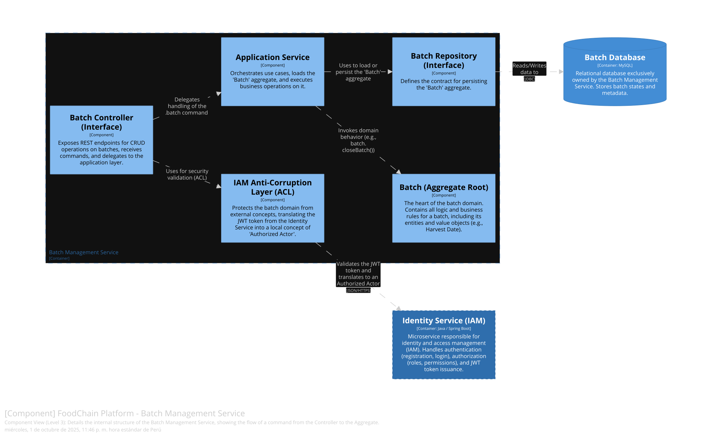

### **5.1.6. Bounded Context Software Architecture Code Level Diagrams**

En esta sección, se presentan y explican los diagramas que ofrecen un mayor detalle sobre la implementación de los componentes en el Bounded Context. Aquí se incluyen como secciones internas los diagramas de clases del Dominio y el diagrama de la Base de Datos.

#### **5.1.6.1. Bounded Context Domain Layer Class Diagrams**

En esta sección se presenta el Class Diagram de UML para las clases del Domain Layer en el `Batch Management Context`. El diagrama modela las clases, interfaces y enumeraciones clave, detallando sus atributos, métodos y visibilidad (private, public). Se evidencian las relaciones fundamentales de DDD: el `Batch Aggregate Root` encapsula su estado y expone métodos de negocio, utilizando el `BatchId Value Object` como su identificador. La interfaz `IBatchRepository` define el contrato de persistencia, desacoplando el dominio de la infraestructura.

###### **Figura [N°]: Diagrama de Clases del Dominio de Batch Management**

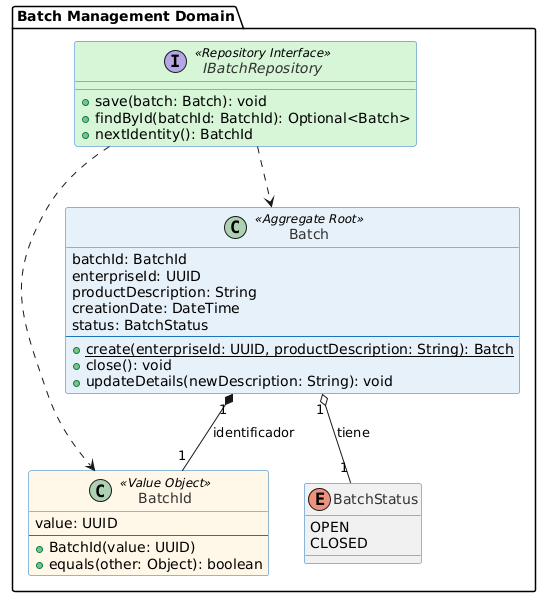

#### **5.1.6.2. Bounded Context Database Design Diagram**

En esta sección se presenta y explica el Database Diagram que incluye los objetos de base de datos que permitirán la persistencia de información para el `Batch Management Context`. Dado que este Bounded Context sigue el patrón "Database-per-Service", posee su propio esquema aislado. El diagrama muestra la tabla `batches`, que es la representación relacional del agregado `Batch`. Se especifican sus columnas, tipos de datos y constraints (Primary Key), reflejando cómo el estado del agregado es persistido.

###### **Figura [N°]: Diagrama de Base de Datos de Batch Management**

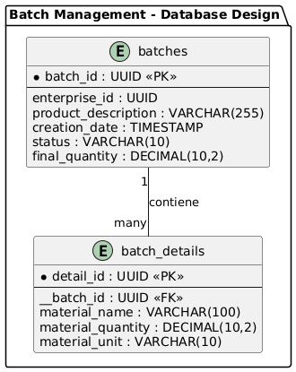

## **5.2. Bounded Context: Traceability**

Este Bounded Context tiene una única y crucial responsabilidad: **registrar los eventos inmutables** que ocurren a lo lo largo de la cadena de suministro para un lote específico. Actúa como un libro de registro (`ledger`) auditable. Su principal función es crear una entrada por cada paso (`TraceabilityEvent`), persistirla y, fundamentalmente, **publicar un evento de dominio** para notificar al resto del sistema que un nuevo paso ha sido registrado. No tiene conocimiento del ciclo de vida del lote, solo de la secuencia de eventos que le pertenecen.

### **5.2.1. Domain Layer**

La capa de dominio de este contexto se centra en la entidad `TraceabilityEvent`. A diferencia de un agregado, un evento es inmutable una vez creado; no tiene un ciclo de vida complejo, simplemente se registra.

| <<Entity>> TraceabilityEvent |
|---|
| **Descripción:** Representa un evento atómico e inmutable en el historial de un lote (ej. 'Cosecha', 'Transporte'). Es una pieza de evidencia que tiene su propia identidad y no puede ser alterada una vez registrada. |
| **Atributos:** |
| `- eventId: EventId (Value Object)` |
| `- batchId: BatchId (Value Object)` |
| `- eventType: String` |
| `- timestamp: DateTime` |
| `- actorId: UUID` |
| `- location: Location (Value Object)` |
| `- blockchainStatus: BlockchainStatus (Enum: PENDING, CONFIRMED, FAILED)` |
| `- transactionHash: String (nullable)` |
| **Métodos:** |
| `+ static record(batchId: BatchId, type: String, actorId: UUID, location: Location): TraceabilityEvent` |
| `+ confirmAnchoring(txHash: String): void` |
| `+ markAsFailed(): void` |

| <<Value Object>> Location |
|---|
| **Descripción:** Representa la localización geográfica donde ocurrió un evento. Es inmutable y se define por sus valores (latitud, longitud), garantizando que una ubicación es siempre la misma si sus coordenadas lo son. |
| **Atributos:** |
| `- latitude: Double` |
| `- longitude: Double` |
| **Métodos:** |
| `+ Location(latitude: Double, longitude: Double)` |
| `+ equals(other: Object): boolean` |

| <<Repository Interface>> ITraceabilityRepository |
|---|
| **Descripción:** Define el contrato para la persistencia de la entidad `TraceabilityEvent`. |
| **Métodos:** |
| `+ save(event: TraceabilityEvent): void` |
| `+ findByBatchId(batchId: BatchId): List<TraceabilityEvent>` |
| `+ findById(eventId: EventId): Optional<TraceabilityEvent>` |
| `+ nextIdentity(): EventId` |

### **5.2.2. Interface Layer**

La capa de interfaces expone el endpoint para que los actores de la cadena registren nuevos eventos y para que los sistemas de consulta (como el `Consumer Inquiry Context`) puedan obtener el historial de un lote.

| <<Controller>> StepController |
|---|
| **Descripción:** Punto de entrada para todas las operaciones relacionadas con los eventos de trazabilidad. |
| **Dependencias:** `TraceabilityService`, `IAMAntiCorruptionLayer` |
| **Métodos (Endpoints):** |
| `+ POST /api/v1/trace/events (resource: RegisterStepResource): ResponseEntity<UUID>` |
| `+ GET /api/v1/trace/history/{batchId}: ResponseEntity<TraceabilityHistoryResponse>` |

| Resource DTOs (Data Transfer Objects) |
|---|
| **Descripción:** Objetos planos para la comunicación. `RegisterStepResource` contiene los datos necesarios para registrar un nuevo evento. `TraceabilityHistoryResponse` contiene la lista de eventos para ser mostrada al consumidor. |
| `RegisterStepResource (Request)` |
| `TraceabilityHistoryResponse (Response)` |

| <<Anti-Corruption Layer>> IAMAntiCorruptionLayer |
|---|
| **Descripción:** Implementación del cliente que protege el Bounded Context de los detalles del `Identity Service`. Realiza una llamada HTTP REST al endpoint de validación de tokens del `Identity Service` y traduce la respuesta en un objeto de valor simple y local (`AuthorizedActor`) que el dominio puede entender sin conocer los detalles de JWT. |
| **Dependencias:** `RestTemplate` o `WebClient` (Spring) |
| **Métodos Implementados:** |
| `+ validateAndTranslate(token: String): AuthorizedActor` |

### **5.2.3. Application Layer**

La capa de aplicación orquesta el caso de uso de registrar un nuevo evento. Su responsabilidad más importante es, tras persistir el evento en su propia base de datos, **publicar un evento de dominio** para que el `Blockchain Worker` pueda actuar de forma asíncrona. Se separa la lógica de comandos (escritura) de la de consultas (lectura) para seguir el patrón CQRS.

| <<Application Service>> TraceabilityService |
|---|
| **Descripción:** Implementa el caso de uso de registrar un evento. Actúa como un Command Handler que coordina la creación de la entidad, su persistencia y la publicación del evento de dominio resultante. |
| **Dependencias:** `ITraceabilityRepository`, `IDomainEventPublisher` |
| **Métodos (Command Handlers):** |
| `+ handle(command: RegisterStepCommand): EventId` |

| <<Query Service>> HistoryQueryService |
|---|
| **Descripción:** Servicio dedicado a manejar las consultas de solo lectura, optimizado para recuperar y formatear el historial de trazabilidad de un lote. |
| **Dependencias:** `ITraceabilityRepository` |
| **Métodos (Query Handlers):** |
| `+ handle(query: GetHistoryByBatchIdQuery): TraceabilityHistoryResponse` |

| Command/Query Objects |
|---|
| **Descripción:** Objetos que representan la intención de una operación. `RegisterStepCommand` encapsula todos los datos para crear un nuevo evento. |
| `RegisterStepCommand` |
| `GetHistoryByBatchIdQuery` |

### **5.2.4. Infrastructure Layer**

La capa de infraestructura contiene las implementaciones concretas de las interfaces definidas en otras capas (principalmente, los repositorios y los publicadores de eventos). Es la capa más externa y volátil, ya que depende de tecnologías y APIs específicas. Su objetivo es adaptar estas tecnologías al lenguaje del dominio.

| <<Repository Implementation>> TraceabilityRepositoryImpl |
|---|
| **Descripción:** Implementación concreta de la interfaz `ITraceabilityRepository`. Utiliza un ORM como **JPA/Hibernate** para traducir las operaciones sobre la entidad `TraceabilityEvent` a sentencias SQL que se ejecutan contra la `TraceabilityDatabase`. |
| **Dependencias:** `EntityManager` (JPA), `DataSource` |
| **Métodos Implementados:** |
| `+ save(event: TraceabilityEvent): void` |
| `+ findByBatchId(batchId: BatchId): List<TraceabilityEvent>` |
| `+ findById(eventId: EventId): Optional<TraceabilityEvent>` |
| `+ nextIdentity(): EventId` |

| <<Domain Event Publisher>> DomainEventPublisherImpl |
|---|
| **Descripción:** Implementación concreta de la interfaz `IDomainEventPublisher`. Se encarga de serializar el objeto de evento de dominio (ej. `StepRegisteredEvent`) a un formato de mensaje estándar (como **JSON**) y enviarlo a la `Message Queue`. |
| **Dependencias:** `RabbitTemplate` (Spring AMQP) o `SqsTemplate` (AWS SDK) |
| **Métodos Implementados:** |
| `+ publish(domainEvent: IDomainEvent): void` |

### **5.2.5. Bounded Context Software Architecture Component Level Diagrams**

En esta sección se presenta el Component Diagram del modelo C4 para el contenedor `Traceability Service`. Este diagrama refleja cómo un comando para registrar un nuevo evento fluye a través del sistema: desde el `Step Controller`, pasando por la validación en la capa `ACL`, la orquestación en el `Application Service`, la persistencia a través del `Step Repository` y, crucialmente, la publicación del evento de dominio mediante el `Event Publisher`, que inicia el flujo asíncrono.

###### **Figura [N°]: Diagrama de Componentes del Traceability Service**
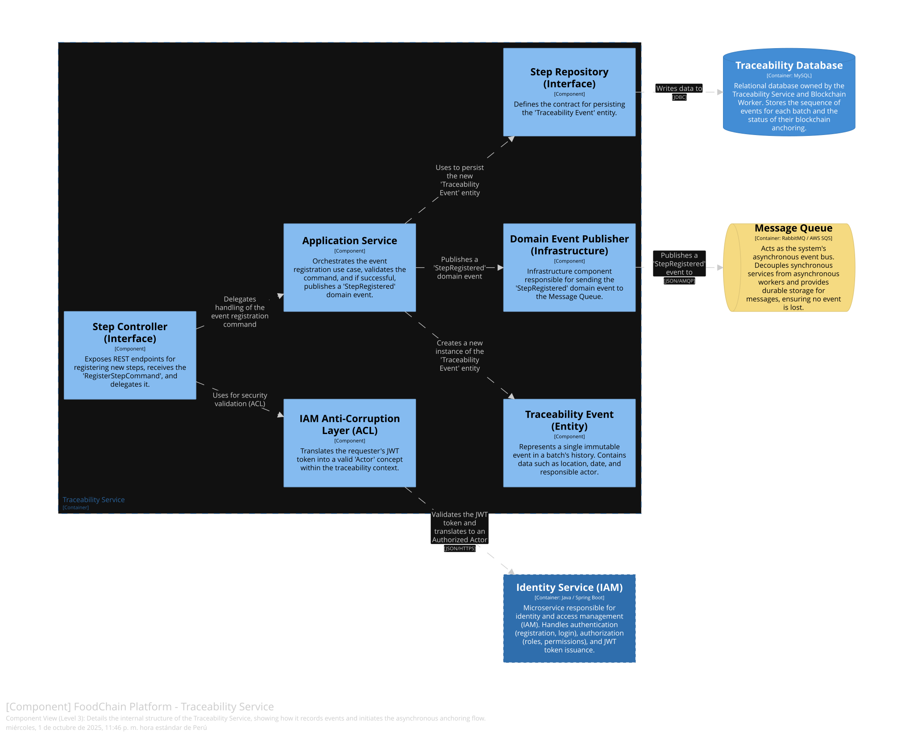

### **5.2.6. Bounded Context Software Architecture Code Level Diagrams**

En esta sección, se presentan y explican los diagramas que ofrecen un mayor detalle sobre la implementación de los componentes en el Bounded Context. Aquí se incluye como secciones internas los diagramas de clases del Dominio y el diagrama de la Base de Datos.

#### **5.2.6.1. Bounded Context Domain Layer Class Diagrams**

El siguiente diagrama de clases UML modela las clases del Domain Layer para el `Traceability Context`. El foco principal es la entidad `TraceabilityEvent`, que es inmutable una vez creada. Se detallan sus atributos y los `Value Objects` que la componen, como `Location` y `EventId`. También se muestra la interfaz del `ITraceabilityRepository`, que define el contrato de persistencia y desacopla el dominio de la infraestructura.

###### **Figura [N°]: Diagrama de Clases del Dominio de Traceability**

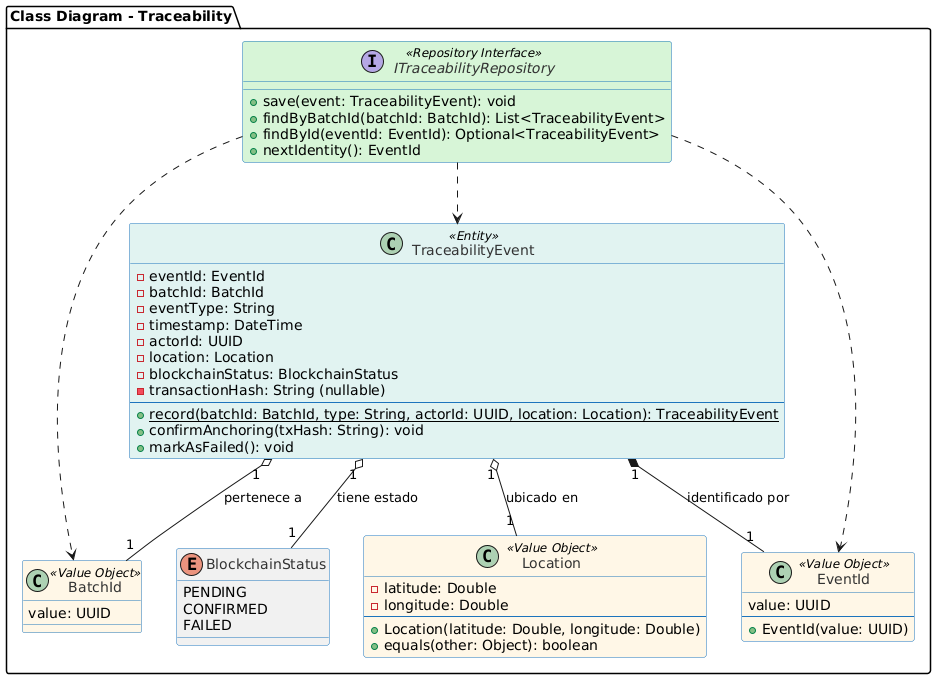

#### **5.2.6.2. Bounded Context Database Design Diagram**

Este diagrama de base de datos ilustra el esquema para la persistencia del `Traceability Context`. La tabla principal, `traceability_events`, almacena cada evento como un registro inmutable. Se especifican sus columnas (que se mapean a los atributos de la entidad `TraceabilityEvent`), los tipos de datos, la clave primaria (`event_id`), y una clave foránea (`batch_id`) que la vincula lógicamente con la información del `Batch Management Context`. También se incluye una columna `blockchain_status` para gestionar el estado del anclaje asíncrono.

###### **Figura [N°]: Diagrama de Base de Datos de Traceability**

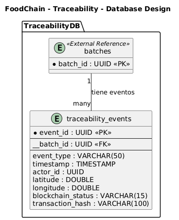

## **5.3. Bounded Context: Blockchain Worker**

Este Bounded Context es un servicio de fondo (background service) puramente asíncrono. Su única responsabilidad es **reaccionar a los eventos de dominio `StepRegisteredEvent`**, procesarlos y ejecutar la lógica de infraestructura necesaria para el anclaje en la blockchain.

A diferencia de los otros Core Domains, este contexto tiene una capa de dominio "anémica" o muy delgada, ya que su propósito no es modelar lógica de negocio compleja, sino orquestar una tarea técnica de larga duración. No posee sus propios agregados, sino que actúa sobre los datos recibidos en los eventos.

### **5.3.1. Domain Layer**

La capa de dominio es mínima. Se centra en el contrato del evento que consume y en las interfaces que definen las operaciones que debe realizar, aplicando el Principio de Inversión de Dependencias.

| <<Domain Event>> StepRegisteredEvent |
|---|
| **Descripción:** Representa el evento de dominio que este servicio consume. Es un DTO inmutable que contiene toda la información necesaria para el anclaje. |
| **Atributos:** |
| `- eventId: UUID` |
| `- eventDataHash: String` |
| `- timestamp: DateTime` |

| <<Domain Service Interface>> IAnchoringService |
|---|
| **Descripción:** Define el contrato para el caso de uso principal de este contexto: anclar un evento. |
| **Métodos:** |
| `+ anchorEvent(event: StepRegisteredEvent): void` |

### **5.3.2. Interface Layer (Input Adapters)**

La "interfaz" de un servicio de fondo no es una API REST, sino los adaptadores que escuchan fuentes de entrada asíncronas. En este caso, es el listener de la cola de mensajes.

| <<Domain Event Handler>> StepRegisteredEventHandler |
|---|
| **Descripción:** Es el punto de entrada del servicio. Escucha activamente la `Message Queue`. Cuando recibe un mensaje `StepRegisteredEvent`, lo deserializa y delega su procesamiento al `IAnchoringService` de la capa de aplicación. |
| **Dependencias:** `IAnchoringService` |
| **Métodos:** |
| `+ onMessage(event: StepRegisteredEvent): void` |

### **5.3.3. Application Layer**

La capa de aplicación orquesta el proceso técnico. Recibe el evento y coordina con los componentes de infraestructura para ejecutar la tarea.

| <<Application Service>> AnchoringServiceImpl |
|---|
| **Descripción:** Implementación del `IAnchoringService`. Orquesta el flujo: invoca al adaptador de blockchain, maneja los posibles errores y, si tiene éxito, invoca al adaptador de base de datos para actualizar el estado. |
| **Dependencias:** `IBlockchainAdapter`, `ITraceabilityDbUpdater` |
| **Métodos (Event Handlers):** |
| `+ anchorEvent(event: StepRegisteredEvent): void` |

### **5.3.4. Infrastructure Layer (Output Adapters)**

Esta es la capa más importante del worker, ya que contiene toda la lógica de bajo nivel para interactuar con sistemas externos. Su función es implementar las interfaces definidas en la capa de dominio, actuando como adaptadores al mundo exterior.

| <<Adapter Implementation>> BlockchainAdapterImpl |
|---|
| **Descripción:** Implementación concreta que se comunica con la red Polygon. Utiliza una librería como **Web3j** para conectarse a un nodo RPC, construir y firmar la transacción que contiene el hash del evento, enviarla y gestionar reintentos en caso de fallo de red. |
| **Dependencias:** `Web3j`, `Credentials` |
| **Métodos Implementados:** |
| `+ anchorHash(hash: String): TransactionReceipt` |

| <<Adapter Implementation>> TraceabilityDbUpdaterImpl |
|---|
| **Descripción:** Implementación concreta que se conecta a la `TraceabilityDatabase`. Su única función es ejecutar una sentencia `UPDATE` sobre la tabla `traceability_events` para cambiar el `blockchain_status` a "CONFIRMED" y almacenar el `transaction_hash` recibido del `BlockchainAdapter`. |
| **Dependencias:** `EntityManager` (JPA) |
| **Métodos Implementados:** |
| `+ updateStatusToConfirmed(eventId: UUID, txHash: String): void` |

### **5.3.5. Bounded Context Software Architecture Component Level Diagrams**

El siguiente diagrama de componentes del modelo C4 ilustra la arquitectura interna del `Blockchain Worker`. Muestra claramente el flujo de datos: el `Domain Event Handler` recibe el evento de la cola, lo pasa al `Anchoring Service` para su orquestación, y este a su vez utiliza los adaptadores de infraestructura para interactuar con la red Polygon y actualizar la base de datos de trazabilidad, completando así el ciclo asíncrono.

###### **Figura [N°]: Diagrama de Componentes del Blockchain Worker**
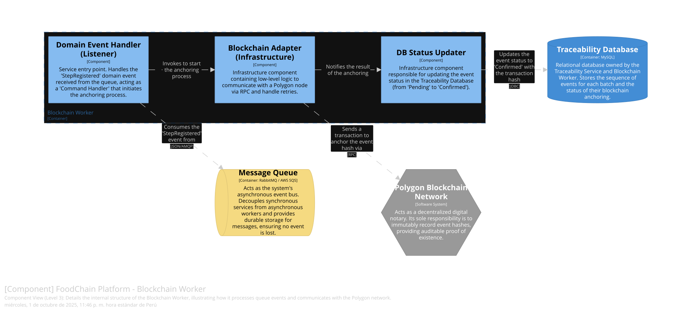

### **5.3.6. Bounded Context Software Architecture Code Level Diagrams**

#### **5.3.6.1. Bounded Context Domain Layer Class Diagrams**

El diagrama de clases para este contexto es simple, reflejando su naturaleza de orquestador técnico. Se centra en las interfaces (`IAnchoringService`, `IBlockchainAdapter`, etc.) para demostrar la inversión de dependencias, y en el objeto de datos `StepRegisteredEvent` que actúa como el contrato de comunicación.

###### **Figura [N°]: Diagrama de Clases del Blockchain Worker**

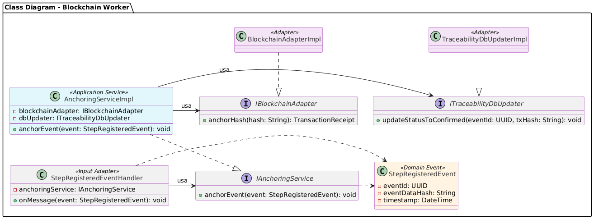

#### **5.3.6.2. Bounded Context Database Design Diagram**

Este Bounded Context **no posee su propia base de datos**. En su lugar, interactúa con la `TraceabilityDatabase`, que es propiedad del `Traceability Service`. Esta es una decisión de diseño deliberada para arquitecturas basadas en eventos. El worker tiene permisos de escritura limitados para actualizar columnas específicas (`blockchain_status`, `transaction_hash`) en la tabla `traceability_events`. Por lo tanto, el diagrama de base de datos aplicable es el mismo que el definido en la sección `5.2.6.2`.

###### **Referencia a Figura [N° de la BD de Traceability]: Diagrama de Base de Datos de Traceability**

## **5.4. Bounded Context: Identity Service (IAM)**

Este Bounded Context es un servicio de soporte genérico. Su única responsabilidad es gestionar la **identidad y el acceso** de los usuarios de la plataforma FoodChain. Se encarga de la autenticación (verificar quién es un usuario) y la autorización (qué puede hacer ese usuario). Actúa como la única fuente de verdad para la identidad del usuario, emitiendo tokens JWT que los demás servicios pueden verificar.

### **5.4.1. Domain Layer**

La capa de dominio contiene el agregado `User`, que encapsula toda la lógica y las reglas de negocio relacionadas con la cuenta de un usuario, sus credenciales y sus roles.

| <<Aggregate Root>> User |
|---|
| **Descripción:** Representa a un usuario del sistema. Es la raíz del agregado y el único punto de entrada para modificar su estado, garantizando reglas como la complejidad de la contraseña o la unicidad del email. |
| **Atributos:** |
| `- userId: UserId (Value Object)` |
| `- enterpriseId: UUID` |
| `- email: Email (Value Object)` |
| `- hashedPassword: HashedPassword (Value Object)` |
| `- roles: Set<Role>` |
| `- isActive: boolean` |
| **Métodos:** |
| `+ static register(email: Email, plainTextPassword: String, enterpriseId: UUID): User` |
| `+ changePassword(oldPassword: String, newPassword: String): void` |
| `+ assignRole(role: Role): void` |
| `+ deactivate(): void` |

| <<Value Object>> HashedPassword |
|---|
| **Descripción:** Representa una contraseña de forma segura. Encapsula la lógica para hashear una contraseña en texto plano y para verificar si una contraseña entrante coincide con el hash almacenado. Nunca expone el hash. |
| **Atributos:** |
| `- hash: String` |
| **Métodos:** |
| `+ create(plainTextPassword: String): HashedPassword` |
| `+ matches(plainTextPassword: String): boolean` |

| <<Repository Interface>> IUserRepository |
|---|
| **Descripción:** Define el contrato para la persistencia del agregado `User`. Desacopla la lógica de dominio de los detalles de la base de datos. |
| **Métodos:** |
| `+ save(user: User): void` |
| `+ findById(userId: UserId): Optional<User>` |
| `+ findByEmail(email: Email): Optional<User>` |
| `+ nextIdentity(): UserId` |

### **5.4.2. Interface Layer**

La capa de interfaces expone los endpoints REST para que los usuarios puedan registrarse, iniciar sesión y gestionar sus perfiles.

| <<Controller>> AuthenticationController |
|---|
| **Descripción:** Punto de entrada para las operaciones de autenticación. Recibe las credenciales del usuario y devuelve un token JWT si son válidas. |
| **Dependencias:** `AuthenticationService` |
| **Métodos (Endpoints):** |
| `+ POST /api/v1/iam/auth/register (resource: RegisterUserResource): ResponseEntity<Void>` |
| `+ POST /api/v1/iam/auth/login (resource: LoginResource): ResponseEntity<JwtResponse>` |
| `+ POST /api/v1/iam/auth/validate (token: String): ResponseEntity<UserDetailsResponse>` |

| Resource DTOs (Data Transfer Objects) |
|---|
| **Descripción:** Objetos planos para la comunicación. Se utilizan para recibir datos de registro y login, y para devolver el token JWT o los detalles del usuario. |
| `RegisterUserResource (Request)` |
| `LoginResource (Request)` |
| `JwtResponse (Response)` |
| `UserDetailsResponse (Response)` |

### **5.4.3. Application Layer**

La capa de aplicación orquesta los casos de uso relacionados con la identidad. Se comunica con el dominio para ejecutar la lógica de negocio y con la infraestructura para tareas como el envío de emails o la generación de tokens.

| <<Application Service>> AuthenticationService |
|---|
| **Descripción:** Implementa los casos de uso de registro y autenticación de usuarios. |
| **Dependencias:** `IUserRepository`, `IJwtProvider`, `IEmailServiceAdapter` |
| **Métodos (Command Handlers):** |
| `+ handle(command: RegisterUserCommand): UserId` |
| `+ handle(command: AuthenticateUserCommand): String (JWT)` |
| `+ handle(query: ValidateTokenQuery): UserDetails` |

### **5.4.4. Infrastructure Layer**

La capa de infraestructura contiene las implementaciones concretas para la persistencia, la generación de tokens y la comunicación con servicios externos como el envío de correos.

| <<Repository Implementation>> UserRepositoryImpl |
|---|
| **Descripción:** Implementación de la interfaz `IUserRepository` utilizando **JPA/Hibernate**. Se encarga de mapear el agregado `User` y sus `Value Objects` a la tabla `users` en la `UserDatabase`. |
| **Dependencias:** `EntityManager` (JPA) |
| **Métodos Implementados:** |
| `+ save(user: User): void` |
| `+ findById(userId: UserId): Optional<User>` |
| `+ findByEmail(email: Email): Optional<User>` |
| `+ nextIdentity(): UserId` |

| <<Token Provider>> JwtProviderImpl |
|---|
| **Descripción:** Implementación de la interfaz `IJwtProvider`. Utiliza una librería como **JJWT** para generar y validar JSON Web Tokens. Se configura con una clave secreta y tiempos de expiración para asegurar los tokens emitidos. |
| **Dependencias:** `JJWT Library` |
| **Métodos Implementados:** |
| `+ generateToken(userDetails: UserDetails): String` |
| `+ validateAndGetUserDetails(token: String): UserDetails` |

| <<Adapter Implementation>> EmailServiceAdapterImpl |
|---|
| **Descripción:** Implementación del adaptador que se comunica con un servicio de correo externo (como SendGrid o AWS SES). Realiza una llamada **HTTP REST** para solicitar el envío de correos transaccionales, como el email de bienvenida tras el registro. |
| **Dependencias:** `RestTemplate` o `WebClient` (Spring) |
| **Métodos Implementados:** |
| `+ sendWelcomeEmail(email: Email): void` |

### **5.4.5. Bounded Context Software Architecture Component Level Diagrams**

El diagrama de componentes para el `Identity Service` ilustra el flujo interno para un caso de uso típico, como la autenticación. La petición llega al `Authentication Controller`, que delega la orquestación al `Application Service`. Este servicio utiliza el `UserRepository` para cargar el agregado `User`, invoca la lógica de validación de contraseña en el propio agregado y, si es exitoso, utiliza el `JwtProvider` para generar el token de respuesta.

###### **Figura [N°]: Diagrama de Componentes del Identity Service**
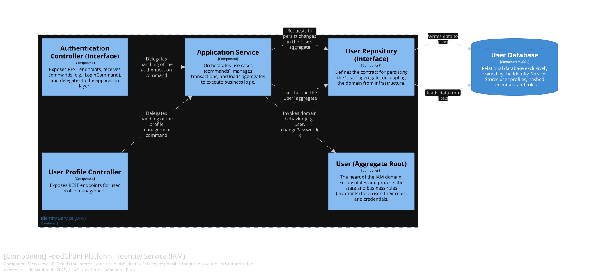

### **5.4.6. Bounded Context Software Architecture Code Level Diagrams**

#### **5.4.6.1. Bounded Context Domain Layer Class Diagrams**

El diagrama de clases UML para el `Identity Service` se centra en el agregado `User`. Muestra cómo `User` es la raíz que encapsula `Value Objects` como `UserId`, `Email` y `HashedPassword`, protegiendo las reglas de negocio. La relación con la interfaz `IUserRepository` demuestra la inversión de dependencias para desacoplar el dominio de la persistencia.

###### **Figura [N°]: Diagrama de Clases del Dominio de Identity Service**

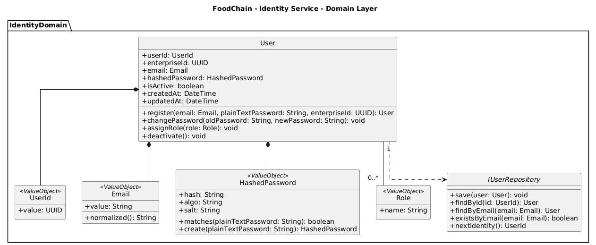

#### **5.4.6.2. Bounded Context Database Design Diagram**

El diagrama de base de datos para este contexto muestra la tabla `users`, que es propiedad exclusiva del `Identity Service`. Se detallan las columnas que persisten el estado del agregado `User`, como `user_id` (Primary Key), `email` (con un constraint `UNIQUE`), y `hashed_password`. También se podría incluir una tabla `user_roles` para gestionar la autorización, vinculada a la tabla `users` mediante una clave foránea.

###### **Figura [N°]: Diagrama de Base de Datos de Identity Service**

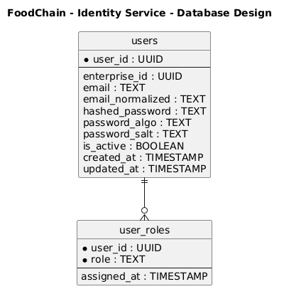