## **CAPÍTULO VI: SOLUTION UX DESIGN**

En este capítulo se define la propuesta de diseño de la experiencia de usuario (UX) e interfaz de usuario (UI) para el ecosistema de FoodChain. El objetivo es traducir nuestra misión de **restaurar la confianza en la cadena alimentaria** en una experiencia digital coherente, intuitiva y transparente para cada uno de nuestros segmentos objetivo.

Para ello, tomaremos como base los User Stories identificados y las decisiones de arquitectura, asegurando que cada interacción, desde el registro de un lote por parte de un productor hasta el escaneo de un QR por parte de un consumidor, refuerce nuestros valores de **integridad, transparencia y empoderamiento**. La propuesta de diseño abarcará desde las guías de estilo que unifican nuestra identidad visual, hasta la arquitectura de información y los prototipos que materializan la interacción con nuestras aplicaciones y el Landing Page.

### **6.1 Style Guidelines**

En esta sección se establecen las bases visuales y de comunicación que definirán la identidad de FoodChain. El objetivo es crear un repositorio de diseño centralizado y coherente que garantice una experiencia de usuario unificada y profesional en todos nuestros productos digitales. Estas guías aseguran que cada elemento, desde un botón hasta el tono de un mensaje, refleje nuestros valores de transparencia, confianza y seguridad alimentaria.

#### 6.1.1 General Style Guidelines

En esta sección se definen los pilares de la identidad visual y verbal de FoodChain. El propósito es establecer un lenguaje de diseño consistente que comunique nuestros valores fundamentales **transparencia, integridad y confianza** en cada punto de contacto con el usuario. Estas guías servirán como la única fuente de verdad para todo el equipo, garantizando que la experiencia en nuestras plataformas sea coherente, profesional y memorable. Como base para la construcción de nuestros componentes, tomaremos como referencia el Design System **Material Design**, adaptándolo a las necesidades de nuestra marca.

**Branding (Marca)**

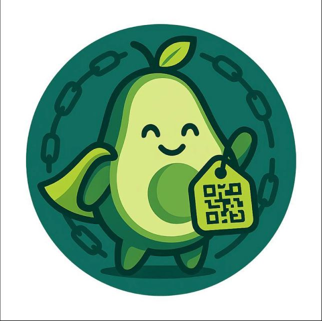

El logotipo de FoodChain es la representación visual de nuestra misión, encarnada en un personaje amigable y heroico: un aguacate con capa que protege y garantiza la transparencia de los alimentos. El diseño comunica nuestros valores de la siguiente manera:
* **El Personaje (Aguacate Héroe):** El aguacate representa lo natural, saludable y fresco. Su expresión sonriente y su capa lo convierten en un símbolo de **protección y empoderamiento** para el consumidor, un guardián de la confianza en la cadena alimentaria.
* **La Etiqueta con Código QR:** Es la herramienta del héroe. Simboliza el poder de la información y la tecnología accesible que ofrecemos para desvelar la historia de cada producto con un simple escaneo.
* **La Cadena de Fondo:** Representa de forma sutil y segura la tecnología **blockchain** y los eslabones de la cadena de suministro que nuestra plataforma une y protege de manera inmutable.

El estilo general del logo es accesible, positivo y moderno, lo que nos permite abordar un tema tan complejo como la trazabilidad de una manera que genera confianza y no intimidación.

#### **Typography**

La selección tipográfica se ha definido para garantizar una excelente legibilidad, jerarquía visual y una estética moderna y limpia, alineada con la confianza y accesibilidad que promueve FoodChain.

* **Familia para Títulos y Encabezados: `Inter`**
  Se ha elegido Inter por su gran legibilidad en interfaces de usuario (UI) y su claridad en diferentes tamaños y pesos. Es una fuente moderna y neutra que aporta seriedad y profesionalismo a los títulos.

* **Familia para Cuerpo de Texto y UI: `Roboto`**
  Se ha optado por Roboto por su familiaridad y comodidad de lectura en párrafos largos. Sus formas abiertas y ritmo natural la hacen ideal para presentar información detallada de manera clara y sin fatigar al lector.

A continuación, se detalla la escala tipográfica que se utilizará en toda la plataforma, según las especificaciones definidas:

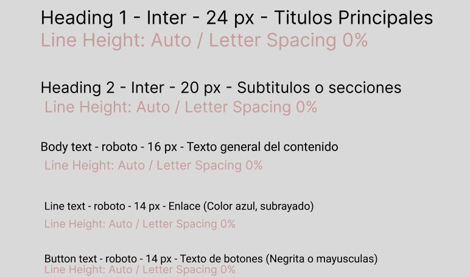

#### **Colors**

La paleta de colores se extrae directamente de nuestro logotipo, asegurando una sinergia total entre la marca y la interfaz de usuario. Los colores han sido seleccionados estratégicamente para evocar naturaleza, frescura, energía y confianza, creando una experiencia visual coherente, accesible y atractiva que refuerza la identidad de FoodChain.

**Paleta de Colores Primarios**

Estos son los colores fundamentales que definen nuestra identidad visual y deben ser los más prominentes en el diseño.

* **Primario (`#1A5952`) - Confianza y Estructura:**
  Extraído del fondo del logo, este verde oscuro y profundo comunica seriedad, seguridad y un fuerte vínculo con la naturaleza. Es el pilar de nuestra paleta.
    * **Uso:** Ideal para componentes estructurales como la barra de navegación, footers, fondos de secciones principales y como color de texto principal sobre fondos claros.

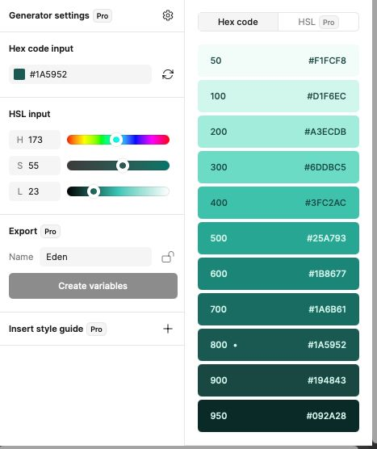

* **Secundario - Acción y Energía (`#8BC53F`)**
  Es el color vibrante y amigable de nuestro personaje. Representa frescura, salud y vitalidad. Su función es guiar al usuario y destacar las acciones más importantes.
    * **Uso:** Exclusivamente para los llamados a la acción (CTAs) más importantes, botones primarios, íconos interactivos y elementos que requieran la atención inmediata del usuario.

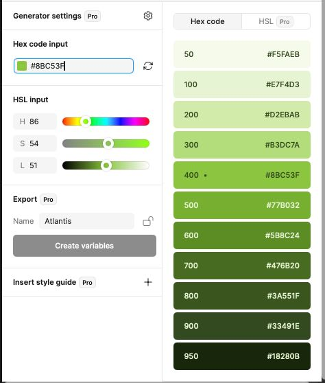

**Paleta de Colores Secundarios y de Acento**

Estos colores complementan a los primarios y se utilizan para resaltar información y añadir dinamismo a la interfaz.

* **Acento - Resaltado y Vitalidad (`#A8D164`)**
  El color de la capa de nuestro héroe. Es un verde lima enérgico que sirve para dar énfasis sin competir con el color secundario.
    * **Uso:** Perfecto para resaltar información secundaria, insignias de certificación, etiquetas, barras de progreso y para los estados de `hover` en elementos interactivos.

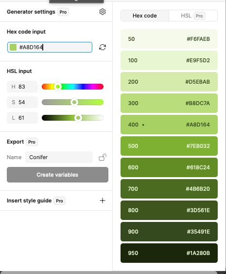

* **Detalle Sutil - (`#594F31`)**
  Un tono tierra extraído de la semilla del aguacate. Aporta un toque orgánico y se usa para detalles que no necesitan un alto contraste.
    * **Uso:** Ideal para íconos secundarios, bordes sutiles o texto de menor importancia.

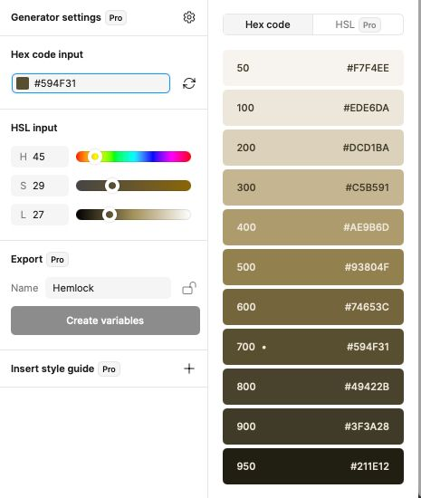

**Paleta de Colores Neutrales**

Los neutrales proporcionan el lienzo sobre el cual nuestros colores de marca pueden brillar. Son esenciales para la claridad, el espaciado y la legibilidad.

* **Neutro Principal (`#231F20`) - Texto y Contornos:**
  Extraído de los contornos del logo y el QR. Este tono casi negro es el color principal para todo el texto, garantizando la máxima legibilidad y cumpliendo con los estándares de accesibilidad.
    * **Uso:** Cuerpo de texto, títulos, etiquetas y bordes de componentes.

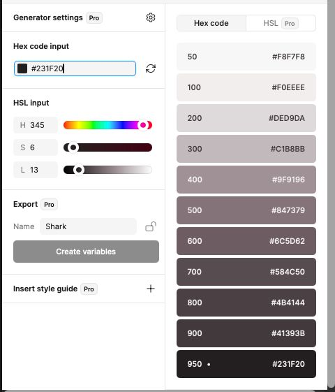

* **Blanco - Fondo y Espacio (`#FFFFFF`)**
  El blanco puro se utiliza para dar "aire" y limpieza al diseño.
    * **Uso:** Fondos principales de página y fondos de tarjetas (cards) para que el contenido sea el protagonista.

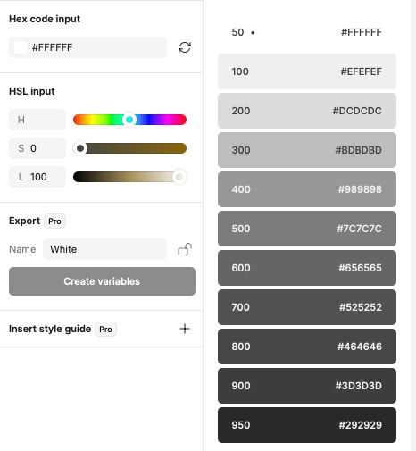

### **Spacing**

El sistema de espaciado de **FoodChain** se fundamenta en una cuadrícula modular de **10 px**, utilizada como guía base para la ubicación, proporción y alineación de todos los elementos visuales.  
Esta estructura asegura uniformidad, equilibrio y legibilidad en las interfaces, manteniendo coherencia entre versiones web y móviles.

#### **Lineamientos de espaciado**
- **Unidad base:** cuadrícula de 10 px (con subdivisiones de 5 px para microajustes).
- **Márgenes internos (padding):** entre 10 px y 30 px según el tipo de componente.
- **Márgenes externos (margin):** entre 20 px y 60 px para bloques principales.
- **Espaciado vertical entre campos y botones:** 20 – 24 px.
- **Separación entre secciones o grupos de contenido:** 50 – 70 px.
- **Alineación:** se emplea *Auto Layout* para mantener distancias proporcionales y consistentes.
- **Sistema de referencia:** el grid de 10 px se aplica en todas las pantallas (1280 px de ancho base) para garantizar una estructura visual clara y escalable.

#### **Justificación**
El uso de una cuadrícula fija permite mantener un ritmo visual uniforme, facilita la lectura de formularios y componentes, y asegura una estética profesional en la interfaz de usuario.

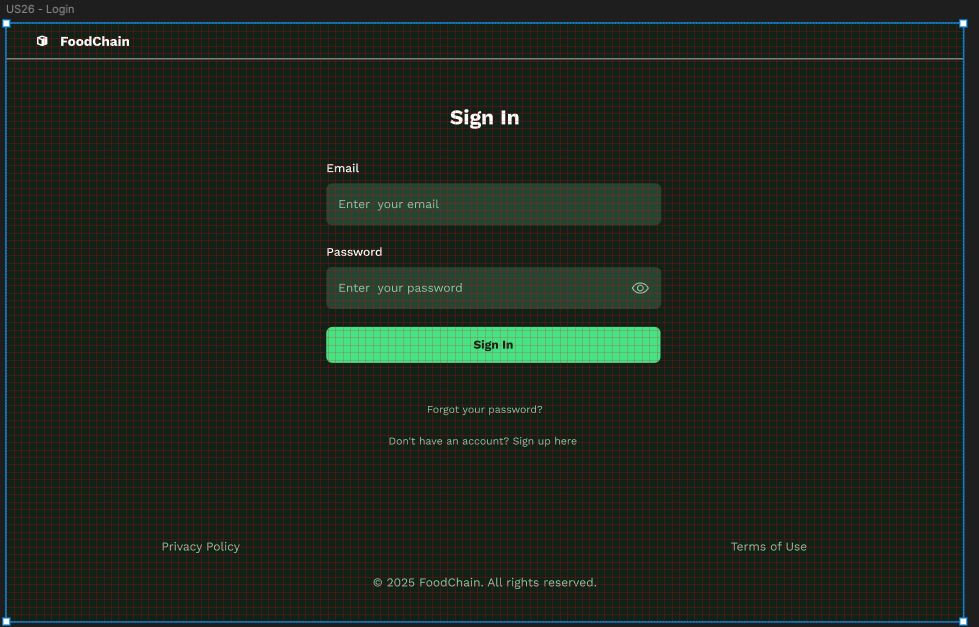

> **Figura.** Sistema de espaciado de 10 px aplicado a la pantalla Login del proyecto FoodChain.  
> *Nota.* Captura elaborada en Figma mostrando la cuadrícula 10 px y las distancias de margen entre los componentes principales (inputs, botón y texto) de la interfaz.

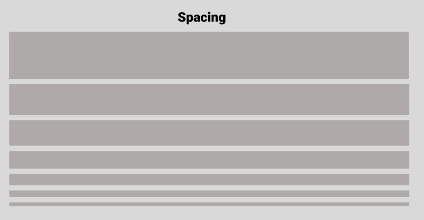

#### **Tono de Comunicación y Lenguaje**

El tono de comunicación de FoodChain debe ser un reflejo directo de nuestra marca: **el guardián confiable y amigable de tus alimentos**. La forma en que nos comunicamos es tan importante como la tecnología que ofrecemos, ya que es el principal vehículo para construir confianza con nuestros usuarios. Por ello, nuestra comunicación será siempre **clara, educativa y tranquilizadora**, adaptando el lenguaje al contexto y al segmento objetivo para maximizar la comprensión y resonancia.

**Personalidad de la Marca**

Nuestra voz se define por tres arquetipos principales que guían todo nuestro contenido:

1.  **Somos el Guía Experto, no el Elitista:** Explicamos conceptos complejos como "blockchain" con autoridad, pero siempre de manera accesible y sencilla. Traducimos la tecnología en beneficios tangibles para el usuario, como "un historial verificado e inalterable". Nuestro objetivo es educar y empoderar, no intimidar con jerga técnica.
2.  **Somos el Guardián Confiable, no el Alarmista:** Nuestra misión es proteger y asegurar. Informamos sobre los riesgos de la industria para dar contexto a nuestra solución, pero nuestro mensaje principal es de empoderamiento, seguridad y tranquilidad. Generamos confianza a través de la transparencia, no del miedo.
3.  **Somos Innovadores con Propósito, no Tecnólogos Abstractos:** Cada característica de nuestra plataforma se presenta en función del problema real que resuelve. Comunicamos el "porqué" de nuestra tecnología, mostrando cómo cada innovación contribuye a una cadena de suministro más justa y segura para todos.

**Adaptación por Segmento**

Reconocemos que nuestros usuarios tienen diferentes necesidades y contextos, por lo que adaptaremos nuestro tono para comunicarnos de la manera más efectiva con cada uno.

* **Hacia el Consumidor (B2C):**
    * **Tono:** Usaremos un tono directo, cercano, sencillo y centrado en el beneficio personal. El lenguaje será visual y evocador, conectando con las emociones del usuario en torno a la salud, la familia y la confianza.
    * **Ejemplo de Copy:** *“¿Quieres saber la historia completa de tu aguacate? Descúbrela desde la huerta hasta tu mesa. Escanea el QR y conoce al héroe que garantiza tu tranquilidad.”*

* **Hacia el Productor y la Empresa (B2B):**
    * **Tono:** El tono será profesional, directo y orientado a resultados. El lenguaje se centrará en conceptos de negocio como eficiencia, mitigación de riesgos, valor de marca y retorno de inversión (ROI).
    * **Ejemplo de Copy:** *“Proteja su marca contra el fraude y optimice la gestión de recalls con nuestra plataforma de trazabilidad inmutable. Convierta la transparencia en su mayor activo competitivo y fortalezca la lealtad de sus clientes.”*

#### 6.1.2 Web, Mobile & Devices Style Guidelines

Este punto muestra cómo se aplican, en pantallas reales, las reglas del 6.1.1.  
Ingredientes heredados: color primario **#8BC53F**, tipografía **Inter**, unidad de espaciado **8 px**.  
El objetivo es **explicar** cada componente y **mostrarlo** con su captura de Figma.

### Catálogo de Componentes (Web)

#### Botones y CTAs

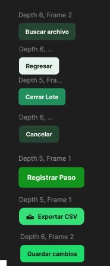

**Uso:** el primario enfatiza la acción principal del flujo; el secundario ofrece una alternativa segura.  
**Estilo primario:** fondo **#8BC53F**, texto Inter Medium 16 px, radio 12 px, padding vertical 12–16 px, sombra sutil; estados hover (↑luminosidad), focus (outline visible), disabled (40% opacidad).  
**Estilo secundario:** fondo verde oscuro **#264533**, texto blanco, mismas proporciones del primario.  
**Accesibilidad:** contraste AA en todos los estados; área mínima clicable 44×44 px; feedback inmediato.

#### Dashboard — KPIs y Gráficos

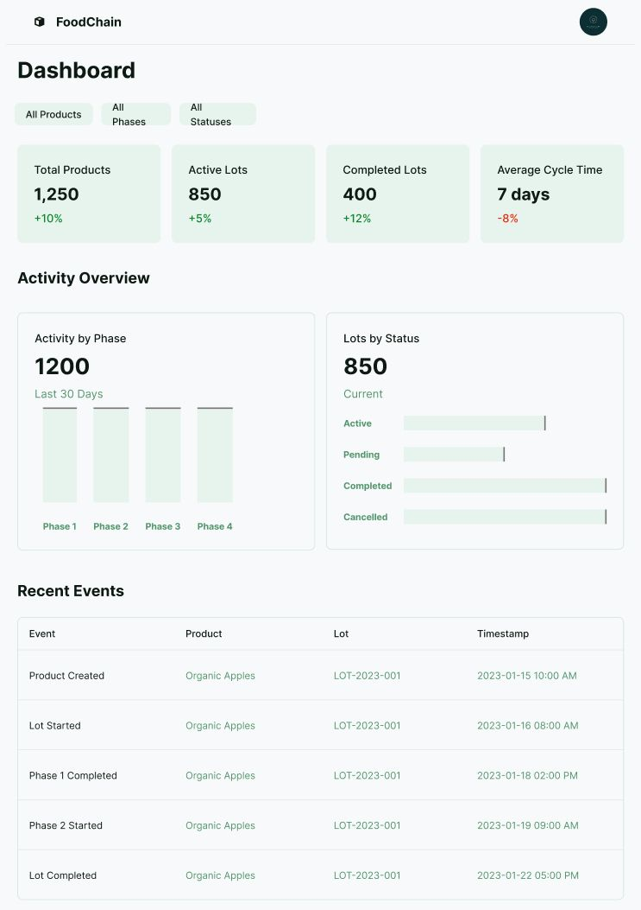

**Propósito:** dar una visión ejecutiva de la operación.  
**Estructura:** tarjetas métricas alineadas a una rejilla de **12 columnas**; módulos de “Activity Overview”, “Lots by Status” y “Recent Events”.  
**Jerarquía:** títulos Inter Bold 24–28 px; cifras principales 28–32 px; descripciones 14–16 px.  
**Color:** neutros claros **#FFFFFF / #E5E8EB** para fondos; acentos en **#8BC53F** para variaciones positivas y rojo suave para negativas.  
**Accesibilidad:** etiquetas textuales en gráficos (no solo color); foco visible en chips de filtro.

#### Detalle del Lote — Trazabilidad

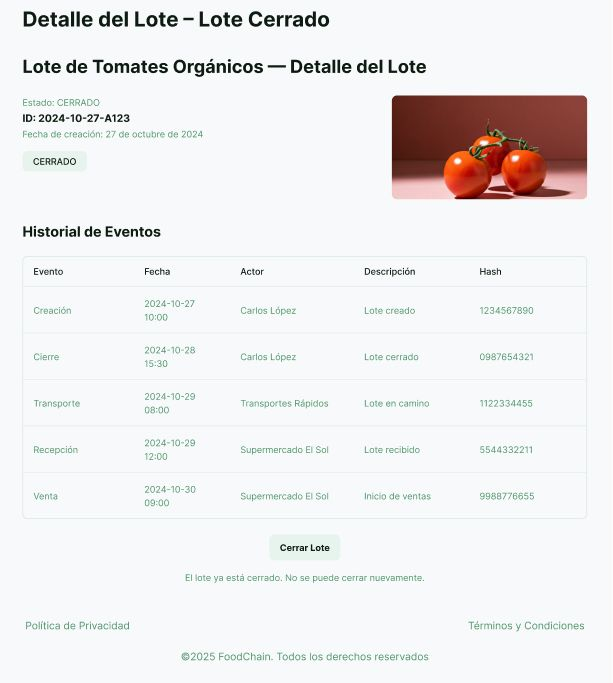

**Propósito:** mostrar estado, metadatos y eventos del lote.  
**Estructura:** H1 con nombre del lote, subtítulo con ID/fechas, chip de estado, miniatura del producto y tabla de eventos (Evento, Fecha, Actor, Descripción, Hash).  
**Patrones:** paddings en múltiplos de **8 px**; bordes finos **#E5E8EB**; botón contextual deshabilitado cuando el lote está cerrado.  
**Accesibilidad:** tabla navegable por teclado; encabezados semánticos; contraste AA.

#### Mis Lotes — Tabla de Gestión

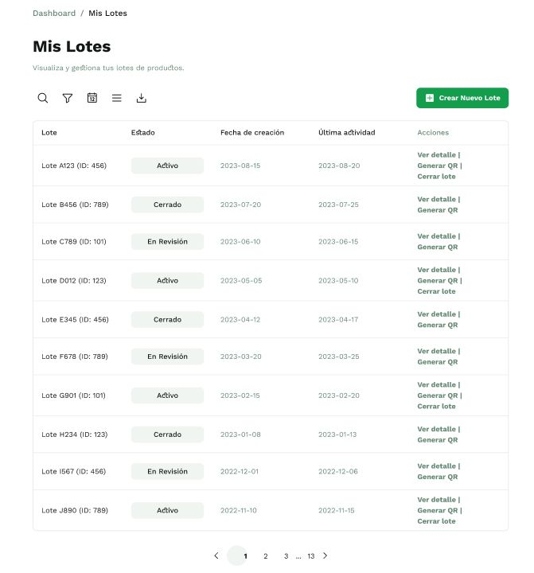

**Propósito:** listar y operar sobre los lotes.  
**Estructura:** columnas por prioridad (Lote, Estado, Fecha de creación, Última actividad, Acciones); paginación al pie.  
**Patrones:** filas con altura suficiente para escaneo; badges de estado con codificación cromática; acciones “Ver detalle | Generar QR | Cerrar lote” alineadas a la derecha.  
**Tipografía:** Inter 14–16 px en celdas; encabezados 12–14 px en semibold.  
**Accesibilidad:** orden de tabulación lógico; roles ARIA en paginación; foco visible en enlaces.

#### Crear Nuevo Lote — Formulario

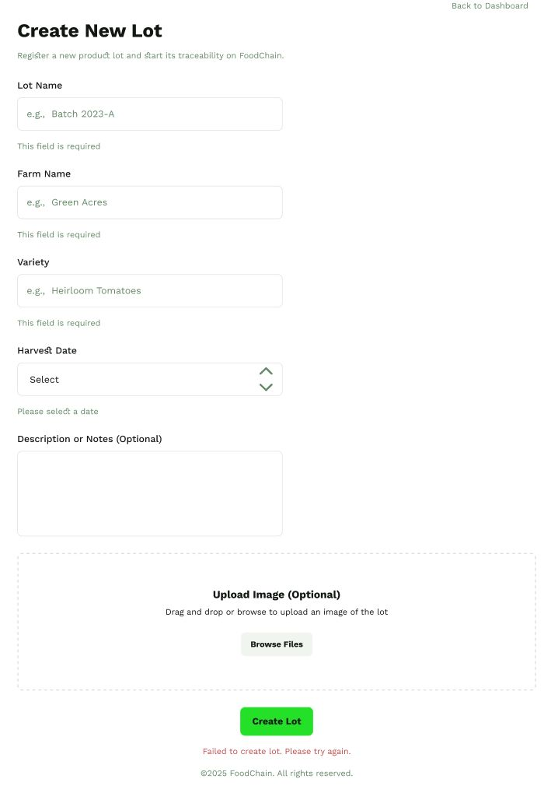

**Propósito:** alta guiada de lotes con validación inmediata.  
**Estructura:** columna única; campos “Lot Name”, “Farm Name”, “Variety”, “Harvest Date”, “Notes” y área de carga de imagen (drag & drop).  
**Patrones:** labels sobre el campo; placeholders claros; espaciado vertical de **16–24 px**; mensajes de error bajo el campo en rojo suave; CTA “Create Lot” en **#8BC53F** a ancho completo.  
**Accesibilidad:** labels asociados a inputs; ayuda textual junto a color; navegación completa por teclado.

#### Navegación Lateral

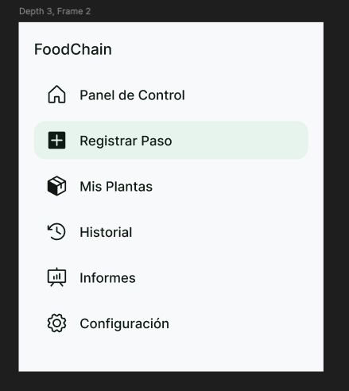

**Propósito:** orientar al usuario entre módulos del sistema.  
**Patrones:** iconos simples, texto Inter 14–16 px, item activo con fondo claro **#E5E8EB** y marcador visual; espaciado interno múltiplo de **8 px**.  
**Estados:** hover con leve cambio de fondo, focus con outline visible, `aria-current="page"` en el activo.  
**Accesibilidad:** objetivos táctiles amplios y orden de foco predecible.

### Reglas transversales aplicadas en todas las vistas (Web)

**Grid:** rejilla de **12 columnas**; unidad de medida y separación basada en **8 px**.  
**Tipografía:** **Inter** en pesos Regular/Medium/Bold; jerarquía seca y consistente.  
**Color:** primario **#8BC53F**; secundarios y neutros **#264533 / #FFFFFF / #E5E8EB**; semántica constante en estados.  
**Microinteracciones:** transiciones de 0.2–0.3 s para hover/focus; feedback instantáneo en envíos y errores.  
**Accesibilidad:** contraste AA, foco visible, áreas mínimas 44×44 px, etiquetas ARIA en controles y tablas.

### Catálogo de Componentes (Mobile)

El diseño de la aplicación móvil de FoodChain se centra en la simplicidad, la rapidez y una experiencia visual intuitiva. El objetivo es que cualquier consumidor pueda verificar la historia de un producto en segundos. Los componentes heredan las guías de estilo generales (colores, tipografía) pero se adaptan a los patrones de interacción nativos de los dispositivos móviles para garantizar una usabilidad óptima.

*(Nota: Las descripciones se basan en los mockups proporcionados para la aplicación móvil, incluyendo las vistas de Escaneo, Trazabilidad y Detalle).*

#### 1. Navegación Inferior (Tab Bar)

**Propósito:** Proporcionar acceso constante y ergonómico a las secciones principales de la aplicación, siguiendo un patrón de diseño nativo y familiar para el usuario móvil.
**Estructura:** Se implementa una barra de pestañas fija en la parte inferior de la pantalla, que contiene los íconos de las secciones principales: "History", "Map", "Companies" y "Help".
**Patrones:**
* Los íconos son de línea, simples y reconocibles para una fácil identificación.
* El ícono de la sección activa se destaca utilizando un relleno sólido, proporcionando un feedback visual claro de la ubicación del usuario.
* El área táctil de cada ítem cumple con las guías de accesibilidad (mínimo 44x44 px) para asegurar una interacción sin errores.

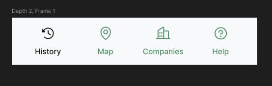

#### 2. Botón de Acción Principal (Scan Button)

**Propósito:** Ser el punto de entrada principal y más evidente de la aplicación. Su diseño está pensado para invitar al usuario a la acción fundamental: escanear un producto.
**Estilo:**
* Se materializa como un botón prominente en la pantalla de escaneo, con un texto claro y directo: "Scan QR Code".
* Utiliza un fondo sólido con un degradado sutil de los colores de la marca, lo que le da profundidad y atractivo visual.
* Incluye un ícono de código QR grande y claro, reforzando su propósito. Los bordes son completamente redondeados, dándole una apariencia amigable y moderna.

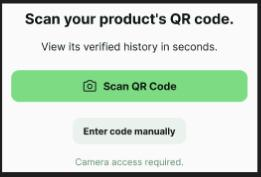

#### 3. Línea de Tiempo de Trazabilidad (Timeline)

**Propósito:** Mostrar la historia de un producto de una manera visual, vertical y fácil de digerir en una pantalla pequeña, reemplazando las complejas tablas de datos de la versión web.
**Estructura:**
* Una línea vertical conecta cada evento de la cadena de suministro, creando un flujo narrativo claro.
* Cada evento (ej. "Cosecha completada", "Empaquetado") es un punto en la línea, representado por un ícono temático dentro de un círculo.
* Junto a cada punto, se muestra el nombre del evento, el actor responsable y la fecha, utilizando la jerarquía tipográfica definida (`Inter` para títulos, `Roboto` para detalles) para una legibilidad óptima.

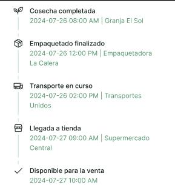

#### 4. Tarjetas de Información (Info Cards)

**Propósito:** Presentar información detallada de manera agrupada y visualmente ordenada, como en la pantalla de "Empresas Participantes".
**Estilo:**
* Utilizan un fondo blanco con bordes redondeados y una sombra sutil para darles elevación sobre el fondo de la pantalla.
* El contenido se estructura con un espaciado interno generoso. Se usan títulos claros (`Inter`) y texto descriptivo (`Roboto`).
* Componentes como las insignias de "Certificaciones" están diseñados para ser visualmente atractivos y fáciles de identificar.

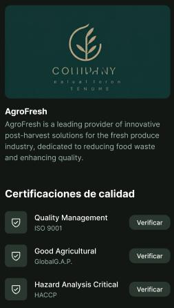

### **6.2 Information Architecture**

La **Arquitectura de la Información (AI)** define cómo se organiza, estructura y presenta el contenido dentro del ecosistema digital de **FoodChain**, que incluye la Landing Page, la Aplicación Web (para productores) y la Aplicación Móvil (para consumidores).  
Su propósito es garantizar que los usuarios puedan **localizar, comprender y navegar** la información de manera intuitiva y eficiente, traduciendo la complejidad técnica de la trazabilidad alimentaria en una experiencia clara, accesible y confiable.

#### **6.2.1 Organization Systems (Sistemas de Organización)**

Los **sistemas de organización** determinan cómo se agrupa y jerarquiza la información. En **FoodChain**, cada producto digital aplica un esquema adaptado a su propósito y tipo de usuario.

**Landing Page:**  
Se implementa una **estructura jerárquica tradicional**, que guía al visitante desde los elementos más generales hasta los más específicos.
- **Inicio:** Presenta el nombre, logotipo y mensaje principal de la startup.
- **Acerca de la solución:** Expone la misión de FoodChain y la tecnología blockchain que respalda su propuesta.
- **Beneficios:** Enumera las ventajas de la trazabilidad para consumidores, productores y distribuidores.
- **Planes:** Detalla las modalidades del servicio y los niveles de suscripción.
- **Testimonios:** Muestra opiniones reales de usuarios que fortalecen la confianza en la plataforma.
- **Contacto:** Sección ubicada en el pie de página con dirección, correo y enlaces a redes sociales oficiales.

**Aplicación Web (Productores):**  
Adopta un **sistema jerárquico por temas**, optimizado para la gestión de datos.
- **Dashboard:** Visión general con métricas clave y accesos directos a secciones prioritarias.
- **Mis Lotes:** Listado principal de lotes activos, cerrados o en revisión.
- **Reportes:** Módulo que permite generar y descargar informes detallados sobre trazabilidad.  
  Este modelo facilita la operación diaria y la administración eficiente de la información.

**Aplicación Móvil (Consumidores):**  
Aplica un **sistema secuencial y cronológico**, donde la experiencia se organiza según el recorrido del producto.
- **Escanear QR:** Punto de inicio para consultar un producto.
- **Trazabilidad:** Línea de tiempo del recorrido desde la cosecha hasta el punto de venta.
- **Empresas:** Muestra las entidades que intervinieron en el proceso, con detalles y certificaciones.
- **Historial:** Registro cronológico de productos escaneados previamente.

Este enfoque secuencial refuerza la **narrativa de confianza**, permitiendo que el consumidor siga la “historia” de cada alimento.

#### **6.2.2 Labeling Systems (Sistemas de Etiquetado)**

El **sistema de etiquetado** define la manera en que se nombran los elementos, secciones y acciones dentro de la interfaz.  
En **FoodChain**, se prioriza un lenguaje **simple, coherente y familiar**, adaptado a cada tipo de usuario, evitando tecnicismos que dificulten la comprensión.

| Etiqueta | Plataforma | Justificación |
| :--- | :--- | :--- |
| **Mis Lotes** | Web | Refiere a la sección principal de gestión del productor. Transmite propiedad y control sobre los registros. |
| **Generar QR** | Web | Indica de manera directa la acción de crear el identificador del lote para trazabilidad. |
| **Escanear Producto** | Mobile | Acción principal, reconocida universalmente, asociada al uso del dispositivo móvil. |
| **Historial** | Mobile | Representa la lista cronológica de productos escaneados, fácil de recordar y acceder. |
| **Ver Detalle** | Web / Mobile | Etiqueta corta, común en plataformas modernas, para profundizar en información específica. |

Este conjunto de etiquetas mantiene la **consistencia semántica** entre las plataformas, reduciendo la carga cognitiva y mejorando la usabilidad.

#### **6.2.3 Searching Systems (Sistemas de Búsqueda)**

Los **sistemas de búsqueda** permiten localizar información dentro de los productos digitales de manera rápida y eficiente. En **FoodChain**, la implementación varía según la complejidad y el propósito de cada plataforma.

**Landing Page:**  
No cuenta con un buscador debido a su estructura simple y lineal. El contenido se presenta de forma directa, facilitando la navegación mediante los menús superiores e inferiores.

**Aplicación Web:**  
Integra un **buscador contextual** en la sección *Mis Lotes*, permitiendo filtrar por nombre, ID o fecha de creación.  
Además, se incorporan **filtros avanzados** por:
- **Estado del lote:** Activo, Cerrado o En Revisión.
- **Rango de fechas:** Permite visualizar los lotes según el periodo de producción o registro.  
  Este sistema mejora la eficiencia y control en la gestión de información del productor.

**Aplicación Móvil:**  
Ofrece un **listado cronológico** de los productos escaneados recientemente. El usuario puede desplazarse con desplazamiento infinito (scroll) para acceder a consultas anteriores sin necesidad de búsqueda textual.

Estos mecanismos garantizan una experiencia **ágil y centrada en el contexto**, evitando que el usuario se sienta perdido entre grandes volúmenes de datos.

#### 6.2.4 SEO Tags and Meta Tags (Etiquetas SEO y Metaetiquetas)

Las **SEO Tags (Search Engine Optimization Tags)** y **Meta Tags** optimizan la visibilidad de FoodChain en los motores de búsqueda y garantizan que los usuarios encuentren fácilmente la plataforma.  
Estas etiquetas describen el contenido, los valores y la estructura técnica del sitio, alineadas con los principios de accesibilidad y coherencia visual de la marca.

A continuación se presentan las configuraciones completas que deben incluirse dentro del `<head>` del sitio y las aplicaciones.

    <!-- Título de la página -->
    <title>FoodChain – Transparencia y trazabilidad alimentaria con blockchain</title>

    <!-- Descripción del sitio -->
    <meta name="description" content="FoodChain es una plataforma que permite verificar el origen, recorrido y autenticidad de los alimentos mediante tecnología blockchain. Promovemos transparencia, confianza y sostenibilidad en toda la cadena alimentaria.">

    <!-- Palabras clave -->
    <meta name="keywords" content="FoodChain, trazabilidad alimentaria, blockchain, seguridad alimentaria, QR alimentos, cadena de suministro, sostenibilidad, transparencia, productos orgánicos, tecnología alimentaria">

    <!-- Configuración responsive para móviles -->
    <meta name="viewport" content="width=device-width, initial-scale=1.0, maximum-scale=1.0, user-scalable=no">
    
    <!-- Autoría -->
    <meta name="author" content="Equipo FoodChain – © 2025. Todos los derechos reservados.">
    
    <!-- Color del tema para navegadores -->
    <meta name="theme-color" content="#0FA573">
    
    <!-- Canonical link -->
    <link rel="canonical" href="https://www.foodchain.example/">
    
    <!-- Open Graph (Facebook / LinkedIn / WhatsApp) -->
    <meta property="og:type" content="website">
    <meta property="og:title" content="FoodChain – Trazabilidad alimentaria con blockchain">
    <meta property="og:description" content="Transparencia total del campo a tu mesa. Verifica la historia real de tus alimentos.">
    <meta property="og:url" content="https://www.foodchain.example/">
    <meta property="og:image" content="https://www.foodchain.example/assets/og-cover.png">
    <meta property="og:locale" content="es_PE">
    
    <!-- Twitter Cards -->
    <meta name="twitter:card" content="summary_large_image">
    <meta name="twitter:title" content="FoodChain – Transparencia alimentaria con blockchain">
    <meta name="twitter:description" content="Confianza y trazabilidad verificadas en cada producto.">
    <meta name="twitter:image" content="https://www.foodchain.example/assets/og-cover.png">
    
    <!-- Progressive Web App (PWA) -->
    <link rel="manifest" href="/manifest.webmanifest">
    <meta name="apple-mobile-web-app-capable" content="yes">
    <meta name="apple-mobile-web-app-title" content="FoodChain">
    <link rel="apple-touch-icon" href="/icons/icon-192.png">

####  Aplicación Web (Zona Autenticada / No Indexable)

En la Aplicación Web de FoodChain, las metaetiquetas se utilizan para mantener coherencia visual, compatibilidad técnica y accesibilidad en navegadores, sin ser indexadas públicamente por los motores de búsqueda.
Su objetivo es identificar la aplicación en pestañas y marcadores, reforzar la identidad corporativa y garantizar una experiencia homogénea para los productores y administradores que gestionan la trazabilidad de los lotes.
Estas configuraciones mejoran la integración en entornos de trabajo y permiten mantener la coherencia de la marca dentro del ecosistema digital.

    <meta name="application-name" content="FoodChain Web App">
    <meta name="description" content="Gestión de lotes, generación de QR y reportes de trazabilidad verificados en blockchain.">
    <meta name="robots" content="noindex, nofollow">
    <meta name="theme-color" content="#0FA573">

#### Aplicación Móvil (ASO Elements)

La Aplicación Móvil de FoodChain no utiliza metaetiquetas HTML tradicionales, ya que su posicionamiento depende del sistema de publicación de las tiendas digitales.
En su lugar, se emplean elementos de App Store Optimization (ASO) que definen el título, subtítulo, descripción y palabras clave para mejorar su visibilidad en plataformas como Google Play y App Store.
Estos elementos garantizan que los consumidores puedan identificar fácilmente la aplicación, comprender su función principal y confiar en su valor de transparencia y sostenibilidad alimentaria.

Estos campos se configuran directamente en las consolas de publicación (Google Play / App Store).

	•	App Title: FoodChain – Verificación Alimentaria
	•	App Subtitle: Escanea, verifica y confía en el origen de tus alimentos
	•	App Description: Escanea el código QR de un producto y conoce su trazabilidad completa con tecnología blockchain. Transparencia, confianza y sostenibilidad en tu consumo diario.
	•	App Keywords: trazabilidad, blockchain, alimentos, QR, seguridad alimentaria, transparencia, sostenibilidad
	•	Developer Name: FoodChain Team
	•	Category: Productividad / Sostenibilidad

#### 6.2.5 Navigation Systems (Sistemas de Navegación)

Los **Sistemas de Navegación** son los mecanismos que permiten a los usuarios orientarse, explorar y desplazarse dentro de la experiencia digital de FoodChain.  
Su función principal es guiar de manera intuitiva a los consumidores y productores a través de las diferentes secciones del ecosistema —Landing Page, Aplicación Web y Aplicación Móvil— asegurando una experiencia fluida, coherente y centrada en los objetivos del usuario.

#### **Landing Page**

La **Landing Page** de FoodChain emplea un sistema de navegación jerárquico y lineal que facilita el acceso rápido a la información esencial.  
Se prioriza la claridad visual, el orden descendente de contenido y la reducción de clics innecesarios.

- **Menú de navegación superior:** Ubicado en la parte superior, contiene los accesos principales a “Inicio”, “Acerca de”, “Beneficios”, “Planes” y “Contacto”.
- **Botón de acción principal (CTA):** Un botón visible “Descúbrelo ahora” dirige directamente al entorno de la aplicación.
- **Navegación en el pie de página:** Incluye enlaces rápidos a secciones clave, redes sociales y términos legales.
- **Desplazamiento suave:** Se implementa un efecto *smooth scroll* que permite transiciones fluidas entre secciones al hacer clic en los enlaces del menú.
- **Navegación adaptativa:** El menú se transforma en un menú hamburguesa en dispositivos móviles para garantizar la accesibilidad en cualquier tamaño de pantalla.

Este sistema guía al visitante desde la introducción hasta la acción final (ingresar o explorar la app), fortaleciendo el flujo natural del recorrido informativo.

#### **Aplicación Web (Productores)**

En la **Aplicación Web**, dirigida a los productores, se adopta un sistema de navegación **lateral persistente (sidebar)**, ideal para entornos de trabajo con múltiples módulos.  
La interfaz mantiene un equilibrio entre eficiencia, claridad y jerarquía funcional.

- **Barra lateral fija:** Contiene accesos a “Dashboard”, “Mis Lotes”, “Reportes” y “Configuración”.
- **Encabezado contextual:** Muestra el título de la sección activa y accesos directos a ayuda o perfil.
- **Breadcrumbs:** Indican la ruta de navegación actual, permitiendo retroceder sin perder contexto.
- **Navegación jerárquica:** El usuario puede pasar fácilmente de un nivel general (vista de lotes) a uno específico (detalle del lote).
- **Retroalimentación visual:** Los elementos activos del menú cambian de color para indicar la ubicación actual.

Este enfoque proporciona **eficiencia y continuidad**, permitiendo que el productor se mueva sin fricción entre las tareas más importantes de su flujo operativo.

#### **Aplicación Móvil (Consumidores)**

La **Aplicación Móvil de FoodChain** prioriza la navegación táctil, ergonómica y secuencial, adaptada a las necesidades del consumidor que consulta la trazabilidad de un producto.

- **Barra de pestañas inferior (Tab Bar):** Permite el acceso directo a las secciones “Inicio”, “Escanear”, “Historial” y “Empresas”.
- **Navegación secuencial:** El flujo natural sigue el recorrido “Escanear → Verificación → Detalle del producto → Historial”.
- **Gestos de deslizamiento:** Facilitan el movimiento entre pantallas sin necesidad de regresar al menú principal.
- **Botones flotantes (FAB):** Accesos rápidos a funciones principales, como volver a escanear o actualizar información.
- **Indicadores visuales:** Iconos activos y transiciones animadas refuerzan la orientación dentro de la app.

Este sistema permite que el usuario mantenga una experiencia **ágil y continua**, con una curva de aprendizaje mínima y una interacción fluida en dispositivos móviles.

#### **Conclusión**

Los sistemas de navegación de **FoodChain** están diseñados bajo principios de **usabilidad, consistencia y accesibilidad**, garantizando que los usuarios puedan cumplir sus objetivos sin esfuerzo.  
La integración de patrones visuales coherentes (sidebar, tab bar, CTA y smooth scroll) asegura una experiencia transversal entre plataformas, fortaleciendo la identidad del producto y la confianza del usuario en la trazabilidad alimentaria digital.

### **6.3 Landing Page UI Design**
La landing page constituye el primer punto de interacción con los usuarios, por lo que su diseño visual y funcional es fundamental para generar una experiencia memorable. En esta sección se detallan las decisiones adoptadas para el wireframe y mock-up de la página principal, priorizando una estructura intuitiva, visualmente atractiva y optimizada para la conversión. El diseño está orientado a captar la atención del usuario desde el primer instante, comunicar de forma clara y concisa los beneficios clave del producto y guiarlo de manera efectiva hacia la acción principal.

#### 6.3.1 Landing Page Wireframe

#### 6.3.2 Landing Page Mock-up

### **6.4 Applications UX/UI Design**
Esta sección detalla el diseño de experiencia (UX) e interfaz de usuario (UI) de la aplicación web y móvil de FoodChain. Mediante el uso de wireframes, wireflows, mock-ups y diagramas de flujo, se abordan los elementos visuales y funcionales necesarios para garantizar una experiencia de usuario fluida, accesible y altamente intuitiva. Cada pantalla ha sido cuidadosamente diseñada para responder a las necesidades específicas de los usuarios, optimizando flujos de tareas esenciales como crear actores, gestionar lotes, registrar pasos, etc. El diseño prioriza la simplicidad, la claridad visual y la accesibilidad, asegurando que los usuarios puedan navegar y completar sus objetivos con el menor esfuerzo posible.

#### 6.4.1 Applications Wireframes

- Web Application Wireframes

Sign In
 

Sign Up
 
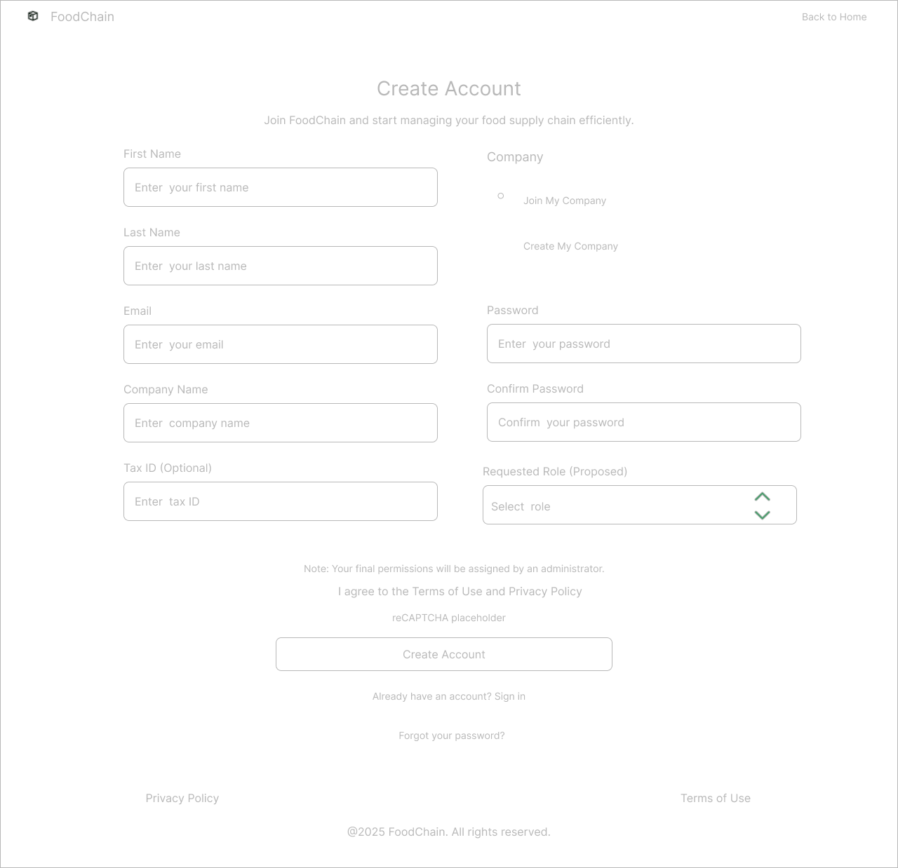

Home
 
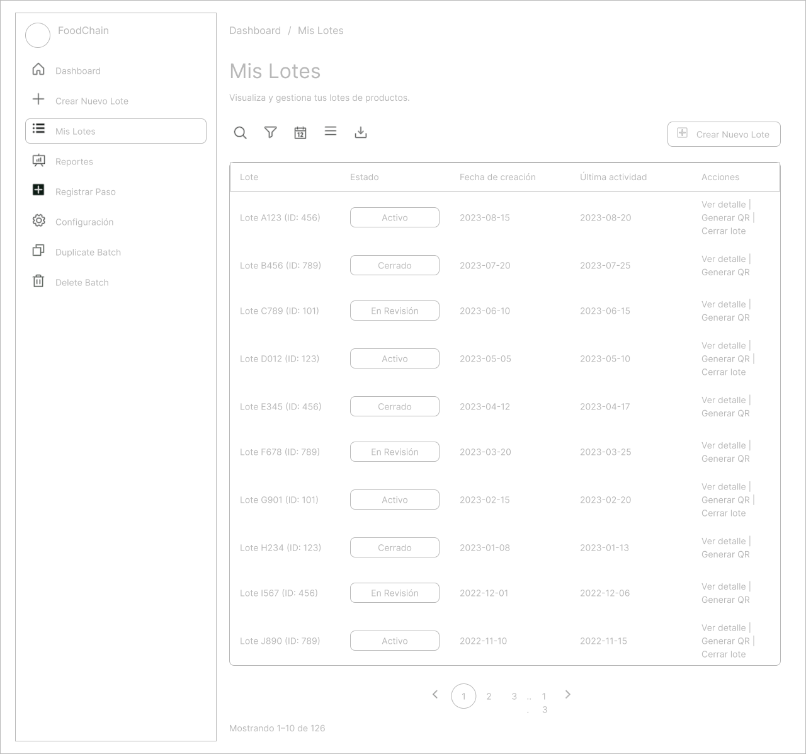

Register role
 

Register Step
 
.png)

Lot Detail
 

- Mobile Application Wireframes

Home
 
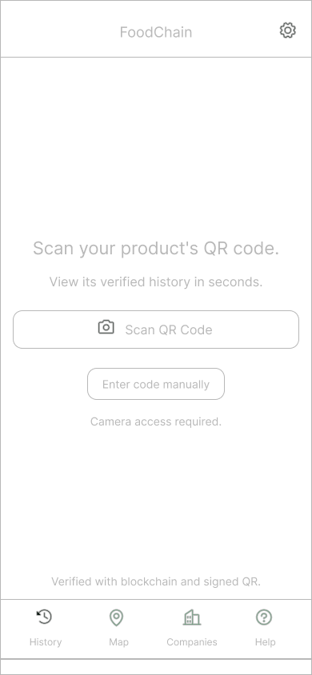

Timeline
 
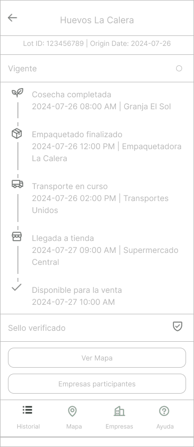

Featuring Companies
 

Company detail
 
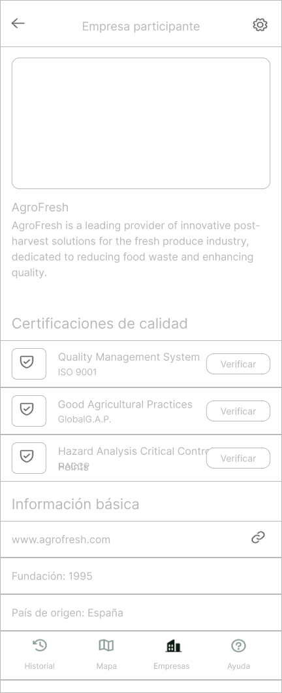

Lot Route
 
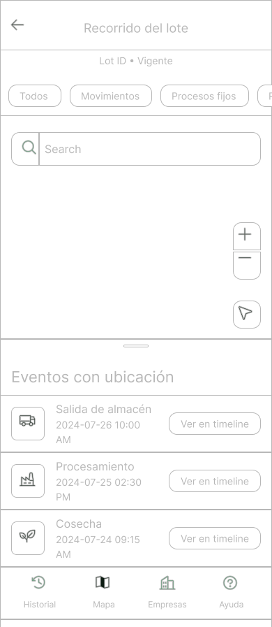

Blockchain Verification
 
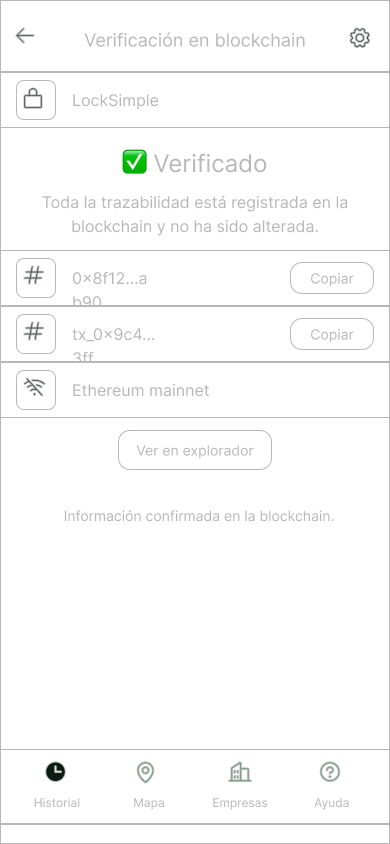

#### 6.4.2 Applications Wireflow Diagrams
Los wireflows fusionan wireframes con diagramas de flujo para representar la forma en que los usuarios navegan e interactúan con la aplicación a través de múltiples pantallas. Esto facilita la comprensión del trayecto integral del usuario y verifica que los flujos diseñados alineen con los objetivos establecidos para procesos como el acceso al sistema, la administración de grupos, la consulta de gastos y la ejecución de pagos.

- **User Goal: Crear cuenta de usuario**

El usuario accede a la aplicación y, al no tener cuenta, hace clic en "Registrarse". Esto lo redirige a la vista "Sign Up" donde encuentra un formulario para completar sus datos. Una vez llenados los campos requeridos, presiona el botón "Registrarse" y, si el registro es exitoso, el sistema muestra una vista de confirmación o redirige al dashboard principal de la aplicación.

- **User Goal: Restablecer contraseña**

El usuario ha olvidado su contraseña y hace clic en "¿Olvidó su contraseña?" en la pantalla de inicio de sesión. Se le redirige a una vista donde ingresa su correo electrónico para recibir un enlace de restablecimiento. Al hacer clic en el enlace del correo, se le dirige a una vista para ingresar una nueva contraseña. Después de establecer la nueva contraseña, se muestra una confirmación y se le redirige al inicio de sesión.

- **User Goal: Crear lote**

El productor, después de iniciar sesión, accede al dashboard y hace clic en "Crear Lote". Se le presenta un formulario con campos obligatorios (nombre, finca, fecha de cosecha, variedad). Al completar el formulario y hacer clic en "Crear Lote", el sistema valida los datos. Si son correctos, se crea el lote y se redirige al productor a la página de detalle del lote con un mensaje de confirmación.

- **User Goal: Cerrar lote**

El productor selecciona un lote activo y hace clic en "Cerrar Lote". El sistema verifica que el lote esté en estado activo y muestra una confirmación. Al confirmar, el lote cambia a estado "Cerrado" y se registra un evento en la blockchain. Si el lote ya está cerrado, se muestra un error.

- **User Goal: Generar QR para lote**

El productor selecciona un lote existente y hace clic en "Generar QR". El sistema genera un código QR único para ese lote y muestra una vista previa. El productor tiene opciones para descargar o imprimir el código QR.

- **User Goal: Registrar paso**

Un actor (productor, transportista, etc.) inicia sesión y selecciona un lote activo. Luego, hace clic en "Registrar Paso". Se le presenta un formulario con campos específicos según su rol (tipo de paso, fecha, hora, ubicación GPS automática, etc.). Al completar el formulario y hacer clic en "Registrar Paso", el sistema valida la información y registra el paso en la blockchain. Se muestra una confirmación con el ID del evento y el hash de la transacción.

- **User Goal: Escanear QR**

El consumidor abre la aplicación y activa el escáner de QR. Enfoca el código QR del producto con la cámara y el sistema lo reconoce automáticamente. Inmediatamente se muestra el historial completo de trazabilidad del lote, incluyendo: fecha y hora de cada paso del proceso, empresas participantes en la cadena de suministro, ubicaciones verificadas con GPS, certificaciones de calidad, mapa interactivo del recorrido, sellos de verificación en blockchain.El usuario puede navegar por la línea de tiempo, ver detalles de cada evento y verificar la autenticidad de la información mediante los hashes de blockchain.

#### 6.4.3 Applications Mock-ups

La sección de mock-ups de la aplicación FoodChain muestra las pantallas clave diseñadas para el usuario consumidor, destacando una interfaz limpia, intuitiva y centrada en la transparencia alimentaria. Se ilustran los flujos de escaneo del código QR, la visualización del historial de trazabilidad y la ficha detallada del producto, donde se evidencia el compromiso del sistema con la confianza y la sostenibilidad. Asimismo, se incluyen los mock-ups del sitio web, que mantienen la misma coherencia visual y funcional, permitiendo al usuario consultar la trazabilidad y acceder a la información del producto desde cualquier navegador con una experiencia igual de clara y accesible.

### **Mobile App – Mock-ups**

##### Home
Pantalla principal que permite al usuario escanear el código QR del producto para iniciar la verificación de su trazabilidad. Presenta un diseño minimalista, con versión clara y oscura, centrado en la acción principal.

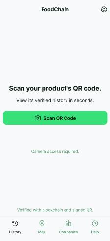

##### Validation
Flujo de validación del código donde se confirma la conexión y autenticidad de los datos registrados. El usuario visualiza el progreso en tiempo real de forma segura y transparente.

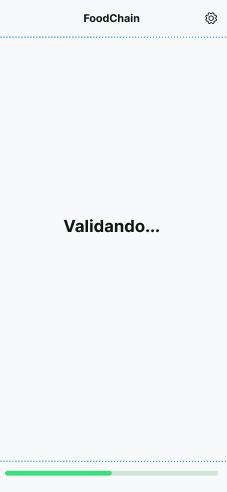

##### Timeline
Vista cronológica del recorrido del producto, mostrando los eventos desde la cosecha hasta la llegada al punto de venta, con detalle de fechas y estados verificados.

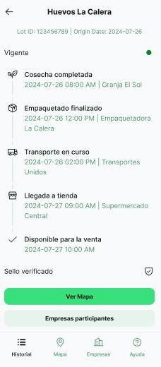

##### Lot Journey
Mapa interactivo que muestra las ubicaciones de los procesos logísticos del lote. Permite visualizar los puntos clave como procesamiento, transporte y almacenamiento.

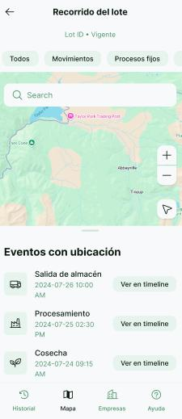

##### Participant Company
Ficha informativa de las empresas involucradas en la cadena, con su logo, certificaciones de calidad y datos de verificación, promoviendo confianza y transparencia.

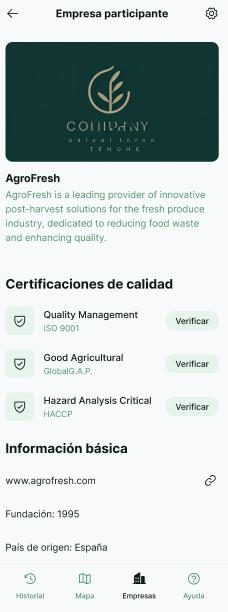

##### Blockchain Verification
Pantalla de verificación en blockchain que muestra los estados de validación del lote: verificado, en proceso o inconsistencia detectada, diferenciados por colores y mensajes claros.

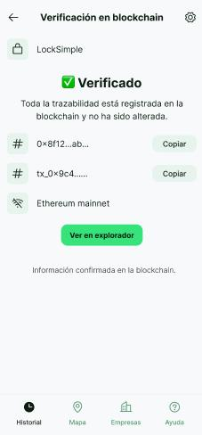

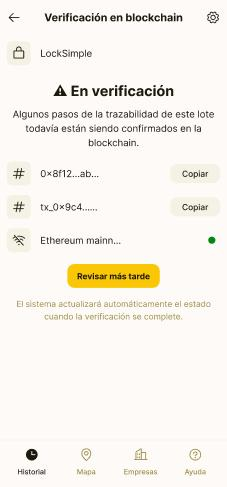

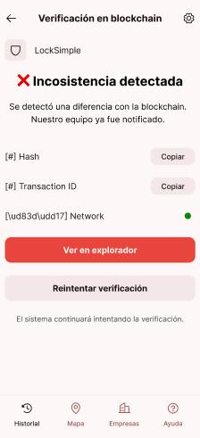

##### Participants List
Lista general de productores, distribuidores y exportadores certificados dentro del ecosistema FoodChain, con acceso a sus registros de trazabilidad y verificación.

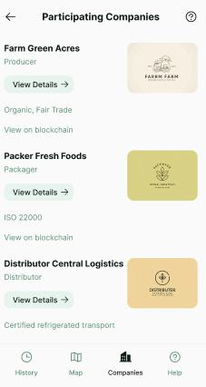

### **Sitio Web – Mock-ups**

Los mock-ups del sitio web de FoodChain muestran la versión web equivalente de las principales funcionalidades presentes en la aplicación móvil, manteniendo coherencia visual, diseño centrado en la transparencia alimentaria y una experiencia accesible desde cualquier navegador. El usuario puede consultar la trazabilidad del producto, revisar los eventos del historial, validar información y acceder a los detalles del lote con la misma claridad, estructura y enfoque de confianza que en la aplicación móvil.

### Sign In – FoodChain

Pantalla de inicio de sesión donde el usuario ingresa su correo y contraseña para acceder. Incluye opción de mostrar la clave, recuperar contraseña y crear una nueva cuenta. Diseño minimalista y centrado en autenticación.

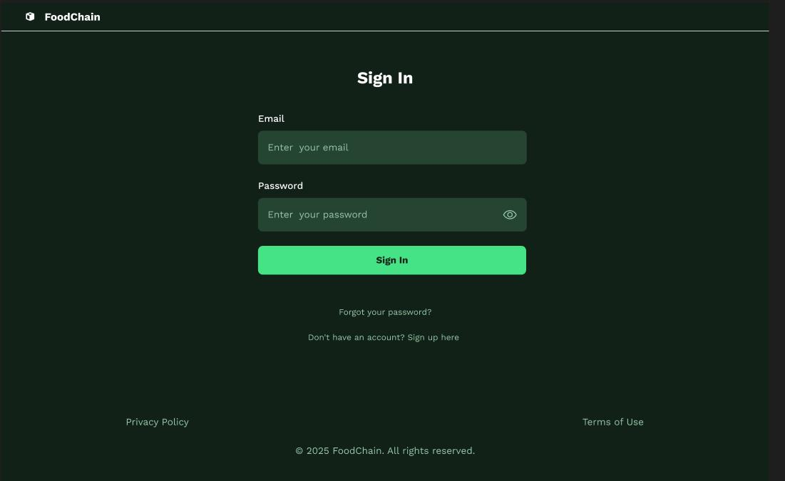

### Create Account – FoodChain

Pantalla de registro donde el usuario crea su cuenta ingresando datos personales y de empresa. Permite elegir si se unirá a una compañía existente o creará una nueva. Incluye validación de contraseña, selección de rol propuesto, aceptación de términos y verificación reCAPTCHA.

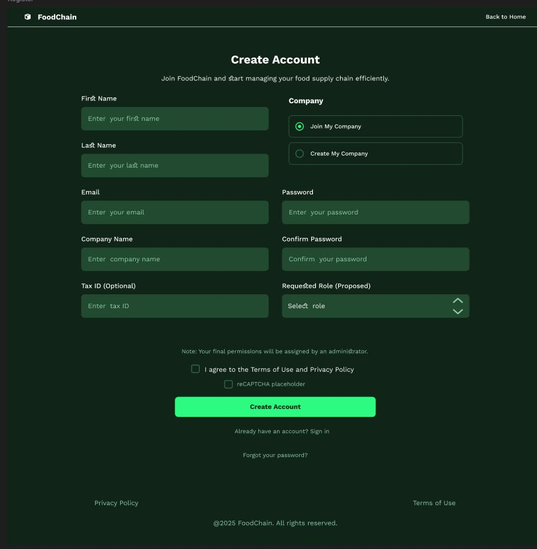

### Create New Lot – FoodChain

Pantalla para registrar un nuevo lote de producto. Permite ingresar nombre del lote, nombre de la granja, variedad, fecha de cosecha y una descripción opcional. Incluye la opción de subir una imagen y finalizar el registro mediante el botón “Create Lot”.

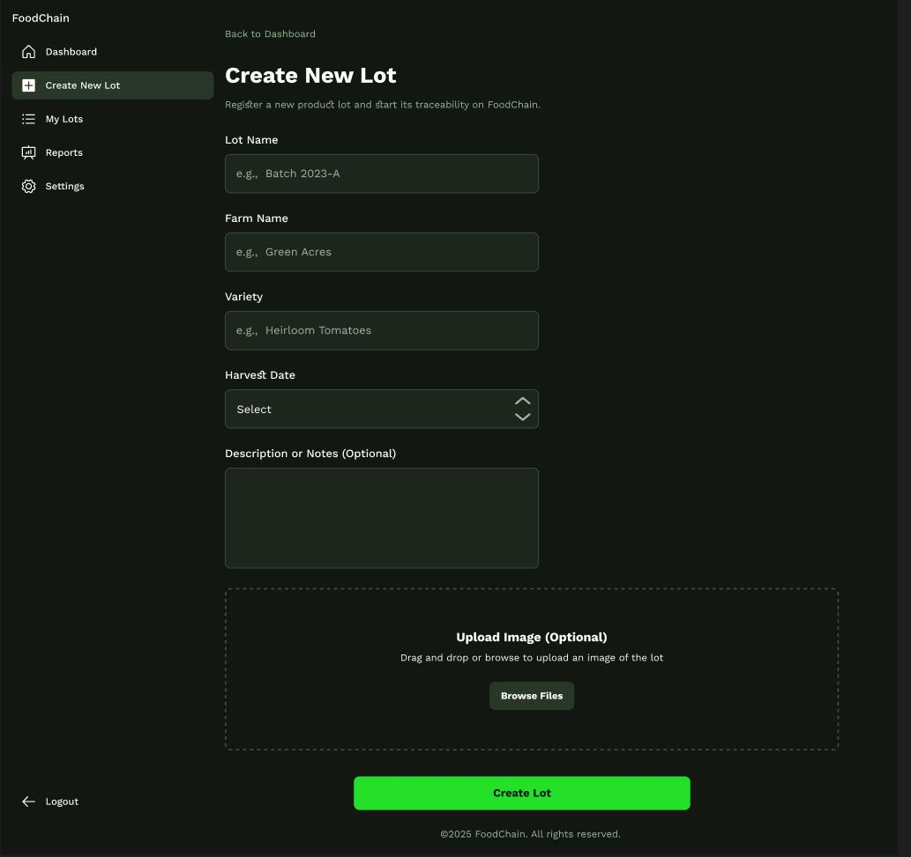

### Lot Detail – FoodChain

Pantalla que muestra los detalles completos de un lote específico. Incluye información de la granja, variedad, fecha de cosecha, estado y una imagen del producto. Permite generar y gestionar códigos QR para su trazabilidad e incluye un historial de versiones generadas.

### Detalle del Lote – FoodChain

Pantalla que muestra la información completa del lote seleccionado, incluyendo su ID, imagen, estado y un historial de eventos registrados. Desde aquí se puede cerrar el lote y visualizar todas las etapas realizadas, como creación, cosecha y empaquetado.

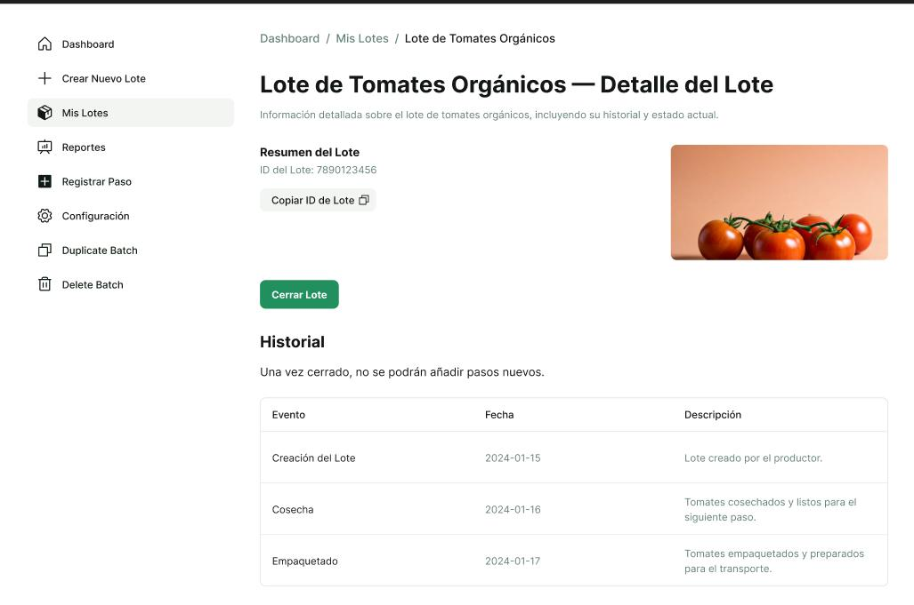

### Editar información de lote – FoodChain

Pantalla para actualizar los datos principales de un lote activo. Permite modificar nombre del lote, finca, variedad, fecha de cosecha y añadir notas. También ofrece la opción de subir una imagen representativa y guardar los cambios registrados en blockchain.

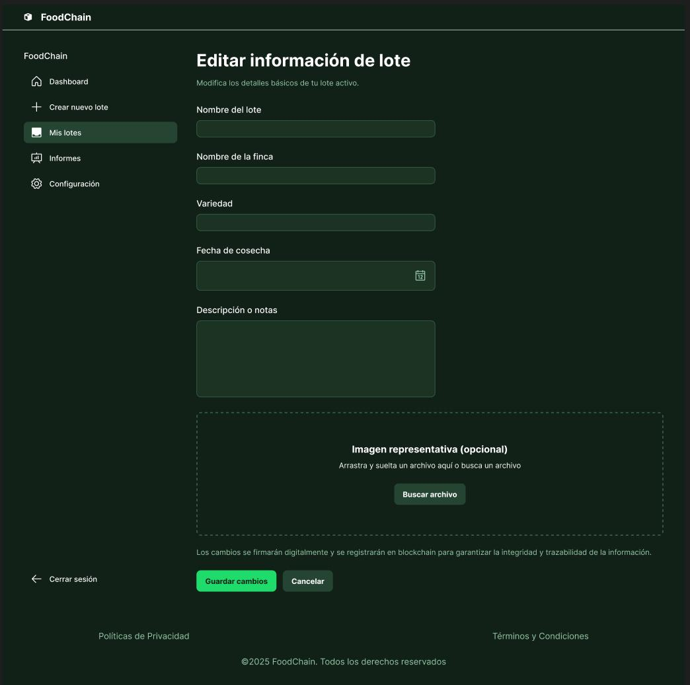

### Duplicar Lote – FoodChain

Pantalla que muestra una lista de lotes existentes para seleccionar y duplicar. Cada tarjeta presenta la información esencial del lote —fecha de creación, variedad, finca y estado— junto con una imagen representativa y un botón para crear una copia rápida del lote elegido.

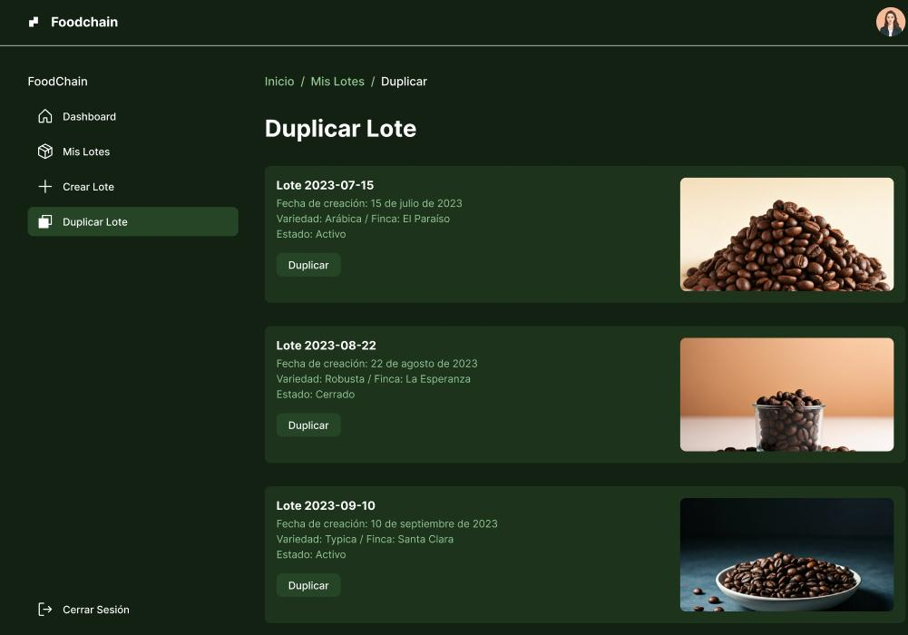

### Eliminar Lote – FoodChain

Pantalla que muestra todos los lotes disponibles para eliminación. Incluye información clave como fecha de creación, variedad, finca y estado. Permite eliminar lotes sin pasos registrados y bloquea aquellos que tienen historial asociado, mostrando un aviso correspondiente.

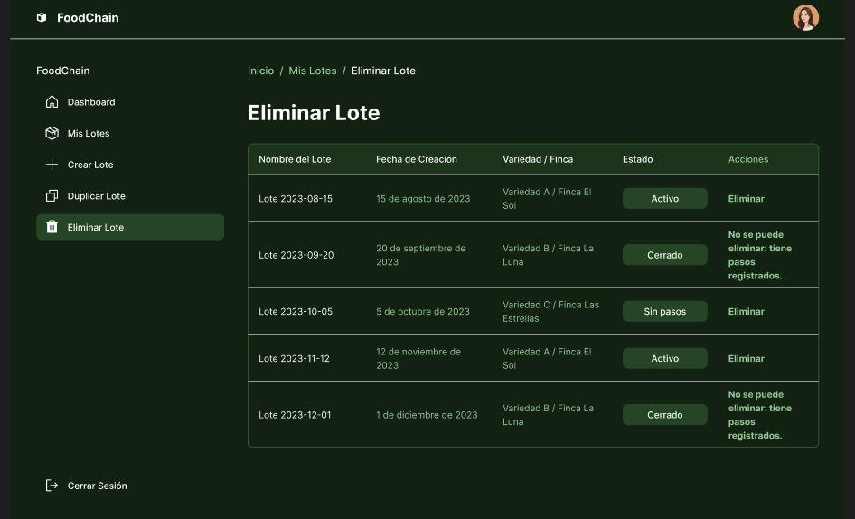

### Lot History – FoodChain

Pantalla que muestra el historial completo de un lote, organizado por línea de tiempo, actor o fase. Permite filtrar por fases, actores y ubicaciones. Incluye los eventos clave del lote, como cosecha, procesamiento y envío, junto con la información del responsable y la ubicación de cada acción.

### Dashboard Administrador – FoodChain

Pantalla principal de administración que resume la actividad del sistema en tiempo real. Muestra métricas clave como lotes activos, pasos registrados, usuarios en línea y verificaciones blockchain. Incluye filtros por rango de tiempo, actividad por fase, estado global de los lotes y una tabla con los eventos más recientes.

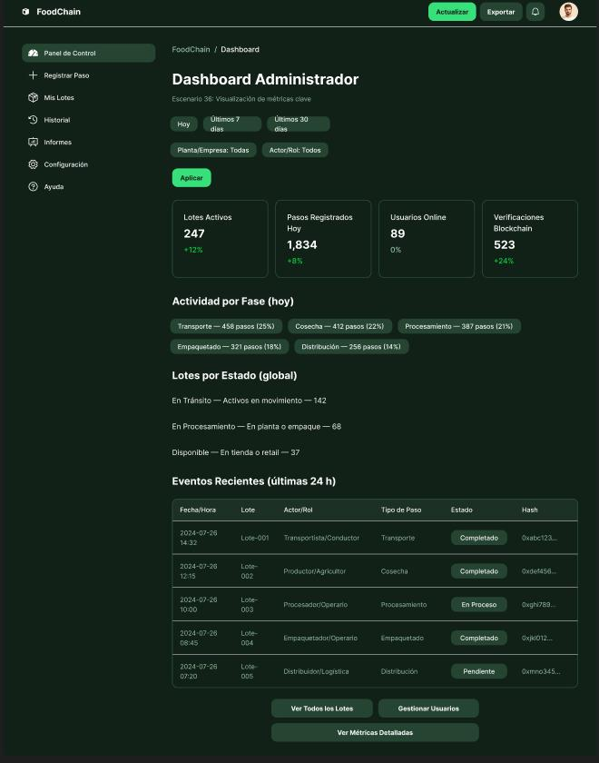

#### 6.4.4 Applications User Flow Diagrams
User Flow es una representación gráfica que representa el camino completo que sigue un usuario para completar una tarea específica en una aplicación o sitio web.

- **User Goal: Iniciar sesión**

- **User Goal: Crear lote**

- **User Goal: Cerrar lote**

- **User Goal: Registrar paso**

- **User Goal: Escanear QR**

### 6.5 Applications Prototyping  

- **Prototype Web Application**

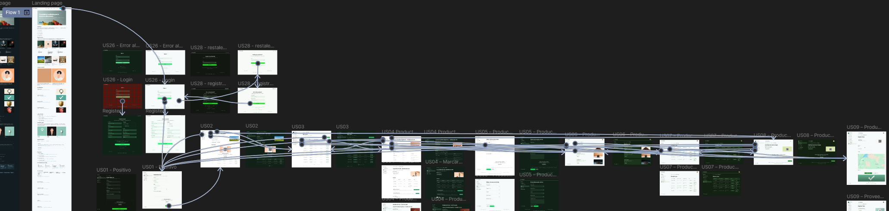

- **Prototype Mobile Application**

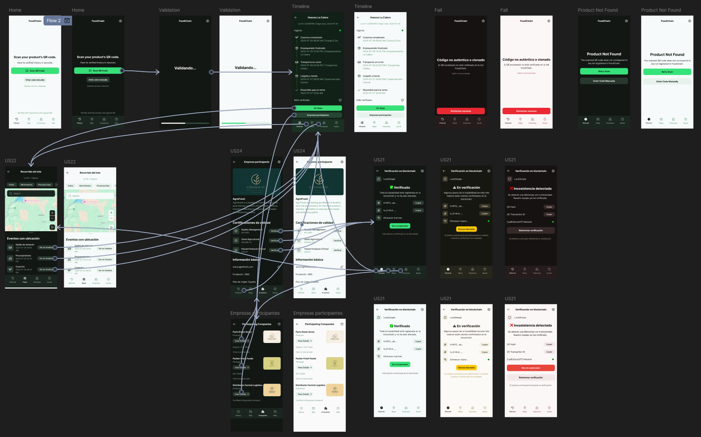

