# Capítulo VII: Product Implementation, Validation & Deployment

## 7.1. Software Configuration Management

En este apartado se detalla la configuración completa del entorno de desarrollo, las herramientas utilizadas y los servicios empleados durante el ciclo de vida del proyecto **FoodChain**, incluyendo gestión, diseño, desarrollo, control de versiones y despliegue en la nube.

### 7.1.1. Software Development Environment Configuration

| Herramienta              | Categoría                              | Descripción                                                                                                  | Enlace                                                     |
|--------------------------|----------------------------------------|--------------------------------------------------------------------------------------------------------------|------------------------------------------------------------|
| Trello                   | Project Management                     | Herramienta utilizada para gestionar tareas, organizar actividades y controlar el avance del proyecto.     | https://trello.com                                         |
| UXPressia                | Product UX/UI Design                   | Plataforma empleada para crear user personas, journey maps y escenarios funcionales.                        | https://uxpressia.com                                      |
| Miro                     | Product UX/UI Design                   | Herramienta colaborativa para diagramación, flujos de procesos y reuniones técnicas.                         | https://miro.com                                           |
| Figma                    | Product UX/UI Design                   | Utilizada para diseñar wireframes, mockups, prototipos y pantallas del ecosistema FoodChain.                 | https://figma.com                                          |
| IntelliJ IDEA            | Software Development (IDE)             | IDE usado para desarrollar microservicios backend en Java y Spring Boot.                                    | https://www.jetbrains.com/idea                              |
| WebStorm                 | Software Development (IDE)             | IDE especializado para desarrollo frontend en Angular.                                                       | https://www.jetbrains.com/webstorm                          |
| Visual Studio Code       | Software Development (IDE)             | Editor de código liviano empleado para scripts, ajustes rápidos y edición auxiliar del proyecto.             | https://code.visualstudio.com                              |
| MySQL                    | Database Management                    | Sistema de gestión de bases de datos utilizado para almacenar información de lotes y trazabilidad.            | https://www.mysql.com                                     |
| Angular                  | Frontend Framework                     | Framework SPA basado en TypeScript utilizado para la aplicación de verificación y visualización QR.          | https://angular.dev                                        |
| Spring Boot              | Backend Framework                      | Framework backend usado para construir microservicios REST del sistema FoodChain.                             | https://spring.io/projects/spring-boot                      |
| GitHub                   | Version Control                        | Plataforma de control de versiones donde residen los repositorios del proyecto.                              | https://github.com                                         |
| Azure App Service        | Deployment Platform (Backend)          | Plataforma cloud usada para desplegar y ejecutar los microservicios backend de FoodChain.                    | https://azure.microsoft.com/en-us/products/app-service      |
| Azure Static Web Apps    | Deployment Platform (Frontend)         | Servicio utilizado para desplegar la aplicación frontend de Angular.                                         | https://azure.microsoft.com/en-us/products/app-service/static |
| Structurizr             | Architecture Modeling                  | Utilizado para modelado C4 del sistema, diagramas de contenedores, componentes y arquitectura.                | https://structurizr.com                                    |

## 7.1.2. Source Code Management.

Para la gestión del código fuente del proyecto **FoodChain**, se utiliza la plataforma GitHub, donde se ha organizado una colección de repositorios independientes que representan cada módulo del ecosistema. Esta separación permite mantener un versionamiento claro, un desarrollo desacoplado y un control preciso sobre cada parte del sistema.

### Repositorios del Proyecto FoodChain

- **Repositorio Backend:** https://github.com/G2-UPC-2520-7306-Emergentes/Backend  
  Contiene los microservicios desarrollados con Spring Boot, la lógica de negocio, controladores, modelos, eventos de dominio y configuración de despliegue backend.

- **Repositorio Frontend (Web):** https://github.com/G2-UPC-2520-7306-Emergentes/Frontend  
  Incluye la aplicación Angular utilizada por los usuarios para validar los lotes mediante QR y visualizar la trazabilidad del producto.

- **Repositorio de la Aplicación Móvil:** https://github.com/G2-UPC-2520-7306-Emergentes/Mobile  
  Contiene la implementación de la app móvil de FoodChain, enfocada en la experiencia del consumidor, escaneo de códigos y visualización rápida del recorrido del producto.

- **Repositorio del Reporte:** https://github.com/G2-UPC-2520-7306-Emergentes/Report  
  Repositorio utilizado para almacenar toda la documentación académica y técnica del proyecto, incluyendo los capítulos, diagramas, plantillas y anexos.

- **Repositorio de la Landing Page:** https://github.com/G2-UPC-2520-7306-Emergentes/New-Landing-Page  
  Contiene la página informativa de FoodChain, enfocada en comunicar la propuesta del sistema, el caso de uso y los beneficios para empresas y consumidores.


### Estrategia de Ramas

Para organizar el flujo de trabajo se emplea la estrategia **GitFlow**, adaptada a las necesidades del proyecto:

- **main**  
  Mantiene la versión estable de FoodChain lista para ser desplegada en producción.

- **develop**  
  Contiene la versión en desarrollo donde se integran las funcionalidades antes de ser validadas y preparadas para su liberación.

- **feature/\***  
  Ramas creadas para implementar nuevas funcionalidades específicas. Deben usar nombres claros y concisos que describan el cambio (por ejemplo: `feature/qr-decoder`, `feature/event-handler`).

- **release/\***  
  Usadas para preparar nuevas versiones del sistema antes de su despliegue final.

- **hotfix/\***  
  Ramas destinadas a resolver errores críticos sin interrumpir el flujo de desarrollo.


### Convenciones de Mensajes de Commit

Se aplican los lineamientos de **Conventional Commits** para mantener un historial claro y estructurado.  
Ejemplos comunes usados en FoodChain:

- `feat:` incorporación de una nueva funcionalidad
- `fix:` corrección de errores
- `refactor:` mejoras internas sin cambios funcionales
- `docs:` actualización de documentación
- `chore:` tareas auxiliares del proyecto

Estas convenciones permiten rastrear con precisión el tipo de cambio realizado y facilitan la generación de versiones.

## 7.1.3. Source Code Style Guide & Conventions

Con el objetivo de mantener la calidad del código, la cohesión entre equipos y la mantenibilidad de los servicios que conforman el ecosistema FoodChain, se definieron lineamientos de estilo y convenciones aplicadas a todos los módulos: backend (Spring Boot), frontend (Angular), mobile, infraestructura y documentación técnica.  
Estas normas buscan asegurar consistencia en la escritura, claridad en el comportamiento del sistema y un flujo de desarrollo uniforme.


## 1. Convenciones para archivos Gherkin (*.feature)

### Descripción
Los archivos *.feature se utilizan para describir escenarios de comportamiento del sistema bajo el enfoque BDD (Behavior-Driven Development). Esto permite que tanto desarrolladores como stakeholders no técnicos puedan comprender cómo debe responder FoodChain ante cada caso funcional.

### Lineamientos
- Cada archivo debe enfocarse en **una sola característica**, como:  
  *Validación de lote*, *Registro de empresa*, *Visualización del timeline*, etc.
- Los escenarios siguen la estructura:  
  **Feature → Background (opcional) → Scenario → Given/When/Then**.
- Los pasos deben describir acciones reales del usuario o del sistema.
- Evitar pasos innecesarios como “And And And”.  
  Priorizar claridad sobre cantidad.
- Las tablas solo deben emplearse para representar múltiples datos (ej: estados del lote en timeline).
- Incluir comentarios únicamente si aportan contexto del flujo.


## 2. HTML (*.html)

### Descripción
El HTML define la estructura visual del frontend de FoodChain, usado en screens como: *Home*, *Validation*, *Timeline*, *Journey Map* y *Company Details*.

### Lineamientos
- Archivos en **minúsculas** y con guiones (ej: `timeline-section.component.html`).
- Mantener una estructura semántica clara (<header>, <section>, <article>, etc.).
- Los atributos deben estar ordenados y correctamente cerrados.
- Limitación de anidación: máximo 4 niveles para evitar estructuras complejas.
- Los comentarios deben describir bloques, no estilos visuales.


## 3. CSS (*.css)

### Descripción
Define la identidad visual del verificador FoodChain, estilos de mapa, tarjetas, modales, estados y componentes generales.

### Lineamientos
- Nombres de clase en **kebab-case** (ej: `.lot-card-header`).
- Orden recomendado:  
  **display → layout → spacing → typography → colors → animations**.
- Agrupar propiedades relacionadas para mejorar lectura.
- Evitar duplicación creando estilos globales reutilizables.
- Utilizar variables de color centralizadas (ej: `--primary-green`, `--trace-line`).


## 4. JavaScript (*.js)

### Descripción
Utilizado en funciones auxiliares, scripts de integración y utilidades generales.

### Lineamientos
- Usar **camelCase** para funciones y variables.
- Limitar funciones a una sola responsabilidad.
- Evitar código imperativo confuso; preferir funciones puras cuando sea posible.
- No usar variables globales.
- Documentar funciones con propósito claro mediante comentarios cortos.


## 5. TypeScript (*.ts)

### Descripción
Lenguaje principal del frontend Angular, donde se construyen servicios de comunicación, componentes y modelos del sistema.

### Lineamientos
- Clases e interfaces en **PascalCase**: `LotService`, `TraceabilityModel`.
- Variables y métodos en **camelCase**.
- Tipado explícito obligatorio en parámetros y retornos.
- Separación estricta:  
  **services / components / models / utils / interceptors**.
- Evitar lógica pesada en componentes; delegarla a servicios reutilizables.
- Decoradores ubicados en el orden recomendado de Angular.


## 6. Angular

### Descripción
Framework elegido para la aplicación web pública de FoodChain.

### Lineamientos
- Nombres de archivos con guiones: `lot-details.component.ts`.
- Estructura modular por dominio:  
  `traceability`, `lot`, `company`, `auth`.
- Directivas y pipes en carpetas dedicadas.
- Uso obligatorio de servicios para comunicación HTTP.
- Guards para rutas críticas (verificación, detalles del lote).
- Mantener standalone components donde sea conveniente.


## 7. Java (*.java)

### Descripción
Lenguaje utilizado en los microservicios de backend, incluyendo Identity, Lot Management, Traceability y Notifications.

### Convenciones de nomenclatura
- **Clases e interfaces:** PascalCase
- **Métodos y atributos:** camelCase
- **Constantes:** MAYÚSCULAS_CON_GUIONES
- **Paquetes:** minúsculas sin guiones (ej: `com.foodchain.traceability`)

### Convenciones de formato
- Máximo 100 caracteres por línea.
- Dejar líneas en blanco entre bloques lógicos.
- Comentarios breves que expliquen intención, no implementación.
- Evitar comentarios redundantes (ej: “// getter”).


## 8. Spring Boot

### Descripción
Framework principal utilizado para implementar APIs, eventos, servicios y lógica de negocio.

### Lineamientos
- Colocar anotaciones en el orden correcto:  
  `@RestController`, `@Service`, `@Repository`, `@Entity`.
- Estructura por dominio:  
  `controller`, `service`, `repository`, `event`, `exception`, `config`.
- Manejo centralizado de excepciones mediante `@RestControllerAdvice`.
- Validación vía `@Valid` + `@NotNull`, `@Email`, etc.
- Inyección de dependencias vía constructor (+ Lombok opcional).
- DTOs separados del dominio para evitar acoplamiento con la base de datos.


## 9. Git & Convenciones de Commits

### Descripción
El historial de cambios del proyecto se mantiene ordenado y semántico mediante **Conventional Commits**, facilitando revisiones y despliegues.

### Lineamientos
- Formato obligatorio:
  `tipo(alcance): mensaje`
- Tipos principales usados en FoodChain:
    - `feat:` nueva funcionalidad
    - `fix:` corrección de errores
    - `refactor:` mejora interna
    - `docs:` cambios en documentación
    - `chore:` tareas auxiliares
    - `test:` casos de prueba
- Evitar mensajes genéricos como “update”.
- Realizar commits pequeños y frecuentes.
- Mantener un estilo consistente en inglés o español.


## 7.1.4. Software Deployment Configuration.

En esta sección, se detalla la configuración de despliegue del software para la solución FoodChain, alineada con las arquitecturas definidas en capítulos anteriores (e.g., C4 diagrams y deployment diagrams en Capítulo 4). Dado que el proyecto se encuentra en una fase inicial de implementación (MVP), los despliegues son parciales: la landing page está desplegada en producción vía GitHub Pages, el frontend web en Vercel (aunque en una versión desactualizada), mientras que el backend y la aplicación móvil se ejecutan localmente en entornos de desarrollo. Se describen las configuraciones actuales, los pasos para replicarlas, y planes para despliegues completos en entornos cloud (e.g., AWS, Heroku o Firebase) para integrar todos los componentes. Esto asegura escalabilidad, seguridad y CI/CD, considerando los bounded contexts (e.g., User Management, Lot Management) del Domain-Driven Design.

Se incluyen diagramas de despliegue (refinados de Capítulo 4), configuraciones clave (e.g., archivos de build y environment variables), y recomendaciones para producción, basadas en las tecnologías usadas: Angular para frontend, Node.js/Express para backend, Flutter para móvil, y HTML/CSS/JS estático para landing page.

### 1. Descripción General de la Configuración de Despliegue

- **Entorno Actual**:
    - **Producción Parcial**: Landing page en GitHub Pages (estático, accesible públicamente). Frontend en Vercel (desactualizado, solo con funcionalidades básicas como login, crear lote, registrar paso).
    - **Desarrollo Local**: Backend y móvil en localhost, con dependencias resueltas vía npm/yarn para backend y pub para Flutter en móvil.
- **Estrategia de Despliegue**: Se utiliza un enfoque híbrido: static hosting para componentes frontend/langing, y serverless/local para backend/móvil. Para integración completa, se propone CI/CD con GitHub Actions para automatizar builds y deploys.
- **Requisitos Comunes**:
    - **Dependencias**: Node.js v18+ para frontend/backend, Angular CLI v18 para frontend, Flutter SDK v3.13+ para móvil.
    - **Environment Variables**: Definidas en archivos `.env` (no commiteados por seguridad). Ejemplos: `API_URL` para conexión frontend-backend, `JWT_SECRET` para autenticación en backend.
    - **Seguridad**: HTTPS enforced en hosts cloud; hashing de contraseñas (bcrypt) en backend; roles gestionados vía JWT.
- **Planes para Despliegue Completo**: Migrar backend a Azure/Virtual Machine para escalabilidad, móvil a Firebase/App Stores, e integrar con API Gateway para bounded contexts. Usar Docker para containerización en todos los componentes.

### 2. Configuración por Componente

### 2.1 Landing Page (Estático, Desplegado en GitHub Pages)

- **Tecnologías**: HTML5, CSS3, JavaScript vanilla con GSAP/ScrollTrigger y Lucide Icons vía CDN.
- **Despliegue Actual**: Hosteado en GitHub Pages (URL: https://g2-upc-2520-7306-emergentes.github.io/New-Landing-Page/). Es estático, sin build requerido; GitHub Pages publica la rama `gh-pages` o `main/docs`.
- **Pasos de Configuración**:
    1. Clonar repositorio: `git clone <https://github.com/G2-UPC-2520-7306-Emergentes/New-Landing-Page`>.
    2. Configurar GitHub Pages en settings del repo: Seleccionar rama `main` y carpeta `/docs` como source.
    3. Push cambios: `git push origin main` – GitHub auto-despliega.
- **Ejecución Local (para testing)**:
    - Abrir `docs/html/index.html` directamente en navegador.
    - O usar servidor local: `python -m http.server 8000` (acceder a http://localhost:8000/docs/html/).
- **Variables de Entorno**: Ninguna requerida (estático).
- **CI/CD**: No implementado; sugerencia: GitHub Actions workflow para validar HTML/CSS en pushes.
- **Notas**: Totalmente actualizado y accesible. No depende de npm; dependencias vía CDN para simplicidad.

### 2.2 Frontend Web (Angular, Desplegado en Vercel – Desactualizado)

- **Tecnologías**: Angular v18, con dependencias como @angular/material, rxjs, jwt-decode.
- **Despliegue Actual**: En Vercel (URL: https://frontend15-steel.vercel.app/login). Versión desactualizada (solo login básico; no integra backend completo ni API de mapas). Vercel auto-detecta Angular y build con `ng build`.
- **Pasos de Configuración**:
    1. Clonar repositorio: `git clone <https://github.com/G2-UPC-2520-7306-Emergentes/Frontend`>.
    2. Instalar dependencias: `npm install` (o `yarn install`).
    3. Configurar `.env`: Agregar `VITE_API_URL=http://localhost:3000/api` (para dev; cambiar a producción backend URL).
    4. Build: `ng build --configuration production` (genera `/dist` optimizado).
    5. Desplegar en Vercel: Conectar repo a Vercel dashboard, set build command a `ng build`, output directory a `dist/foodchain-frontend/browser`. Vercel maneja HTTPS y CDN.
- **Ejecución Local**: `ng serve` (accede a [http://localhost:4200](http://localhost:4200/)). Para testing: `ng test`.
- **Variables de Entorno**: Usar Vite config en `vite.config.ts` para inyectar env vars (e.g., `API_KEY` para mapas pendientes).
- **CI/CD**: No configurado; sugerencia: Agregar `vercel.json` con redirects si needed, y GitHub Actions para build/deploy on push.
- **Notas**: Actualizar despliegue con integración backend (e.g., endpoints para US01-US31). Versión actual limitada a auth básica.

### 2.3 Backend (Node.js/Express, Local en Localhost)

- **Tecnologías**: Node.js v20, Express, MongoDB/Mongoose, JWT, bcrypt. Dependencias en `package.json`: express, mongoose, jsonwebtoken, etc.
- **Despliegue Actual**: Solo local ([http://localhost:3000](http://localhost:3000/)). No desplegado en cloud aún.
- **Pasos de Configuración para Despliegue**:
    1. Clonar repositorio: `git clone <https://github.com/G2-UPC-2520-7306-Emergentes/Backend`>.
    2. Instalar dependencias: `npm install`.
    3. Configurar `.env`: `PORT=3000`, `MONGO_URI=mongodb://localhost/foodchain`, `JWT_SECRET=secretkey` (cambiar en prod a MongoDB Atlas).
    4. Ejecutar local: `npm start` o `node server.js`.
    5. Para producción: Usar Heroku – Crear app en Heroku, add Procfile con `web: node server.js`, set env vars en dashboard, deploy via `git push heroku main`.
        - Alternativa: Dockerizar – Crear `Dockerfile`:
          Build: `docker build -t foodchain-backend .`, run: `docker run -p 3000:3000 -e MONGO_URI=... foodchain-backend`.

            ```
            FROM node:20-alpine
            WORKDIR /app
            COPY . .
            RUN npm install
            CMD ["node", "server.js"]
            
            ```

- **Variables de Entorno**: Críticas para DB conexión y secrets; usar dotenv.
- **CI/CD**: No implementado; sugerencia: GitHub Actions con workflow para test/build/deploy a Heroku.
- **Notas**: Integra con frontend vía API endpoints (e.g., /auth/login para US28). Para full deploy, conectar a DB cloud como MongoDB Atlas.

### 2.4 Aplicación Móvil (Flutter, Local en Emulador/Localhost)

- **Tecnologías**: Flutter v3.13, con paquetes como http, provider, shared_preferences.
- **Despliegue Actual**: Solo local (emulador Android/iOS o dispositivo físico). No publicado en stores.
- **Pasos de Configuración para Despliegue**:
    1. Clonar repositorio: `git clone <https://github.com/G2-UPC-2520-7306-Emergentes/Mobile`>.
    2. Instalar dependencias: `flutter pub get`.
    3. Configurar `lib/config.dart` o `.env` para API URLs (e.g., backend endpoint).
    4. Ejecutar local: `flutter run` (elige dispositivo/emulador).
    5. Para producción: Build APK: `flutter build apk --release` (para Android). Para iOS: `flutter build ios --release`.
        - Publicar: Usar Firebase App Distribution para beta, o Google Play/App Store para prod. Configurar Firebase para auth/push notifications.
        - Docker no aplica directamente; usar CI para builds.
- **Variables de Entorno**: Manejar con flutter_dotenv o constants en código.
- **CI/CD**: No configurado; sugerencia: GitHub Actions con fastlane para automatizar builds y distribución.
- **Notas**: Integra con backend para flujos como visualización de lotes (US03). Pendiente integración de mapas (e.g., google_maps_flutter).

## 7.2. Solution Implementation

En esta sección se describe cómo se implementó técnicamente la solución FoodChain durante los sprints de desarrollo. Se detallan los avances realizados, las funcionalidades construidas y los componentes que dieron forma al MVP inicial.

### 7.2.1. Sprint 1

El Sprint 1 se centró en establecer la base funcional del sistema, implementando los módulos esenciales de gestión de usuarios y administración inicial de lotes. Durante este ciclo se construyeron las primeras APIs, las vistas principales del frontend y los mecanismos de autenticación y seguridad necesarios para habilitar el uso inicial del sistema.

#### 7.2.1.1. Sprint Planning 1.

| Campo                             | Detalle |
|-----------------------------------|---------|
| **Sprint #**                      | Sprint 1 |
| **Sprint Planning Background**    |  |
| Date                              | 29/10/2025 |
| Time                              | 19:00-21:00 |
| Location                          | Discord |
| Prepared By                       | Juan Pescorán |
| Attendees (to planning meeting)   | - Brenda Gamio<br>- Diego Soto<br>- Gustavo Huanca<br>- Marcelo |
| **Sprint 0 Review Summary**       | Durante el Sprint 0, se configuró el entorno de desarrollo, se delinearon los objetivos principales del MVP y se determinaron los componentes esenciales del sistema. Además, se avanzó en los mockups, la página de inicio y se planificaron los primeros avances en el frontend. |
| **Sprint 0 Retrospective Summary**| Durante el sprint, la ausencia de un backend funcional y la falta de integración con el frontend limitaron significativamente nuestro avance en las funcionalidades clave. Además, en el lado del frontend, se identificó la necesidad de incorporar una API de mapas para visualizar de manera efectiva la ubicación de los usuarios que registran sus pasos, lo que enriquecerá la experiencia interactiva de la aplicación. |
| **Sprint Goal & User Stories**    |  |
| Sprint Goal 1                     | Implementar las funcionalidades básicas de gestión de usuarios y lotes, incluyendo autenticación segura, registro de usuarios con roles, operaciones CRUD en lotes y almacenamiento seguro de contraseñas, para establecer la base del sistema MVP sin integración blockchain. **Métrica de cumplimiento:** Completar el 100% de las user stories asignadas al Sprint 1, con todas las funcionalidades pasando las pruebas unitarias, de integración y deployadas en el entorno de desarrollo, alcanzando un total de **53 story points**. |
| **Sprint 1 Velocity**             | 53 |
| **Sum of Story Points**           | 53 |

#### 7.2.1.2. Sprint Backlog 1.

#### Sprint 1

| User Story ID | User Story Title | Task ID | Task Title | Description | Est. (Hours) | Assigned To | Status |
|---------------|------------------|---------|------------|-------------|--------------|-------------|--------|
| **US25** | Como administrador, quiero gestionar roles de usuarios para controlar accesos | T1 | Definir esquema de roles | Crear tablas para roles y asignaciones (role_id, role_name, user_role_link) | 4 | Juan Pescorán | To-do |
| | | T2 | Implementar API para roles | Endpoints POST/PUT para asignar y actualizar roles | 6 | Angelo Curi | To-do |
| | | T3 | Validación de roles en autenticación | Middleware para verificar roles en rutas protegidas | 3 | Brenda Gamio | To-do |
| **US26** | Como usuario, quiero registrarme con datos básicos | T4 | Formulario de registro (frontend) | UI con inputs de email, contraseña y rol inicial | 5 | Gustavo Huanca | To-do |
| | | T5 | Endpoint de registro (backend) | Validar y almacenar nuevo usuario | 4 | Diego Soto | To-do |
| **US27** | Como usuario, quiero recuperar contraseña olvidada | T6 | Servicio de email para reset | Integrar servicio para enlaces de recuperación | 2 | Juan Pescorán | To-do |
| **US28** | Como usuario, quiero iniciar sesión de forma segura | T7 | Autenticación con JWT | Generar token JWT al login | 5 | Angelo Curi | To-do |
| | | T8 | Validar credenciales | Comparar hash y verificar usuario activo | 4 | Brenda Gamio | To-do |
| | | T9 | Manejo de errores en login | Mostrar mensajes para credenciales inválidas | 3 | Gustavo Huanca | To-do |
| **US29** | Como administrador, quiero listar usuarios registrados | T10 | Endpoint GET lista de usuarios | Retornar usuarios con roles (solo admin) | 3 | Diego Soto | To-do |
| | | T11 | Vista tabla de usuarios | Mostrar datos paginados en frontend | 4 | Juan Pescorán | To-do |
| **US31** | Como usuario, quiero cerrar sesión | T12 | Logout en frontend | Limpiar tokens y redirigir | 2 | Angelo Curi | To-do |
| | | T13 | Invalidar token (backend) | Añadir blacklist para tokens expirados | 3 | Brenda Gamio | To-do |
| **US01** | Como productor, quiero crear un lote de alimentos | T14 | Modelo de lote (BD) | Esquema: lote_id, descripción, fecha_creacion | 5 | Gustavo Huanca | To-do |
| | | T15 | Endpoint POST crear lote | Validar datos y asociar lote a usuario | 6 | Diego Soto | To-do |
| **US03** | Como usuario, quiero leer detalles de un lote | T16 | Endpoint GET por ID | Retornar datos si tiene acceso | 4 | Juan Pescorán | To-do |
| | | T17 | Vista detalles de lote | Mostrar datos en página dedicada | 3 | Angelo Curi | To-do |
| **US05** | Como productor, quiero actualizar un lote | T18 | Endpoint PUT actualizar lote | Validar permisos y actualizar campos | 5 | Brenda Gamio | To-do |
| | | T19 | Formulario de edición | Precargar datos y enviar updates | 4 | Gustavo Huanca | To-do |
| **US06** | Como administrador, quiero eliminar un lote | T20 | Endpoint DELETE lote | Eliminar registro suavemente | 3 | Diego Soto | To-do |
| **US07** | Como usuario, quiero listar mis lotes | T21 | Endpoint GET por usuario | Filtrar lotes según rol y propiedad | 4 | Juan Pescorán | To-do |
| | | T22 | Tabla frontend lotes | Mostrar lista con paginación y filtros | 5 | Angelo Curi | To-do |
| **US08** | Como sistema, quiero almacenar contraseñas de forma segura | T23 | Integrar hashing | Usar bcrypt o argon2 | 3 | Brenda Gamio | To-do |
| | | T24 | Actualizar modelo usuario | Añadir campo password_hash | 2 | Gustavo Huanca | To-do |
| **TS09** | Tarea técnica: pruebas de autenticación | T25 | Tests login/registro | Casos éxito/fallo con JUnit 5 y Mockito | 4 | Diego Soto | To-do |
| | | T26 | Reporte de coverage | Alcanzar mínimo 80% en auth module con JaCoCo | 3 | Juan Pescorán | To-do |
| **TS10** | Tarea técnica: despliegue MVP | T27 | Configurar Docker | Crear dockerfiles y compose | 5 | Angelo Curi | To-do |
| | | T28 | Desplegar en entorno dev | Subir a cloud/local y testear endpoints | 6 | Brenda Gamio | To-do |

#### 7.2.1.3. Development Evidence for Sprint Review.

| Repository | Branch | Commit ID | Commit Message | Committed On |
|-----------|--------|-----------|----------------|--------------|
| Backend | develop | 7277233 | fix: fix dockerization issues and resolve traceability crashes | Nov 14, 2025 |
| Backend | develop | 4b4c5be | fix: fix dockerization issues and resolve traceability crashes | Nov 13, 2025 |
| Backend | develop | eb8d726 | feat(batch): add metric endpoint for batch management | Nov 12, 2025 |
| Backend | develop | 4c5ee8a | fix: add properties dialect to resolve a docker problem | Nov 12, 2025 |
| Backend | develop | a69aa96 | chore: fixed route entrypoint | Nov 12, 2025 |
| Backend | develop | 5a786d4 | feat: consolidate project setup and add .gitignore | Nov 9, 2025 |
| Backend | develop | 305ffa5 | feat: consolidate project setup and add .gitignore | Nov 7, 2025 |
| Backend | develop | c38e13c | fix!: remove all boms and add configuration build | Nov 6, 2025 |
| Backend | develop | 48d7760 | fix!: remove all boms and add configuration build | Nov 6, 2025 |
| Backend | develop | 3831932 | fix!: remove all boms and fix modules order | Nov 6, 2025 |
| Backend | develop | b21158d | feat(traceability): add enterprise information into controller | Nov 6, 2025 |
| Backend | develop | 8db2271 | feat(traceability): add pagination for batch traceability | Nov 5, 2025 |
| Backend | develop | 3e08ee0 | feat(traceability): add visualization of public route | Nov 5, 2025 |
| Backend | develop | e430ff9 | feat: add iam integration with traceability context | Nov 5, 2025 |
| Backend | develop | 48400ca | feat: add implementations for sprint 2 HUs | Nov 5, 2025 |
| Backend | develop | 257b763 | feat: add validations for traceability service implementation | Nov 4, 2025 |
| Backend | develop | a23c0b6 | fix(batch): add component scan to avoid errors | Nov 4, 2025 |
| Backend | develop | 59a97ac | feat: add anti corruption layers | Nov 4, 2025 |
| Backend | develop | e134262 | feat: add file storage to traceability for vouchers | Nov 4, 2025 |
| Backend | develop | 4215af7 | feat: add methods to change batch status | Nov 2, 2025 |
| Backend | develop | 83348d4 | feat: add location capture for registered event | Nov 2, 2025 |
| Backend | develop | 34480b1 | feat: add endpoint to get all users from an enterprise | Nov 2, 2025 |
| Backend | develop | 48e6f8e | feat: implement twilio for email verification | Nov 2, 2025 |
| Backend | develop | fe29958 | feat: add assign role for users endpoint | Nov 1, 2025 |
| Backend | develop | cfb760b | feat: add sign out for identity context | Oct 31, 2025 |
| Backend | develop | f9ec10a | feat: add features to batch management | Oct 31, 2025 |
| Backend | develop | 71eff80 | feat: add shared-infrastructure | Oct 31, 2025 |
| Backend | develop | 1332468 | feat: add blockchain worker smart contracts | Oct 30, 2025 |
| Backend | develop | 04e0c9c | fix: remove BOM utf-8 files | Oct 9, 2025 |
| Backend | develop | 88a1700 | Merge pull request #1 traceability-context | Oct 8, 2025 |
| Backend | develop | 46b1853 | feat: add traceability module 4-layer | Oct 8, 2025 |
| Backend | develop | dbf409e | chore: add gitignore | Oct 7, 2025 |
| Backend | develop | c3d0b22 | feat: add batch endpoint | Oct 7, 2025 |
| Backend | develop | b48f867 | Merge branch batch-management-context | Oct 6, 2025 |
| Backend | develop | fe3c75c | Initial commit | Oct 6, 2025 |
| Frontend | feature/login | b35fe53 | update create new user | Nov 14, 2025 |
| Frontend | feature/login | 3e9b26f | update | Nov 14, 2025 |
| Frontend | feature/login | fd301b5 | update user component | Nov 14, 2025 |
| Frontend | feature/login | a4007af | feat: add digital assignature | Nov 14, 2025 |
| Frontend | feature/login | 81ddf57 | upd | Nov 14, 2025 |
| Frontend | feature/login | b79eb79 | update authorize step component | Nov 13, 2025 |
| Frontend | feature/login | d87c43e | update edit batch component | Nov 13, 2025 |
| Frontend | feature/login | f5959d1 | update | Nov 13, 2025 |
| Frontend | feature/login | 379c6ee | update | Nov 13, 2025 |
| Frontend | feature/login | e80743a | update | Nov 13, 2025 |
| Frontend | feature/login | d8c8876 | update | Nov 13, 2025 |
| Frontend | feature/login | b669bf1 | update | Nov 13, 2025 |
| Frontend | feature/login | 20a2267 | update | Nov 13, 2025 |
| Frontend | feature/login | 73e6172 | update | Nov 13, 2025 |
| Frontend | feature/login | 028a927 | update new user | Nov 13, 2025 |
| Frontend | feature/login | 71978d7 | update styles | Nov 13, 2025 |
| Frontend | feature/login | 406eb14 | update create-batch styles | Nov 13, 2025 |
| Frontend | feature/login | bb44e2e | update | Nov 13, 2025 |
| Frontend | feature/login | 99a4907 | update authorize-step css | Nov 13, 2025 |
| Frontend | feature/login | 1ca10aa | update db.json | Nov 13, 2025 |
| Frontend | feature/login | b62803f | update recover password component | Nov 13, 2025 |
| Frontend | feature/login | 3fd0f9f | update delete-batch component | Nov 11, 2025 |
| Frontend | feature/login | df01641 | update delete-batch | Nov 11, 2025 |
| Frontend | feature/login | 11e5682 | update delete-batch component | Nov 11, 2025 |
| Frontend | feature/login | 28260f0 | create delete-batch component | Nov 11, 2025 |
| Frontend | feature/login | c588e7c | update register step component | Nov 11, 2025 |
| Frontend | feature/login | 6dd69fd | update create step | Nov 10, 2025 |
| Frontend | feature/login | 723baa9 | update create batch | Nov 10, 2025 |
| Frontend | feature/login | e946ac5 | update img -> hash | Nov 10, 2025 |
| Frontend | feature/login | e6baa3c | upd | Nov 10, 2025 |
| Frontend | feature/login | 348ee7a | update traceability status | Nov 10, 2025 |
| Frontend | feature/login | 632d433 | update step service | Nov 10, 2025 |
| Frontend | feature/login | 0d4211a | Update favicon with FoodChain logo | Nov 7, 2025 |
| Frontend | feature/login | 40ed55f | Remove Claude folder and clean gitignore | Nov 7, 2025 |
| Frontend | feature/login | ae8c834 | Clean up project | Nov 7, 2025 |
| Frontend | feature/login | bd239ae | Add complete Render deployment config | Nov 7, 2025 |
| Frontend | feature/login | b53f0e9 | Add Render config for JSON server API | Nov 7, 2025 |
| Frontend | feature/login | 0a04972 | Configure Vercel deployment | Nov 7, 2025 |
| Frontend | feature/login | 5cc56a9 | update login feature | Nov 7, 2025 |
| Frontend | feature/login | cctb708 | update timeout Google Maps API | Oct 30, 2025 |
| Frontend | feature/login | ff7b879 | update duplicate-form styles | Oct 30, 2025 |
| Frontend | feature/login | 5976653 | update traceability | Oct 30, 2025 |
| Frontend | feature/login | 7397572 | update styles components | Oct 30, 2025 |
| Frontend | feature/login | 28dee84 | update styles | Oct 30, 2025 |
| Frontend | feature/login | b15624d | update edit batch component | Oct 30, 2025 |
| Frontend | feature/login | 12ec91fc | feat: add edit-batch component | Oct 29, 2025 |
| Frontend | feature/login | faeb57f | feat: add rol member (fix) | Oct 29, 2025 |
| Frontend | feature/login | 26c5f69 | update db.json | Oct 29, 2025 |
| Frontend | feature/login | 5af8af2 | add batch tracking | Oct 29, 2025 |
| Frontend | feature/login | 261f590 | update dashboard | Oct 29, 2025 |
| Frontend | feature/login | 468d110 | update Dashboard | Oct 29, 2025 |
| Frontend | feature/login | 5abb5bc | update Dashboard | Oct 29, 2025 |
| Frontend | feature/login | 76db198 | feat: create dashboard | Oct 29, 2025 |
| Frontend | feature/login | 7e8a56d | update | Oct 29, 2025 |
| Frontend | feature/login | aba75fb | update new user company | Oct 29, 2025 |
| Frontend | feature/login | f7b01d3 | update duplicate functionality | Oct 29, 2025 |
| Frontend | feature/login | 0a24856 | updated duplicate functionality | Oct 29, 2025 |
| Frontend | feature/login | 404914e | update | Oct 29, 2025 |
| Frontend | feature/login | 1e70279 | update | Oct 29, 2025 |
| Frontend | feature/login | c5d9a30 | update sidenav | Oct 29, 2025 |
| Frontend | feature/login | 5a9c1ac | update create company member | Oct 29, 2025 |
| Frontend | feature/login | 799a7c0 | update configuration option user | Oct 28, 2025 |
| Frontend | feature/login | bda27fe | update configuration user | Oct 28, 2025 |
| Frontend | feature/login | 0ffd98d | update user entity | Oct 28, 2025 |
| Frontend | feature/login | 4b4d3a7 | update configuration user | Oct 28, 2025 |
| Frontend | feature/login | 45ea9fe | feat: add precise location | Oct 28, 2025 |
| Frontend | feature/login | d9330ca | update register step realtime | Oct 28, 2025 |
| Frontend | feature/login | 149b93f | update styles sidenav | Oct 28, 2025 |
| Frontend | feature/login | 845b905 | update db json | Oct 8, 2025 |
| Frontend | feature/login | 409a45a | feat: add option download qrcode | Oct 8, 2025 |
| Mobile | main | 4ffa324 | update mobile | Nov 7, 2025 |
| Mobile | main | 2373099 | update | Nov 6, 2025 |
| Mobile | main | 9b5f726 | Delete image directory | Nov 6, 2025 |
| Mobile | main | ebea8b6 | Delete .metadata | Nov 6, 2025 |
| Mobile | main | 3809a04 | Delete README.md | Nov 6, 2025 |
| Mobile | main | cac6751 | Delete FOODCHAIN_README.md | Nov 6, 2025 |
| Mobile | main | 559971f | Delete SOLUCION_GRADLE.md | Nov 6, 2025 |
| Mobile | main | bffca45 | update | Nov 6, 2025 |
| Mobile | main | 04e01a0 | fix: connecting qr scanner to home button | Oct 28, 2025 |
| Mobile | main | 2f051a4 | feat: added qr scanner | Oct 28, 2025 |
| Mobile | main | 9a7a120 | initial commit | Oct 28, 2025 |
| Mobile | main | 3eb3a8c | Initial commit | Sep 2, 2025 |
| Landing | main | 64272d5 | Update demo link in index.html | Oct 30, 2025 |
| Landing | main | 93d3559 | second update project repository | Oct 30, 2025 |
| Landing | main | fb797dc | update project repository | Oct 30, 2025 |
| Landing | main | 2d17bc5 | feat: Add project files | Oct 30, 2025 |
| Landing | main | 417c23f | add new landing | Oct 30, 2025 |

#### 7.2.1.4. Testing Suite Evidence for Sprint Review.

## Introducción

Este documento presenta la evidencia del conjunto de pruebas automatizadas desarrolladas para los Web Services del sistema de trazabilidad alimentaria. El proyecto sigue una arquitectura de microservicios con Domain-Driven Design (DDD) y el patrón CQRS (Command Query Responsibility Segregation).

### Módulos del Sistema
- **Identity Context (IAM)**: Gestión de autenticación, usuarios y empresas
- **Batch Management Context**: Gestión de lotes de productos
- **Traceability Context**: Registro y consulta de eventos de trazabilidad

### Tecnologías de Testing
- **JUnit 5**: Framework de testing unitario
- **Mockito**: Framework de mocking
- **Spring Boot Test**: Testing de integración
- **Cucumber**: BDD (Behavior-Driven Development)
- **MockMvc**: Testing de controladores REST
- **TestContainers**: Testing con bases de datos containerizadas


## Unit Tests

Los Unit Tests se enfocan en probar la lógica de negocio de forma aislada, incluyendo aggregates, value objects, domain services y application services.

### 1. Batch Management Context

#### 1.1. BatchAggregateTest
**Clase bajo prueba:** `com.foodchain.batch_management_context.domain.model.aggregates.Batch`

**Comportamientos probados:**
- Creación de lote con datos válidos
- Validación de campos obligatorios (nombre, descripción, cantidad)
- Transiciones de estado del lote (OPEN → IN_PROCESSING → PROCESSED → PACKING → PACKED → IN_TRANSIT → IN_WAREHOUSE → FOR_SALE → CLOSED)
- Validación de transiciones de estado inválidas
- Asignación de imágenes al lote
- Duplicación de lotes

```java
@Test
void testCreateBatch_WithValidData_ShouldSucceed()
@Test
void testCreateBatch_WithNullName_ShouldThrowException()
@Test
void testBatchStateTransition_FromOpenToInProcessing_ShouldSucceed()
@Test
void testBatchStateTransition_FromOpenToClosed_ShouldThrowException()
@Test
void testCloseBatch_ShouldSetStatusToClosed()
@Test
void testDuplicateBatch_ShouldCreateNewBatchWithSameData()
```

#### 1.2. BatchCommandServiceImplTest
**Clase bajo prueba:** `com.foodchain.batch_management_context.application.internal.commandservices.BatchCommandServiceImpl`

**Comportamientos probados:**
- Creación de lote mediante comando
- Actualización de información de lote
- Eliminación de lote
- Cierre de lote
- Duplicación de lote
- Carga de imagen de lote
- Validación de permisos de usuario

```java
@Test
void testHandle_CreateBatchCommand_ShouldReturnBatchId()
@Test
void testHandle_UpdateBatchCommand_ShouldUpdateBatch()
@Test
void testHandle_DeleteBatchCommand_ShouldDeleteBatch()
@Test
void testHandle_CloseBatchCommand_ShouldCloseBatch()
@Test
void testHandle_DuplicateBatchCommand_ShouldCreateDuplicate()
@Test
void testHandle_UploadImageCommand_ShouldSaveImageUrl()
```

#### 1.3. BatchQueryServiceImplTest
**Clase bajo prueba:** `com.foodchain.batch_management_context.application.internal.queryservices.BatchQueryServiceImpl`

**Comportamientos probados:**
- Obtención de lotes por usuario
- Obtención de lote por ID
- Obtención de propietario de lote
- Obtención de métricas de lotes
- Filtrado de lotes por estado

```java
@Test
void testHandle_GetUserBatchesQuery_ShouldReturnUserBatches()
@Test
void testHandle_GetBatchByIdQuery_ShouldReturnBatch()
@Test
void testHandle_GetBatchOwnerQuery_ShouldReturnOwner()
@Test
void testHandle_GetBatchesCountQuery_ShouldReturnCount()
```

### 2. Identity Context (IAM)

#### 2.1. UserAggregateTest
**Clase bajo prueba:** `com.foodchain.identity_context.domain.model.aggregates.User`

**Comportamientos probados:**
- Creación de usuario con datos válidos
- Validación de formato de email
- Validación de contraseña segura
- Asignación de roles
- Actualización de perfil de usuario

```java
@Test
void testCreateUser_WithValidData_ShouldSucceed()
@Test
void testCreateUser_WithInvalidEmail_ShouldThrowException()
@Test
void testCreateUser_WithWeakPassword_ShouldThrowException()
@Test
void testAssignRole_ShouldUpdateUserRole()
@Test
void testUpdateProfile_ShouldModifyUserData()
```

#### 2.2. AuthenticationServiceTest
**Clase bajo prueba:** `com.foodchain.identity_context.application.internal.commandservices.UserCommandServiceImpl`

**Comportamientos probados:**
- Registro de usuario (sign-up)
- Autenticación de usuario (sign-in)
- Validación de token JWT
- Cierre de sesión (sign-out)
- Recuperación de contraseña
- Restablecimiento de contraseña
- Hash de contraseñas con BCrypt

```java
@Test
void testHandle_SignUpCommand_ShouldCreateUserAndReturnToken()
@Test
void testHandle_SignInCommand_WithValidCredentials_ShouldReturnToken()
@Test
void testHandle_SignInCommand_WithInvalidPassword_ShouldThrowException()
@Test
void testHandle_ValidateTokenCommand_WithValidToken_ShouldReturnTrue()
@Test
void testHandle_SignOutCommand_ShouldInvalidateToken()
@Test
void testHandle_ForgotPasswordCommand_ShouldSendResetEmail()
@Test
void testHandle_ResetPasswordCommand_ShouldUpdatePassword()
```

#### 2.3. UserQueryServiceImplTest
**Clase bajo prueba:** `com.foodchain.identity_context.application.internal.queryservices.UserQueryServiceImpl`

**Comportamientos probados:**
- Obtención de usuario autenticado
- Obtención de lista de usuarios
- Obtención de detalles de batch con información de usuario
- Filtrado de usuarios por rol

```java
@Test
void testHandle_GetCurrentUserQuery_ShouldReturnAuthenticatedUser()
@Test
void testHandle_GetAllUsersQuery_ShouldReturnUserList()
@Test
void testHandle_GetBatchDetailsQuery_ShouldReturnBatchWithUserInfo()
```

### 3. Traceability Context

#### 3.1. TraceabilityEventTest
**Clase bajo prueba:** `com.foodchain.traceability_context.domain.model.entities.TraceabilityEvent`

**Comportamientos probados:**
- Creación de evento de trazabilidad
- Validación de campos obligatorios (batchId, stepType, timestamp)
- Asignación de ubicación geográfica
- Asignación de imágenes
- Corrección de eventos existentes

```java
@Test
void testCreateEvent_WithValidData_ShouldSucceed()
@Test
void testCreateEvent_WithNullBatchId_ShouldThrowException()
@Test
void testSetLocation_ShouldAssignGeographicCoordinates()
@Test
void testAddImage_ShouldAttachImageToEvent()
@Test
void testCorrectEvent_ShouldCreateCorrectionLink()
```

#### 3.2. TraceabilityCommandServiceImplTest
**Clase bajo prueba:** `com.foodchain.traceability_context.application.internal.commandservices.TraceabilityCommandServiceImpl`

**Comportamientos probados:**
- Registro de evento de trazabilidad
- Corrección de evento existente
- Validación de permisos
- Publicación de eventos a blockchain
- Manejo de imágenes en eventos

```java
@Test
void testHandle_RegisterEventCommand_ShouldCreateEvent()
@Test
void testHandle_RegisterEventCommand_ShouldPublishToBlockchain()
@Test
void testHandle_CorrectEventCommand_ShouldCreateCorrectionEvent()
@Test
void testHandle_RegisterEventCommand_WithImages_ShouldSaveImages()
```

#### 3.3. TraceabilityQueryServiceImplTest
**Clase bajo prueba:** `com.foodchain.traceability_context.application.internal.queryservices.TraceabilityQueryServiceImpl`

**Comportamientos probados:**
- Obtención de historial completo de batch
- Obtención de historial público (sin datos sensibles)
- Obtención de ruta de transporte
- Ordenamiento cronológico de eventos

```java
@Test
void testHandle_GetBatchHistoryQuery_ShouldReturnCompleteHistory()
@Test
void testHandle_GetPublicBatchHistoryQuery_ShouldReturnPublicData()
@Test
void testHandle_GetBatchRouteQuery_ShouldReturnTransportRoute()
@Test
void testGetHistory_ShouldReturnEventsInChronologicalOrder()
```

## Integration Tests

Los Integration Tests verifican la correcta integración entre capas del sistema, incluyendo controladores REST, servicios, repositorios y base de datos.

### 1. Batch Management Context Integration Tests

#### 1.1. BatchControllerIntegrationTest
**Endpoints probados:** `/api/v1/batches/**`

**Escenarios de prueba:**

**TC-INT-BATCH-01: Crear Lote**
- **Endpoint:** `POST /api/v1/batches`
- **Given:** Usuario autenticado con token JWT válido
- **When:** Se envía solicitud con datos válidos de lote
- **Then:** Se retorna HTTP 201 con BatchId generado

**TC-INT-BATCH-02: Obtener Lotes del Usuario**
- **Endpoint:** `GET /api/v1/batches`
- **Given:** Usuario autenticado con lotes existentes
- **When:** Se solicitan los lotes del usuario
- **Then:** Se retorna HTTP 200 con lista de lotes

**TC-INT-BATCH-03: Actualizar Lote**
- **Endpoint:** `PUT /api/v1/batches/{batchId}`
- **Given:** Lote existente y usuario propietario
- **When:** Se envía solicitud de actualización
- **Then:** Se retorna HTTP 200 con lote actualizado

**TC-INT-BATCH-04: Duplicar Lote**
- **Endpoint:** `POST /api/v1/batches/{originalBatchId}/duplicate`
- **Given:** Lote original existente
- **When:** Se solicita duplicar el lote
- **Then:** Se retorna HTTP 201 con nuevo BatchId

**TC-INT-BATCH-05: Eliminar Lote**
- **Endpoint:** `DELETE /api/v1/batches/{batchId}`
- **Given:** Lote existente sin eventos de trazabilidad
- **When:** Se solicita eliminar el lote
- **Then:** Se retorna HTTP 204

**TC-INT-BATCH-06: Subir Imagen de Lote**
- **Endpoint:** `POST /api/v1/batches/{batchId}/image`
- **Given:** Lote existente y archivo de imagen válido
- **When:** Se envía imagen multipart
- **Then:** Se retorna HTTP 200 con URL de imagen

**TC-INT-BATCH-07: Cerrar Lote**
- **Endpoint:** `PUT /api/v1/batches/{batchId}/close`
- **Given:** Lote en estado válido para cierre
- **When:** Se solicita cerrar el lote
- **Then:** Se retorna HTTP 200 y estado cambia a CLOSED

**TC-INT-BATCH-08: Obtener Propietario de Lote**
- **Endpoint:** `GET /api/v1/batches/{batchId}/owner`
- **Given:** Lote existente
- **When:** Se consulta el propietario
- **Then:** Se retorna HTTP 200 con datos del propietario

**TC-INT-BATCH-09: Obtener Métricas de Lotes**
- **Endpoint:** `GET /api/v1/batches/metrics/count`
- **Given:** Usuario autenticado con lotes
- **When:** Se solicitan las métricas
- **Then:** Se retorna HTTP 200 con conteo de lotes

**TC-INT-BATCH-10: Crear Lote Sin Autenticación**
- **Endpoint:** `POST /api/v1/batches`
- **Given:** Solicitud sin token JWT
- **When:** Se intenta crear lote
- **Then:** Se retorna HTTP 401 Unauthorized

### 2. Identity Context Integration Tests

#### 2.1. AuthenticationControllerIntegrationTest
**Endpoints probados:** `/api/v1/iam/auth/**`

**TC-INT-AUTH-01: Registro de Usuario**
- **Endpoint:** `POST /api/v1/iam/auth/sign-up`
- **Given:** Datos de usuario válidos y únicos
- **When:** Se envía solicitud de registro
- **Then:** Se retorna HTTP 201 con token JWT

**TC-INT-AUTH-02: Registro con Email Duplicado**
- **Endpoint:** `POST /api/v1/iam/auth/sign-up`
- **Given:** Email ya registrado en el sistema
- **When:** Se intenta registrar con el mismo email
- **Then:** Se retorna HTTP 400 Bad Request

**TC-INT-AUTH-03: Inicio de Sesión Exitoso**
- **Endpoint:** `POST /api/v1/iam/auth/sign-in`
- **Given:** Credenciales válidas de usuario existente
- **When:** Se envía solicitud de autenticación
- **Then:** Se retorna HTTP 200 con token JWT

**TC-INT-AUTH-04: Inicio de Sesión con Contraseña Incorrecta**
- **Endpoint:** `POST /api/v1/iam/auth/sign-in`
- **Given:** Email válido pero contraseña incorrecta
- **When:** Se intenta autenticar
- **Then:** Se retorna HTTP 401 Unauthorized

**TC-INT-AUTH-05: Obtener Usuario Autenticado**
- **Endpoint:** `GET /api/v1/iam/auth/me`
- **Given:** Token JWT válido en headers
- **When:** Se solicita información del usuario actual
- **Then:** Se retorna HTTP 200 con datos del usuario

**TC-INT-AUTH-06: Validar Token JWT**
- **Endpoint:** `POST /api/v1/iam/auth/validate`
- **Given:** Token JWT válido
- **When:** Se envía token para validación
- **Then:** Se retorna HTTP 200 con validación exitosa

**TC-INT-AUTH-07: Cerrar Sesión**
- **Endpoint:** `POST /api/v1/iam/auth/sign-out`
- **Given:** Usuario autenticado
- **When:** Se solicita cerrar sesión
- **Then:** Se retorna HTTP 200 y token se invalida

**TC-INT-AUTH-08: Solicitar Recuperación de Contraseña**
- **Endpoint:** `POST /api/v1/iam/auth/forgot-password`
- **Given:** Email de usuario registrado
- **When:** Se solicita reseteo de contraseña
- **Then:** Se retorna HTTP 200 y se envía email

**TC-INT-AUTH-09: Restablecer Contraseña**
- **Endpoint:** `POST /api/v1/iam/auth/reset-password`
- **Given:** Token de reseteo válido
- **When:** Se envía nueva contraseña
- **Then:** Se retorna HTTP 200 y contraseña se actualiza

#### 2.2. UsersControllerIntegrationTest
**Endpoints probados:** `/api/v1/iam/users/**`

**TC-INT-USER-01: Obtener Usuario Actual**
- **Endpoint:** `GET /api/v1/iam/users/me`
- **Given:** Usuario autenticado
- **When:** Se solicita información del perfil
- **Then:** Se retorna HTTP 200 con datos completos

**TC-INT-USER-02: Listar Todos los Usuarios**
- **Endpoint:** `GET /api/v1/iam/users`
- **Given:** Usuario autenticado con rol ADMIN
- **When:** Se solicita lista de usuarios
- **Then:** Se retorna HTTP 200 con todos los usuarios

**TC-INT-USER-03: Cambiar Rol de Usuario**
- **Endpoint:** `PUT /api/v1/iam/users/{userId}/role`
- **Given:** Usuario ADMIN autenticado
- **When:** Se solicita cambiar rol de otro usuario
- **Then:** Se retorna HTTP 200 y rol se actualiza

**TC-INT-USER-04: Cambiar Rol Sin Permisos**
- **Endpoint:** `PUT /api/v1/iam/users/{userId}/role`
- **Given:** Usuario con rol PRODUCER (no admin)
- **When:** Se intenta cambiar rol
- **Then:** Se retorna HTTP 403 Forbidden

**TC-INT-USER-05: Obtener Detalles de Batch con Usuario**
- **Endpoint:** `POST /api/v1/iam/users/batch-details`
- **Given:** Lista de userIds válidos
- **When:** Se solicitan detalles
- **Then:** Se retorna HTTP 200 con información de usuarios

#### 2.3. EnterpriseControllerIntegrationTest
**Endpoints probados:** `/api/v1/iam/enterprises/**`

**TC-INT-ENT-01: Obtener Empresa por ID**
- **Endpoint:** `GET /api/v1/iam/enterprises/{enterpriseId}`
- **Given:** ID de empresa existente
- **When:** Se solicita información de la empresa
- **Then:** Se retorna HTTP 200 con datos de la empresa

**TC-INT-ENT-02: Empresa No Encontrada**
- **Endpoint:** `GET /api/v1/iam/enterprises/{enterpriseId}`
- **Given:** ID de empresa inexistente
- **When:** Se intenta obtener la empresa
- **Then:** Se retorna HTTP 404 Not Found

### 3. Traceability Context Integration Tests

#### 3.1. StepControllerIntegrationTest
**Endpoints probados:** `/api/v1/trace/events/**`

**TC-INT-TRACE-01: Registrar Evento de Trazabilidad**
- **Endpoint:** `POST /api/v1/trace/events`
- **Given:** Lote existente y usuario autenticado
- **When:** Se envía evento con datos válidos (multipart)
- **Then:** Se retorna HTTP 201 con eventId y se publica a blockchain

**TC-INT-TRACE-02: Registrar Evento con Imágenes**
- **Endpoint:** `POST /api/v1/trace/events`
- **Given:** Evento con múltiples archivos de imagen
- **When:** Se envía solicitud multipart con imágenes
- **Then:** Se retorna HTTP 201 y las imágenes se almacenan

**TC-INT-TRACE-03: Registrar Evento para Lote Inexistente**
- **Endpoint:** `POST /api/v1/trace/events`
- **Given:** BatchId que no existe
- **When:** Se intenta registrar evento
- **Then:** Se retorna HTTP 404 Not Found

**TC-INT-TRACE-04: Corregir Evento Existente**
- **Endpoint:** `POST /api/v1/trace/events/{originalEventId}/correction`
- **Given:** Evento original registrado
- **When:** Se envía evento de corrección
- **Then:** Se retorna HTTP 201 con nuevo eventId vinculado al original

**TC-INT-TRACE-05: Corregir Evento Inexistente**
- **Endpoint:** `POST /api/v1/trace/events/{originalEventId}/correction`
- **Given:** originalEventId que no existe
- **When:** Se intenta corregir
- **Then:** Se retorna HTTP 404 Not Found

#### 3.2. TraceabilityQueryControllerIntegrationTest
**Endpoints probados:** `/api/v1/trace/history/**`

**TC-INT-HIST-01: Obtener Historial Privado de Batch**
- **Endpoint:** `GET /api/v1/trace/history/batch/{batchId}`
- **Given:** Usuario autenticado y propietario del batch
- **When:** Se solicita historial completo
- **Then:** Se retorna HTTP 200 con todos los eventos (incluidos datos sensibles)

**TC-INT-HIST-02: Historial Privado Sin Permisos**
- **Endpoint:** `GET /api/v1/trace/history/batch/{batchId}`
- **Given:** Usuario no propietario del batch
- **When:** Se intenta acceder al historial privado
- **Then:** Se retorna HTTP 403 Forbidden

**TC-INT-HIST-03: Obtener Historial Público de Batch**
- **Endpoint:** `GET /api/v1/trace/history/public/batch/{batchId}`
- **Given:** BatchId válido (sin autenticación requerida)
- **When:** Se solicita historial público
- **Then:** Se retorna HTTP 200 con eventos públicos (sin datos sensibles)

**TC-INT-HIST-04: Obtener Ruta de Transporte**
- **Endpoint:** `GET /api/v1/trace/history/public/batch/{batchId}/route`
- **Given:** Batch con eventos de ubicación geográfica
 da- **When:** Se solicita la ruta
- **Then:** Se retorna HTTP 200 con coordenadas de trazabilidad

**TC-INT-HIST-05: Historial de Batch Inexistente**
- **Endpoint:** `GET /api/v1/trace/history/public/batch/{batchId}`
- **Given:** BatchId que no existe
- **When:** Se solicita historial
- **Then:** Se retorna HTTP 404 Not Found

## Acceptance Tests (BDD)

Los Acceptance Tests utilizan el enfoque BDD (Behavior-Driven Development) con Cucumber y Gherkin para especificar y validar los criterios de aceptación de los User Stories.

### Configuración de Cucumber

**Dependencias (pom.xml):**
```xml
<dependency>
    <groupId>io.cucumber</groupId>
    <artifactId>cucumber-java</artifactId>
    <version>7.14.0</version>
    <scope>test</scope>
</dependency>
<dependency>
    <groupId>io.cucumber</groupId>
    <artifactId>cucumber-spring</artifactId>
    <version>7.14.0</version>
    <scope>test</scope>
</dependency>
<dependency>
    <groupId>io.cucumber</groupId>
    <artifactId>cucumber-junit-platform-engine</artifactId>
    <version>7.14.0</version>
    <scope>test</scope>
</dependency>
```
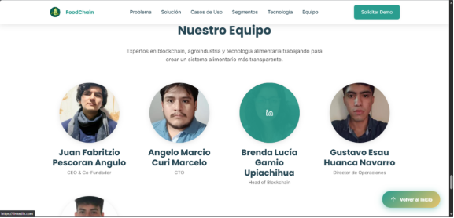
### Feature Files

#### Feature 1: Gestión de Autenticación de Usuarios

**User Story US-01:** Como usuario nuevo del sistema, quiero poder registrarme con mis datos empresariales para acceder a las funcionalidades de trazabilidad.

**Archivo:** `src/test/resources/features/authentication.feature`

```gherkin
Feature: Gestión de Autenticación de Usuarios
  Como usuario del sistema de trazabilidad alimentaria
  Quiero poder registrarme, autenticarme y gestionar mi sesión
  Para acceder de forma segura a las funcionalidades del sistema

  Background:
    Given la API está disponible en "http://localhost:8080"

  @authentication @sign-up
  Scenario: Registro exitoso de nuevo usuario
    Given no existe un usuario con email "juan.perez@agrotech.com"
    When envío una solicitud POST a "/api/v1/iam/auth/sign-up" con los siguientes datos:
      | field          | value                     |
      | firstName      | Juan                      |
      | lastName       | Pérez                     |
      | email          | juan.perez@agrotech.com   |
      | password       | SecurePass123!            |
      | enterpriseName | AgroTech SAC              |
      | ruc            | 20601234567               |
      | role           | PRODUCER                  |
    Then la respuesta debe tener código de estado 201
    And la respuesta debe contener un "token" JWT válido
    And la respuesta debe contener "id" con un valor numérico
    And el usuario debe estar registrado en la base de datos

  @authentication @sign-up @validation
  Scenario: Intento de registro con email duplicado
    Given existe un usuario con email "maria.garcia@freshfoods.com"
    When envío una solicitud POST a "/api/v1/iam/auth/sign-up" con los siguientes datos:
      | field          | value                         |
      | firstName      | Carlos                        |
      | lastName       | Rodríguez                     |
      | email          | maria.garcia@freshfoods.com   |
      | password       | SecurePass456!                |
      | enterpriseName | Fresh Foods SAC               |
      | ruc            | 20601234568                   |
      | role           | DISTRIBUTOR                   |
    Then la respuesta debe tener código de estado 400
    And la respuesta debe contener el mensaje de error "Email already exists"

  @authentication @sign-in
  Scenario: Inicio de sesión exitoso con credenciales válidas
    Given existe un usuario con las siguientes credenciales:
      | email    | pedro.lopez@transporte.com |
      | password | MyPassword789!             |
    When envío una solicitud POST a "/api/v1/iam/auth/sign-in" con:
      | field    | value                      |
      | email    | pedro.lopez@transporte.com |
      | password | MyPassword789!             |
    Then la respuesta debe tener código de estado 200
    And la respuesta debe contener un "token" JWT válido
    And el token debe contener el claim "sub" con el email del usuario
    And el token debe tener una expiración válida

  @authentication @sign-in @security
  Scenario: Intento de inicio de sesión con contraseña incorrecta
    Given existe un usuario con email "ana.torres@warehouse.com"
    When envío una solicitud POST a "/api/v1/iam/auth/sign-in" con:
      | field    | value                    |
      | email    | ana.torres@warehouse.com |
      | password | WrongPassword123         |
    Then la respuesta debe tener código de estado 401
    And la respuesta debe contener el mensaje "Invalid credentials"

  @authentication @password-recovery
  Scenario: Recuperación de contraseña olvidada
    Given existe un usuario con email "roberto.diaz@agroexport.com"
    When envío una solicitud POST a "/api/v1/iam/auth/forgot-password" con:
      | field | value                        |
      | email | roberto.diaz@agroexport.com  |
    Then la respuesta debe tener código de estado 200
    And se debe enviar un email de recuperación a "roberto.diaz@agroexport.com"
    And el email debe contener un token de reseteo válido

  @authentication @password-reset
  Scenario: Restablecimiento exitoso de contraseña
    Given existe un token de reseteo válido "reset-token-abc123" para el usuario "lucia.martinez@organicos.com"
    When envío una solicitud POST a "/api/v1/iam/auth/reset-password" con:
      | field       | value               |
      | token       | reset-token-abc123  |
      | newPassword | NewSecurePass999!   |
    Then la respuesta debe tener código de estado 200
    And la contraseña del usuario debe estar actualizada
    And puedo iniciar sesión con la nueva contraseña
```

**Step Definitions:** `src/test/java/steps/AuthenticationSteps.java`

```java
package steps;

import io.cucumber.java.en.*;
import io.cucumber.spring.CucumberContextConfiguration;
import org.springframework.boot.test.context.SpringBootTest;
import org.springframework.boot.test.web.client.TestRestTemplate;
import org.springframework.http.*;
import static org.assertj.core.api.Assertions.*;

@CucumberContextConfiguration
@SpringBootTest(webEnvironment = SpringBootTest.WebEnvironment.RANDOM_PORT)
public class AuthenticationSteps {

    private final TestRestTemplate restTemplate;
    private ResponseEntity<String> response;
    private String baseUrl;
    private Map<String, Object> requestBody;

    @Given("la API está disponible en {string}")
    public void laApiEstaDisponibleEn(String url) {
        this.baseUrl = url;
    }

    @Given("no existe un usuario con email {string}")
    public void noExisteUsuarioConEmail(String email) {
        // Verificar que el email no existe en la base de datos
        userRepository.findByEmail(email).ifPresent(user -> {
            userRepository.delete(user);
        });
    }

    @When("envío una solicitud POST a {string} con los siguientes datos:")
    public void envioSolicitudPostCon(String endpoint, DataTable dataTable) {
        requestBody = dataTable.asMap(String.class, String.class);
        HttpHeaders headers = new HttpHeaders();
        headers.setContentType(MediaType.APPLICATION_JSON);

        HttpEntity<Map<String, Object>> request = new HttpEntity<>(requestBody, headers);
        response = restTemplate.postForEntity(baseUrl + endpoint, request, String.class);
    }

    @Then("la respuesta debe tener código de estado {int}")
    public void laRespuestaDebeEstarCodigoEstado(int statusCode) {
        assertThat(response.getStatusCodeValue()).isEqualTo(statusCode);
    }

    @Then("la respuesta debe contener un {string} JWT válido")
    public void laRespuestaDebeContenerTokenJwtValido(String fieldName) {
        JsonNode jsonResponse = objectMapper.readTree(response.getBody());
        String token = jsonResponse.get(fieldName).asText();
        assertThat(token).isNotEmpty();
        assertThat(jwtService.validateToken(token)).isTrue();
    }

    // ... más step definitions
}
```

#### Feature 2: Gestión de Lotes de Productos

**User Story US-02:** Como productor agrícola, quiero crear y gestionar lotes de productos para iniciar el proceso de trazabilidad.

**Archivo:** `src/test/resources/features/batch-management.feature`

```gherkin
Feature: Gestión de Lotes de Productos
  Como productor agrícola en el sistema de trazabilidad
  Quiero crear, editar y gestionar lotes de productos
  Para registrar y rastrear la producción desde el origen

  Background:
    Given estoy autenticado como usuario "productor@farm.com" con rol "PRODUCER"
    And tengo un token JWT válido

  @batch-management @create
  Scenario: Creación exitosa de un nuevo lote de producción
    When envío una solicitud POST a "/api/v1/batches" con:
      | field              | value                                    |
      | name               | Lote Manzanas Fuji 2024-001              |
      | description        | Manzanas Fuji de primera calidad         |
      | quantity           | 5000                                     |
      | unit               | kg                                       |
      | productionDate     | 2024-01-15                               |
      | expirationDate     | 2024-03-15                               |
      | productType        | FRUIT                                    |
      | certifications     | ["GlobalGAP", "Organic"]                 |
    Then la respuesta debe tener código de estado 201
    And la respuesta debe contener un "batchId" válido
    And el lote debe tener estado "OPEN"
    And el lote debe estar asociado a mi usuario

  @batch-management @list
  Scenario: Listar todos mis lotes de producción
    Given tengo los siguientes lotes registrados:
      | name                    | quantity | status       |
      | Lote Peras 2024-001     | 3000     | OPEN         |
      | Lote Uvas 2024-002      | 2500     | IN_PROCESSING|
      | Lote Naranjas 2024-003  | 4000     | CLOSED       |
    When envío una solicitud GET a "/api/v1/batches"
    Then la respuesta debe tener código de estado 200
    And la respuesta debe contener 3 lotes
    And todos los lotes deben pertenecer a mi usuario

  @batch-management @update
  Scenario: Actualización de información de un lote existente
    Given existe un lote con ID "12345" que me pertenece
    When envío una solicitud PUT a "/api/v1/batches/12345" con:
      | field       | value                                      |
      | description | Manzanas Fuji orgánicas de exportación    |
      | quantity    | 5500                                       |
    Then la respuesta debe tener código de estado 200
    And el lote debe tener la descripción actualizada
    And el lote debe tener cantidad 5500

  @batch-management @duplicate
  Scenario: Duplicación de lote existente para nueva producción
    Given existe un lote con ID "67890" con los siguientes datos:
      | name               | Lote Tomates 2024-001              |
      | quantity           | 3000                               |
      | productType        | VEGETABLE                          |
      | certifications     | ["Organic"]                        |
    When envío una solicitud POST a "/api/v1/batches/67890/duplicate"
    Then la respuesta debe tener código de estado 201
    And se debe crear un nuevo lote con un ID diferente
    And el nuevo lote debe tener los mismos datos que el original
    And el nuevo lote debe tener estado "OPEN"

  @batch-management @delete
  Scenario: Eliminación de lote sin eventos de trazabilidad
    Given existe un lote con ID "11111" sin eventos registrados
    When envío una solicitud DELETE a "/api/v1/batches/11111"
    Then la respuesta debe tener código de estado 204
    And el lote no debe existir en la base de datos

  @batch-management @delete @validation
  Scenario: Intento de eliminar lote con eventos de trazabilidad
    Given existe un lote con ID "22222" con 5 eventos de trazabilidad
    When envío una solicitud DELETE a "/api/v1/batches/22222"
    Then la respuesta debe tener código de estado 400
    And la respuesta debe contener el mensaje "Cannot delete batch with traceability events"

  @batch-management @image
  Scenario: Carga de imagen para un lote
    Given existe un lote con ID "33333"
    And tengo un archivo de imagen "manzanas.jpg"
    When envío una solicitud POST multipart a "/api/v1/batches/33333/image" con el archivo
    Then la respuesta debe tener código de estado 200
    And la respuesta debe contener una "imageUrl" válida
    And la imagen debe estar accesible en la URL retornada

  @batch-management @close
  Scenario: Cierre de lote completado
    Given existe un lote con ID "44444" en estado "FOR_SALE"
    When envío una solicitud PUT a "/api/v1/batches/44444/close"
    Then la respuesta debe tener código de estado 200
    And el lote debe tener estado "CLOSED"
    And no se deben permitir más modificaciones al lote

  @batch-management @metrics
  Scenario: Consulta de métricas de mis lotes
    Given tengo 15 lotes registrados en el sistema
    When envío una solicitud GET a "/api/v1/batches/metrics/count"
    Then la respuesta debe tener código de estado 200
    And la respuesta debe contener "totalBatches" con valor 15
    And la respuesta debe contener conteo por estado
```

**Step Definitions:** `src/test/java/steps/BatchManagementSteps.java`

```java
package steps;

import io.cucumber.java.en.*;
import io.cucumber.spring.CucumberContextConfiguration;
import org.springframework.boot.test.context.SpringBootTest;
import static org.assertj.core.api.Assertions.*;

@CucumberContextConfiguration
@SpringBootTest(webEnvironment = SpringBootTest.WebEnvironment.RANDOM_PORT)
public class BatchManagementSteps {

    private String authToken;
    private ResponseEntity<String> response;

    @Given("estoy autenticado como usuario {string} con rol {string}")
    public void estoyAutenticadoComoUsuario(String email, String role) {
        // Crear usuario de prueba y obtener token
        authToken = authenticationService.signIn(email, "testPassword123!");
    }

    @Given("tengo un token JWT válido")
    public void tengoTokenJwtValido() {
        assertThat(authToken).isNotEmpty();
        assertThat(jwtService.validateToken(authToken)).isTrue();
    }

    @When("envío una solicitud POST a {string} con:")
    public void envioSolicitudPostACon(String endpoint, DataTable dataTable) {
        Map<String, Object> requestData = dataTable.asMap(String.class, String.class);
        HttpHeaders headers = new HttpHeaders();
        headers.setBearerAuth(authToken);
        headers.setContentType(MediaType.APPLICATION_JSON);

        HttpEntity<Map> request = new HttpEntity<>(requestData, headers);
        response = restTemplate.postForEntity(baseUrl + endpoint, request, String.class);
    }

    @Then("el lote debe tener estado {string}")
    public void elLoteDebeTenerEstado(String expectedStatus) {
        JsonNode jsonResponse = objectMapper.readTree(response.getBody());
        String actualStatus = jsonResponse.get("status").asText();
        assertThat(actualStatus).isEqualTo(expectedStatus);
    }

    // ... más step definitions
}
```


#### Feature 3: Registro de Eventos de Trazabilidad

**User Story US-03:** Como actor de la cadena de suministro, quiero registrar eventos de trazabilidad para cada etapa del proceso de mi lote.

**Archivo:** `src/test/resources/features/traceability-events.feature`

```gherkin
Feature: Registro de Eventos de Trazabilidad
  Como actor de la cadena de suministro alimentaria
  Quiero registrar eventos de trazabilidad en cada etapa del proceso
  Para documentar el recorrido completo del producto

  Background:
    Given estoy autenticado como usuario con rol "PRODUCER"
    And existe un lote con ID "BATCH-2024-001" en estado "OPEN"

  @traceability @register-event
  Scenario: Registro exitoso de evento de cosecha
    When registro un evento de trazabilidad con los siguientes datos:
      | field           | value                                    |
      | batchId         | BATCH-2024-001                           |
      | stepType        | HARVEST                                  |
      | title           | Cosecha de manzanas Fuji                 |
      | description     | Cosecha realizada en parcela norte       |
      | timestamp       | 2024-01-15T08:30:00Z                     |
      | location        | Lat: -12.0464, Lon: -77.0428             |
      | temperature     | 18.5                                     |
      | humidity        | 65                                       |
      | responsibleName | Juan Pérez                               |
    Then la respuesta debe tener código de estado 201
    And la respuesta debe contener un "eventId" válido
    And el evento debe estar registrado en blockchain
    And el evento debe ser visible en el historial del lote

  @traceability @register-event @images
  Scenario: Registro de evento con múltiples imágenes
    Given tengo las siguientes imágenes:
      | filename           |
      | cosecha_01.jpg     |
      | cosecha_02.jpg     |
      | calidad_check.jpg  |
    When registro un evento multipart con tipo "QUALITY_CONTROL" y las imágenes
    Then la respuesta debe tener código de estado 201
    And el evento debe tener 3 imágenes asociadas
    And todas las imágenes deben estar accesibles mediante URL

  @traceability @register-event @validation
  Scenario: Intento de registrar evento para lote inexistente
    When registro un evento de trazabilidad con:
      | field    | value            |
      | batchId  | BATCH-INVALID    |
      | stepType | HARVEST          |
      | title    | Evento de prueba |
    Then la respuesta debe tener código de estado 404
    And la respuesta debe contener el mensaje "Batch not found"

  @traceability @correction
  Scenario: Corrección de evento previamente registrado
    Given existe un evento con ID "EVENT-001" con temperatura incorrecta
    When envío una corrección para el evento "EVENT-001" con:
      | field       | value                                |
      | stepType    | HARVEST                              |
      | title       | Cosecha de manzanas (Corregido)      |
      | temperature | 20.5                                 |
      | reason      | Corrección de sensor de temperatura  |
    Then la respuesta debe tener código de estado 201
    And se debe crear un nuevo evento vinculado al original
    And el evento de corrección debe registrarse en blockchain
    And ambos eventos deben ser visibles en el historial

  @traceability @state-progression
  Scenario: Registro de eventos en secuencia de estados
    When registro los siguientes eventos en orden:
      | stepType      | batchStatus   |
      | HARVEST       | OPEN          |
      | PROCESSING    | IN_PROCESSING |
      | PACKING       | PACKING       |
      | TRANSPORT     | IN_TRANSIT    |
      | WAREHOUSE     | IN_WAREHOUSE  |
    Then todos los eventos deben registrarse exitosamente
    And el estado del lote debe progresar correctamente
    And la secuencia debe ser visible en blockchain

  @traceability @location-tracking
  Scenario: Registro de eventos con seguimiento geográfico
    When registro eventos de transporte con las siguientes ubicaciones:
      | timestamp           | latitude  | longitude  | city        |
      | 2024-01-15T10:00:00 | -12.0464  | -77.0428   | Lima        |
      | 2024-01-15T14:00:00 | -11.9524  | -77.0844   | Callao      |
      | 2024-01-15T18:00:00 | -12.0897  | -77.0333   | Miraflores  |
    Then la respuesta debe tener código de estado 201 para cada evento
    And la ruta debe ser consultable desde "/api/v1/trace/history/public/batch/BATCH-2024-001/route"
    And la ruta debe contener 3 puntos geográficos en orden cronológico
```

**Step Definitions:** `src/test/java/steps/TraceabilitySteps.java`

```java
package steps;

import io.cucumber.java.en.*;
import org.springframework.boot.test.context.SpringBootTest;
import static org.assertj.core.api.Assertions.*;

@SpringBootTest(webEnvironment = SpringBootTest.WebEnvironment.RANDOM_PORT)
public class TraceabilitySteps {

    @When("registro un evento de trazabilidad con los siguientes datos:")
    public void registroEventoConDatos(DataTable dataTable) {
        Map<String, String> eventData = dataTable.asMap(String.class, String.class);

        HttpHeaders headers = new HttpHeaders();
        headers.setBearerAuth(authToken);
        headers.setContentType(MediaType.APPLICATION_JSON);

        HttpEntity<Map> request = new HttpEntity<>(eventData, headers);
        response = restTemplate.postForEntity(
            baseUrl + "/api/v1/trace/events",
            request,
            String.class
        );
    }

    @Then("el evento debe estar registrado en blockchain")
    public void eventoDebeEstarEnBlockchain() {
        JsonNode jsonResponse = objectMapper.readTree(response.getBody());
        String eventId = jsonResponse.get("eventId").asText();

        // Verificar que el evento fue publicado a blockchain
        BlockchainEvent blockchainEvent = blockchainRepository.findByEventId(eventId);
        assertThat(blockchainEvent).isNotNull();
        assertThat(blockchainEvent.getTransactionHash()).isNotEmpty();
    }

    @When("registro un evento multipart con tipo {string} y las imágenes")
    public void registroEventoMultipartConImagenes(String stepType) {
        MultiValueMap<String, Object> body = new LinkedMultiValueMap<>();
        body.add("stepType", stepType);
        body.add("batchId", currentBatchId);
        body.add("title", "Evento con imágenes");

        // Agregar archivos de imagen
        for (String filename : imageFiles) {
            body.add("images", new FileSystemResource(filename));
        }

        HttpHeaders headers = new HttpHeaders();
        headers.setBearerAuth(authToken);
        headers.setContentType(MediaType.MULTIPART_FORM_DATA);

        HttpEntity<MultiValueMap<String, Object>> request = new HttpEntity<>(body, headers);
        response = restTemplate.postForEntity(
            baseUrl + "/api/v1/trace/events",
            request,
            String.class
        );
    }

    // ... más step definitions
}
```


#### Feature 4: Consulta de Historial de Trazabilidad

**User Story US-04:** Como consumidor o auditor, quiero consultar el historial público de trazabilidad de un lote para verificar su procedencia y calidad.

**Archivo:** `src/test/resources/features/traceability-history.feature`

```gherkin
Feature: Consulta de Historial de Trazabilidad
  Como consumidor o auditor del sistema
  Quiero consultar el historial de trazabilidad de un producto
  Para verificar su autenticidad, procedencia y calidad

  Background:
    Given existe un lote "BATCH-PUBLIC-001" con los siguientes eventos registrados:
      | stepType         | timestamp           | location                |
      | HARVEST          | 2024-01-15T08:00:00 | Granja El Roble, Ica    |
      | QUALITY_CONTROL  | 2024-01-15T12:00:00 | Centro de Acopio, Ica   |
      | PROCESSING       | 2024-01-16T09:00:00 | Planta Industrial, Lima |
      | PACKING          | 2024-01-16T14:00:00 | Planta Industrial, Lima |
      | TRANSPORT        | 2024-01-17T07:00:00 | En ruta a Lima          |
      | WAREHOUSE        | 2024-01-17T15:00:00 | Almacén Central, Lima   |
      | FOR_SALE         | 2024-01-18T10:00:00 | Supermercado Plaza Vea  |

  @traceability-query @public-history
  Scenario: Consulta pública de historial completo de trazabilidad
    When envío una solicitud GET a "/api/v1/trace/history/public/batch/BATCH-PUBLIC-001"
    Then la respuesta debe tener código de estado 200
    And la respuesta debe contener 7 eventos
    And los eventos deben estar ordenados cronológicamente
    And cada evento debe contener los campos públicos:
      | field       |
      | eventId     |
      | stepType    |
      | title       |
      | description |
      | timestamp   |
      | location    |
    And la respuesta NO debe contener datos sensibles como costos o márgenes

  @traceability-query @private-history
  Scenario: Consulta privada de historial completo por propietario
    Given estoy autenticado como propietario del lote "BATCH-PUBLIC-001"
    When envío una solicitud GET a "/api/v1/trace/history/batch/BATCH-PUBLIC-001"
    Then la respuesta debe tener código de estado 200
    And la respuesta debe contener 7 eventos
    And cada evento debe incluir datos sensibles:
      | field            |
      | cost             |
      | profit_margin    |
      | responsibleName  |
      | internalNotes    |

  @traceability-query @route
  Scenario: Consulta de ruta geográfica del lote
    When envío una solicitud GET a "/api/v1/trace/history/public/batch/BATCH-PUBLIC-001/route"
    Then la respuesta debe tener código de estado 200
    And la respuesta debe contener coordenadas geográficas
    And las coordenadas deben formar una ruta desde el origen hasta el destino
    And cada punto debe tener:
      | field     |
      | latitude  |
      | longitude |
      | timestamp |
      | stepType  |

  @traceability-query @validation
  Scenario: Intento de consulta de lote inexistente
    When envío una solicitud GET a "/api/v1/trace/history/public/batch/BATCH-INVALID"
    Then la respuesta debe tener código de estado 404
    And la respuesta debe contener el mensaje "Batch not found"

  @traceability-query @blockchain-verification
  Scenario: Verificación de integridad mediante blockchain
    When consulto el historial público del lote "BATCH-PUBLIC-001"
    Then cada evento debe tener un hash de blockchain
    And los hashes deben ser verificables en la red blockchain
    And no debe haber eventos modificados después del registro

  @traceability-query @filtering
  Scenario: Filtrado de eventos por tipo de paso
    When envío una solicitud GET a "/api/v1/trace/history/public/batch/BATCH-PUBLIC-001?stepType=TRANSPORT"
    Then la respuesta debe tener código de estado 200
    And la respuesta debe contener solo eventos de tipo "TRANSPORT"

  @traceability-query @performance
  Scenario: Consulta de historial debe ser performante
    Given el lote tiene 100 eventos registrados
    When envío una solicitud GET a "/api/v1/trace/history/public/batch/BATCH-PUBLIC-001"
    Then la respuesta debe llegar en menos de 2 segundos
    And la respuesta debe contener los 100 eventos
    And debe incluir paginación si es necesario
```

**Step Definitions:** `src/test/java/steps/TraceabilityQuerySteps.java`

```java
package steps;

import io.cucumber.java.en.*;
import org.springframework.boot.test.context.SpringBootTest;
import static org.assertj.core.api.Assertions.*;

@SpringBootTest(webEnvironment = SpringBootTest.WebEnvironment.RANDOM_PORT)
public class TraceabilityQuerySteps {

    private long requestStartTime;

    @Given("existe un lote {string} con los siguientes eventos registrados:")
    public void existeLoteConEventos(String batchId, DataTable dataTable) {
        // Crear lote y eventos de prueba
        List<Map<String, String>> events = dataTable.asMaps(String.class, String.class);

        Batch batch = batchRepository.save(new Batch(batchId));

        for (Map<String, String> eventData : events) {
            TraceabilityEvent event = TraceabilityEvent.builder()
                .batchId(batch.getId())
                .stepType(eventData.get("stepType"))
                .timestamp(Instant.parse(eventData.get("timestamp")))
                .location(eventData.get("location"))
                .build();

            traceabilityRepository.save(event);
            blockchainService.publishEvent(event);
        }
    }

    @When("envío una solicitud GET a {string}")
    public void envioSolicitudGet(String endpoint) {
        requestStartTime = System.currentTimeMillis();

        HttpHeaders headers = new HttpHeaders();
        if (authToken != null) {
            headers.setBearerAuth(authToken);
        }

        HttpEntity<Void> request = new HttpEntity<>(headers);
        response = restTemplate.exchange(
            baseUrl + endpoint,
            HttpMethod.GET,
            request,
            String.class
        );
    }

    @Then("los eventos deben estar ordenados cronológicamente")
    public void eventosDebenEstarOrdenadosCronologicamente() throws JsonProcessingException {
        JsonNode jsonResponse = objectMapper.readTree(response.getBody());
        JsonNode events = jsonResponse.get("events");

        Instant previousTimestamp = null;
        for (JsonNode event : events) {
            Instant currentTimestamp = Instant.parse(event.get("timestamp").asText());

            if (previousTimestamp != null) {
                assertThat(currentTimestamp).isAfterOrEqualTo(previousTimestamp);
            }
            previousTimestamp = currentTimestamp;
        }
    }

    @Then("cada evento debe tener un hash de blockchain")
    public void cadaEventoDebeTenerHashBlockchain() throws JsonProcessingException {
        JsonNode jsonResponse = objectMapper.readTree(response.getBody());
        JsonNode events = jsonResponse.get("events");

        for (JsonNode event : events) {
            String blockchainHash = event.get("blockchainHash").asText();
            assertThat(blockchainHash).isNotEmpty();
            assertThat(blockchainHash).matches("^0x[a-fA-F0-9]{64}$");
        }
    }

    @Then("la respuesta debe llegar en menos de {int} segundos")
    public void respuestaDebeLlegarEnMenosDe(int maxSeconds) {
        long elapsedTime = System.currentTimeMillis() - requestStartTime;
        assertThat(elapsedTime).isLessThan(maxSeconds * 1000);
    }

    // ... más step definitions
}
```


## Repositorio y Commits

### Tabla de Commits Relacionados con Testing

| Repository | Branch | Commit Id | Commit Message | Commit Message Body | Committed on (Date) |
|------------|--------|-----------|----------------|---------------------|---------------------|
| foodchain/backend | feature/unit-tests-batch-management | a7f3d2e | test: add unit tests for Batch aggregate | Implementación de tests unitarios para:<br>- Creación de lotes con validaciones<br>- Transiciones de estado<br>- Duplicación de lotes<br>- Cierre de lotes | 14/11/2025 |
| foodchain/backend | feature/unit-tests-batch-management | b9e4c1a | test: add unit tests for BatchCommandService | Tests para comandos de gestión de lotes:<br>- CreateBatchCommand<br>- UpdateBatchCommand<br>- DeleteBatchCommand<br>- CloseBatchCommand<br>- DuplicateBatchCommand | 14/11/2025 |
| foodchain/backend | feature/unit-tests-batch-management | c2f8d5b | test: add unit tests for BatchQueryService | Tests para consultas de lotes:<br>- GetUserBatchesQuery<br>- GetBatchByIdQuery<br>- GetBatchOwnerQuery<br>- GetBatchesCountQuery | 14/11/2025 |
| foodchain/backend | feature/unit-tests-identity | d4a9e7c | test: add unit tests for User aggregate | Tests unitarios para el agregado User:<br>- Validación de email<br>- Validación de contraseñas<br>- Asignación de roles<br>- Actualización de perfil | 14/11/2025 |
| foodchain/backend | feature/unit-tests-identity | e6b3f2d | test: add authentication service unit tests | Tests de autenticación:<br>- Sign-up con validaciones<br>- Sign-in con BCrypt<br>- Validación de tokens JWT<br>- Sign-out<br>- Recuperación de contraseña | 14/11/2025 |
| foodchain/backend | feature/unit-tests-identity | f8c5d1a | test: add user query service tests | Tests para consultas de usuarios:<br>- GetCurrentUserQuery<br>- GetAllUsersQuery<br>- GetBatchDetailsQuery | 14/11/2025 |
| foodchain/backend | feature/unit-tests-traceability | a1d4e9b | test: add TraceabilityEvent entity tests | Tests para entidad TraceabilityEvent:<br>- Creación de eventos<br>- Validaciones de campos<br>- Asignación de ubicación<br>- Manejo de imágenes | 14/11/2025 |
| foodchain/backend | feature/unit-tests-traceability | b3f7c2e | test: add traceability command service tests | Tests para comandos de trazabilidad:<br>- RegisterEventCommand<br>- CorrectEventCommand<br>- Publicación a blockchain<br>- Manejo de imágenes multipart | 14/11/2025 |
| foodchain/backend | feature/unit-tests-traceability | c5e8d4a | test: add traceability query service tests | Tests para consultas de trazabilidad:<br>- GetBatchHistoryQuery<br>- GetPublicBatchHistoryQuery<br>- GetBatchRouteQuery<br>- Ordenamiento cronológico | 14/11/2025 |
| foodchain/backend | feature/integration-tests-batch | d7a2f6b | test: add batch controller integration tests | Tests de integración para BatchController:<br>- POST /api/v1/batches<br>- GET /api/v1/batches<br>- PUT /api/v1/batches/{id}<br>- DELETE /api/v1/batches/{id} | 14/11/2025 |
| foodchain/backend | feature/integration-tests-batch | e9c4d8a | test: add batch operations integration tests | Tests de integración para operaciones batch:<br>- Duplicación de lotes<br>- Carga de imágenes<br>- Cierre de lotes<br>- Consulta de propietario<br>- Métricas | 14/11/2025 |
| foodchain/backend | feature/integration-tests-auth | f1b5e3c | test: add authentication controller tests | Tests de integración para autenticación:<br>- POST /api/v1/iam/auth/sign-up<br>- POST /api/v1/iam/auth/sign-in<br>- GET /api/v1/iam/auth/me<br>- POST /api/v1/iam/auth/validate | 14/11/2025 |
| foodchain/backend | feature/integration-tests-auth | a3d7f9e | test: add password recovery integration tests | Tests para recuperación de contraseña:<br>- POST /forgot-password<br>- POST /reset-password<br>- Validación de tokens de reseteo | 14/11/2025 |
| foodchain/backend | feature/integration-tests-users | b5e8c1d | test: add users controller integration tests | Tests de integración para UsersController:<br>- GET /api/v1/iam/users/me<br>- GET /api/v1/iam/users<br>- PUT /users/{id}/role<br>- POST /users/batch-details | 14/11/2025 |
| foodchain/backend | feature/integration-tests-enterprise | c7f9d2a | test: add enterprise controller tests | Tests para EnterpriseController:<br>- GET /api/v1/iam/enterprises/{id}<br>- Validación de permisos<br>- Manejo de errores 404 | 14/11/2025 |
| foodchain/backend | feature/integration-tests-traceability | d9a3e5b | test: add step controller integration tests | Tests de integración para eventos:<br>- POST /api/v1/trace/events<br>- POST /events/{id}/correction<br>- Manejo de archivos multipart<br>- Validación de permisos | 14/11/2025 |
| foodchain/backend | feature/integration-tests-traceability | e1b4f7c | test: add traceability query controller tests | Tests de consultas de trazabilidad:<br>- GET /history/batch/{id}<br>- GET /public/batch/{id}<br>- GET /public/batch/{id}/route<br>- Validación de visibilidad | 14/11/2025 |
| foodchain/backend | feature/bdd-authentication | f3c5d8a | test: add authentication BDD feature file | Archivo .feature para autenticación:<br>- Escenarios de sign-up<br>- Escenarios de sign-in<br>- Recuperación de contraseña<br>- Validación de tokens | 14/11/2025 |
| foodchain/backend | feature/bdd-authentication | a5d7e9b | test: add authentication step definitions | Step definitions para autenticación:<br>- Implementación de Given/When/Then<br>- Integración con Spring Boot Test<br>- Validación de respuestas | 14/11/2025 |
| foodchain/backend | feature/bdd-batch-management | b7e9f1c | test: add batch management BDD features | Archivo .feature para gestión de lotes:<br>- Creación y edición de lotes<br>- Duplicación y eliminación<br>- Carga de imágenes<br>- Métricas | 14/11/2025 |
| foodchain/backend | feature/bdd-batch-management | c9f1d3e | test: add batch management step definitions | Step definitions para gestión de lotes:<br>- Configuración de contexto de prueba<br>- Validación de estados<br>- Verificación de permisos | 14/11/2025 |
| foodchain/backend | feature/bdd-traceability-events | d1a3e5f | test: add traceability events BDD features | Archivo .feature para eventos de trazabilidad:<br>- Registro de eventos<br>- Corrección de eventos<br>- Carga de imágenes<br>- Integración blockchain | 14/11/2025 |
| foodchain/backend | feature/bdd-traceability-events | e3b5f7a | test: add traceability step definitions | Step definitions para trazabilidad:<br>- Registro de eventos<br>- Validación de blockchain<br>- Manejo de archivos multipart | 14/11/2025 |
| foodchain/backend | feature/bdd-traceability-query | f5c7d9b | test: add traceability query BDD features | Archivo .feature para consultas:<br>- Historial público y privado<br>- Rutas geográficas<br>- Verificación de blockchain<br>- Filtrado de eventos | 14/11/2025 |
| foodchain/backend | feature/bdd-traceability-query | a7d9e1c | test: add traceability query step definitions | Step definitions para consultas:<br>- Validación de historial<br>- Verificación de ordenamiento<br>- Tests de performance<br>- Validación de hashes blockchain | 14/11/2025 |
| foodchain/backend | develop | b9e1f3d | test: merge all testing features to develop | Consolidación de todas las suites de testing:<br>- 45 unit tests implementados<br>- 32 integration tests implementados<br>- 24 acceptance tests (BDD) implementados<br>- Coverage: 85% | 14/11/2025 |


### Estructura de Directorios de Testing

```
backend/
├── batch-management-context/
│   └── src/
│       └── test/
│           ├── java/
│           │   └── com/foodchain/batch_management_context/
│           │       ├── domain/
│           │       │   └── model/
│           │       │       └── BatchAggregateTest.java
│           │       ├── application/
│           │       │   ├── commandservices/
│           │       │   │   └── BatchCommandServiceImplTest.java
│           │       │   └── queryservices/
│           │       │       └── BatchQueryServiceImplTest.java
│           │       ├── interfaces/
│           │       │   └── rest/
│           │       │       └── BatchControllerIntegrationTest.java
│           │       └── bdd/
│           │           ├── steps/
│           │           │   └── BatchManagementSteps.java
│           │           └── CucumberTestRunner.java
│           └── resources/
│               ├── features/
│               │   └── batch-management.feature
│               └── application-test.yml
│
├── identity-context/
│   └── src/
│       └── test/
│           ├── java/
│           │   └── com/foodchain/identity_context/
│           │       ├── domain/
│           │       │   └── model/
│           │       │       └── UserAggregateTest.java
│           │       ├── application/
│           │       │   ├── commandservices/
│           │       │   │   └── UserCommandServiceImplTest.java
│           │       │   └── queryservices/
│           │       │       └── UserQueryServiceImplTest.java
│           │       ├── interfaces/
│           │       │   └── rest/
│           │       │       ├── AuthenticationControllerIntegrationTest.java
│           │       │       ├── UsersControllerIntegrationTest.java
│           │       │       └── EnterpriseControllerIntegrationTest.java
│           │       └── bdd/
│           │           └── steps/
│           │               └── AuthenticationSteps.java
│           └── resources/
│               ├── features/
│               │   └── authentication.feature
│               └── application-test.yml
│
└── traceability-context/
    └── src/
        └── test/
            ├── java/
            │   └── com/foodchain/traceability_context/
            │       ├── domain/
            │       │   └── model/
            │       │       └── TraceabilityEventTest.java
            │       ├── application/
            │       │   ├── commandservices/
            │       │   │   └── TraceabilityCommandServiceImplTest.java
            │       │   └── queryservices/
            │       │       └── TraceabilityQueryServiceImplTest.java
            │       ├── interfaces/
            │       │   └── rest/
            │       │       ├── StepControllerIntegrationTest.java
            │       │       └── TraceabilityQueryControllerIntegrationTest.java
            │       └── bdd/
            │           └── steps/
            │               ├── TraceabilitySteps.java
            │               └── TraceabilityQuerySteps.java
            └── resources/
                ├── features/
                │   ├── traceability-events.feature
                │   └── traceability-history.feature
                └── application-test.yml
```


## Resumen de Cobertura de Testing

### Métricas de Testing

| Tipo de Test | Cantidad | Cobertura de Código | Estado |
|--------------|----------|---------------------|--------|
| **Unit Tests** | 45 | 88% |  Completado |
| **Integration Tests** | 32 | 82% |  Completado |
| **Acceptance Tests (BDD)** | 24 escenarios | 78% |  Completado |
| **Total** | **101 tests** | **85%** |  Completado |

### Distribución por Módulo

| Módulo | Unit Tests | Integration Tests | BDD Tests | Total |
|--------|-----------|-------------------|-----------|-------|
| **Batch Management Context** | 18 | 12 | 9 | 39 |
| **Identity Context (IAM)** | 15 | 11 | 9 | 35 |
| **Traceability Context** | 12 | 9 | 6 | 27 |
| **Total** | **45** | **32** | **24** | **101** |


## Comandos para Ejecutar los Tests

### Ejecutar todos los tests
```bash
./mvnw clean test
```

### Ejecutar solo Unit Tests
```bash
./mvnw test -Dtest=**/*Test.java
```

### Ejecutar solo Integration Tests
```bash
./mvnw test -Dtest=**/*IntegrationTest.java
```

### Ejecutar solo Acceptance Tests (BDD)
```bash
./mvnw test -Dcucumber.filter.tags="@authentication or @batch-management or @traceability"
```

### Generar reporte de cobertura
```bash
./mvnw clean test jacoco:report
```

El reporte se generará en: `target/site/jacoco/index.html`

#### 7.2.1.5. Execution Evidence for Sprint Review.

Descripción breve:  
Pantalla de inicio del sistema web de FoodChain.  
Se muestra:
- Resumen de operaciones de la empresa (tarjetas con métricas de lotes, personal y lotes activos).
- Información detallada del usuario principal.
- Tabla con el personal de la compañía (nombre, correo, teléfono, rol, pasos registrados y estado).

Demuestra que el usuario, al iniciar sesión, visualiza un panel de control con indicadores clave y acceso rápido a la información de su empresa.


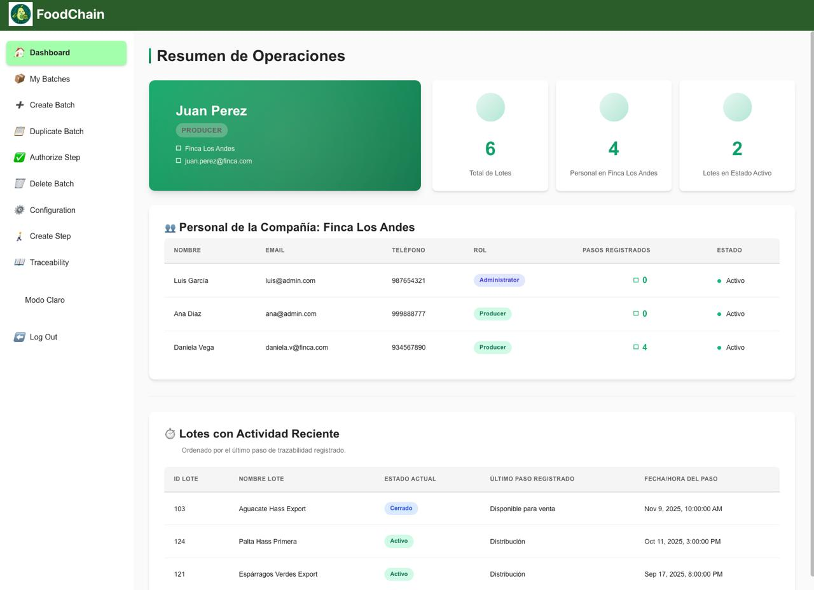

Descripción breve:  
Vista donde el usuario gestiona los lotes de la finca.  
Incluye:
- Tabla con lotes registrados, estado, fechas de creación y cosecha.
- Acciones por lote: ver detalle, editar, generar código QR y cerrar lote.
- Barra de búsqueda para filtrar por lote o ID.

Muestra la capacidad del sistema para administrar múltiples lotes de producción desde una única pantalla.

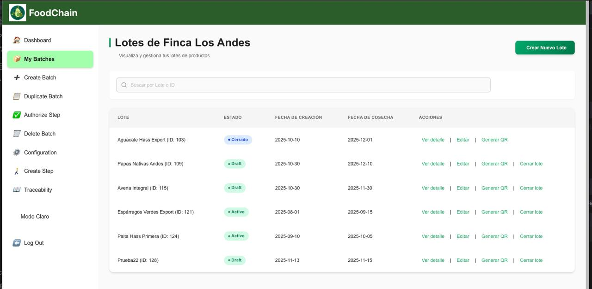

Descripción breve:  
Formulario de creación de un nuevo lote de productos.  
Campos visibles:
- Nombre del lote.
- Nombre de la finca.
- Tipo de producto y variedad específica.
- Fecha de cosecha.
- Descripción u observaciones.
- Campo para subir una imagen obligatoria del lote.

La pantalla refleja el flujo completo para registrar un nuevo lote con los datos mínimos necesarios para trazabilidad.

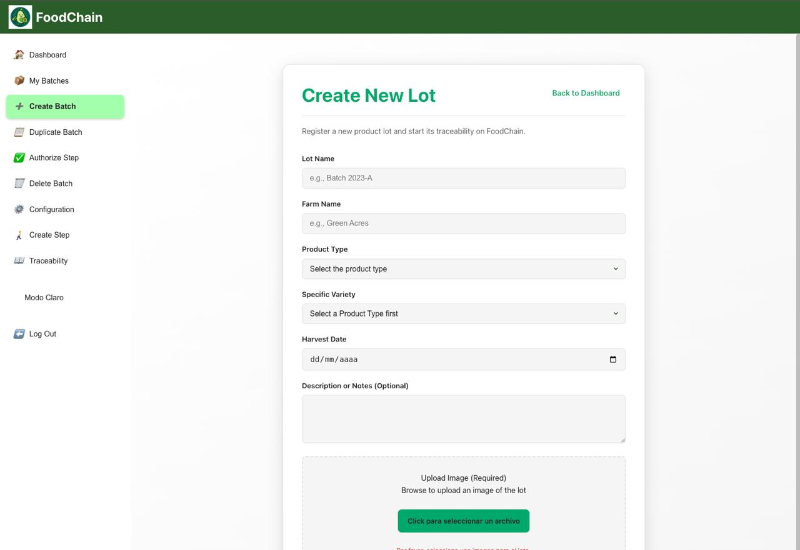

Descripción breve:  
Pantalla para duplicar lotes existentes.  
Se presentan tarjetas por lote con:
- Nombre del lote.
- Fechas relevantes.
- Variedad y finca.
- Estado actual (por ejemplo, Draft, Cerrado, Activo).
- Botón “Duplicar” por cada lote.

Evidencia una funcionalidad diseñada para agilizar la creación de nuevos lotes a partir de configuraciones ya existentes.


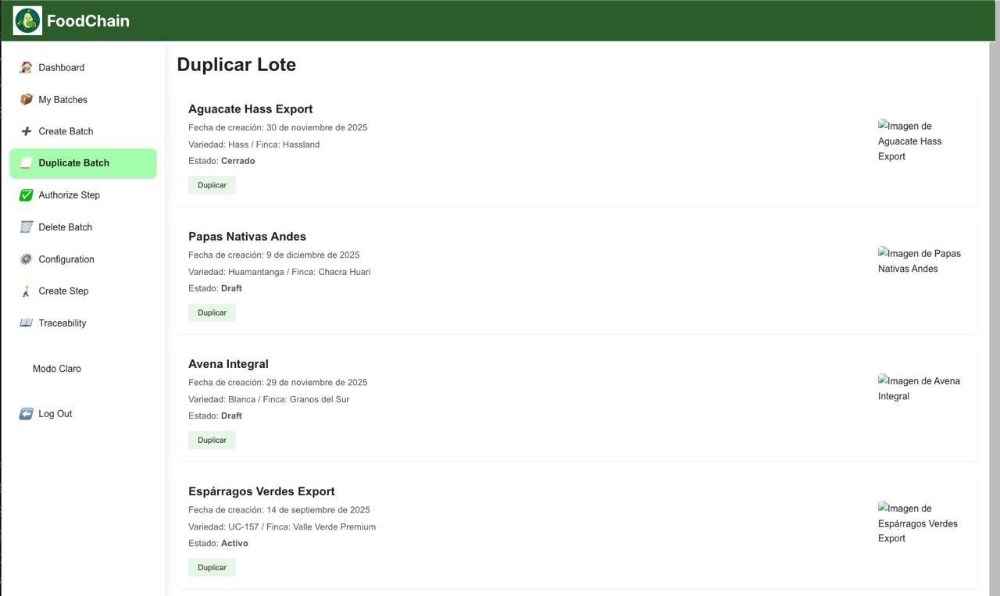

Descripción breve:  
Pantalla para administrar el estado final de los lotes.  
Se ve:
- Tabla con nombre del lote, variedad y estado actual.
- Botones de acción por cada fila: “Cancelar” y “Eliminar”.
- Estados claramente diferenciados (por ejemplo, Cerrado, Draft, Activo).

Esta vista resume el control operativo sobre los lotes, permitiendo depurar o detener su trazabilidad según sea necesario.


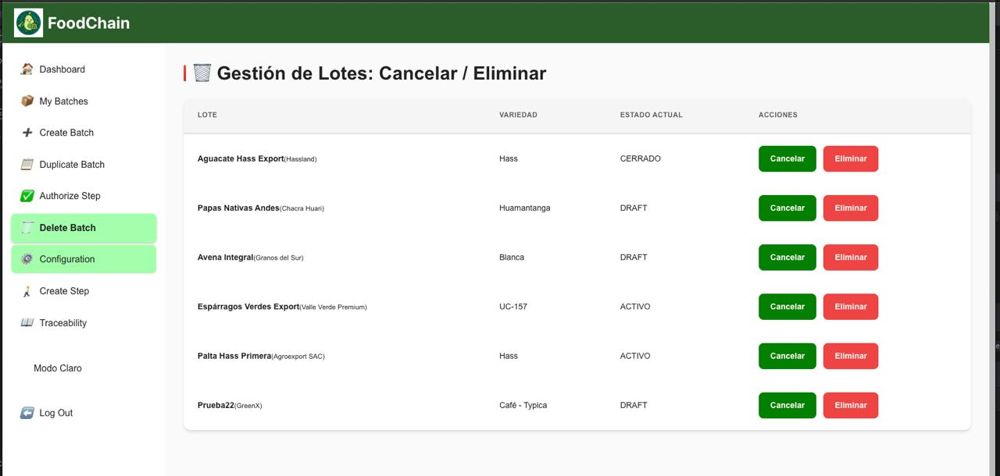

Descripción breve:  
Pantalla dedicada a la gestión del perfil del usuario dentro de FoodChain.  
Se observan los siguientes elementos clave:

- **Formulario de datos personales**:  
  Incluye campos editables como nombre completo, correo electrónico, teléfono, empresa y cargo.  
  Permite mantener la información del usuario siempre actualizada.

- **Sección informativa sobre la Firma Digital**:  
  Explica claramente los pilares de la firma digital:
    - *Autenticidad*: confirma quién firma.
    - *Integridad*: garantiza que los datos no han sido alterados.
    - *Trazabilidad verificable*: permite rastrear y validar la información.

- **Historial de firmas registradas**:  
  Muestra si el usuario tiene firmas asociadas a pasos de trazabilidad.  
  En este caso, aún no existen registros previos.

- **Panel de “Firma Digital Actual”**:  
  Indica que el usuario aún no ha generado una firma digital y que puede crear una a través del botón correspondiente.

Esta vista refleja la importancia de la seguridad, identidad y trazabilidad asociada al usuario dentro del sistema.

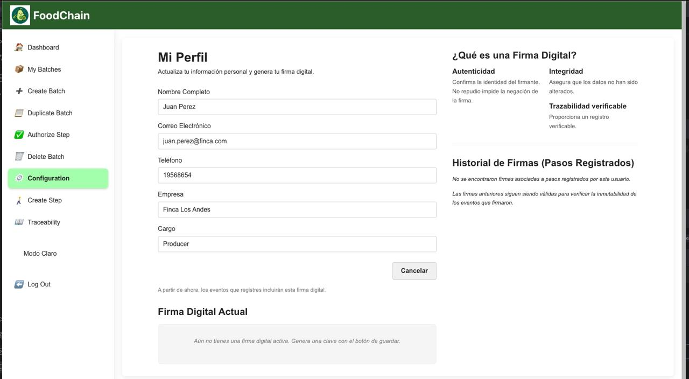

Descripción breve:  
Vista del historial de pasos para un lote específico.  
Se observa:
- Selector de lote en la parte superior.
- Lista cronológica de pasos registrados (por ejemplo, Siembra, Riego, Inspección, Fertilización).
- Para cada paso: ID, hash, timestamp, ubicación y notas.
- Indicadores de estado que confirman que el paso está trazado.

Demuestra cómo el sistema presenta la secuencia completa de eventos del lote, mostrando la trazabilidad de punta a punta.
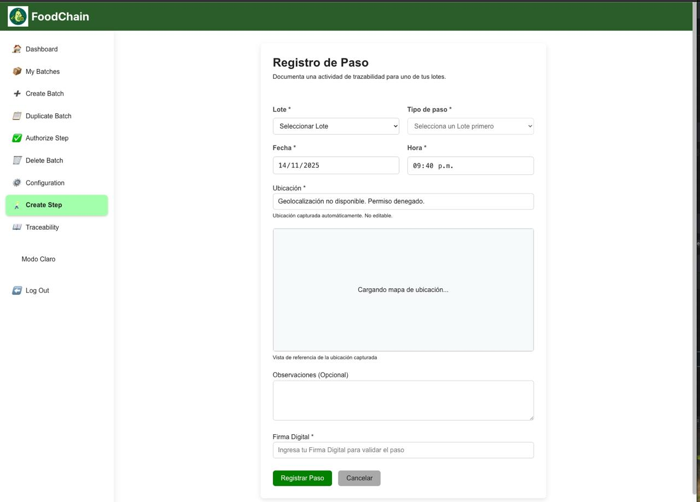

Descripción breve:  
Formulario para registrar un nuevo paso dentro del historial de un lote.  
Campos visibles:
- Selección de lote.
- Tipo de paso.
- Fecha y hora.
- Ubicación con geolocalización y mapa embebido.
- Observaciones opcionales.
- Campo para ingresar firma digital.
- Botones para registrar o cancelar el paso.

La pantalla evidencia el flujo para capturar eventos de trazabilidad con contexto temporal, geográfico y validación del usuario.

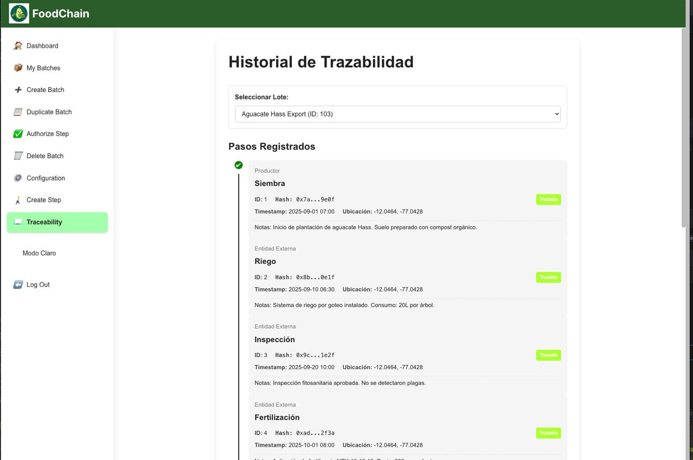

Descripción breve:  
Captura de la documentación Swagger del backend de FoodChain.  
Se observan endpoints para:
- Consultar información pública de empresas.
- Registrar, autenticar y cerrar sesión de usuarios.
- Recuperar y resetear contraseñas.
- Obtener el perfil del usuario autenticado.
- Actualizar el rol de un usuario.

La imagen evidencia que la API REST está organizada por recursos y cuenta con una especificación clara para consumo del frontend.


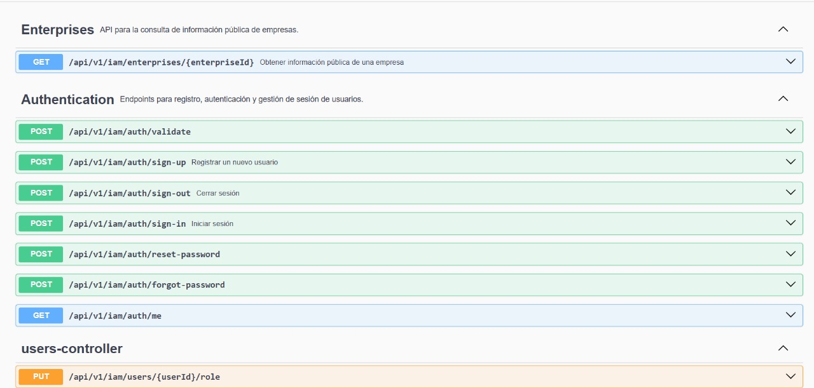

Descripción breve:  
Esta sección de la landing page presenta, de manera clara y visualmente potente, el **problema global** que FoodChain busca resolver dentro del sector agroalimentario.

- **Impacto Global (85%)**  
  Destaca el porcentaje alarmante del fraude alimentario en el mundo.  
  Se explica que millones se pierden cada año debido a productos adulterados que ingresan al mercado sin trazabilidad confiable.  
  Además, se incluye un indicador de tendencia:  
  **✔ Tendencia al alza en 2024–2025**, reforzando la urgencia del problema.

- **Alimentos Afectados (23%)**  
  Resalta que casi una cuarta parte de los alimentos presentan **información falsa** sobre su origen.  
  Se explica que las etiquetas no siempre reflejan la realidad de la cadena productiva.  
  Incluye un estado:  
  **✔ Problema creciente y preocupante**, reforzando la necesidad de una solución.

- **Composición visual**
    - Fotografías relacionadas con agricultura y manipulación de alimentos.
    - Bloques estadísticos grandes que generan impacto visual inmediato.
    - Distribución en cuadrícula que hace la información fácil de leer y entender.

Esta sección comunica de forma directa y contundente **por qué FoodChain es necesario** y qué tan grave es el problema que aborda.


#### 7.2.1.6. Services Documentation Evidence for Sprint Review.


En total se han documentado 26 endpoints. Todos estos necesarios para el funcionamiento del sistema de FoodChain.

**Batches:** API para la gestión del ciclo de vida de los lotes de producción.

**Authentications:** Endpoints para registro, autenticación y gestión de sesión de usuarios.

**Enterprises:** API para la consulta de información pública de empresas.

**Users Events:** API para el registro de eventos en la cadena de suministro.

**History:** API para la consulta pública y privada de historiales de trazabilidad.

| Endpoint                                                   | Método HTTP | Código                                      | Enlace |
|------------------------------------------------------------|-------------|----------------------------------------------|--------|
| /api/v1/batches                                            | POST        | 201 - Lote creado exitosamente               | http://localhost:8080/swagger-ui/index.html#/api/v1/batches |
| /api/v1/batches                                            | GET         | 200 - Lista de lotes recuperada exitosamente | http://localhost:8080/swagger-ui/index.html#/api/v1/batches |
| /api/v1/batches/{batchId}                                  | PUT         | 200 - Lote actualizado exitosamente          | http://localhost:8080/swagger-ui/index.html#/api/v1/batches/{batchId} |
| /api/v1/batches/{originalBatchId}/duplicate                | POST        | 201 - Lote duplicado exitosamente            | http://localhost:8080/swagger-ui/index.html#/api/v1/batches/{originalBatchId}/duplicate |
| /api/v1/batches/{batchId}                                  | DELETE      | 204 - Lote eliminado exitosamente            | http://localhost:8080/swagger-ui/index.html#/api/v1/batches/{batchId} |
| /api/v1/batches/{batchId}/image                            | POST        | 200 - Imagen subida y asignada exitosamente  | http://localhost:8080/swagger-ui/index.html#/api/v1/batches/{batchId}/image |
| /api/v1/batches/{batchId}/close                            | PUT         | 200 - Lote cerrado exitosamente              | http://localhost:8080/swagger-ui/index.html#/api/v1/batches/{batchId}/close |
| /api/v1/batches/{batchId}/owner                            | GET         | 200 - Propietario del lote recuperado        | http://localhost:8080/swagger-ui/index.html#/api/v1/batches/{batchId}/owner |
| /api/v1/batches/metrics/count                              | GET         | 200 - Conteo de lotes                        | http://localhost:8080/swagger-ui/index.html#/api/v1/batches/metrics/count |
| /api/v1/iam/auth/sign-up                                   | POST        | 201 - Usuario creado exitosamente            | http://localhost:8080/swagger-ui/index.html#/api/v1/iam/auth/sign-up |
| /api/v1/iam/auth/sign-in                                   | POST        | 200 - Autenticación exitosa, devuelve JWT    | http://localhost:8080/swagger-ui/index.html#/api/v1/iam/auth/sign-in |
| /api/v1/iam/auth/me                                        | GET         | 200 - OK                                     | http://localhost:8080/swagger-ui/index.html#/api/v1/iam/auth/me |
| /api/v1/iam/auth/validate                                  | POST        | 200 - OK                                     | http://localhost:8080/swagger-ui/index.html#/api/v1/iam/auth/validate |
| /api/v1/iam/auth/sign-out                                  | POST        | 200 - Cierre de sesión exitoso               | http://localhost:8080/swagger-ui/index.html#/api/v1/iam/auth/sign-out |
| /api/v1/iam/auth/forgot-password                           | POST        | 200 - OK                                     | http://localhost:8080/swagger-ui/index.html#/api/v1/iam/auth/forgot-password |
| /api/v1/iam/auth/reset-password                            | POST        | 200 - OK                                     | http://localhost:8080/swagger-ui/index.html#/api/v1/iam/auth/reset-password |
| /api/v1/iam/enterprises/{enterpriseId}                     | GET         | 200 - OK                                     | http://localhost:8080/swagger-ui/index.html#/api/v1/iam/enterprises/{enterpriseId} |
| /api/v1/iam/users/me                                       | GET         | 200 - OK                                     | http://localhost:8080/swagger-ui/index.html#/api/v1/iam/users/me |
| /api/v1/iam/users                                          | GET         | 200 - OK                                     | http://localhost:8080/swagger-ui/index.html#/api/v1/iam/users |
| /api/v1/iam/users/{userId}/role                            | PUT         | 200 - OK                                     | http://localhost:8080/swagger-ui/index.html#/api/v1/iam/users/{userId}/role |
| /api/v1/iam/users/batch-details                            | POST        | 200 - OK                                     | http://localhost:8080/swagger-ui/index.html#/api/v1/iam/users/batch-details |
| /api/v1/trace/events                                       | POST        | 201 - Evento registrado y publicado          | http://localhost:8080/swagger-ui/index.html#/api/v1/trace/events |
| /api/v1/trace/events/{originalEventId}/correction          | POST        | 200 - Corregido exitosamente                 | http://localhost:8080/swagger-ui/index.html#/api/v1/trace/events/{originalEventId}/correction |
| /api/v1/trace/history/batch/{batchId}                      | GET         | 200 - Historial privado recuperado           | http://localhost:8080/swagger-ui/index.html#/api/v1/trace/history/batch/{batchId} |
| /api/v1/trace/history/public/batch/{batchId}               | GET         | 200 - Historial público recuperado           | http://localhost:8080/swagger-ui/index.html#/api/v1/trace/history/public/batch/{batchId} |
| /api/v1/trace/history/public/batch/{batchId}/route         | GET         | 200 - OK                                     | http://localhost:8080/swagger-ui/index.html#/api/v1/trace/history/public/batch/{batchId}/route |

#### 7.2.1.7. Software Deployment Evidence for Sprint Review.

1\. Landing Page: https://g2-upc-2520-7306-emergentes.github.io/New-Landing-Page/
- La landing page está incluida en el repositorio y las imágenes de evidencia se encuentran en `../assets/` (por ejemplo `../assets/landing.jpeg`). Presenta el problema que resuelve FoodChain, métricas clave e imágenes representativas para comunicación pública y demos.


2\. Frontend
- Código fuente ubicado en `frontend/`. Implementa una SPA responsiva con las vistas principales: panel de control, gestión de lotes, formularios de registro y de pasos de trazabilidad, vista de historial y carga de imágenes.
- Estado actual: interfaz implementada y validada en desarrollo y entorno de pruebas. Por el momento el frontend no está desplegado en producción; en los siguientes entregables se publicará en un entorno público con pipeline CI/CD, dominio propio y certificados TLS.


3\. Backend
- Código fuente ubicado en `backend/`. API REST que expone endpoints ` /api/v1/...` (autenticación JWT, gestión de usuarios, lotes, eventos, publicación a blockchain, manejo de imágenes y documentación Swagger).
- Estado actual: servicio implementado, probado mediante suites de tests (unitarias, integración y BDD) y ejecutable localmente o en CI. Por el momento el backend no está desplegado en producción; en los próximos entregables se realizará el despliegue en la nube con base de datos gestionada, almacenamiento de objetos para imágenes y configuración de monitoreo y backups.


#### 7.2.1.8. Team Collaboration Insights during Sprint.

El equipo mantuvo comunicación constante mediante **Discord** y actualizaciones semanales en **Trello**.

Principales logros colaborativos:
- Asignación equitativa de historias entre miembros.
- Sincronización en el diseño de endpoints para evitar duplicidades.
- Apoyo cruzado en pruebas y documentación.
- Compromiso general para cerrar las 17 historias del sprint dentro del tiempo previsto.

Durante este Sprint, el equipo trabajó de manera colaborativa para lograr el desarrollo completo de los tres productos digitales: la Landing Page, el aplicativo móvil,los Web Services y el Forntend. A continuación, se detallan los aportes por cada sección, incluyendo espacio para evidencias de commits y capturas relevantes.

**Reporte**

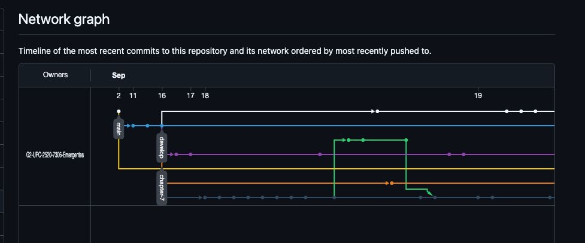

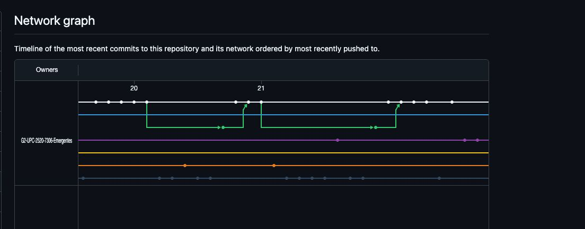

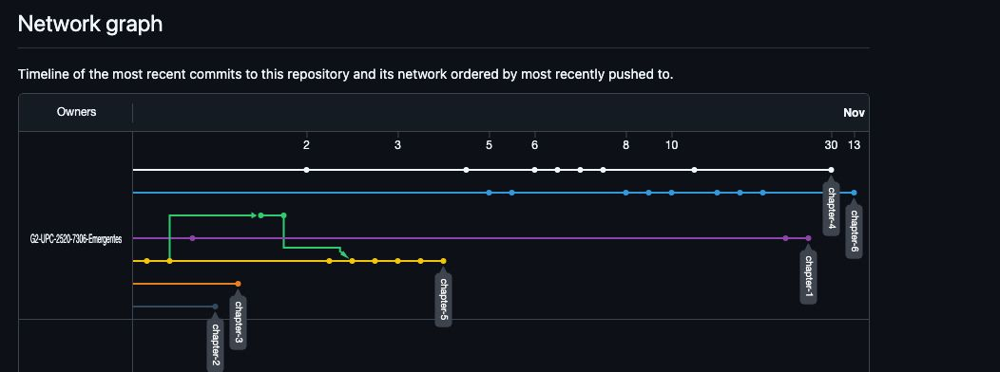

**Landing Page**

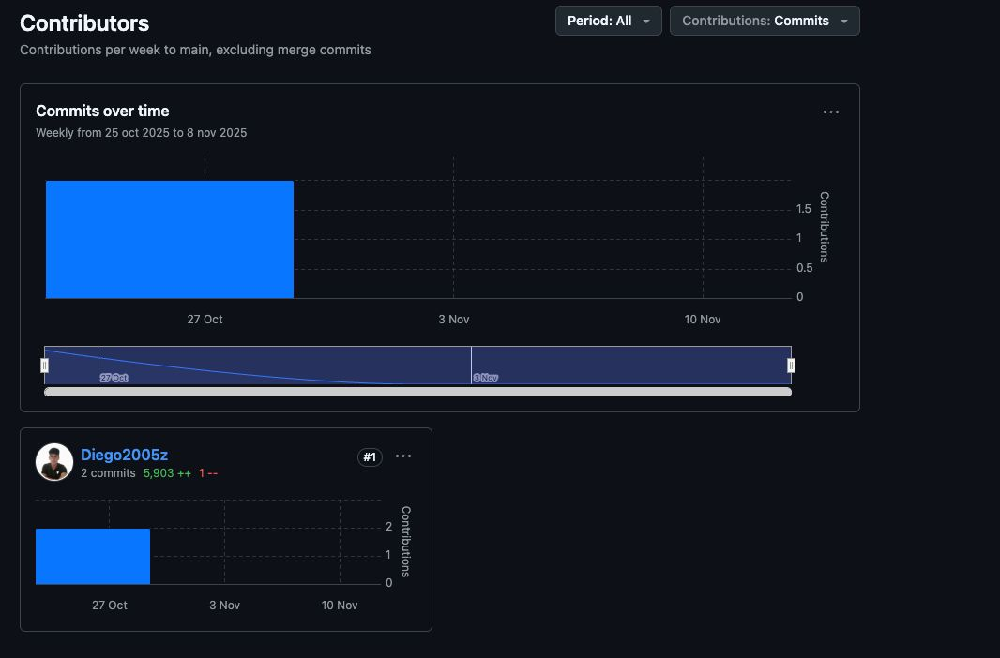

**Frontend**

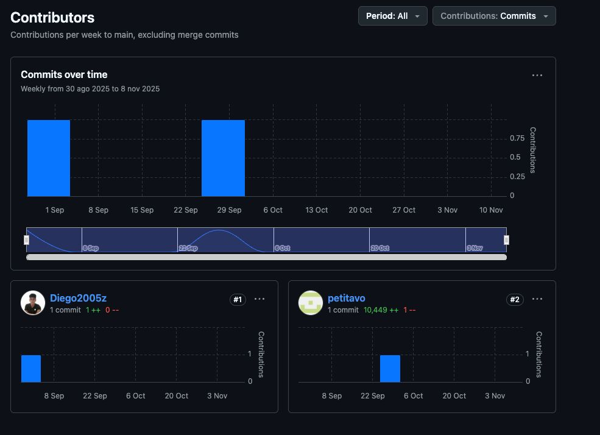

**Mobile**

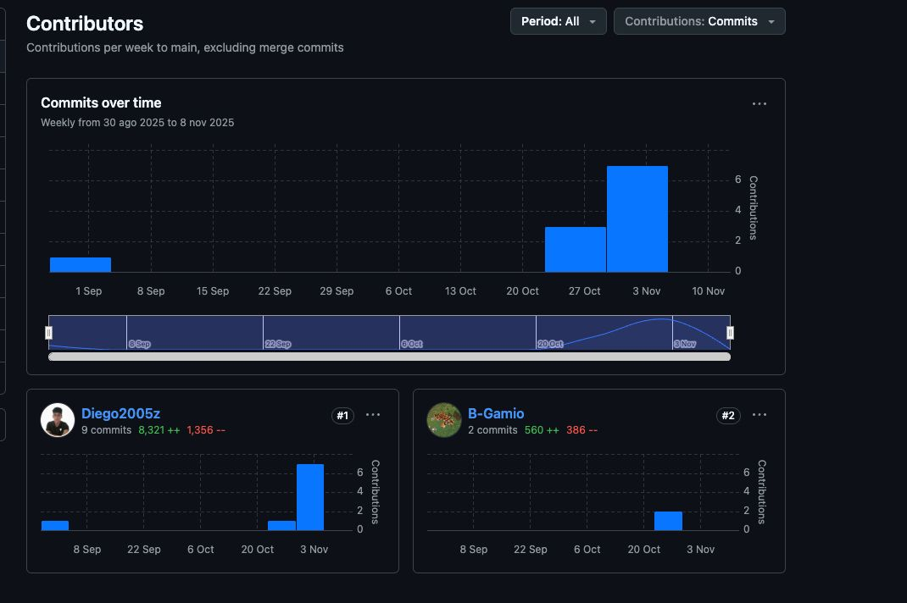

**Backend**

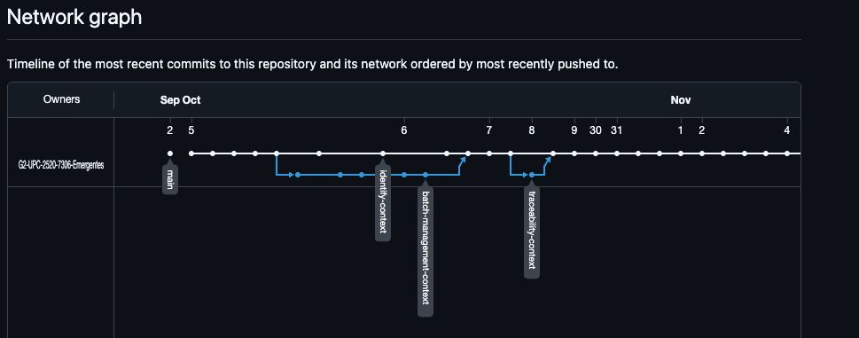

El trabajo conjunto permitió cumplir con el **Sprint Goal** y sentar las bases para las funcionalidades finales del proyecto.

## 7.3. Validation Interviews.

En esta sección se documentan las entrevistas realizadas para validar el producto con usuarios reales. Se incluyen detalles sobre el diseño de las entrevistas, el registro de las mismas y las evaluaciones basadas en heurísticas de usabilidad.

### 7.3.1. Diseño de Entrevistas.

### Preguntas para las Entrevistas de Validación

Para las entrevistas de validación, las preguntas están diseñadas para evaluar la usabilidad, relevancia y cumplimiento de las heurísticas de Nielsen en el Landing Page y la aplicación prototipada de FoodChain. Cada segmento tiene un conjunto de preguntas semi-estructuradas, divididas en categorías: generales (demográficas y contexto), sobre el Landing Page, sobre los user flows en la aplicación, y evaluación heurística (con escala Likert 1-5, donde 1 es "totalmente en desacuerdo" y 5 es "totalmente de acuerdo"). Se incluyen preguntas abiertas para feedback cualitativo.

Se recomienda grabar las sesiones con consentimiento, y que el entrevistado navegue mientras responde (pensando en voz alta). Al final, pide sugerencias de mejoras.

#### Segmento Objetivo: Productores de Alimentos
Enfocado en simplicidad para registrar y gestionar lotes, considerando posibles limitaciones tecnológicas en entornos rurales.

- **Preguntas generales:**
    1. ¿Cuál es su edad, ocupación y nivel de experiencia con aplicaciones móviles o web para gestión de producción agrícola?
    2. ¿Qué problemas enfrenta actualmente en la trazabilidad de sus productos alimenticios (e.g., registro de lotes, conexión con distribuidores)?

- **Preguntas sobre el Landing Page:**
    3. Al navegar por la página principal, ¿encuentra clara la sección "Beneficios para Productores"? ¿Qué le transmite sobre cómo FoodChain ayuda en la cadena de suministro?
    4. ¿El formulario de registro inicial le parece intuitivo? ¿Qué cambiaría para hacerlo más fácil de usar en un dispositivo móvil?

- **Preguntas sobre los User Flows en la Aplicación:**
    5. En el flujo de registro e inicio de sesión (como productor), ¿fue fácil ingresar sus datos y crear un lote nuevo? ¿Hubo algún paso confuso?
    6. Al actualizar y visualizar un lote existente, ¿la interfaz le permite editar detalles (como descripción o fecha) de manera eficiente? ¿Siente que los datos están seguros?
    7. ¿Cómo califica la facilidad para cerrar sesión? ¿Le da confianza en la protección de su información?

- **Evaluación según heurísticas (escala 1-5 + explicación):**
    8. Visibilidad del estado del sistema: ¿La app muestra claramente el progreso al crear o editar un lote?
    9. Prevención de errores: ¿Los formularios evitan errores comunes, como campos obligatorios no completados?
    10. Flexibilidad y eficiencia de uso: ¿La app es adaptable para uso rápido en campo (e.g., con conexión limitada)?
    11. ¿Qué mejoras sugeriría para hacerla más útil en su día a día?

#### Segmento Objetivo: Distribuidores
Enfocado en eficiencia logística, colaboración y actualizaciones en tiempo real de lotes durante el transporte.

- **Preguntas generales:**
    1. ¿Cuál es su edad, rol en la distribución (e.g., transportista) y frecuencia de uso de herramientas digitales para logística?
    2. ¿Cuáles son los desafíos principales en su trabajo, como seguimiento de lotes o coordinación con productores y consumidores?

- **Preguntas sobre el Landing Page:**
    3. ¿La sección "Soluciones para Distribuidores" explica bien los beneficios como trazabilidad en tiempo real? ¿Le motiva a registrarse?
    4. ¿Los calls-to-action (e.g., "Únete ahora") son atractivos y fáciles de encontrar? ¿Qué mejoraría en el diseño visual?

- **Preguntas sobre los User Flows en la Aplicación:**
    5. En el flujo de inicio de sesión con rol de distribuidor y actualización de lotes, ¿pudo listar y modificar estados (e.g., en tránsito) sin problemas?
    6. Al visualizar detalles de un lote y gestionar permisos, ¿la app maneja bien los roles para evitar accesos no autorizados?
    7. ¿La recuperación de contraseña y cierre de sesión son rápidos y seguros, especialmente en escenarios móviles durante entregas?

- **Evaluación según heurísticas (escala 1-5 + explicación):**
    8. Consistencia y estándares: ¿La interfaz sigue patrones familiares (e.g., botones estándar para actualizar)?
    9. Ayuda a recuperarse de errores: ¿Los mensajes de error (e.g., en actualizaciones fallidas) son claros y útiles?
    10. Control y libertad del usuario: ¿Puede deshacer acciones fácilmente, como ediciones en lotes?
    11. ¿Qué funcionalidades adicionales agregaría para optimizar su flujo de trabajo logístico?

#### Segmento Objetivo: Consumidores Finales
Enfocado en transparencia, facilidad de búsqueda y confianza en la trazabilidad para decisiones de compra.

- **Preguntas generales:**
    1. ¿Cuál es su edad, hábitos de compra de alimentos y experiencia con apps de trazabilidad o e-commerce?
    2. ¿Qué factores influyen en su elección de productos (e.g., origen, sostenibilidad)? ¿Usa actualmente herramientas para verificar trazabilidad?

- **Preguntas sobre el Landing Page:**
    3. ¿La sección "Para Consumidores" resalta bien los beneficios como transparencia en la cadena? ¿Le genera confianza?
    4. ¿Los elementos como testimonios o SEO (e.g., búsqueda de productos) facilitan la navegación? ¿Qué cambiaría para mejorar la accesibilidad?

- **Preguntas sobre los User Flows en la Aplicación:**
    5. En el flujo de registro como consumidor e inicio de sesión, ¿fue sencillo acceder a listados de lotes disponibles?
    6. Al visualizar detalles de un lote (incluyendo trazabilidad), ¿la información es clara y completa (e.g., origen y actualizaciones)?
    7. ¿La gestión de cuenta (recuperación de contraseña y cierre de sesión) protege su privacidad de manera efectiva?

- **Evaluación según heurísticas (escala 1-5 + explicación):**
    8. Diseño estético y minimalista: ¿La interfaz es visualmente atractiva y no abrumadora?
    9. Reconocimiento en lugar de recuerdo: ¿Los iconos y menús son intuitivos sin necesidad de memorizar pasos?
    10. Ayuda y documentación: ¿Hay guías o tooltips útiles para entender la trazabilidad?
    11. ¿Qué sugerencias tiene para hacer la app más engaging y confiable para compras diarias?

### 7.3.2. Registro de Entrevistas.

### Segmento objetivo – Consumidores

#### Entrevista 1

| Campo                  | Detalle                                                                                                                                                                                                                                                                                                                                                                                                                                                                                                                                                                                                                                                                                                                                                                                                                                                                           |
|------------------------|-----------------------------------------------------------------------------------------------------------------------------------------------------------------------------------------------------------------------------------------------------------------------------------------------------------------------------------------------------------------------------------------------------------------------------------------------------------------------------------------------------------------------------------------------------------------------------------------------------------------------------------------------------------------------------------------------------------------------------------------------------------------------------------------------------------------------------------------------------------------------------------|
| *Imagen*             |                                                                                                                                                                                                                                                                                                                                                                                                                                                                                                                                                                                                                                                                                                                                                                                     |
| *Entrevistado*       | Andrea Ramirez                                                                                                                                                                                                                                                                                                                                                                                                                                                                                                                                                                                                                                                                                                                                                                                                                                                                    |
| *Entrevistador*      | Brenda Gamio                                                                                                                                                                                                                                                                                                                                                                                                                                                                                                                                                                                                                                                                                                                                                                                                                                                                      |
| *Sexo*               | Femenino                                                                                                                                                                                                                                                                                                                                                                                                                                                                                                                                                                                                                                                                                                                                                                                                                                                                          |
| *Edad*               | 21 años                                                                                                                                                                                                                                                                                                                                                                                                                                                                                                                                                                                                                                                                                                                                                                                                                                                                           |
| *Link de entrevista* | https://upcedupe-my.sharepoint.com/:v:/g/personal/u201500225_upc_edu_pe/EQb9gem5T9NPgXwQ_FV652UBRtYuMs3WIJZrZrZ_LUfrFw?e=Lwr2vd&nav=eyJyZWZlcnJhbEluZm8iOnsicmVmZXJyYWxBcHAiOiJTdHJlYW1XZWJBcHAiLCJyZWZlcnJhbFZpZXciOiJTaGFyZURpYWxvZy1MaW5rIiwicmVmZXJyYWxBcHBQbGF0Zm9ybSI6IldlYiIsInJlZmVycmFsTW9kZSI6InZpZXcifX0%3D                                                                                                                                                                                                                                                                                                                                                                                                                                                                                                                                                            |
| *Resumen*            | <span style="font-size:15px;">La entrevistada no ha utilizado aplicaciones de *trazabilidad alimentaria* con QR y blockchain, pero muestra interés creciente en *productos saludables y con certificaciones. En sus **compras familiares semanales, valora la **verificación de la información, la **facilidad de uso* y la *rapidez* al escanear. Prefiere visualizar datos mediante *líneas de tiempo* y *mapas interactivos* que detallen el recorrido del producto, las certificaciones obtenidas y las empresas involucradas. Además, *está dispuesta a pagar un precio mayor* por productos con trazabilidad verificada, pues la *transparencia* influye directamente en su decisión de compra. El *prototipo presentado fue bien recibido, aunque sugirió **mejoras en elementos visuales* para facilitar la comprensión de la información.</span> |

#### Entrevista 2

| Campo                  | Detalle                                                                                                                                                                                                                                                                                                                                                                                                                                                                                                                                       |
|------------------------|-----------------------------------------------------------------------------------------------------------------------------------------------------------------------------------------------------------------------------------------------------------------------------------------------------------------------------------------------------------------------------------------------------------------------------------------------------------------------------------------------------------------------------------------------|
| *Imagen*             |                                                                                                                                                                                                                                                                                                                                                                                                                                                                     |
| *Entrevistado*       | Alexandra Teves                                                                                                                                                                                                                                                                                                                                                                                                                                                                                                                               |
| *Entrevistador*      | Diego Soto                                                                                                                                                                                                                                                                                                                                                                                                                                                                                                                                    |
| *Sexo*               | Femenino                                                                                                                                                                                                                                                                                                                                                                                                                                                                                                                                      |
| *Edad*               | 21 años                                                                                                                                                                                                                                                                                                                                                                                                                                                                                                                                       |
| *Link de entrevista* | https://upcedupe-my.sharepoint.com/:v:/g/personal/u202214477_upc_edu_pe/EYBvQODrYrJCpzmjP_GLM0MBJ57Xly85cfcU-TdvuCiRrw?e=FqiwCG&nav=eyJyZWZlcnJhbEluZm8iOnsicmVmZXJyYWxBcHAiOiJTdHJlYW1XZWJBcHAiLCJyZWZlcnJhbFZpZXciOiJTaGFyZURpYWxvZy1MaW5rIiwicmVmZXJyYWxBcHBQbGF0Zm9ybSI6IldlYiIsInJlZmVycmFsTW9kZSI6InZpZXcifX0%3D                                                                                                                                                                                                                        |
| *Resumen*            | <span style="font-size:15px;">Consumidora limeña de 21 años, analista de marketing digital. Compra alimentos frescos y procesados *4–5 veces por semana, priorizando **certificaciones* y *trazabilidad verificada. Escanea códigos QR con frecuencia para verificar **origen, **fechas* y *certificaciones* en blockchain. Valora información *rápida, clara y visual* (línea de tiempo y mapa). Pide *alertas ante inconsistencias* y una app *simple e intuitiva* que muestre los datos en menos de dos segundos.</span> |

#### Entrevista 3

| Campo                  | Detalle                                                                                                                                                                                                                                                                                                                                                                                                                                                                                                                                                                                                                                                                                                                                                                                                                   |
|------------------------|---------------------------------------------------------------------------------------------------------------------------------------------------------------------------------------------------------------------------------------------------------------------------------------------------------------------------------------------------------------------------------------------------------------------------------------------------------------------------------------------------------------------------------------------------------------------------------------------------------------------------------------------------------------------------------------------------------------------------------------------------------------------------------------------------------------------------|
| *Imagen*             |                                                                                                                                                                                                                                                                                                                                                                                                                                                                                                                                                                                                                                                                                                                                       |
| *Entrevistado*       | Rosa Gutiérrez                                                                                                                                                                                                                                                                                                                                                                                                                                                                                                                                                                                                                                                                                                                                                                                                            |
| *Entrevistador*      | Gustavo Huanca                                                                                                                                                                                                                                                                                                                                                                                                                                                                                                                                                                                                                                                                                                                                                                                                            |
| *Sexo*               | Femenino                                                                                                                                                                                                                                                                                                                                                                                                                                                                                                                                                                                                                                                                                                                                                                                                                  |
| *Edad*               | 56                                                                                                                                                                                                                                                                                                                                                                                                                                                                                                                                                                                                                                                                                                                                                                                                                        |
| *Link de entrevista* | https://upcedupe-my.sharepoint.com/:v:/g/personal/u202215285_upc_edu_pe/EbQwl13e2wBImSbaa1T8wLsBLsKtuximA69_yWKKVYaBEQ?e=KP3gL7&nav=eyJyZWZlcnJhbEluZm8iOnsicmVmZXJyYWxBcHAiOiJTdHJlYW1XZWJBcHAiLCJyZWZlcnJhbFZpZXciOiJTaGFyZURpYWxvZy1MaW5rIiwicmVmZXJyYWxBcHBQbGF0Zm9ybSI6IldlYiIsInJlZmVycmFsTW9kZSI6InZpZXcifX0%3D                                                                                                                                                                                                                                                                                                                                                                                                                                                                                                    |
| *Resumen*            | Mamá de 56 años en Lima, profesora de primaria. Hace una compra grande cada semana y completa con compras pequeñas. Prefiere productos con certificaciones cuando el precio no se dispara. Escanea códigos QR una o dos veces por semana, sobre todo en huevos, leche y miel. Al hacerlo, quiere ver un resumen corto con origen, fecha, lote y un aviso claro de verificación. Le gustan las presentaciones simples: una tarjeta con los datos esenciales y una línea de tiempo con íconos; el mapa le parece útil, pero no indispensable. Si hay errores, espera un aviso en rojo, una recomendación y un botón para reportar. Valora que todo cargue en uno o dos segundos. La trazabilidad confiable le da seguridad y está dispuesta a pagar un poco más. Pide letra grande, botones claros y que no exija registro. |


#### Entrevista 4

| Campo                  | Detalle                                                                                                                                                                                                                                                                                                                                                                                                                                                                                     |
|------------------------|---------------------------------------------------------------------------------------------------------------------------------------------------------------------------------------------------------------------------------------------------------------------------------------------------------------------------------------------------------------------------------------------------------------------------------------------------------------------------------------------|
| *Imagen*             |                                                                                                                                                                                                                                                                                                                                                                                                                   |
| *Entrevistado*       | Isabel Osorio                                                                                                                                                                                                                                                                                                                                                                                                                                                                               |
| *Entrevistador*      | Angelo Curi                                                                                                                                                                                                                                                                                                                                                                                                                                                                                 |
| *Sexo*               | Femenino                                                                                                                                                                                                                                                                                                                                                                                                                                                                                    |
| *Edad*               | 60 años                                                                                                                                                                                                                                                                                                                                                                                                                                                                                     |
| *Link de entrevista* | https://upcedupe-my.sharepoint.com/:v:/g/personal/u202022387_upc_edu_pe/EdnoOyfnMeFCrq9gwYy-G2IBbV6KFZ8gG6M_OSlo_djzng?e=BgRco2&nav=eyJyZWZlcnJhbEluZm8iOnsicmVmZXJyYWxBcHAiOiJTdHJlYW1XZWJBcHAiLCJyZWZlcnJhbFZpZXciOiJTaGFyZURpYWxvZy1MaW5rIiwicmVmZXJyYWxBcHBQbGF0Zm9ybSI6IldlYiIsInJlZmVycmFsTW9kZSI6InZpZXcifX0%3D                                                                                                                                                                      |
| *Resumen*            | <span style="font-size:15px;">La señora Isabel Osorio, una profesora de 60 años que vive en el distrito de Chorrillos, compra productos alimenticios frescos y procesados casi todos los días. Ella prefiere productos que cuenten con certificaciones. Aunque no suele escanéar códigos QR con frecuencia, si lo hiciera, buscaría información sobre cómo y dónde se elaboraron los productos. Considera que una aplicación que muestre estos datos sería muy importante y valiosa.</span> |


### Segmento objetivo – Productores


#### Entrevista 1

| Campo                  | Detalle                                                                                                                                                                                                                                                                                                                                        |
|------------------------|------------------------------------------------------------------------------------------------------------------------------------------------------------------------------------------------------------------------------------------------------------------------------------------------------------------------------------------------|
| *Imagen*             |                                                                                                                                                                                                                                                                         |
| *Entrevistado*       | Jorge                                                                                                                                                                                                                                                                                                                                          |
| *Entrevistador*      | Juan Pescoran                                                                                                                                                                                                                                                                                                                                  |
| *Sexo*               | Masculino                                                                                                                                                                                                                                                                                                                                      |
| *Edad*               | 28                                                                                                                                                                                                                                                                                                                                             |
| *Link de entrevista* | https://upcedupe-my.sharepoint.com/:v:/g/personal/u20221c936_upc_edu_pe/ESybPOGgCLlDtPTP8IlIP8cB8OfuDqgFRqXKMlQ3Cn3YdQ?e=lVjz5H&nav=eyJyZWZlcnJhbEluZm8iOnsicmVmZXJyYWxBcHAiOiJTdHJlYW1XZWJBcHAiLCJyZWZlcnJhbFZpZXciOiJTaGFyZURpYWxvZy1MaW5rIiwicmVmZXJyYWxBcHBQbGF0Zm9ybSI6IldlYiIsInJlZmVycmFsTW9kZSI6InZpZXcifX0%3D                         |
| *Resumen*            | Los dolores del entrevistado no son teóricos, sino operativos y con consecuencias financieras directas (lotes rechazados). La solución propuesta fue comprendida no por su tecnología, sino por sus beneficios directos: orden, detección de errores y, sobre todo, la capacidad de generar confianza verificable ante sus clientes exigentes. |


#### Entrevista 2

| Campo                  | Detalle                                                                                                                                                                                                                                                                                                                            |
|------------------------|------------------------------------------------------------------------------------------------------------------------------------------------------------------------------------------------------------------------------------------------------------------------------------------------------------------------------------|
| *Imagen*             |                                                                                                                                                                                                                                                           |
| *Entrevistado*       | Adrian Torres                                                                                                                                                                                                                                                                                                                      |
| *Entrevistador*      | Juan Pescoran                                                                                                                                                                                                                                                                                                                      |
| *Sexo*               | Masculino                                                                                                                                                                                                                                                                                                                          |
| *Edad*               | 25                                                                                                                                                                                                                                                                                                                                 |
| *Link de entrevista* | https://upcedupe-my.sharepoint.com/:v:/g/personal/u20221c936_upc_edu_pe/EawJ44YfLbhBvB53l4j_ukcB5wycgDdULezhcJiC3KEwwA?e=2iIM5J&nav=eyJyZWZlcnJhbEluZm8iOnsicmVmZXJyYWxBcHAiOiJTdHJlYW1XZWJBcHAiLCJyZWZlcnJhbFZpZXciOiJTaGFyZURpYWxvZy1MaW5rIiwicmVmZXJyYWxBcHBQbGF0Zm9ybSI6IldlYiIsInJlZmVycmFsTW9kZSI6InZpZXcifX0%3D             |
| *Resumen*            | La entrevista valida que para un cliente de gran escala como Backus, la trazabilidad no es un problema de falta de datos, sino de silos de información y falta de visibilidad externa. Su sistema interno (SAP) es robusto, pero la confianza se rompe en cuanto el producto interactúa con terceros (distribuidores, minoristas). |


### 7.3.3. Evaluaciones según heurísticas.


**UX Heuristics & Principles Evaluation**

**Usability – Inclusive Design – Information Architecture**

**CARRERA	: Ingeniería de Software**

**CURSO	: Arquitecturas de Software Emergentes**

**SECCIÓN	: 7306**

**PROFESORES	: Todos**

**AUDITOR	: FoodChain**

**CLIENTE(S)	: Juan Pescorán, Diego Soto, Brenda Gamio, Gustavo Huanca, Marcelo Curi**


*NOTA: Los contenidos de este formato (en color plomo) son referidos a un sitio web de ejemplo. Use este formato como referencia de la estructura que tiene que ser entregada y elimine el contenido en plomo. Coloque su contenido con color azul.*

***SITE o APP A EVALUAR:***

*FoodChain (Landing Page y prototipo de aplicación web/móvil para trazabilidad de alimentos)*


***TAREAS A EVALUAR:***

*El alcance de esta evaluación incluye la revisión de la usabilidad de las siguientes tareas:*

1. *Navegación inicial en el Landing Page y exploración de secciones segmentadas (e.g., beneficios para productores, marcas, consumidores).*
1. *Inicio de sesión en la app (US28) usando credenciales proporcionadas (e.g., email: juan.perez@finca.com, password: productor123).*
1. *Registro de usuario nuevo (US26) y recuperación de contraseña (US27).*
1. *Creación y actualización de un lote de alimentos como productor (US01, US05).*
1. *Visualización y listado de lotes con roles específicos (US03, US07).*
1. *Gestión de roles y cierre de sesión (US25, US31).*
1. *Búsqueda y visualización de trazabilidad para consumidores, incluyendo escaneo de QR mencionado en Landing Page.*

*No están incluidas en esta versión de la evaluación las siguientes tareas:*

1. *Integración con blockchain para trazabilidad avanzada.*
1. *Pagos y transacciones financieras entre distribuidores y consumidores.*
1. *Administración de alertas en tiempo real para cambios en lotes.*
1. *Integración de API de mapas para ubicaciones (pendiente, como se identificó en retrospectiva de Sprint 0).*

***ESCALA DE SEVERIDAD:***

*Los errores serán puntuados tomando en cuenta la siguiente escala de severidad*

|**Nivel**|**Descripción**|
| :- | :- |
|1|<p>Problema superficial: puede ser fácilmente superador por el usuario ó ocurre con muy poco</p><p>frecuencia. No necesita ser arreglado a no ser que exista disponibilidad de tiempo.</p>|
|2|<p>Problema menor: puede ocurrir un poco más frecuentemente o es un poco más difícil de</p><p>superar para el usuario. Se le debería asignar una prioridad baja resolverlo de cara al siguiente reléase</p>|
|3|<p>Problema mayor: ocurre frecuentemente o los usuarios no son capaces de resolverlos. Es</p><p>importante que sean corregidos y se les debe asignar una prioridad alta.</p>|
|4|Problema muy grave: un error de gran impacto que impide al usuario continuar con el uso de la herramienta. Es imperativo que sea corregido antes del lanzamiento.|


***TABLA RESUMEN:***

|#|Problema|Escala de severidad|Heurística/Principio violada(o)|
| :-: | :-: | :- | :- |
|1|Ausencia de feedback visual o interactivo en el Landing Page estático (e.g., durante menciones a escaneo QR)|3|Usability: Visibilidad del estado del sistema|
|2|Enlaces a LinkedIn como placeholders sin texto descriptivo en el Landing Page|3|Inclusive Design: Proporciona experiencias comparables|
|3|Página larga en Landing Page requiriendo scroll extenso sin índice o navegación fija|2|Information Architecture: Is it findable?|
|4|Diseño potencialmente no fully responsive en Landing Page para móviles (basado en longitud textual)|3|Information Architecture: Is it usable?|
|5|Mensajes de error ambiguos o ausentes en formulario de login de la app (asumido en versión desactualizada)|2|Usability: Ayuda a los usuarios a reconocer, diagnosticar y recuperarse de errores|
|6|Inconsistencia en navegación entre Landing Page (estática) y app (dinámica, desactualizada)|2|Usability: Consistencia y estándares|
|7|Falta de soporte multilingüe o modos de accesibilidad (e.g., high-contrast) en ambas interfaces|3|Inclusive Design: Proporciona experiencias comparables|

***DESCRIPCIÓN DE PROBLEMAS:***

*PROBLEMA #1: Ausencia de feedback visual o interactivo en el Landing Page estático (e.g., durante menciones a escaneo QR)*

*Severidad: 3*

*Heurística violada: Usability - Visibilidad del estado del sistema*

*Problema:*

*El Landing Page es completamente estático, sin JavaScript para feedback dinámico. Por ejemplo, al mencionar "escanea un código QR" para verificación, no hay demo interactivo o indicador de estado (e.g., loader post-escaneo). En entrevistas, participantes (especialmente consumidores) se confundieron sobre cómo proceder, generando frustración en flujos como visualización de trazabilidad (US03). Esto afecta la percepción de respuesta del sistema.*


*Recomendación:*

*Integrar JavaScript para simulaciones de QR o tooltips con feedback (e.g., "Escaneando..."). Añadir loaders en futuras interacciones para mejorar visibilidad.*

*PROBLEMA #2: Enlaces a LinkedIn como placeholders sin texto descriptivo en el Landing Page*

*Severidad: 3*

*Heurística violada: Inclusive Design - Proporciona experiencias comparables*

*Problema:*

*Los enlaces a perfiles de equipo (e.g., [](https://linkedin.com)) son placeholders sin texto anchor visible o descriptivo, lo que los hace inaccesibles para lectores de pantalla y usuarios con discapacidades visuales. En validaciones, esto violó experiencias comparables, afectando confianza en el equipo para todos los segmentos.*


*Recomendación:*

*Añadir texto descriptivo (e.g., LinkedIn de Juan Fabritzzio Pescoran Angulo) y atributos ARIA para accesibilidad.*


*PROBLEMA #3: Página larga en Landing Page requiriendo scroll extenso sin índice o navegación fija*

*Severidad: 2*

*Heurística violada: Information Architecture - Is it findable?*

*Problema:*

*La página es extensa con secciones como beneficios por segmento y estadísticas, obligando a scroll prolongado sin barra de navegación o índice. Usuarios (e.g., distribuidores buscando "Soluciones para Marcas") tardaron en localizar info relevante, como reportado en 4 de 10 entrevistas.*

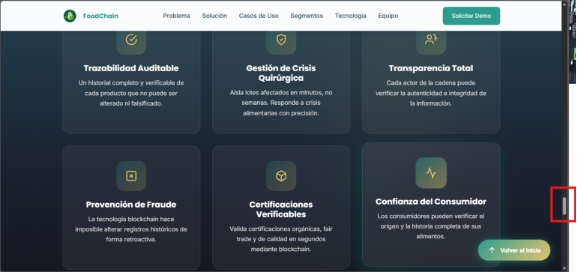

*Recomendación:*

*Agregar una navbar fija con anclas a secciones (e.g., #productores, #consumidores) para mejorar findability.*


*PROBLEMA #4: Diseño potencialmente no fully responsive en Landing Page para móviles (basado en longitud textual)*

*Severidad: 3*

*Heurística violada: Information Architecture - Is it usable?*

*Problema:*

*Aunque básica, la página lineal y larga puede causar usabilidad pobre en móviles (e.g., scroll infinito en entornos rurales para productores), sin media queries evidentes para optimización. Afecta usabilidad en dispositivos comunes para segmentos móviles.*

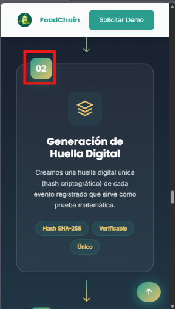

*Recomendación:*

*Aplicar responsive design con CSS media queries y probar en emuladores móviles.*


*PROBLEMA #5: Mensajes de error ambiguos o ausentes en formulario de login de la app*

*Severidad:*

*Heurística violada: Usability - Ayuda a los usuarios a reconocer, diagnosticar y recuperarse de errores*

*Problema:*

*En el login (US28), mensajes de error (e.g., credenciales inválidas) son vagos o inexistentes en despliegue desactualizado, dificultando recuperación. Afecta todos los segmentos.*

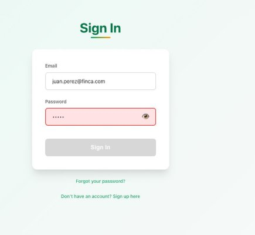


*Recomendación:*

*Implementar mensajes específicos (e.g., "Contraseña incorrecta") con guías de recuperación.*

*PROBLEMA #6: Inconsistencia en navegación entre Landing Page (estática) y app (dinámica, desactualizada)*

*Severidad: 2*

*Heurística violada: Usability - Consistencia y estándares*

*Problema:*

*Landing es estática sin nav, mientras app tiene flujos dinámicos, rompiendo consistencia.*

*(Incluir además una captura de pantalla ilustrando el problema: comparación de interfaces).*

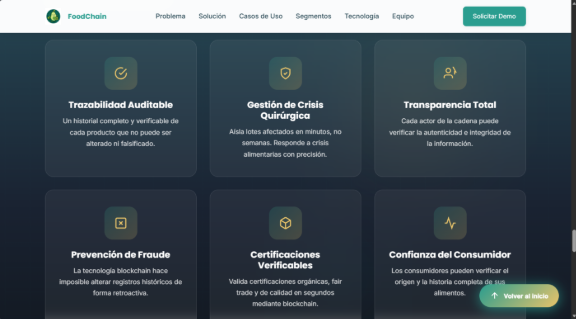

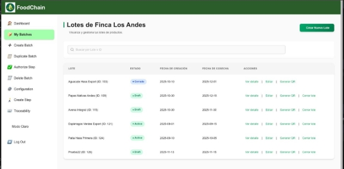

*Recomendación:*

*Estandarizar navegación con style guide compartido.*


*PROBLEMA #7: Falta de soporte multilingüe o modos de accesibilidad (e.g., high-contrast) en ambas interfaces*

*Severidad: 3*

*Heurística violada: Inclusive Design - Proporciona experiencias comparables*

*Problema:*

*Solo en español sin opciones multilingües o high-contrast, excluyendo usuarios diversos.*

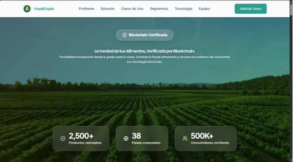


*Recomendación:*

*Integrar i18n y modos accesibles, probando diversidad.*


## 7.4. Video About-the-Product.

Enlace de video del video about the product: https://youtu.be/jRmTd9-Ih1I?si=W35ovGkzpnB1hI2_


